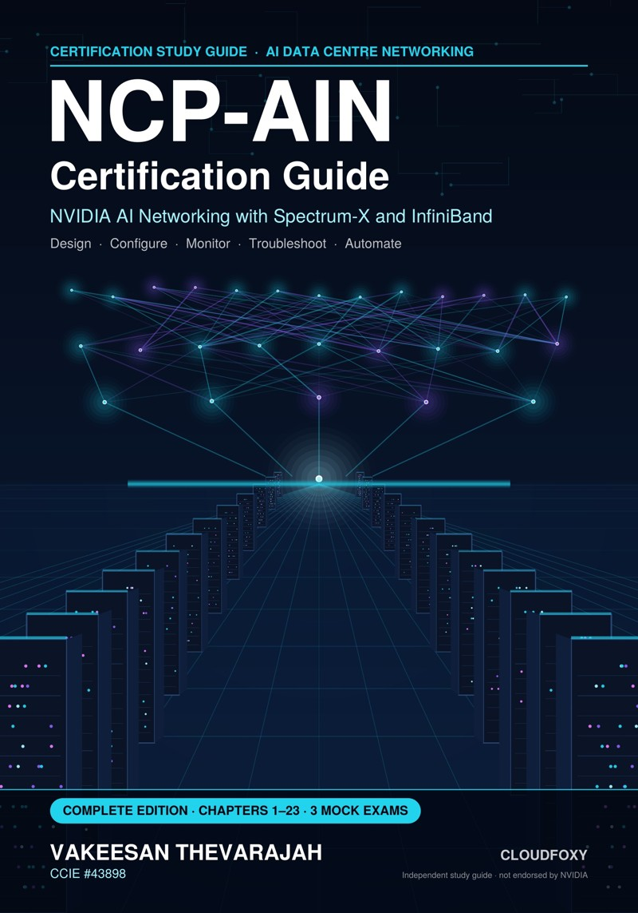

# NCP-AIN Certification Guide

**NVIDIA AI Networking with Spectrum-X and InfiniBand**
by **Vakeesan Thevarajah** (CCIE #43898) · published by **Cloudfoxy Ltd**

This is the official companion site for the book: corrections, updated commands and free study files.

## Errata and updates

NVIDIA ships new software releases several times a year, so some commands will change after publication.
See the **[errata page](errata.md)** for confirmed corrections, listed by edition, chapter and page.

Found an error? **[Report it here](https://github.com/Cloudfoxy-Ltd/ncp-ain-guide/issues/new?template=erratum.yml)** (a free GitHub account is needed), and include the edition, page and what you expected to see.

## Free companion files

| File | What it is |
|---|---|
| [Flashcard deck (CSV)](flashcards/ncp-ain-flashcards.csv) | About 490 cards (front, back, chapter) for Anki, Quizlet or any flashcard app. See the [import guide](flashcards/README.md). |
| [Free sample (PDF)](sample/NCP-AIN_Sample.pdf) | Front matter, Chapter 1 with its Q&A pack, and Chapter 2. |

## Where to buy

- Complete ebook and PDF (Leanpub): *link coming soon*
- Kindle and paperback, Volumes I and II (Amazon): *links coming soon*

## About the book

The book covers every objective in NVIDIA's published NCP-AIN exam blueprint and uses one running example, the Helix AI Factory, throughout. Each chapter has technical diagrams, a hands-on lab, a troubleshooting scenario and about 40 exam-style questions with explanations. The book ends with three 75-question mock exams, a cram sheet, a command reference and a glossary.

*Independent study guide. Not produced, sponsored or endorsed by NVIDIA Corporation. All practice questions are original. NVIDIA and product names are trademarks of NVIDIA Corporation.*

© 2026 Vakeesan Thevarajah · Cloudfoxy Ltd
