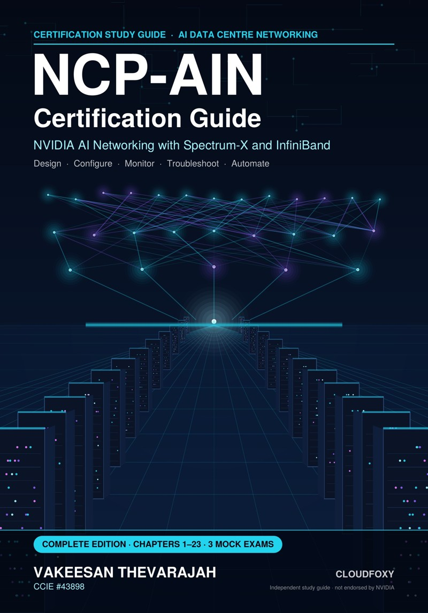

# The Book

{ width="260" align=right }

**NCP-AIN Certification Guide: NVIDIA AI Networking with Spectrum-X and InfiniBand**
by **Vakeesan Thevarajah** (CCIE #43898) · published by **Cloudfoxy Ltd**

The book teaches the NVIDIA networking stack behind AI factories, from first principles to production operations, and follows every objective in NVIDIA's published NCP-AIN exam blueprint. The free labs on this site show you *how*; the book explains *why*, and covers the hardware behaviour a simulator can't show.

- 23 chapters across Spectrum-X Ethernet, InfiniBand, Kubernetes, troubleshooting and automation
- Hundreds of technical diagrams, one running example (the Helix AI Factory)
- A hands-on lab and a troubleshooting scenario in every chapter
- About 1,000 original exam-style questions with explanations, and three 75-question mock exams
- Final-week cram sheet, command reference, glossary and flashcards

## Get it

| Edition | Where |
|---|---|
| Complete ebook and PDF (free updates) | Leanpub — *link coming soon* |
| Kindle | Amazon — *link coming soon* |
| Paperback, Volume I: Foundations and Spectrum-X Ethernet | Amazon — *link coming soon* |
| Paperback, Volume II: InfiniBand, Kubernetes, Troubleshooting, Automation and Exam Readiness | Amazon — *link coming soon* |

[Read the free sample (PDF)](sample/NCP-AIN_Sample.pdf){ .md-button .md-button--primary }

*Independent study guide. Not produced, sponsored or endorsed by NVIDIA Corporation. All practice questions are original.*
