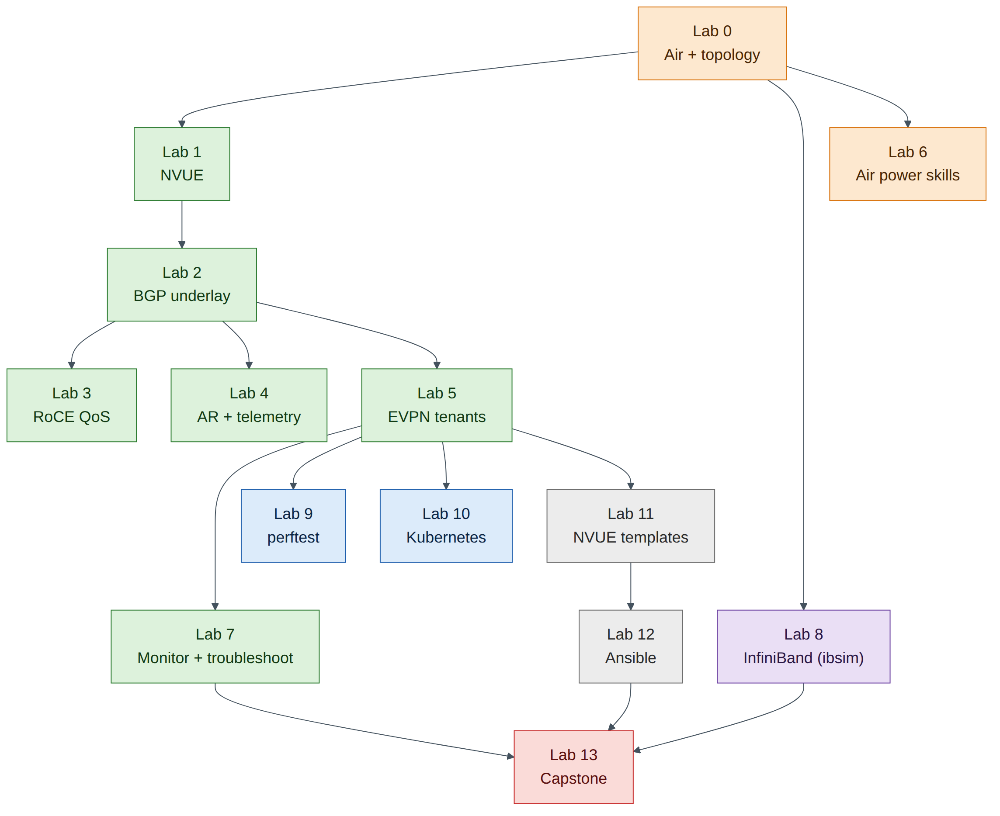

# Hands-On Lab Guide

## What this guide is

This guide turns the *NCP-AIN Certification Guide* into hands-on practice. You build a small version of the book's running example, the **Helix AI factory**, inside **NVIDIA DSX Air**, NVIDIA's cloud-hosted digital twin, and then configure, verify, break and repair it lab by lab. Every lab maps to chapters of the book and to NCP-AIN exam objectives.

The labs run on the **free trial**. That shapes the design: the whole topology fits inside the trial's limits of 60 concurrent vCPUs and 60 GiB of memory, with room to spare.

## What you can and cannot do in Air

Be clear about this from the start, because the exam tests real-hardware behaviour.

| Topic | In this lab guide | What you still need to learn from the book |
|---|---|---|
| Cumulus Linux and NVUE | Fully real (Cumulus VX runs the same NVUE and FRR as a Spectrum switch) | — |
| BGP unnumbered, EVPN, VRFs, VXLAN | Fully real control plane and data plane | — |
| RoCE QoS (trust, maps, PFC, ECN) | Configuration and verification of intent; DSCP marking visible in captures | Lossless behaviour under load, pause frames, ECN marking (needs a Spectrum ASIC) |
| Adaptive routing, telemetry, WJH | Configuration only | Forwarding behaviour and drop reasons (ASIC features) |
| RDMA and perftest | Real RDMA verbs over **Soft-RoCE** (software RoCE in the Linux kernel) | Hardware numbers (ConnectX line-rate, sub-2 µs latency) |
| InfiniBand | Real OpenSM and InfiniBand diagnostic tools against a **simulated fabric** (ibsim) | ibdiagnet, UFM, SHARP and hardware counters |
| Kubernetes Network Operator | Real operator, CRDs and secondary networks (Multus, NV-IPAM, macvlan) | RDMA device plugins and DOCA drivers (need NVIDIA NICs) |
| NVUE templates and Ansible | Fully real | — |
| NCCL tests | Not possible (no GPUs) | Chapter 19 methodology |

!!! tip "Exam focus"
    When a lab can only verify configuration (for example PFC on Cumulus VX), the lab says so and points you to the chapter that explains the hardware behaviour. The exam asks about both.

## Lab map

| Lab | Title | Book chapters | Exam objectives | Time |
|---|---|---|---|---|
| 0 | Air account, trial and the Helix-B lab topology | 9 | 2.4 | 60 min |
| 1 | NVUE essentials on Cumulus VX | 4 | 2.1, 6.1 | 60 min |
| 2 | Underlay: eBGP unnumbered | 4, 7 | 2.1, 2.3 | 60 min |
| 3 | Lossless RoCE QoS and Soft-RoCE hosts | 3, 5 | 2.1, 2.2 | 75 min |
| 4 | Adaptive routing, ECMP and telemetry configuration | 6 | 2.2, 2.5 | 45 min |
| 5 | BGP-EVPN multi-tenancy | 7 | 2.3 | 90 min |
| 6 | DSX Air power skills | 9 | 2.4 | 45 min |
| 7 | Monitoring and troubleshooting | 10, 18 | 2.5, 2.6, 5.1, 5.2 | 60 min |
| 8 | InfiniBand fabric with ibsim | 11–15, 17, 20 | 3.1–3.4, 5.4, 5.5 | 90 min |
| 9 | perftest over Soft-RoCE | 19 | 5.3, 5.5 | 60 min |
| 10 | Kubernetes and the NVIDIA Network Operator | 16 | 4.1, 4.2 | 90 min |
| 11 | NVUE templates and configuration management | 21 | 6.1 | 60 min |
| 12 | Ansible automation: VLANs and RoCE | 22 | 6.2 | 60 min |
| 13 | Capstone troubleshooting challenge | All | All | 120 min |

<figure markdown>

{ loading=lazy }

<figcaption><strong>Figure 0.1: Lab dependency map.</strong> Labs 0–2 build the platform. Lab 5 depends on Labs 1–2; Labs 9 and 10 run across the EVPN fabric from Lab 5. Lab 8 (InfiniBand) only needs Lab 0. Lab 13 draws on everything.</figcaption>

</figure>

!!! abstract "Companion to the NCP-AIN Certification Guide"
    This free lab is part of the hands-on companion to *NCP-AIN Certification Guide* by Vakeesan Thevarajah (Cloudfoxy Ltd). The book explains the theory, design choices and hardware behaviour behind every step. [Get the book](../book.md){ .md-button .md-button--primary } [Free sample](../sample/NCP-AIN_Sample.pdf){ .md-button }

## Conventions

- **Prompts** show where to type: `cumulus@hxb-leaf-r1:mgmt:~$` is a switch, `ubuntu@hxb-gpu01:~$` a server, `ubuntu@oob-mgmt-server:~$` the jump host, and `sim>` the InfiniBand simulator console.
- **Expected output** blocks show what you should see. Outputs marked *illustrative* show the shape of the output; values such as MAC addresses, uptimes and counters will differ.
- **Checkpoint** lists tell you what must be true before you move on. Don't skip them: most later problems come from an earlier checkpoint that was never met.
- Callouts follow the book: **Exam focus**, **Warning**, **Field note**, **Version note** and **Check your understanding**.

## Saving your credits

The free trial gives you compute-hour credits for a year. The lab topology uses about 26 vCPUs while it runs. **Always sleep the simulation** (store a checkpoint) when you stop for the day, and save switch configuration with `nv config save` first. Lab 6 shows how to estimate and manage credits in detail.

!!! warning "Warning"
    A simulation left running overnight spends credits for nothing. Set a sleep date in the simulation settings as a safety net (Lab 0, Task 5).

