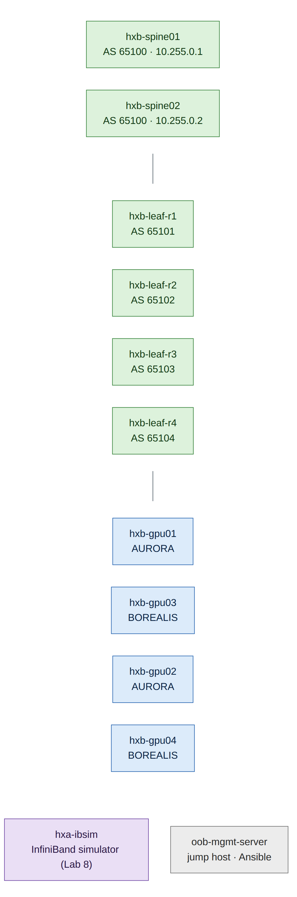
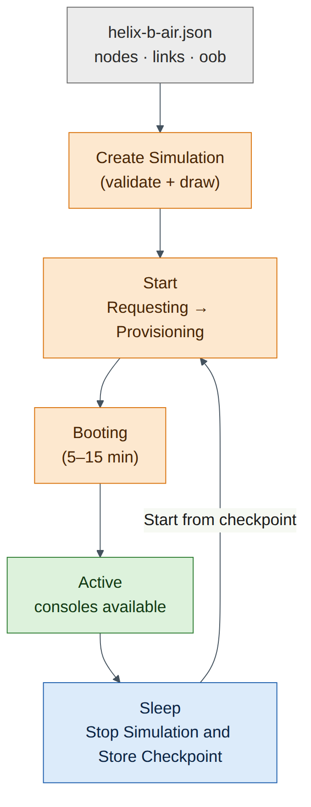

# Lab 0 — DSX Air Account, Free Trial and the Helix Lab Topology

!!! abstract "Companion to the NCP-AIN Certification Guide"
    This free lab is part of the hands-on companion to *NCP-AIN Certification Guide* by Vakeesan Thevarajah (Cloudfoxy Ltd). The book explains the theory, design choices and hardware behaviour behind every step.

    [Get the book](../book.md){ .md-button .md-button--primary } [Free sample](../sample/NCP-AIN_Sample.pdf){ .md-button }


## Lab at a glance

| | |
|---|---|
| Book chapters | 9 (Lab Simulation with NVIDIA Air), 1 (running example) |
| Exam objectives | 2.4 Simulate a Spectrum-X network with NVIDIA Air |
| Time | 60 minutes (plus 10–15 minutes of boot time) |
| Air resources | About 26 vCPU and 46 GiB while running |
| Prerequisites | A web browser, an SSH client (Windows Terminal, macOS Terminal or PuTTY) |

## Objectives

By the end of this lab you will have:

- activated the DSX Air free trial and understood its limits;
- imported the **helix-b-air** topology from JSON and started it;
- logged in to every switch and server through the out-of-band (OOB) management network;
- verified the cabling with LLDP;
- protected your credits with a sleep date and your first checkpoint.

## Background

DSX Air runs real network operating systems as virtual machines. The switches run **Cumulus VX**, the virtual edition of Cumulus Linux, with the same NVUE CLI, FRR routing suite and Linux kernel data path that a Spectrum switch uses. The servers run Ubuntu. Air wires them together exactly as the topology file describes and adds an **OOB management network**: an `oob-mgmt-switch` connected to `eth0` on every server and the management port on every switch, and an `oob-mgmt-server` that acts as jump host, DHCP and DNS server, and NAT gateway to the internet.

The lab topology is a compressed Helix-B (Chapter 1): two spines, four rail leaves and four "GPU servers" (Ubuntu VMs without GPUs), plus one Ubuntu node, `hxa-ibsim`, that hosts the InfiniBand simulator used in Lab 8.


<figure markdown>

{ loading=lazy }

<figcaption><strong>Figure 0.2: The helix-b-air lab topology.</strong> Every leaf connects to both spines (swp31 → spine01, swp32 → spine02). Each server has two data NICs: eth1 to an odd leaf and eth2 to an even leaf. AURORA servers are gpu01 and gpu02, BOREALIS servers gpu03 and gpu04. The OOB network (not drawn) reaches every node's eth0 or management port.</figcaption>

</figure>


### Addressing and cabling plan

| Node | Loopback / role | Uplinks |
|---|---|---|
| hxb-spine01 | 10.255.0.1/32, AS 65100 | swp1–swp4 → leaf-r1…r4 swp31 |
| hxb-spine02 | 10.255.0.2/32, AS 65100 | swp1–swp4 → leaf-r1…r4 swp32 |
| hxb-leaf-r1 … r4 | 10.255.0.11–.14/32, AS 65101–65104 | swp31 → spine01, swp32 → spine02 |

| Server NIC | Leaf port | Tenant / VLAN (Lab 5) | Host IP (Lab 5) |
|---|---|---|---|
| hxb-gpu01 eth1 | hxb-leaf-r1 swp1 | AURORA VLAN 110 | 172.16.10.101/24 |
| hxb-gpu01 eth2 | hxb-leaf-r2 swp1 | AURORA VLAN 111 | 172.16.11.101/24 |
| hxb-gpu02 eth1 | hxb-leaf-r3 swp1 | AURORA VLAN 110 | 172.16.10.102/24 |
| hxb-gpu02 eth2 | hxb-leaf-r4 swp1 | AURORA VLAN 111 | 172.16.11.102/24 |
| hxb-gpu03 eth1 | hxb-leaf-r1 swp2 | BOREALIS VLAN 210 | 172.17.10.103/24 |
| hxb-gpu03 eth2 | hxb-leaf-r2 swp2 | BOREALIS VLAN 211 | 172.17.11.103/24 |
| hxb-gpu04 eth1 | hxb-leaf-r3 swp2 | BOREALIS VLAN 210 | 172.17.10.104/24 |
| hxb-gpu04 eth2 | hxb-leaf-r4 swp2 | BOREALIS VLAN 211 | 172.17.11.104/24 |

## Step-by-step

### Task 1 — Sign in and activate the free trial

1. Go to **https://dsx-air.nvidia.com** and sign in with your NVIDIA account. DSX Air uses NVIDIA NGC organisations: when you first sign in you are placed in (or asked to create) an NGC organisation.
2. If you are the **owner** of your NGC organisation, Air shows a prompt to start the free trial. Click **Start Trial**. If you are not the owner, ask the organisation owner to start it; only NGC organisation owners can activate the trial.
3. Note the trial limits. For an individual organisation they are:

    | Limit | Free trial |
    |---|---|
    | Concurrent vCPUs | 60 |
    | Concurrent memory | 60 GiB |
    | Compute-hour credits | 10,000 |
    | Duration | 1 year |


    !!! info "Field note"
        "Concurrent" means *while simulations are running*. A sleeping (checkpointed) simulation uses no vCPU or memory quota. You can keep several lab simulations and run one at a time.


**Checkpoint**

- [ ] You can open the **Simulations** page without an error or a trial prompt.

### Task 2 — Add your SSH key (optional but recommended)

Console access in the browser works for every lab. SSH from your own terminal is faster for copying and pasting long command blocks.

1. On your laptop, create a key if you don't already have one:

    ```
    you@laptop:~$ ssh-keygen -t ed25519 -C "air-lab"
    you@laptop:~$ cat ~/.ssh/id_ed25519.pub
    ssh-ed25519 AAAAC3Nza...  air-lab
    ```

2. In Air, open your user menu → **Settings**, find the SSH keys section, give the key a **Name** and paste the **Public Key** line, then save.

Lab 6 (Task 4) shows how to publish SSH access to the running simulation.

### Task 3 — Import the helix-b-air topology

1. Download `helix-b-air.json` from the book's companion site (https://cloudfoxy-ltd.github.io/ncp-ain-guide/), or copy it from **Appendix A** of this guide into a file on your laptop.
2. In Air, go to **Simulations** and click **Create Simulation**.
3. Name it `helix-b-air`, choose **JSON** as the file type, and upload `helix-b-air.json`.
4. Leave **Apply ZTP Template** unticked. You configure every switch by hand in Labs 1 and 2, which is the point of the exercise.
5. Click **Create**. Air validates the file and draws the topology on the canvas.


<figure markdown>

{ loading=lazy }

<figcaption><strong>Figure 0.3: From JSON file to running simulation.</strong> Air validates the JSON, builds the nodes and links, adds the OOB network, then boots every VM. The simulation is usable when it reaches Active and every node shows as running.</figcaption>

</figure>


!!! note "Version note"
    Air validates node resources on import. Cumulus VX nodes need at least **20 GB of storage**; a smaller value fails with "Resource amount of 10 does not reach the minimum requirement of 20". The file in Appendix A already uses 20. If validation reports another minimum on your account, raise that value in the JSON and import again.


!!! note "Version note"
    The JSON uses the operating-system image names `cumulus-vx-5.16.1` and `generic/ubuntu2404`, as shown in the DSX Air documentation. If Air rejects an image name, open the simulation in the canvas, select a node, and pick the nearest available Cumulus VX 5.x or Ubuntu 24.04 image from the **OS** list. Keep all six switches on the same Cumulus version.


**Checkpoint**

- [ ] The canvas shows 2 spines, 4 leaves, 4 gpu servers, `hxa-ibsim`, and the OOB switch and server.

### Task 4 — Start the simulation and log in

1. Click **Start**. The state moves through *Requesting → Provisioning → Booting → Active*. Allow 5–15 minutes.
2. Double-click **oob-mgmt-server** to open its console. Log in as `ubuntu`. Air's Ubuntu images commonly use the password `nvidia`; if that fails, check the node's details panel or console banner for the credentials your image uses.
3. From the oob-mgmt-server, reach any node by name. Start with a switch:

    ```
    ubuntu@oob-mgmt-server:~$ ssh cumulus@hxb-leaf-r1
    cumulus@hxb-leaf-r1's password:            # default: cumulus
    You are required to change your password immediately (administrator enforced).
    Current password:                          # cumulus
    New password:                              # CumulusLinux!
    Retype new password:                       # CumulusLinux!
    ```

4. Repeat for every switch (`hxb-spine01`, `hxb-spine02`, `hxb-leaf-r1` to `hxb-leaf-r4`). This guide uses `CumulusLinux!` as the new password; choose your own if you prefer, and use it consistently.


    !!! warning "Warning"
        Cumulus Linux 5.x forces a password change for the `cumulus` user at first login. Automation in Labs 11 and 12 uses the new password, so write it down.


5. Log in to each server and check its interfaces:

    ```
    ubuntu@oob-mgmt-server:~$ ssh ubuntu@hxb-gpu01
    ubuntu@hxb-gpu01:~$ ip -br link
    lo               UNKNOWN        00:00:00:00:00:00 <LOOPBACK,UP,LOWER_UP>
    eth0             UP             44:38:39:00:00:1a <BROADCAST,MULTICAST,UP,LOWER_UP>
    eth1             DOWN           44:38:39:00:00:21 <BROADCAST,MULTICAST>
    eth2             DOWN           44:38:39:00:00:23 <BROADCAST,MULTICAST>
    ```

    *(Illustrative.)* `eth0` is the OOB interface. `eth1` and `eth2` are the data NICs you configure in Labs 3 and 5.

6. Make passwordless SSH easier for later labs. On the oob-mgmt-server:

    ```
    ubuntu@oob-mgmt-server:~$ ssh-keygen -t ed25519 -N "" -f ~/.ssh/id_ed25519
    ubuntu@oob-mgmt-server:~$ for h in hxb-spine01 hxb-spine02 hxb-leaf-r1 hxb-leaf-r2 hxb-leaf-r3 hxb-leaf-r4; do ssh-copy-id cumulus@$h; done
    ubuntu@oob-mgmt-server:~$ for h in hxb-gpu01 hxb-gpu02 hxb-gpu03 hxb-gpu04 hxa-ibsim; do ssh-copy-id ubuntu@$h; done
    ```

**Checkpoint**

- [ ] You can `ssh cumulus@hxb-leaf-r1` from the oob-mgmt-server without a password prompt.
- [ ] Every switch password has been changed.

### Task 5 — Verify the cabling with LLDP

Cabling mistakes cause more lab problems than anything else, so prove the wiring before you configure anything. Bring the data ports up and read LLDP on every leaf.

```
cumulus@hxb-leaf-r1:mgmt:~$ nv set interface swp1-2,swp31-32 link state up
cumulus@hxb-leaf-r1:mgmt:~$ nv config apply -y
cumulus@hxb-leaf-r1:mgmt:~$ sudo lldpctl | grep -E "Interface|SysName|PortID"
Interface:    swp31, via: LLDP
    SysName:      hxb-spine01
    PortID:       ifname swp1
Interface:    swp32, via: LLDP
    SysName:      hxb-spine02
    PortID:       ifname swp1
```

*(Illustrative.)* Servers only appear in LLDP if they run an LLDP agent. Install one on each server so the switch can see it:

```
ubuntu@hxb-gpu01:~$ sudo apt-get update && sudo apt-get install -y lldpd
ubuntu@hxb-gpu01:~$ sudo ip link set eth1 up && sudo ip link set eth2 up
```

Do the same on the spines (`nv set interface swp1-4 link state up`) and compare what you see against the cabling table.

**Checkpoint**

- [ ] Each leaf sees spine01 on swp31 and spine02 on swp32.
- [ ] Each leaf sees the expected servers on swp1 and swp2.

### Task 6 — Protect your credits and save your first checkpoint

1. On every switch, save the configuration so it survives a reboot: `nv config save`.
2. Open the simulation settings and set a **sleep date** a few hours ahead as a safety net. Free-trial simulations may already have one that you cannot remove.
3. Click **Stop Simulation and Store Checkpoint**. When the simulation is *Inactive*, open **Checkpoints**, find the new checkpoint and mark it as a favourite named something like `lab00-cabled`.

## Verify

- [ ] Free trial active; quota visible.
- [ ] helix-b-air imported, started and reached Active.
- [ ] Passwords changed on all six switches; passwordless SSH from the oob-mgmt-server.
- [ ] LLDP matches the cabling plan.
- [ ] A favourite checkpoint saved.

## Break and fix

**Fault: "I can't reach hxb-leaf-r2 by name."**

- *Symptom:* `ssh cumulus@hxb-leaf-r2` from the oob-mgmt-server fails with "Could not resolve hostname".
- *Diagnosis:* the node is still booting, or it has not taken its OOB DHCP lease yet. Check its state on the Air canvas and open its console.
- *Fix:* wait for the node to finish booting, then retry. If it stays unreachable, reboot the node from its menu in the canvas.

**Fault: "ssh says No route to host" and the switch's eth0 has a 169.254.x.x address.**

- *Symptom:* the name resolves on the oob-mgmt-server, but SSH fails with *No route to host*. On the switch console, `ip -br addr show eth0` shows a `169.254.x.x` (link-local) address.
- *Diagnosis:* the switch hasn't finished loading yet. Cumulus VX switches can take several minutes after the simulation starts, which is longer than the servers. Until the switch is fully up, eth0 may only have a link-local address.
- *Fix:* wait a few more minutes and retry. You don't need to change anything. When `ip -br addr show eth0` on the switch console shows a 192.168.200.x address, SSH will work.

**Fault: "A leaf sees spine02 on swp31."**

- *Symptom:* LLDP on a leaf shows the spines swapped.
- *Diagnosis:* the topology file was edited and the links swapped.
- *Fix:* stop the simulation, correct the link in the canvas or JSON (swp31 → spine01, swp32 → spine02), and start it again. Every later lab assumes this wiring.

## Clean-up / save state

Always finish a session with `nv config save` on the switches and **Stop Simulation and Store Checkpoint** in Air.

## Exam tie-in

- Objective 2.4 expects you to know how Air builds a digital twin: a topology file (JSON recommended, DOT supported), real NOS images, and an OOB network with a management server.
- Know that Cumulus VX runs the same NVUE and FRR as Cumulus Linux on Spectrum hardware, but has no ASIC. That's why lossless behaviour, WJH and adaptive routing forwarding can't be tested in Air.
- Know the purpose of the oob-mgmt-server: jump host, DHCP/DNS, ZTP server and NAT gateway.

## Review questions

1. Which two limits of the free trial are "concurrent", and what does that mean for a sleeping simulation?
2. Why is JSON preferred over DOT for Air topologies?
3. What does the oob-mgmt-server provide to the other nodes?
4. Why do you verify cabling with LLDP before configuring BGP?
5. What must you do on each switch before sleeping a simulation, and why?

### Answers

1. vCPUs (60) and memory (60 GiB) are concurrent limits: they only count while simulations run. A sleeping simulation uses none of them, only storage for its checkpoint.
2. NVIDIA recommends JSON because it has better validation, scales better and is more widely adopted; DOT is still supported.
3. A jump host reachable by SSH, DHCP and DNS for the OOB network (so nodes are reachable by name), a ZTP server, and a NAT gateway to the internet for package downloads.
4. Because BGP unnumbered, EVPN and every later lab assume the documented port mapping. A swapped cable produces confusing symptoms later; LLDP proves the wiring in seconds.
5. Run `nv config save` so the applied configuration is written to `/etc/nvue.d/startup.yaml`. Only the startup configuration is loaded at boot, so unsaved changes would be lost when the simulation restarts from its checkpoint.

---

!!! abstract "Go deeper"
    The matching book chapters cover the exam objectives for this lab in full, with a Q&A pack of about 40 exam-style questions per chapter.

    [Get the book](../book.md){ .md-button .md-button--primary } [Report a problem with this lab](https://github.com/Cloudfoxy-Ltd/ncp-ain-guide/issues/new?template=erratum.yml){ .md-button }
