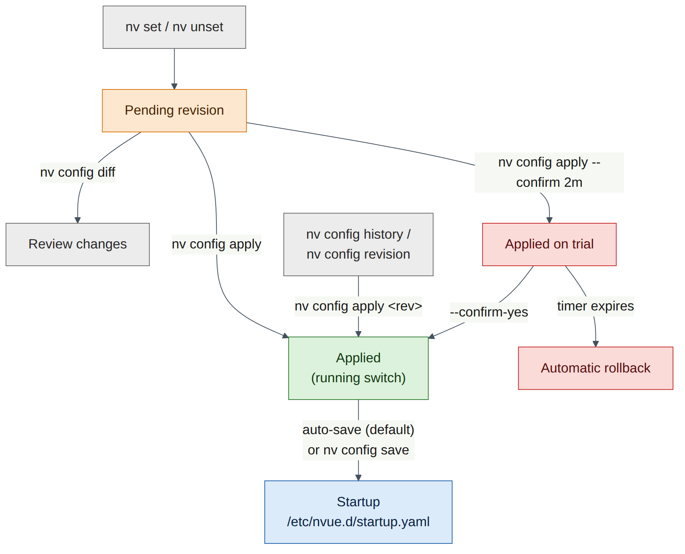
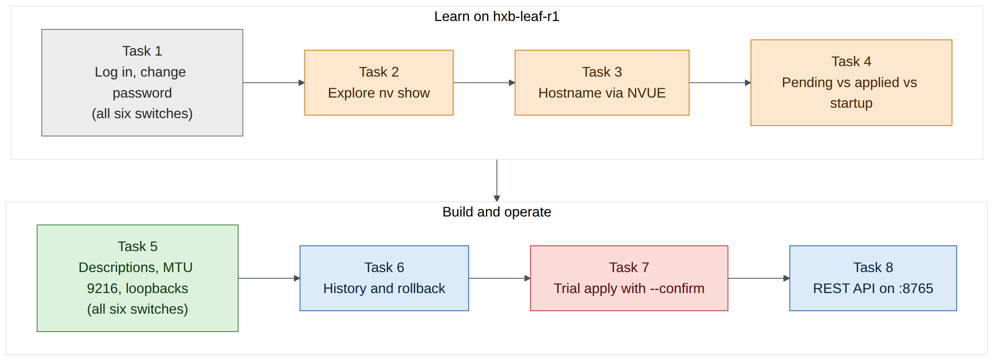
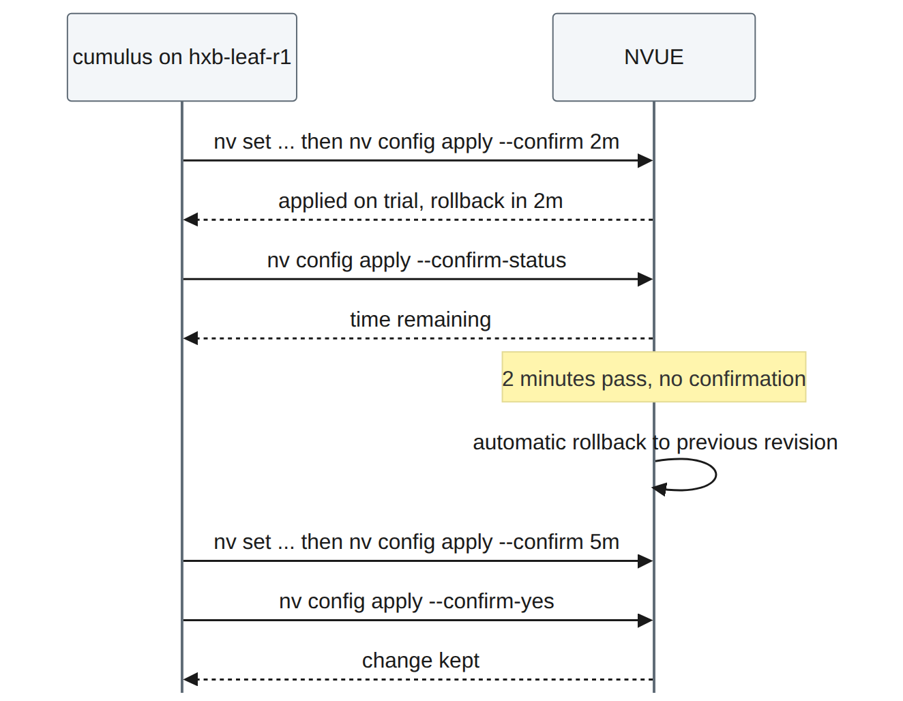

# Lab 1 — NVUE Essentials on Cumulus VX

!!! abstract "Companion to the NCP-AIN Certification Guide"
    This free lab is part of the hands-on companion to *NCP-AIN Certification Guide* by Vakeesan Thevarajah (Cloudfoxy Ltd). The book explains the theory, design choices and hardware behaviour behind every step.

    [Get the book on Leanpub](https://leanpub.com/nvidiancp-aincertificationguide){ .md-button .md-button--primary } [Paperbacks](../book.md){ .md-button } [Free sample](../sample/NCP-AIN_Sample.pdf){ .md-button }


## Lab at a glance

| | |
|---|---|
| Book chapters | Chapter 4 (Cumulus Linux and NVUE Essentials); Chapter 21 (NVUE Templates and Configuration Management) for the revision model |
| Exam objectives | 2.1 Configure Spectrum-X switches (foundation: the switch OS and NVUE) · 6.1 Manage switch configuration with NVUE · supports 2.4 (NVIDIA Air) |
| Time | 75–90 minutes |
| Air resources used | Simulation `helix-b-air`: hxb-spine01, hxb-spine02, hxb-leaf-r1 … hxb-leaf-r4 (6 × Cumulus VX 5.16.1) and oob-mgmt-server. The GPU servers can stay powered but are not used. |
| Prerequisite labs | Lab 0 (simulation imported from `helix-b-air.json`, started, and oob-mgmt-server reachable) |

## Objectives

By the end of this lab you will be able to:

- Log in to a Cumulus VX switch from the out-of-band jump host and change the default password.
- Use `nv show`, `nv set` and `nv unset`, with Tab completion, to read and change the NVUE object model.
- Explain and observe the **pending**, **applied** and **startup** configurations, and use `nv config diff`, `nv config apply` and `nv config save`.
- Find past changes with `nv config history` and `nv config revision`, and roll back with `nv config apply <revision>`.
- Make a risky change safely with `nv config apply --confirm` and let it roll back by itself.
- Give every switch in Helix-B its hostname, port descriptions, jumbo MTU (9216) and loopback address, ready for the underlay in Lab 2.
- Read configuration through the NVUE REST API with `curl` on port 8765.

## Background

Cumulus Linux 5.x is configured through **NVUE**, an object model of the whole switch. Every `nv` command addresses a path in that model, for example `interface swp31 link mtu` or `system hostname`. The same paths are exposed by the NVUE REST API on TCP port 8765, which is why the CLI, the API, templates (Chapter 21) and Ansible (Chapter 22) all describe configuration in the same way.

NVUE never changes the running switch while you type. `nv set` and `nv unset` only build a **pending** revision. `nv config apply` turns pending into the **applied** configuration, and NVUE then renders the Linux files (`/etc/network/interfaces`, `/etc/frr/frr.conf` and others) and reloads the services. With auto-save enabled (the default in Cumulus Linux 5.x), each apply is also written to the **startup** configuration, `/etc/nvue.d/startup.yaml`, which is what the switch loads at boot. With auto-save disabled you need an explicit `nv config save`.

Every apply is stored as a numbered revision. You can compare revisions with `nv config diff`, see who applied what with `nv config history`, and return to an earlier revision with `nv config apply <revision>`. For changes that could cut you off, `nv config apply --confirm <time>` applies the change on trial and rolls it back automatically unless you confirm it in time.


<figure markdown>

{ loading=lazy }

<figcaption><strong>Figure L1.1: Pending, applied and startup in NVUE.</strong> nv set and nv unset only change the pending revision. nv config apply makes pending the applied (running) configuration and, with auto-save on, also writes startup.yaml. nv config apply --confirm applies on trial and rolls back unless confirmed. nv config apply with a revision number returns to an earlier state.</figcaption>

</figure>


!!! note "Version note"
    This guide uses Cumulus VX 5.16.1. NVUE paths occasionally move between 5.x releases (for example, SVI addressing moved under an `ipv4` object in 5.15; Lab 5 covers that). The commands in this lab were checked against the Cumulus Linux 5.16 documentation. If a command is rejected on your release, press Tab after the last accepted word to see what NVUE expects.


## Step-by-step

The addressing and naming plan for this lab is below. Keep it open; every task refers to it.

| Switch | Loopback (lo) | Uplink ports | Downlink ports |
|---|---|---|---|
| hxb-spine01 | 10.255.0.1/32 | – | swp1–swp4 → leaf-r1…r4 swp31 |
| hxb-spine02 | 10.255.0.2/32 | – | swp1–swp4 → leaf-r1…r4 swp32 |
| hxb-leaf-r1 | 10.255.0.11/32 | swp31 → spine01 swp1, swp32 → spine02 swp1 | swp1 → hxb-gpu01 eth1, swp2 → hxb-gpu03 eth1 |
| hxb-leaf-r2 | 10.255.0.12/32 | swp31 → spine01 swp2, swp32 → spine02 swp2 | swp1 → hxb-gpu01 eth2, swp2 → hxb-gpu03 eth2 |
| hxb-leaf-r3 | 10.255.0.13/32 | swp31 → spine01 swp3, swp32 → spine02 swp3 | swp1 → hxb-gpu02 eth1, swp2 → hxb-gpu04 eth1 |
| hxb-leaf-r4 | 10.255.0.14/32 | swp31 → spine01 swp4, swp32 → spine02 swp4 | swp1 → hxb-gpu02 eth2, swp2 → hxb-gpu04 eth2 |


<figure markdown>

{ loading=lazy }

<figcaption><strong>Figure L1.2: What Lab 1 builds on each switch.</strong> Tasks 1–4 are learned on hxb-leaf-r1. Task 5 then applies the same pattern to all six switches, and Tasks 6–8 exercise history, trial applies and the REST API on hxb-leaf-r1.</figcaption>

</figure>


### Task 1 — First login and password change

**Do this on all switches**

| Switch | Log in from oob-mgmt-server with | New password |
|---|---|---|
| hxb-spine01 | `ssh cumulus@hxb-spine01` | `CumulusLinux!` |
| hxb-spine02 | `ssh cumulus@hxb-spine02` | `CumulusLinux!` |
| hxb-leaf-r1 | `ssh cumulus@hxb-leaf-r1` | `CumulusLinux!` |
| hxb-leaf-r2 | `ssh cumulus@hxb-leaf-r2` | `CumulusLinux!` |
| hxb-leaf-r3 | `ssh cumulus@hxb-leaf-r3` | `CumulusLinux!` |
| hxb-leaf-r4 | `ssh cumulus@hxb-leaf-r4` | `CumulusLinux!` |

1. In the Air console, open the **oob-mgmt-server** terminal and log in as `ubuntu` / `nvidia` (check the login banner or your Air node panel if these differ). If Air asks you to change this password too, do so and note it.

2. From the jump host, connect to the first leaf:

    ```
    ubuntu@oob-mgmt-server:~$ ssh cumulus@hxb-leaf-r1
    ```

3. Accept the host key (`yes`), enter the default password `cumulus`, and then follow the forced password change: enter `cumulus` again as the current password, then `CumulusLinux!` twice.

    **Expected output** (illustrative; wording varies by release):

    ```
    cumulus@hxb-leaf-r1's password:
    You are required to change your password immediately (administrator enforced).
    Changing password for cumulus.
    Current password:
    New password:
    Retype new password:
    passwd: password updated successfully
    Connection to hxb-leaf-r1 closed.
    ```

4. The session closes after the change on many releases. Log in again with the new password:

    ```
    ubuntu@oob-mgmt-server:~$ ssh cumulus@hxb-leaf-r1
    cumulus@hxb-leaf-r1:mgmt:~$
    ```

5. Repeat steps 2–4 for the other five switches, using the table above. Use `exit` to return to the jump host each time.


    !!! info "Field note"
        `:mgmt:` in the prompt means your shell runs in the management VRF, because you arrived over eth0. `ping` and `traceroute` still use the default (data-plane) VRF unless you add `-I mgmt`. You will rely on that in Lab 2.


    !!! warning "Warning"
        Use the same new password on every switch. The REST API step in Task 8 and the automation labs later assume `cumulus` / `CumulusLinux!`. If you choose something else, substitute it everywhere.


**Checkpoint**

- You can log in to all six switches from oob-mgmt-server with `CumulusLinux!`.
- The prompt on each switch ends in `:mgmt:~$`.

### Task 2 — Explore the object model with nv show

Work on **hxb-leaf-r1** for Tasks 2–4.

1. Look at the system object and the interface summary:

    ```
    cumulus@hxb-leaf-r1:mgmt:~$ nv show system
    cumulus@hxb-leaf-r1:mgmt:~$ nv show interface
    ```

    **Expected output** (illustrative, trimmed):

    ```
                         operational          applied
    -------------------  -------------------  -----------
    hostname             hxb-leaf-r1          cumulus
    build                Cumulus Linux 5.16.1
    uptime               0:24:10
    timezone             Etc/UTC

    Interface  Admin Status  Oper Status  Speed  MTU    Type      Remote Host   Remote Port  Summary
    ---------  ------------  -----------  -----  -----  --------  ------------  -----------  -------------------------
    eth0       up            up           1G     1500   eth       oob-mgmt-sw…  swp2         IP Address: 192.168.200.x/24
    lo         up            up                  65536  loopback                             IP Address:   127.0.0.1/8
    swp1       down          down                9216   swp
    ...
    ```

2. Note the two columns in `nv show system`: **operational** is what the switch is actually doing; **applied** is what NVUE has been told. If they differ (for example, Air set the hostname at boot outside NVUE), NVUE does not yet own that setting.

3. Use Tab completion to discover the tree. Press Tab twice after each partial command:

    ```
    cumulus@hxb-leaf-r1:mgmt:~$ nv show <TAB><TAB>
    cumulus@hxb-leaf-r1:mgmt:~$ nv show interface swp31 <TAB><TAB>
    cumulus@hxb-leaf-r1:mgmt:~$ nv set interface swp31 link <TAB><TAB>
    ```

4. Try machine-readable output, which automation uses in Labs 11 and 12:

    ```
    cumulus@hxb-leaf-r1:mgmt:~$ nv show interface lo -o json
    cumulus@hxb-leaf-r1:mgmt:~$ nv config show
    ```

    `nv config show` prints the whole applied configuration as YAML. On a fresh switch it is short.

5. Ask NVUE where a setting lives with `nv config find` or `nv config lookup` if your release has them (Tab after `nv config` to check). This is useful when you remember a value but not its path.

**Checkpoint**

- You can explain the difference between the operational and applied columns.
- `nv show interface` lists eth0, lo and the swp ports.

### Task 3 — Set the hostname through NVUE

1. Stage the hostname:

    ```
    cumulus@hxb-leaf-r1:mgmt:~$ nv set system hostname hxb-leaf-r1
    ```

2. Look at what is pending before you apply it:

    ```
    cumulus@hxb-leaf-r1:mgmt:~$ nv config diff
    ```

    **Expected output** (illustrative):

    ```
    - set:
        system:
          hostname: hxb-leaf-r1
    ```

3. Apply it. If NVUE asks `Are you sure? [y/N]`, answer `y`. The output below is illustrative; your revision number will differ:

    ```
    cumulus@hxb-leaf-r1:mgmt:~$ nv config apply
    applied [rev_id: 2]
    ```

4. Confirm that the applied and operational values now agree:

    ```
    cumulus@hxb-leaf-r1:mgmt:~$ nv show system
    ```


    !!! info "Field note"
        Air often sets the hostname from the node name, so your prompt may already have shown `hxb-leaf-r1`. Setting it through NVUE still matters: it puts the hostname in the applied and startup configuration, so NVUE owns it. The shell prompt only changes when you next log in.


**Checkpoint**

- `nv show system` shows `hxb-leaf-r1` in both the operational and applied columns.
- `nv config diff` now prints nothing (nothing is pending).

### Task 4 — Pending vs applied vs startup

1. Stage a description on the first uplink but **do not apply it**:

    ```
    cumulus@hxb-leaf-r1:mgmt:~$ nv set interface swp31 description to-hxb-spine01-swp1
    ```

2. Look at the same object in each revision:

    ```
    cumulus@hxb-leaf-r1:mgmt:~$ nv show interface swp31 --pending
    cumulus@hxb-leaf-r1:mgmt:~$ nv show interface swp31 --applied
    cumulus@hxb-leaf-r1:mgmt:~$ nv show interface swp31 --startup
    ```

    **Expected result:** only `--pending` shows the description. Applied and startup do not have it yet.

3. Check the auto-save setting:

    ```
    cumulus@hxb-leaf-r1:mgmt:~$ nv show system config auto-save
    ```

    **Expected output** (illustrative):

    ```
           operational  applied
    -----  -----------  -------
    state  enabled      enabled
    ```

4. Now turn auto-save off, so you can see the three revisions separate. Apply both changes together:

    ```
    cumulus@hxb-leaf-r1:mgmt:~$ nv set system config auto-save state disabled
    cumulus@hxb-leaf-r1:mgmt:~$ nv config diff
    cumulus@hxb-leaf-r1:mgmt:~$ nv config apply
    ```

5. Compare applied with startup:

    ```
    cumulus@hxb-leaf-r1:mgmt:~$ nv config diff applied startup
    ```

    **Expected output** (illustrative): the description (and the auto-save change itself) appear, because they are applied but not yet in `startup.yaml`.

    ```
    - set:
        interface:
          swp31:
            description: to-hxb-spine01-swp1
        system:
          config:
            auto-save:
              state: disabled
    ```

6. Save applied to startup and compare again:

    ```
    cumulus@hxb-leaf-r1:mgmt:~$ nv config save
    cumulus@hxb-leaf-r1:mgmt:~$ nv config diff applied startup
    ```

The second diff should now be empty.

7. Turn auto-save back on, because the rest of this guide assumes it:

    ```
    cumulus@hxb-leaf-r1:mgmt:~$ nv set system config auto-save state enabled
    cumulus@hxb-leaf-r1:mgmt:~$ nv config apply
    cumulus@hxb-leaf-r1:mgmt:~$ nv config diff applied startup
    ```

8. Look at the startup file itself (read only; never edit it by hand):

    ```
    cumulus@hxb-leaf-r1:mgmt:~$ sudo cat /etc/nvue.d/startup.yaml
    ```


    !!! danger "Exam trap"
        `nv config save` does **not** apply anything. It copies the *applied* configuration to startup. Only `nv config apply` changes the running switch. A change that is only pending is lost at reboot.


**Checkpoint**

- You saw a change exist in pending only, then in applied but not startup, then in all three.
- `nv show system config auto-save` shows `enabled` again.

### Task 5 — Descriptions, MTU 9216 and loopbacks on every switch

Now give every switch its identity and port settings. Ports that NVUE configures are brought up; we also set `link state up` explicitly so the intent is clear in the configuration.

**Do this on all switches**

| Setting | Spines (hxb-spine01, hxb-spine02) | Leaves (hxb-leaf-r1 … r4) |
|---|---|---|
| Hostname | `nv set system hostname <name>` | `nv set system hostname <name>` |
| Ports | swp1–swp4 | swp1, swp2, swp31, swp32 |
| Admin state | `link state up` | `link state up` |
| MTU | `link mtu 9216` | `link mtu 9216` |
| Description | to-hxb-leaf-rN-swp31/32 | server or spine port name |
| Loopback | 10.255.0.1/32, 10.255.0.2/32 | 10.255.0.11/32 … 10.255.0.14/32 |
| Finish with | `nv config diff`, then `nv config apply -y` | `nv config diff`, then `nv config apply -y` |

The values differ per switch, so a full block is given for each. Paste each block into the matching switch.

**hxb-spine01**

```
cumulus@hxb-spine01:mgmt:~$ nv set system hostname hxb-spine01
cumulus@hxb-spine01:mgmt:~$ nv set interface swp1 description to-hxb-leaf-r1-swp31
cumulus@hxb-spine01:mgmt:~$ nv set interface swp2 description to-hxb-leaf-r2-swp31
cumulus@hxb-spine01:mgmt:~$ nv set interface swp3 description to-hxb-leaf-r3-swp31
cumulus@hxb-spine01:mgmt:~$ nv set interface swp4 description to-hxb-leaf-r4-swp31
cumulus@hxb-spine01:mgmt:~$ nv set interface swp1-4 link state up
cumulus@hxb-spine01:mgmt:~$ nv set interface swp1-4 link mtu 9216
cumulus@hxb-spine01:mgmt:~$ nv set interface lo ip address 10.255.0.1/32
cumulus@hxb-spine01:mgmt:~$ nv config diff
cumulus@hxb-spine01:mgmt:~$ nv config apply -y
```

**hxb-spine02**

```
cumulus@hxb-spine02:mgmt:~$ nv set system hostname hxb-spine02
cumulus@hxb-spine02:mgmt:~$ nv set interface swp1 description to-hxb-leaf-r1-swp32
cumulus@hxb-spine02:mgmt:~$ nv set interface swp2 description to-hxb-leaf-r2-swp32
cumulus@hxb-spine02:mgmt:~$ nv set interface swp3 description to-hxb-leaf-r3-swp32
cumulus@hxb-spine02:mgmt:~$ nv set interface swp4 description to-hxb-leaf-r4-swp32
cumulus@hxb-spine02:mgmt:~$ nv set interface swp1-4 link state up
cumulus@hxb-spine02:mgmt:~$ nv set interface swp1-4 link mtu 9216
cumulus@hxb-spine02:mgmt:~$ nv set interface lo ip address 10.255.0.2/32
cumulus@hxb-spine02:mgmt:~$ nv config diff
cumulus@hxb-spine02:mgmt:~$ nv config apply -y
```

**hxb-leaf-r1** (the hostname and swp31 description are already applied from Tasks 3–4; setting them again is harmless)

```
cumulus@hxb-leaf-r1:mgmt:~$ nv set system hostname hxb-leaf-r1
cumulus@hxb-leaf-r1:mgmt:~$ nv set interface swp31 description to-hxb-spine01-swp1
cumulus@hxb-leaf-r1:mgmt:~$ nv set interface swp32 description to-hxb-spine02-swp1
cumulus@hxb-leaf-r1:mgmt:~$ nv set interface swp1 description hxb-gpu01-eth1
cumulus@hxb-leaf-r1:mgmt:~$ nv set interface swp2 description hxb-gpu03-eth1
cumulus@hxb-leaf-r1:mgmt:~$ nv set interface swp1-2,swp31-32 link state up
cumulus@hxb-leaf-r1:mgmt:~$ nv set interface swp1-2,swp31-32 link mtu 9216
cumulus@hxb-leaf-r1:mgmt:~$ nv set interface lo ip address 10.255.0.11/32
cumulus@hxb-leaf-r1:mgmt:~$ nv config diff
cumulus@hxb-leaf-r1:mgmt:~$ nv config apply -y
```

**hxb-leaf-r2**

```
cumulus@hxb-leaf-r2:mgmt:~$ nv set system hostname hxb-leaf-r2
cumulus@hxb-leaf-r2:mgmt:~$ nv set interface swp31 description to-hxb-spine01-swp2
cumulus@hxb-leaf-r2:mgmt:~$ nv set interface swp32 description to-hxb-spine02-swp2
cumulus@hxb-leaf-r2:mgmt:~$ nv set interface swp1 description hxb-gpu01-eth2
cumulus@hxb-leaf-r2:mgmt:~$ nv set interface swp2 description hxb-gpu03-eth2
cumulus@hxb-leaf-r2:mgmt:~$ nv set interface swp1-2,swp31-32 link state up
cumulus@hxb-leaf-r2:mgmt:~$ nv set interface swp1-2,swp31-32 link mtu 9216
cumulus@hxb-leaf-r2:mgmt:~$ nv set interface lo ip address 10.255.0.12/32
cumulus@hxb-leaf-r2:mgmt:~$ nv config diff
cumulus@hxb-leaf-r2:mgmt:~$ nv config apply -y
```

**hxb-leaf-r3**

```
cumulus@hxb-leaf-r3:mgmt:~$ nv set system hostname hxb-leaf-r3
cumulus@hxb-leaf-r3:mgmt:~$ nv set interface swp31 description to-hxb-spine01-swp3
cumulus@hxb-leaf-r3:mgmt:~$ nv set interface swp32 description to-hxb-spine02-swp3
cumulus@hxb-leaf-r3:mgmt:~$ nv set interface swp1 description hxb-gpu02-eth1
cumulus@hxb-leaf-r3:mgmt:~$ nv set interface swp2 description hxb-gpu04-eth1
cumulus@hxb-leaf-r3:mgmt:~$ nv set interface swp1-2,swp31-32 link state up
cumulus@hxb-leaf-r3:mgmt:~$ nv set interface swp1-2,swp31-32 link mtu 9216
cumulus@hxb-leaf-r3:mgmt:~$ nv set interface lo ip address 10.255.0.13/32
cumulus@hxb-leaf-r3:mgmt:~$ nv config diff
cumulus@hxb-leaf-r3:mgmt:~$ nv config apply -y
```

**hxb-leaf-r4**

```
cumulus@hxb-leaf-r4:mgmt:~$ nv set system hostname hxb-leaf-r4
cumulus@hxb-leaf-r4:mgmt:~$ nv set interface swp31 description to-hxb-spine01-swp4
cumulus@hxb-leaf-r4:mgmt:~$ nv set interface swp32 description to-hxb-spine02-swp4
cumulus@hxb-leaf-r4:mgmt:~$ nv set interface swp1 description hxb-gpu02-eth2
cumulus@hxb-leaf-r4:mgmt:~$ nv set interface swp2 description hxb-gpu04-eth2
cumulus@hxb-leaf-r4:mgmt:~$ nv set interface swp1-2,swp31-32 link state up
cumulus@hxb-leaf-r4:mgmt:~$ nv set interface swp1-2,swp31-32 link mtu 9216
cumulus@hxb-leaf-r4:mgmt:~$ nv set interface lo ip address 10.255.0.14/32
cumulus@hxb-leaf-r4:mgmt:~$ nv config diff
cumulus@hxb-leaf-r4:mgmt:~$ nv config apply -y
```


!!! note "Version note"
    On Cumulus Linux 5.16 the loopback address is `nv set interface lo ip address <prefix>`, as in Chapter 4. If your release rejects `ip address` for `lo`, press Tab after `nv set interface lo` and use the address path it offers (newer releases have reorganised some addressing under `ipv4`). The command ranges `swp1-4` and `swp1-2,swp31-32` are standard NVUE syntax.


1. After applying on each switch, check the ports and the loopback:

    ```
    cumulus@hxb-leaf-r1:mgmt:~$ nv show interface
    cumulus@hxb-leaf-r1:mgmt:~$ nv show interface swp31 link
    cumulus@hxb-leaf-r1:mgmt:~$ nv show interface lo ip address
    ```

    **Expected output** (illustrative, trimmed):

    ```
    Interface  Admin Status  Oper Status  Speed  MTU    Type      Remote Host  Remote Port  Summary
    ---------  ------------  -----------  -----  -----  --------  -----------  -----------  ---------------------------
    lo         up            up                  65536  loopback                            IP Address:  10.255.0.11/32
    swp1       up            up           1G     9216   swp       hxb-gpu01    eth1
    swp2       up            up           1G     9216   swp       hxb-gpu03    eth1
    swp31      up            up           1G     9216   swp       hxb-spine01  swp1
    swp32      up            up           1G     9216   swp       hxb-spine02  swp1
    ```

2. The **Remote Host** and **Remote Port** columns come from LLDP, which is on by default. Use them to prove the cabling matches the plan table. A mismatch here is the cheapest cabling bug you will ever find.


    !!! warning "Warning"
        Cumulus VX ports are virtual links and report a nominal speed (often 1G). Real Spectrum ports would show 400G or 800G. MTU 9216 is still applied and visible in `nv show`; that is what matters here.


**Checkpoint**

- All six switches show their correct hostname (log out and back in to see it in the prompt).
- On every switch, the configured ports are admin **up**, oper **up**, MTU **9216**, with the right description.
- LLDP neighbours match the cabling table on every leaf and spine.
- `nv show interface lo` shows the right 10.255.0.x/32 on each switch.

### Task 6 — History, revisions and rollback

Return to **hxb-leaf-r1**.

1. List the stored revisions and the apply history:

    ```
    cumulus@hxb-leaf-r1:mgmt:~$ nv config revision
    cumulus@hxb-leaf-r1:mgmt:~$ nv config history
    ```

    **Expected output** (illustrative; your revision numbers and dates will differ):

    ```
    Rev ID  State              Apply ID       Apply Date           Type  User     Reason
    2       applied_and_saved  rev_2_apply_1  2026-09-28 10:02:11  CLI   cumulus  Config update
    3       applied            rev_3_apply_1  2026-09-28 10:06:40  CLI   cumulus  Config update
    4       applied_and_saved  rev_4_apply_1  2026-09-28 10:07:15  CLI   cumulus  Config update
    5       applied_and_saved  rev_5_apply_1  2026-09-28 10:15:02  CLI   cumulus  Config update
    ```

2. Write down the revision ID of your current **good** state (the latest one, here 5). Call it **GOOD**.

3. Make a deliberate "bad" change: wrong description and wrong MTU on swp32.

    ```
    cumulus@hxb-leaf-r1:mgmt:~$ nv set interface swp32 description WRONG-PORT
    cumulus@hxb-leaf-r1:mgmt:~$ nv set interface swp32 link mtu 1500
    cumulus@hxb-leaf-r1:mgmt:~$ nv config apply -y
    ```

4. Compare the bad revision with GOOD. Replace `5` and `6` with your numbers:

    ```
    cumulus@hxb-leaf-r1:mgmt:~$ nv config revision
    cumulus@hxb-leaf-r1:mgmt:~$ nv config diff 5 6
    ```

    **Expected output** (illustrative):

    ```
    - set:
        interface:
          swp32:
            description: WRONG-PORT
            link:
              mtu: 1500
    ```

5. Roll back by applying the GOOD revision:

    ```
    cumulus@hxb-leaf-r1:mgmt:~$ nv config apply 5 -y
    ```

6. Confirm the rollback and look at how history records it:

    ```
    cumulus@hxb-leaf-r1:mgmt:~$ nv show interface swp32
    cumulus@hxb-leaf-r1:mgmt:~$ nv config history
    ```


    !!! info "Field note"
        Rollback with `nv config apply <rev>` applies the **whole** configuration of that revision, not just the reverse of the last change. Anything applied after that revision is also undone. Always run `nv config diff <good> applied` first so you know exactly what will change.


**Checkpoint**

- swp32 shows the description `to-hxb-spine02-swp1` and MTU 9216 again.
- `nv config history` shows the bad apply and the rollback as separate entries.

### Task 7 — Trial apply with --confirm

A trial apply protects you from changes that could lock you out. You will let one trial expire, and confirm a second.


<figure markdown>

{ loading=lazy }

<figcaption><strong>Figure L1.3: A trial apply with automatic rollback.</strong> The first trial is not confirmed, so NVUE restores the previous configuration when the timer expires. The second trial is confirmed within the window and is kept.</figcaption>

</figure>


1. Stage a harmless test change and apply it on a two-minute trial:

    ```
    cumulus@hxb-leaf-r1:mgmt:~$ nv set interface swp2 description TRIAL-CHANGE
    cumulus@hxb-leaf-r1:mgmt:~$ nv config apply --confirm 2m
    ```

2. Check the change is live and how long is left:

    ```
    cumulus@hxb-leaf-r1:mgmt:~$ nv show interface swp2 description
    cumulus@hxb-leaf-r1:mgmt:~$ nv config apply --confirm-status
    ```

3. Do nothing for just over two minutes, then check again:

    ```
    cumulus@hxb-leaf-r1:mgmt:~$ nv show interface swp2
    cumulus@hxb-leaf-r1:mgmt:~$ nv config history
    ```

    **Expected result:** the description is back to `hxb-gpu03-eth1`, and the history shows the rollback.

4. Run a second trial and confirm it this time. For the test we set a useful value: a longer description that includes the tenant:

    ```
    cumulus@hxb-leaf-r1:mgmt:~$ nv set interface swp2 description hxb-gpu03-eth1-BOREALIS
    cumulus@hxb-leaf-r1:mgmt:~$ nv config apply --confirm 5m
    cumulus@hxb-leaf-r1:mgmt:~$ nv config apply --confirm-yes
    ```

5. Verify the change stayed and is in startup:

    ```
    cumulus@hxb-leaf-r1:mgmt:~$ nv show interface swp2 description
    cumulus@hxb-leaf-r1:mgmt:~$ nv config diff applied startup
    ```


    !!! note "Version note"
        The NVUE command reference documents `nv config apply --confirm [<time>]`, `--confirm-status`, and `nv config apply [<revision>] --confirm-yes` to keep a trial change. The default window is ten minutes, and the timer accepts `s`, `m` or `h`. On some releases the confirmation is also offered as an interactive prompt; if `--confirm-yes` is rejected on yours, press Tab after `nv config apply --` to see the confirm options (check on your release).


    !!! info "Field note"
        In production, use `--confirm` for anything that touches eth0, the management VRF, ACLs, BGP or the NVUE API itself. If the change cuts you off, the switch rolls back without you.


**Checkpoint**

- The first trial rolled back by itself.
- The second trial's description `hxb-gpu03-eth1-BOREALIS` is applied and, with auto-save on, also in startup.

### Task 8 — Read configuration through the NVUE REST API

The REST API is enabled by default on TCP port 8765 and, on current releases, listens on `localhost` unless you add a listening address. You will call it from the switch itself.

1. Check the API service:

    ```
    cumulus@hxb-leaf-r1:mgmt:~$ nv show system api
    ```

    **Expected output** (illustrative):

    ```
                         operational  applied
    -------------------  -----------  -----------
    port                 8765         8765
    state                enabled      enabled
    certificate          self-signed  self-signed
    [listening-address]  localhost    localhost
    ```

2. Read the applied loopback configuration. `-k` accepts the self-signed certificate. The single quotes stop Bash from interpreting the `!` in the password:

    ```
    cumulus@hxb-leaf-r1:mgmt:~$ curl -s -k -u 'cumulus:CumulusLinux!' \
      'https://127.0.0.1:8765/nvue_v1/interface/lo?rev=applied' | python3 -m json.tool
    ```

    **Expected output** (illustrative, trimmed):

    ```
    {
        "ip": {
            "address": {
                "10.255.0.11/32": {}
            }
        },
        "type": "loopback"
    }
    ```

3. Read operational state for an uplink, the API equivalent of `nv show interface swp31 link`:

    ```
    cumulus@hxb-leaf-r1:mgmt:~$ curl -s -k -u 'cumulus:CumulusLinux!' \
      https://127.0.0.1:8765/nvue_v1/interface/swp31/link | python3 -m json.tool
    ```

4. Read the revision list, which is what automation uses to track changes:

    ```
    cumulus@hxb-leaf-r1:mgmt:~$ curl -s -k -u 'cumulus:CumulusLinux!' \
      https://127.0.0.1:8765/nvue_v1/revision | python3 -m json.tool | head -30
    ```

5. Compare the JSON paths with the CLI paths. `interface/lo?rev=applied` is `nv show interface lo --applied`. That one-to-one mapping is the point of the NVUE object model.


    !!! warning "Warning"
        `-k` and a password on the command line are fine in a lab. In production use a dedicated automation account, keep credentials in a vault, and validate the switch certificate. To reach the API from oob-mgmt-server you would add a listening address (`nv set system api listening-address <ip>`) in the management VRF; later labs use SSH and Ansible instead, so leave it on localhost.


**Checkpoint**

- `curl` returns JSON showing `10.255.0.11/32` on `lo`.
- You can name the CLI command equivalent to each API URL you used.

## Verify

Tick each item before you move on to Lab 2.

- [ ] You can log in to all six switches as `cumulus` with `CumulusLinux!`.
- [ ] `nv show system` shows the correct hostname in both columns on every switch.
- [ ] On every leaf, swp1, swp2, swp31 and swp32 are up, MTU 9216, with correct descriptions; on every spine, swp1–swp4 are the same.
- [ ] LLDP (`nv show interface`) matches the cabling plan.
- [ ] Loopbacks: spine01 10.255.0.1/32, spine02 10.255.0.2/32, leaf-r1 … r4 10.255.0.11–.14/32.
- [ ] `nv config diff` is empty and `nv config diff applied startup` is empty on every switch.
- [ ] `nv show system config auto-save` is `enabled` on hxb-leaf-r1.
- [ ] You rolled back with `nv config apply <rev>` and watched a `--confirm` trial expire.
- [ ] `curl` to `https://127.0.0.1:8765/nvue_v1/...` returns JSON.

## Break and fix

### Fault 1 — "My change was there, now it has gone"

**Inject** (on hxb-leaf-r2):

```
cumulus@hxb-leaf-r2:mgmt:~$ nv set system config auto-save state disabled
cumulus@hxb-leaf-r2:mgmt:~$ nv config apply -y
cumulus@hxb-leaf-r2:mgmt:~$ nv set interface swp2 description hxb-gpu03-eth2-BOREALIS
cumulus@hxb-leaf-r2:mgmt:~$ nv config apply -y
```

**Symptom:** a colleague reports that the new swp2 description "disappears after every reboot". (Optionally reboot the switch to see it: `sudo reboot`, wait for it to return, and log in again.)

**Diagnosis:**

1. Compare applied with startup:

    ```
    cumulus@hxb-leaf-r2:mgmt:~$ nv config diff applied startup
    ```

The description appears in the diff: it is applied but was never written to startup. (After a reboot, it is missing from applied too, because the switch loaded startup.)

2. Check why:

    ```
    cumulus@hxb-leaf-r2:mgmt:~$ nv show system config auto-save
    ```

Auto-save is `disabled`.

**Fix:** re-enable auto-save and make sure the change is applied and saved.

```
cumulus@hxb-leaf-r2:mgmt:~$ nv set system config auto-save state enabled
cumulus@hxb-leaf-r2:mgmt:~$ nv set interface swp2 description hxb-gpu03-eth2-BOREALIS
cumulus@hxb-leaf-r2:mgmt:~$ nv config apply -y
cumulus@hxb-leaf-r2:mgmt:~$ nv config save
cumulus@hxb-leaf-r2:mgmt:~$ nv config diff applied startup
```

The last diff must be empty.

### Fault 2 — A hand edit that NVUE overwrites

**Inject** (on hxb-leaf-r3): edit a file NVUE manages directly.

```
cumulus@hxb-leaf-r3:mgmt:~$ sudo sed -i 's/mtu 9216/mtu 1500/' /etc/network/interfaces
cumulus@hxb-leaf-r3:mgmt:~$ sudo ifreload -a
cumulus@hxb-leaf-r3:mgmt:~$ ip link show swp31 | grep mtu
```

The kernel now shows MTU 1500 on the ports.

**Symptom:** `nv show interface` shows MTU 1500 in the operational view, but `nv show interface swp31 link --applied` still says 9216. Later, after an unrelated `nv config apply`, the MTU silently returns to 9216.

**Diagnosis:**

1. Compare the views:

    ```
    cumulus@hxb-leaf-r3:mgmt:~$ nv show interface swp31 link
    cumulus@hxb-leaf-r3:mgmt:~$ nv show interface swp31 link --applied
    ```

Operational and applied disagree: someone changed the switch outside NVUE.

2. `nv config history` shows no apply that set MTU 1500. The change was never an NVUE change.

    **Fix:** let NVUE put back its own configuration, and agree the team rule: NVUE only.

    ```
    cumulus@hxb-leaf-r3:mgmt:~$ nv set interface swp31 description to-hxb-spine01-swp3
    cumulus@hxb-leaf-r3:mgmt:~$ nv config apply -y
    cumulus@hxb-leaf-r3:mgmt:~$ ip link show swp31 | grep mtu
    ```

If a plain apply reports nothing to apply and the MTU stays at 1500, force NVUE to re-render the files by applying the current revision again with `nv config apply <current-rev> -y`, or reboot the switch (startup still has MTU 9216). Check on your release which of these re-renders the files.


!!! warning "Warning"
    This is exactly the Chapter 4 scenario. Hand edits to `/etc/network/interfaces` or `/etc/frr/frr.conf` on an NVUE-managed switch are overwritten by the next apply. Choose NVUE for a switch and never mix the two.


## Clean-up / save state

1. On every switch, confirm nothing is pending and startup matches applied:

    ```
    cumulus@hxb-leaf-r1:mgmt:~$ nv config diff
    cumulus@hxb-leaf-r1:mgmt:~$ nv config diff applied startup
    ```

2. If either shows output, run `nv config apply -y` and `nv config save`.
3. Check that auto-save is enabled on hxb-leaf-r2 again (Fault 1).
4. Keep the configuration. Lab 2 builds directly on these loopbacks, descriptions and MTUs.
5. If you are stopping here, put the simulation to sleep from the Air console to save compute-hour credits. Sleeping keeps the switch disks, so your configuration survives.

## Exam tie-in

- **6.1** — The order of operations is **set → diff → apply (→ save)**. Know the three revisions and how to show each (`--pending`, `--applied`, `--startup`), and that `nv config save` writes applied to `/etc/nvue.d/startup.yaml`.
- **6.1** — Safe change: `nv config apply --confirm <time>` rolls back automatically; `nv config history` / `nv config revision` plus `nv config apply <rev>` is the manual rollback.
- **2.1** — All Spectrum-X switch configuration in later objectives (RoCE with `nv set qos roce`, adaptive routing, EVPN) uses this same NVUE workflow, and RoCE can only be configured with NVUE.
- **2.1 / 6.1** — The REST API runs on **port 8765** with base path `/nvue_v1/`, and its URL paths mirror the `nv` CLI paths.
- **2.4** — NVIDIA Air lets you rehearse all of this on Cumulus VX, with the caveat that VX has no Spectrum ASIC.

## Review questions

1. You run `nv set interface swp1 link mtu 9216` and then `nv config save`, and reboot. What MTU does swp1 have after the reboot, and why?
2. Which command shows only the changes you have staged but not yet applied?
3. A change applied with `nv config apply --confirm 5m` is not confirmed. What happens, and how could you have kept it?
4. You find a bad change was applied as revision 12, and revision 11 was good. Which command returns the switch to the good state, and what should you check first?
5. What is the REST API equivalent of `nv show interface lo --applied` on a switch, and which port does it use by default?

### Answers

1. The old MTU. `nv config save` copies the **applied** configuration to startup; the MTU change was only pending and was never applied, so it was neither running nor saved.
2. `nv config diff` (with no arguments it compares pending with applied). `nv show <path> --pending` shows the pending view of one object.
3. After five minutes NVUE rolls back to the previous configuration automatically. To keep it, confirm within the window with `nv config apply --confirm-yes`.
4. `nv config apply 11` (add `-y` to skip the prompt). First run `nv config diff 11 applied` to see everything the rollback will change, because it restores the whole revision.
5. `GET https://<switch>:8765/nvue_v1/interface/lo?rev=applied`, on port **8765**, using HTTP basic authentication.

---

!!! abstract "Go deeper"
    The matching book chapters cover the exam objectives for this lab in full, with a Q&A pack of about 40 exam-style questions per chapter.

    [Get the book on Leanpub](https://leanpub.com/nvidiancp-aincertificationguide){ .md-button .md-button--primary } [Report a problem with this lab](https://github.com/Cloudfoxy-Ltd/ncp-ain-guide/issues/new?template=erratum.yml){ .md-button }
