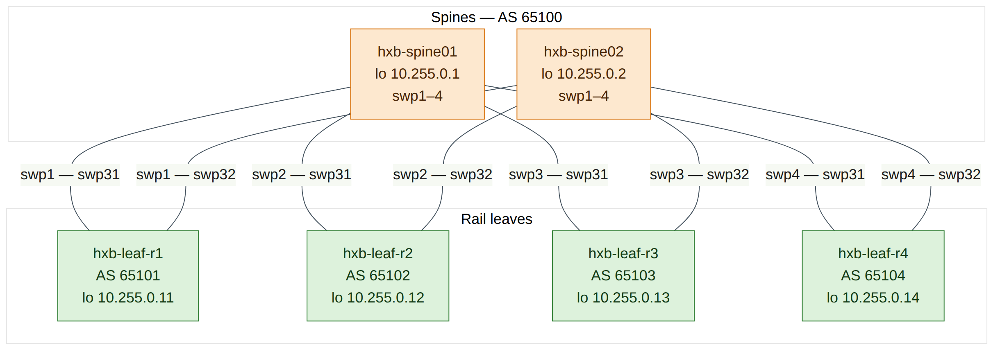
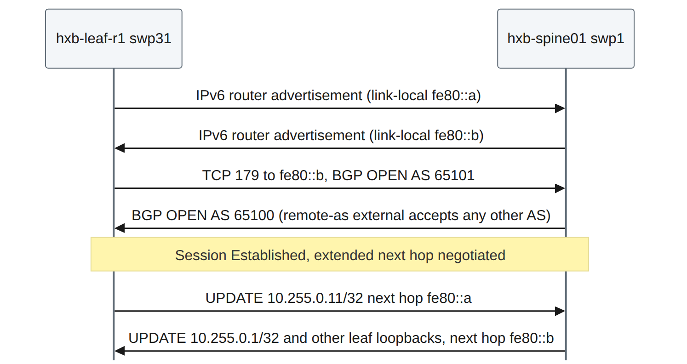
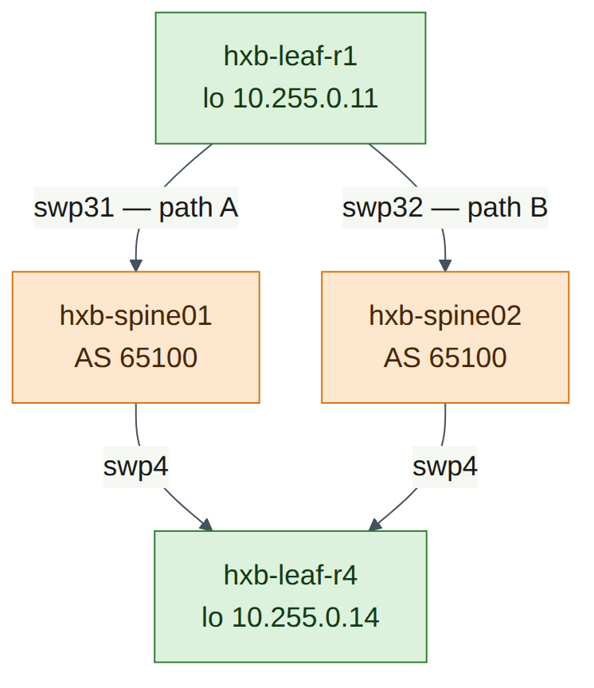
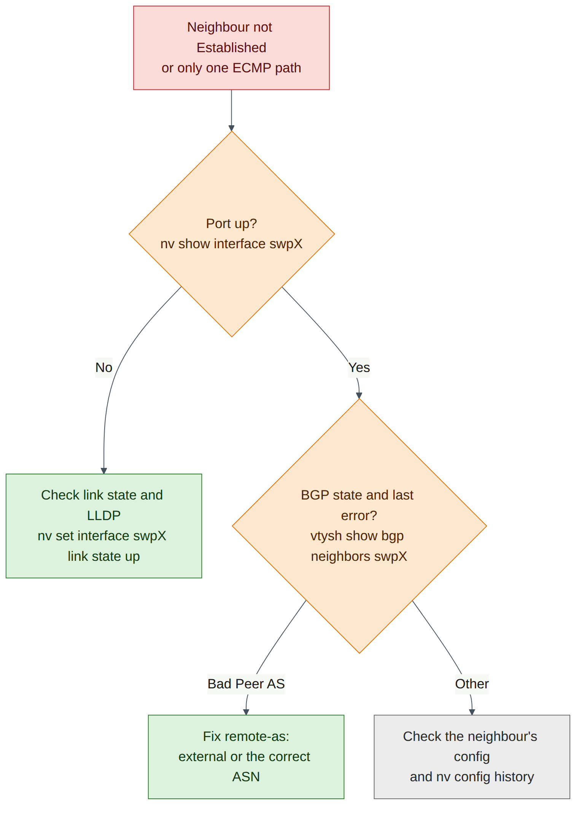

# Lab 2 — Underlay with eBGP Unnumbered

!!! abstract "Companion to the NCP-AIN Certification Guide"
    This free lab is part of the hands-on companion to *NCP-AIN Certification Guide* by Vakeesan Thevarajah (Cloudfoxy Ltd). The book explains the theory, design choices and hardware behaviour behind every step.

    [Get the book on Leanpub](https://leanpub.com/nvidiancp-aincertificationguide){ .md-button .md-button--primary } [Paperbacks](../book.md){ .md-button } [Free sample](../sample/NCP-AIN_Sample.pdf){ .md-button }


## Lab at a glance

| | |
|---|---|
| Book chapters | Chapter 4 (4.4 BGP unnumbered with NVUE); Chapter 2 (rail-optimised leaf–spine); Chapter 7 (the underlay that EVPN rides on) |
| Exam objectives | 2.1 Configure Spectrum-X switches (underlay foundation) · 2.3 Multi-tenant BGP-EVPN (prerequisite underlay) · 1.2 Rail-optimised topologies · supports 2.4 (NVIDIA Air) |
| Time | 75–90 minutes |
| Air resources used | Simulation `helix-b-air`: hxb-spine01, hxb-spine02, hxb-leaf-r1 … hxb-leaf-r4 and oob-mgmt-server |
| Prerequisite labs | Lab 1 (hostnames, MTU 9216, port descriptions and loopbacks applied and saved on all six switches) |

## Objectives

By the end of this lab you will be able to:

- Explain why AI fabrics use eBGP with a private ASN per leaf and a shared spine ASN, and what "unnumbered" removes from the design.
- Configure BGP on all six Helix-B switches with NVUE: ASN, router ID, interface neighbours with `remote-as external`, and loopback advertisement.
- Confirm ECMP multipath is active so each leaf has two equal-cost paths to every other leaf.
- Verify the underlay with `nv show vrf default router bgp neighbor`, `vtysh` (`show ip bgp summary`, `show ip route`), a loopback-sourced `ping`, and `traceroute`.
- Diagnose and fix a wrong `remote-as` and a downed uplink.

## Background

Helix-B uses the design most Spectrum-X AI fabrics use: a **Layer 3 leaf–spine underlay running eBGP**. Each leaf has its own private ASN (hxb-leaf-r1 … r4 are AS 65101–65104) and both spines share AS 65100. Sharing the spine ASN is deliberate. A path from one spine through a leaf to the other spine would contain AS 65100 twice, so BGP's own loop prevention rejects it. That keeps spine-to-leaf-to-spine "valley" paths out of the routing table without extra policy.

**Unnumbered** means the point-to-point links have no IPv4 addresses. Each switch port has an IPv6 link-local address and sends IPv6 router advertisements, so the neighbour learns that address automatically. BGP then peers over the link-local address, and carries IPv4 routes with an IPv6 next hop (RFC 5549 / RFC 8950). The result: you configure `neighbor swp31 remote-as external` instead of an IP address and a numeric ASN per link, there is no /31 addressing plan to maintain, and every leaf's BGP configuration is identical except for its ASN, router ID and loopback. That is exactly what makes templates (Lab 11) and Ansible (Lab 12) easy.

Each switch advertises only its **loopback** (/32). In Lab 5 the leaf loopbacks become the VXLAN tunnel endpoints (VTEPs), so the underlay's only job is to make every loopback reachable from every other one over **two equal-cost paths** — one through each spine. Cumulus Linux enables BGP multipath by default, so both paths are installed and traffic is spread by ECMP hashing.


<figure markdown>

{ loading=lazy }

<figcaption><strong>Figure L2.1: Helix-B underlay in Air.</strong> Each leaf connects swp31 to hxb-spine01 and swp32 to hxb-spine02. Leaves have their own ASN; both spines share AS 65100. Every link is an eBGP unnumbered session, and each switch advertises only its loopback.</figcaption>

</figure>


<figure markdown>

{ loading=lazy }

<figcaption><strong>Figure L2.2: How an unnumbered session comes up.</strong> No IPv4 address is configured on the link. Router advertisements reveal the neighbour's IPv6 link-local address, BGP peers over it, and IPv4 loopback routes are carried with an IPv6 next hop.</figcaption>

</figure>


!!! note "Version note"
    Cumulus VX forwards in the Linux kernel, not on a Spectrum ASIC. BGP, the routing table and ECMP behave as on a real switch, but the exact hash the kernel uses to choose between the two paths may differ from Spectrum hardware. The routing table is the authoritative proof of ECMP in this lab.


## Step-by-step

### Task 1 — Check the starting point

**Do this on all switches**

| Check | Command | Expected |
|---|---|---|
| Nothing pending | `nv config diff` | No output |
| Loopback present | `nv show interface lo` | Correct 10.255.0.x/32 from Lab 1 |
| Fabric ports up with LLDP neighbours | `nv show interface` | Leaves: swp31/32 up to spine01/02; spines: swp1–4 up to leaf-r1…r4 |
| No BGP yet | `nv show router bgp` | No ASN configured |

1. From oob-mgmt-server, log in to each switch in turn (`ssh cumulus@hxb-spine01` and so on) and run the checks in the table. For example:

    ```
    cumulus@hxb-leaf-r1:mgmt:~$ nv config diff
    cumulus@hxb-leaf-r1:mgmt:~$ nv show interface
    cumulus@hxb-leaf-r1:mgmt:~$ nv show router bgp
    ```

2. If a port is down or an LLDP neighbour is wrong, fix it before going further (see Lab 1, Task 5). BGP cannot fix cabling.

**Checkpoint**

- Every fabric port is up with the neighbour the plan expects, and every loopback is correct.

### Task 2 — Plan the BGP values

This is the only information that differs between switches. Everything else is identical.

| Switch | ASN | Router ID | Unnumbered neighbours | Advertise |
|---|---|---|---|---|
| hxb-spine01 | 65100 | 10.255.0.1 | swp1, swp2, swp3, swp4 | 10.255.0.1/32 |
| hxb-spine02 | 65100 | 10.255.0.2 | swp1, swp2, swp3, swp4 | 10.255.0.2/32 |
| hxb-leaf-r1 | 65101 | 10.255.0.11 | swp31, swp32 | 10.255.0.11/32 |
| hxb-leaf-r2 | 65102 | 10.255.0.12 | swp31, swp32 | 10.255.0.12/32 |
| hxb-leaf-r3 | 65103 | 10.255.0.13 | swp31, swp32 | 10.255.0.13/32 |
| hxb-leaf-r4 | 65104 | 10.255.0.14 | swp31, swp32 | 10.255.0.14/32 |

**Do this on all switches** (the pattern)

| Step | NVUE command |
|---|---|
| 1. Local ASN | `nv set router bgp autonomous-system <ASN>` |
| 2. Router ID = loopback | `nv set router bgp router-id <loopback IP>` |
| 3. One unnumbered neighbour per fabric port | `nv set vrf default router bgp neighbor <swpX> remote-as external` |
| 4. Advertise the loopback | `nv set vrf default router bgp address-family ipv4-unicast network <loopback>/32` |
| 5. ECMP (default 64; set explicitly for clarity) | `nv set vrf default router bgp address-family ipv4-unicast multipaths ebgp 64` |
| 6. Review and apply | `nv config diff` then `nv config apply -y` |


!!! info "Field note"
    `remote-as external` means "any ASN other than mine". That is why one line works on every leaf uplink without typing the spine's ASN, and why a spine can use the same line for four different leaves. Use `remote-as internal` for iBGP, or a number when you want BGP to enforce a specific peer ASN.


!!! info "Field note"
    The guide uses a `network` statement to advertise exactly one prefix, as in Chapter 4. The alternative, `nv set vrf default router bgp address-family ipv4-unicast redistribute connected`, advertises every connected route in the default VRF. That is common in labs, but on a real leaf it can leak link or server subnets into the underlay unless you add a route map, so prefer `network` for loopbacks.


### Task 3 — Configure the spines

Paste each block into the matching spine.

**hxb-spine01**

```
cumulus@hxb-spine01:mgmt:~$ nv set router bgp autonomous-system 65100
cumulus@hxb-spine01:mgmt:~$ nv set router bgp router-id 10.255.0.1
cumulus@hxb-spine01:mgmt:~$ nv set vrf default router bgp neighbor swp1 remote-as external
cumulus@hxb-spine01:mgmt:~$ nv set vrf default router bgp neighbor swp2 remote-as external
cumulus@hxb-spine01:mgmt:~$ nv set vrf default router bgp neighbor swp3 remote-as external
cumulus@hxb-spine01:mgmt:~$ nv set vrf default router bgp neighbor swp4 remote-as external
cumulus@hxb-spine01:mgmt:~$ nv set vrf default router bgp address-family ipv4-unicast network 10.255.0.1/32
cumulus@hxb-spine01:mgmt:~$ nv set vrf default router bgp address-family ipv4-unicast multipaths ebgp 64
cumulus@hxb-spine01:mgmt:~$ nv config diff
cumulus@hxb-spine01:mgmt:~$ nv config apply -y
```

**hxb-spine02**

```
cumulus@hxb-spine02:mgmt:~$ nv set router bgp autonomous-system 65100
cumulus@hxb-spine02:mgmt:~$ nv set router bgp router-id 10.255.0.2
cumulus@hxb-spine02:mgmt:~$ nv set vrf default router bgp neighbor swp1 remote-as external
cumulus@hxb-spine02:mgmt:~$ nv set vrf default router bgp neighbor swp2 remote-as external
cumulus@hxb-spine02:mgmt:~$ nv set vrf default router bgp neighbor swp3 remote-as external
cumulus@hxb-spine02:mgmt:~$ nv set vrf default router bgp neighbor swp4 remote-as external
cumulus@hxb-spine02:mgmt:~$ nv set vrf default router bgp address-family ipv4-unicast network 10.255.0.2/32
cumulus@hxb-spine02:mgmt:~$ nv set vrf default router bgp address-family ipv4-unicast multipaths ebgp 64
cumulus@hxb-spine02:mgmt:~$ nv config diff
cumulus@hxb-spine02:mgmt:~$ nv config apply -y
```

**Expected `nv config diff` output on hxb-spine01** (illustrative, trimmed):

```
- set:
    router:
      bgp:
        autonomous-system: 65100
        router-id: 10.255.0.1
    vrf:
      default:
        router:
          bgp:
            address-family:
              ipv4-unicast:
                multipaths:
                  ebgp: 64
                network:
                  10.255.0.1/32: {}
            neighbor:
              swp1:
                remote-as: external
                type: unnumbered
              ...
```


!!! note "Version note"
    Recent releases may also need `nv set router bgp state enabled` or `nv set vrf default router bgp state enabled` before BGP starts, and on some releases setting the ASN enables BGP implicitly. After applying, if `nv show router bgp` shows the state as disabled, set it to `enabled` and apply again (check on your release). The multipaths value 64 is already the default on Cumulus Linux; if your release rejects `multipaths ebgp`, press Tab after `multipaths` and skip the line — ECMP still works.


**Checkpoint**

- Both spines applied without errors.
- `nv show router bgp` on each spine shows AS 65100 and the correct router ID.
- Sessions are not up yet; the leaves have no BGP.

### Task 4 — Configure the leaves

**hxb-leaf-r1**

```
cumulus@hxb-leaf-r1:mgmt:~$ nv set router bgp autonomous-system 65101
cumulus@hxb-leaf-r1:mgmt:~$ nv set router bgp router-id 10.255.0.11
cumulus@hxb-leaf-r1:mgmt:~$ nv set vrf default router bgp neighbor swp31 remote-as external
cumulus@hxb-leaf-r1:mgmt:~$ nv set vrf default router bgp neighbor swp32 remote-as external
cumulus@hxb-leaf-r1:mgmt:~$ nv set vrf default router bgp address-family ipv4-unicast network 10.255.0.11/32
cumulus@hxb-leaf-r1:mgmt:~$ nv set vrf default router bgp address-family ipv4-unicast multipaths ebgp 64
cumulus@hxb-leaf-r1:mgmt:~$ nv config diff
cumulus@hxb-leaf-r1:mgmt:~$ nv config apply -y
```

**hxb-leaf-r2**

```
cumulus@hxb-leaf-r2:mgmt:~$ nv set router bgp autonomous-system 65102
cumulus@hxb-leaf-r2:mgmt:~$ nv set router bgp router-id 10.255.0.12
cumulus@hxb-leaf-r2:mgmt:~$ nv set vrf default router bgp neighbor swp31 remote-as external
cumulus@hxb-leaf-r2:mgmt:~$ nv set vrf default router bgp neighbor swp32 remote-as external
cumulus@hxb-leaf-r2:mgmt:~$ nv set vrf default router bgp address-family ipv4-unicast network 10.255.0.12/32
cumulus@hxb-leaf-r2:mgmt:~$ nv set vrf default router bgp address-family ipv4-unicast multipaths ebgp 64
cumulus@hxb-leaf-r2:mgmt:~$ nv config diff
cumulus@hxb-leaf-r2:mgmt:~$ nv config apply -y
```

**hxb-leaf-r3**

```
cumulus@hxb-leaf-r3:mgmt:~$ nv set router bgp autonomous-system 65103
cumulus@hxb-leaf-r3:mgmt:~$ nv set router bgp router-id 10.255.0.13
cumulus@hxb-leaf-r3:mgmt:~$ nv set vrf default router bgp neighbor swp31 remote-as external
cumulus@hxb-leaf-r3:mgmt:~$ nv set vrf default router bgp neighbor swp32 remote-as external
cumulus@hxb-leaf-r3:mgmt:~$ nv set vrf default router bgp address-family ipv4-unicast network 10.255.0.13/32
cumulus@hxb-leaf-r3:mgmt:~$ nv set vrf default router bgp address-family ipv4-unicast multipaths ebgp 64
cumulus@hxb-leaf-r3:mgmt:~$ nv config diff
cumulus@hxb-leaf-r3:mgmt:~$ nv config apply -y
```

**hxb-leaf-r4**

```
cumulus@hxb-leaf-r4:mgmt:~$ nv set router bgp autonomous-system 65104
cumulus@hxb-leaf-r4:mgmt:~$ nv set router bgp router-id 10.255.0.14
cumulus@hxb-leaf-r4:mgmt:~$ nv set vrf default router bgp neighbor swp31 remote-as external
cumulus@hxb-leaf-r4:mgmt:~$ nv set vrf default router bgp neighbor swp32 remote-as external
cumulus@hxb-leaf-r4:mgmt:~$ nv set vrf default router bgp address-family ipv4-unicast network 10.255.0.14/32
cumulus@hxb-leaf-r4:mgmt:~$ nv set vrf default router bgp address-family ipv4-unicast multipaths ebgp 64
cumulus@hxb-leaf-r4:mgmt:~$ nv config diff
cumulus@hxb-leaf-r4:mgmt:~$ nv config apply -y
```

1. After each leaf applies, wait 10–30 seconds for the sessions to establish.


    !!! info "Field note"
        Notice how little differs between the four leaf blocks: three values. In Lab 11 you will generate these blocks from one Jinja template and a small variables file.


**Checkpoint**

- All six switches applied without errors.
- `nv config diff applied startup` is empty on each switch (auto-save).

### Task 5 — Verify the BGP sessions

1. On **hxb-leaf-r1**, check the neighbours with NVUE:

    ```
    cumulus@hxb-leaf-r1:mgmt:~$ nv show vrf default router bgp neighbor
    ```

    **Expected output** (illustrative; column names vary by release):

    ```
    Neighbor  AS     State        Uptime    PfxSent  PfxRcvd
    --------  -----  -----------  --------  -------  -------
    swp31     65100  established  00:01:12  ...      4
    swp32     65100  established  00:01:10  ...      4
    ```

2. Look at one neighbour in detail:

    ```
    cumulus@hxb-leaf-r1:mgmt:~$ nv show vrf default router bgp neighbor swp31
    ```

Note the remote ASN (65100), the remote router ID (10.255.0.1), the state and the IPv6 link-local address the session uses.

3. Check the same thing from FRR:

    ```
    cumulus@hxb-leaf-r1:mgmt:~$ sudo vtysh -c "show ip bgp summary"
    ```

    **Expected output** (illustrative):

    ```
    IPv4 Unicast Summary (VRF default):
    BGP router identifier 10.255.0.11, local AS number 65101 vrf-id 0
    BGP table version 7
    RIB entries 11, using 2112 bytes of memory
    Peers 2, using 47 KiB of memory

    Neighbor            V    AS   MsgRcvd  MsgSent  TblVer  InQ OutQ  Up/Down State/PfxRcd  PfxSnt Desc
    hxb-spine01(swp31)  4 65100        45       44       0    0    0 00:01:12            4       5 N/A
    hxb-spine02(swp32)  4 65100        45       44       0    0    0 00:01:10            4       5 N/A

    Total number of neighbors 2
    ```

A number under **State/PfxRcd** means the session is Established and shows how many prefixes were accepted. A word such as `Active`, `Connect` or `Idle` means it is not up.

4. On **hxb-spine01**, confirm all four leaves are neighbours:

    ```
    cumulus@hxb-spine01:mgmt:~$ sudo vtysh -c "show ip bgp summary"
    ```

Expect four Established neighbours, `hxb-leaf-r1(swp1)` … `hxb-leaf-r4(swp4)`, with remote AS 65101–65104 and one prefix received from each.

**Do this on all switches** (quick check)

| Switch | Command | Expected |
|---|---|---|
| hxb-spine01, hxb-spine02 | `sudo vtysh -c "show ip bgp summary"` | 4 neighbours Established, AS 65101–65104 |
| hxb-leaf-r1 … r4 | `nv show vrf default router bgp neighbor` | swp31 and swp32 Established, AS 65100 |

**Checkpoint**

- 8 sessions in total (each leaf has 2, each spine has 4), all Established.
- Each leaf receives 4 prefixes per spine.

### Task 6 — Verify the routing table and ECMP

1. On **hxb-leaf-r1**, list the BGP routes:

    ```
    cumulus@hxb-leaf-r1:mgmt:~$ sudo vtysh -c "show ip route bgp"
    ```

    **Expected output** (illustrative; link-local addresses will differ):

    ```
    B>* 10.255.0.1/32 [20/0] via fe80::4638:39ff:fe00:1, swp31, weight 1, 00:01:30
    B>* 10.255.0.2/32 [20/0] via fe80::4638:39ff:fe00:2, swp32, weight 1, 00:01:28
    B>* 10.255.0.12/32 [20/0] via fe80::4638:39ff:fe00:1, swp31, weight 1, 00:01:05
      *                       via fe80::4638:39ff:fe00:2, swp32, weight 1, 00:01:05
    B>* 10.255.0.13/32 [20/0] via fe80::4638:39ff:fe00:1, swp31, weight 1, 00:00:58
      *                       via fe80::4638:39ff:fe00:2, swp32, weight 1, 00:00:58
    B>* 10.255.0.14/32 [20/0] via fe80::4638:39ff:fe00:1, swp31, weight 1, 00:00:50
      *                       via fe80::4638:39ff:fe00:2, swp32, weight 1, 00:00:50
    ```

2. Read it carefully:
       - The spine loopbacks each have **one** path (you reach spine01 only through swp31).
       - Every other leaf loopback has **two** next hops, one per spine. The `*` on both lines means both are installed in the forwarding table. That is ECMP.
       - The next hops are IPv6 link-local addresses: that is BGP unnumbered.

3. Look at one route in detail, and at the kernel's view:

    ```
    cumulus@hxb-leaf-r1:mgmt:~$ sudo vtysh -c "show ip route 10.255.0.14"
    cumulus@hxb-leaf-r1:mgmt:~$ sudo vtysh -c "show ip bgp 10.255.0.14/32"
    cumulus@hxb-leaf-r1:mgmt:~$ ip route show 10.255.0.14
    ```

    `show ip bgp 10.255.0.14/32` should list two paths, both with AS path `65100 65104`, and mark them `multipath`. The kernel output shows two `nexthop via inet6 fe80::…` lines.

4. On **hxb-spine01**, check what a spine knows:

    ```
    cumulus@hxb-spine01:mgmt:~$ sudo vtysh -c "show ip route bgp"
    ```

Expect the four leaf loopbacks, each via one port. There is **no** route to 10.255.0.2 (spine02). A path spine02 → leaf → spine01 carries AS path `65101 65100`, which contains spine01's own ASN, so BGP rejects it. This is the valley-free behaviour described in the Background, not a fault.


<figure markdown>

{ loading=lazy }

<figcaption><strong>Figure L2.3: Two equal-cost paths from hxb-leaf-r1 to hxb-leaf-r4.</strong> Both paths have the same AS path length (65100 65104), so BGP installs both. Traffic sourced from 10.255.0.11 to 10.255.0.14 is hashed per flow onto swp31 or swp32.</figcaption>

</figure>


**Checkpoint**

- Every leaf has one path to each spine loopback and two paths to each other leaf loopback.
- Each spine has four leaf loopbacks and no route to the other spine's loopback.

### Task 7 — Loopback-to-loopback ping and traceroute

`ping` and `traceroute` use the default VRF even though your shell is in the management VRF (Lab 1, Task 1). Always source from the loopback: it is the address the other leaf has a route back to, and it is the address VXLAN will use in Lab 5.

1. Ping hxb-leaf-r4's loopback from hxb-leaf-r1's loopback:

    ```
    cumulus@hxb-leaf-r1:mgmt:~$ ping -c 3 -I 10.255.0.11 10.255.0.14
    ```

    **Expected output** (illustrative):

    ```
    PING 10.255.0.14 (10.255.0.14) from 10.255.0.11 : 56(84) bytes of data.
    64 bytes from 10.255.0.14: icmp_seq=1 ttl=63 time=0.912 ms
    64 bytes from 10.255.0.14: icmp_seq=2 ttl=63 time=0.845 ms
    64 bytes from 10.255.0.14: icmp_seq=3 ttl=63 time=0.801 ms

    --- 10.255.0.14 ping statistics ---
    3 packets transmitted, 3 received, 0% packet loss, time 2003ms
    ```

TTL 63 means one routed hop (a spine) between the leaves.

2. Test jumbo frames end to end. 8972 bytes of ICMP data plus 28 bytes of headers is 9000 bytes, below the 9216 MTU; `-M do` forbids fragmentation:

    ```
    cumulus@hxb-leaf-r1:mgmt:~$ ping -c 3 -M do -s 8972 -I 10.255.0.11 10.255.0.14
    ```

This should succeed. If it fails with `message too long`, a port on the path is not at MTU 9216 (Lab 1, Task 5).

3. Trace the path:

    ```
    cumulus@hxb-leaf-r1:mgmt:~$ traceroute -n -s 10.255.0.11 10.255.0.14
    ```

    **Expected output** (illustrative):

    ```
    traceroute to 10.255.0.14 (10.255.0.14), 30 hops max, 60 byte packets
     1  10.255.0.1  0.702 ms  10.255.0.2  0.811 ms  10.255.0.1  0.765 ms
     2  10.255.0.14  1.120 ms  1.082 ms  1.051 ms
    ```

Traceroute sends three UDP probes per hop, each to a different destination port, so each probe is a different flow. When the ECMP hash includes the ports, the probes land on different spines and hop 1 lists both 10.255.0.1 and 10.255.0.2. The spines answer from their loopback because their fabric ports have no IPv4 address.

4. If hop 1 always shows the same spine, repeat with a few different starting ports to create different flows:

    ```
    cumulus@hxb-leaf-r1:mgmt:~$ traceroute -n -s 10.255.0.11 -p 33434 10.255.0.14
    cumulus@hxb-leaf-r1:mgmt:~$ traceroute -n -s 10.255.0.11 -p 40000 10.255.0.14
    cumulus@hxb-leaf-r1:mgmt:~$ traceroute -n -s 10.255.0.11 -p 50000 10.255.0.14
    ```


    !!! note "Version note"
        Which path a flow takes depends on the kernel's multipath hash policy on Cumulus VX, which may hash on addresses only (check on your release with `sysctl net.ipv4.fib_multipath_hash_policy`: 0 is L3, 1 is L3+L4). If every traceroute shows the same spine, ECMP is still working: the two installed next hops in Task 6 prove it. A Spectrum switch hashes in the ASIC and, with adaptive routing (Lab 4), can go further than per-flow ECMP.


**Do this on all switches** (full-mesh reachability)

| From | Command | Expected |
|---|---|---|
| hxb-leaf-r1 | `ping -c 2 -I 10.255.0.11 10.255.0.12` / `.13` / `.14` | 0% loss to each |
| hxb-leaf-r2 | `ping -c 2 -I 10.255.0.12 10.255.0.11` / `.13` / `.14` | 0% loss to each |
| hxb-leaf-r3 | `ping -c 2 -I 10.255.0.13 10.255.0.11` / `.12` / `.14` | 0% loss to each |
| hxb-leaf-r4 | `ping -c 2 -I 10.255.0.14 10.255.0.11` / `.12` / `.13` | 0% loss to each |
| hxb-spine01 | `ping -c 2 -I 10.255.0.1 10.255.0.11` … `.14` | 0% loss to each leaf |
| hxb-spine02 | `ping -c 2 -I 10.255.0.2 10.255.0.11` … `.14` | 0% loss to each leaf |

**Checkpoint**

- hxb-leaf-r1 pings 10.255.0.14 from 10.255.0.11 with 0% loss, including 9000-byte packets.
- Traceroute shows one spine hop, and you have seen (or can explain why you have not seen) both spines at hop 1.
- Every leaf reaches every other leaf loopback.

## Verify

- [ ] Every switch shows the planned ASN and router ID in `nv show router bgp`.
- [ ] 8 unnumbered sessions are Established (2 per leaf, 4 per spine).
- [ ] Each leaf has two ECMP next hops (swp31 and swp32) to every other leaf loopback.
- [ ] Spines have the four leaf loopbacks and no route to each other's loopback.
- [ ] `ping -I 10.255.0.11 10.255.0.14` succeeds, including with `-M do -s 8972`.
- [ ] `nv config diff` and `nv config diff applied startup` are empty on every switch.

## Break and fix


<figure markdown>

{ loading=lazy }

<figcaption><strong>Figure L2.4: Diagnosing a missing underlay session.</strong> Start from the symptom on the leaf, check the link layer first, then the BGP state and the last notification, then compare the configured remote-as with what the neighbour really uses.</figcaption>

</figure>


### Fault 1 — Wrong remote-as

**Inject** (on hxb-leaf-r4): someone "tightens" the configuration by typing the spine ASN, but gets it wrong.

```
cumulus@hxb-leaf-r4:mgmt:~$ nv set vrf default router bgp neighbor swp31 remote-as 65200
cumulus@hxb-leaf-r4:mgmt:~$ nv config apply -y
```

**Symptoms:**

- On hxb-leaf-r4, `nv show vrf default router bgp neighbor` shows swp31 not established.
- On hxb-leaf-r1, `sudo vtysh -c "show ip route 10.255.0.14"` shows only **one** next hop (via swp32). Traffic still flows, so nothing alarms — you have silently lost half the bandwidth to leaf-r4.
- On hxb-spine01, `show ip bgp summary` shows the neighbour on swp4 as `Idle` or `Active`.

**Diagnosis:**

```
cumulus@hxb-leaf-r4:mgmt:~$ sudo vtysh -c "show ip bgp summary"
cumulus@hxb-leaf-r4:mgmt:~$ sudo vtysh -c "show bgp neighbors swp31" | grep -iE "remote AS|state|notification|last reset"
cumulus@hxb-leaf-r4:mgmt:~$ nv config history
```

**Expected output** (illustrative):

```
BGP neighbor on swp31: fe80::4638:39ff:fe00:1, remote AS 65200, local AS 65104, external link
  BGP state = Active
  Last reset 00:00:41,  Notification sent (OPEN Message Error/Bad Peer AS)
```

The leaf expects AS 65200, the spine opens with AS 65100, so the leaf rejects the OPEN with **Bad Peer AS**. `nv config history` shows who applied the change and when.

**Fix:**

```
cumulus@hxb-leaf-r4:mgmt:~$ nv set vrf default router bgp neighbor swp31 remote-as external
cumulus@hxb-leaf-r4:mgmt:~$ nv config apply -y
cumulus@hxb-leaf-r4:mgmt:~$ nv show vrf default router bgp neighbor
```

Then confirm on hxb-leaf-r1 that 10.255.0.14 has two next hops again. (Setting `remote-as 65100` would also work; `external` keeps every leaf identical.)

### Fault 2 — Uplink administratively down

**Inject** (on hxb-leaf-r1):

```
cumulus@hxb-leaf-r1:mgmt:~$ nv set interface swp32 link state down
cumulus@hxb-leaf-r1:mgmt:~$ nv config apply -y
```

**Symptoms:**

- `nv show vrf default router bgp neighbor` shows swp32 down; `nv show interface` shows swp32 admin down.
- `sudo vtysh -c "show ip route 10.255.0.14"` shows a single next hop via swp31.
- Route to 10.255.0.2 (spine02) is gone from hxb-leaf-r1.
- Traceroute to 10.255.0.14 shows only 10.255.0.1 at hop 1, whatever the port.
- On hxb-spine02, only three leaves are Established.

**Diagnosis:** start at the link layer, as the figure shows.

```
cumulus@hxb-leaf-r1:mgmt:~$ nv show interface swp32
cumulus@hxb-leaf-r1:mgmt:~$ nv show interface swp32 link --applied
cumulus@hxb-leaf-r1:mgmt:~$ nv config history
```

Admin state is `down` in the applied configuration: this was a configuration change, not a cable fault. (A cable fault would show admin up, oper down, and no LLDP neighbour.)

**Fix:**

```
cumulus@hxb-leaf-r1:mgmt:~$ nv set interface swp32 link state up
cumulus@hxb-leaf-r1:mgmt:~$ nv config apply -y
cumulus@hxb-leaf-r1:mgmt:~$ sudo vtysh -c "show ip route 10.255.0.14"
```

Two next hops should return within a few seconds of the session re-establishing.


!!! info "Field note"
    Both faults leave the fabric "working", because the other spine carries the traffic. In an AI fabric that means half the bandwidth for every flow to or from that leaf, and slower collective operations. Monitor the number of ECMP next hops and Established sessions, not just reachability (Lab 7).


## Clean-up / save state

1. On every switch, confirm that nothing is pending and startup matches applied:

    ```
    cumulus@hxb-leaf-r1:mgmt:~$ nv config diff
    cumulus@hxb-leaf-r1:mgmt:~$ nv config diff applied startup
    ```

2. Make sure both faults are fixed: all 8 sessions Established, two next hops on every leaf-to-leaf route.
3. Optional but recommended: in the Air console, take a checkpoint of the simulation now (Lab 6 covers checkpoints in depth). "Underlay complete" is a useful point to return to before the RoCE and EVPN labs.
4. Keep the configuration. Labs 3–5 build on this underlay; Lab 5 uses the leaf loopbacks as VTEPs.
5. If you are stopping, put the simulation to sleep from the Air console.

## Exam tie-in

- **2.1 / 2.3** — The Spectrum-X underlay is eBGP unnumbered: `nv set router bgp autonomous-system`, `router-id`, and `nv set vrf default router bgp neighbor swpX remote-as external`. EVPN (Lab 5) adds the `l2vpn-evpn` address family to these same neighbours.
- **1.2** — Rail-optimised leaves with a shared spine ASN give valley-free, two-hop paths between any two leaves; each additional spine adds another equal-cost path.
- **2.1** — Loopbacks are advertised as /32s and become VTEP addresses; verify with `nv show vrf default router bgp neighbor`, `vtysh show ip bgp summary` and `show ip route`.
- **2.2 / 5.3** — ECMP multipath is on by default; losing a session halves the paths without breaking reachability, which is why path counts matter for low-latency, high-bandwidth verification.
- **2.4** — Air lets you rehearse the full underlay and its failures on Cumulus VX; hashing detail and forwarding performance are not representative of Spectrum hardware.

## Review questions

1. Why can every leaf use `remote-as external` on both uplinks, and what would break if you typed the wrong numeric ASN instead?
2. Why does hxb-spine01 have no route to hxb-spine02's loopback, and is that a problem?
3. In `show ip route 10.255.0.14` on hxb-leaf-r1, what tells you the underlay is using ECMP, and what tells you the sessions are unnumbered?
4. Why do you ping with `-I 10.255.0.11` rather than letting the switch pick a source address?
5. A leaf can still reach every other leaf, but `show ip route` shows one next hop for each. Name two likely causes and the first command you would run.

### Answers

1. `remote-as external` accepts any ASN different from the local one, so the same line works for any eBGP peer. A wrong numeric ASN makes the leaf reject the spine's OPEN with a **Bad Peer AS** notification, and the session never establishes.
2. Both spines use AS 65100. A path to spine02's loopback through any leaf has AS path `65101 65100`, which contains spine01's own ASN, so BGP loop prevention drops it. It is not a problem: spines do not need to reach each other in a leaf–spine fabric, and this prevents valley paths.
3. ECMP: two `via` lines, both marked `*` (installed), one through swp31 and one through swp32. Unnumbered: the next hops are IPv6 link-local addresses (`fe80::…`) on swp ports, with no IPv4 next hop.
4. The fabric ports have no IPv4 addresses, and only the loopback /32 is advertised. Sourcing from the loopback makes sure the far leaf has a route back, and it tests the same address pair that VXLAN tunnels will use.
5. One uplink or BGP session is down: a port set to admin down (or a cable fault), or a misconfigured neighbour such as a wrong `remote-as`. Start with `nv show vrf default router bgp neighbor` (or `sudo vtysh -c "show ip bgp summary"`), then `nv show interface` for the affected port.

---

!!! abstract "Go deeper"
    The matching book chapters cover the exam objectives for this lab in full, with a Q&A pack of about 40 exam-style questions per chapter.

    [Get the book on Leanpub](https://leanpub.com/nvidiancp-aincertificationguide){ .md-button .md-button--primary } [Report a problem with this lab](https://github.com/Cloudfoxy-Ltd/ncp-ain-guide/issues/new?template=erratum.yml){ .md-button }
