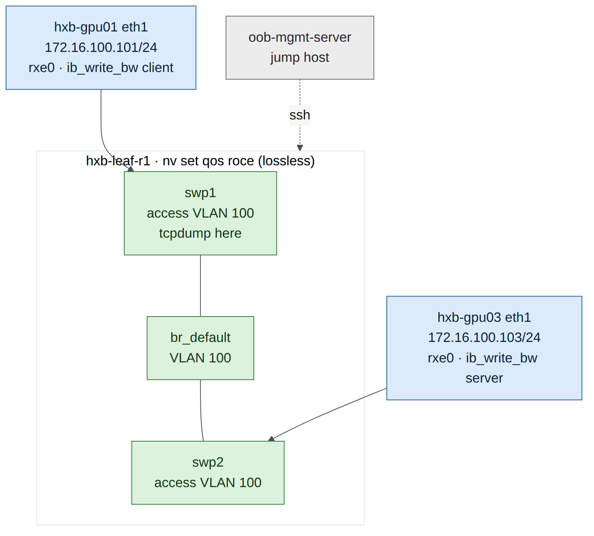
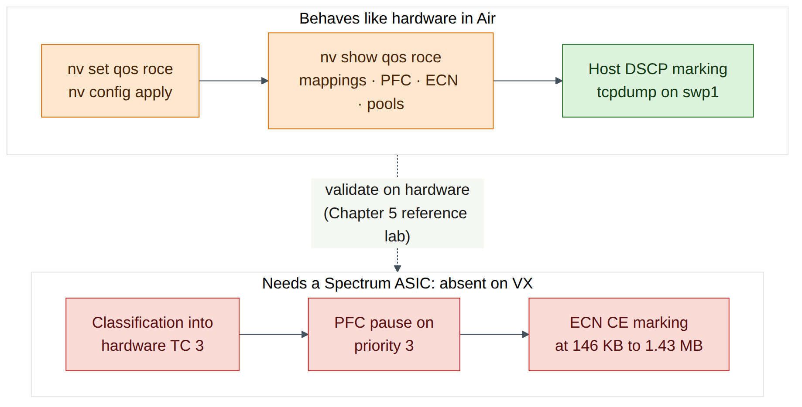
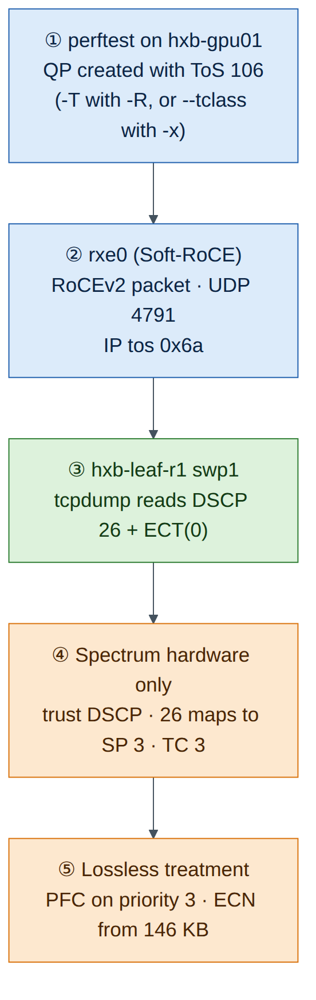
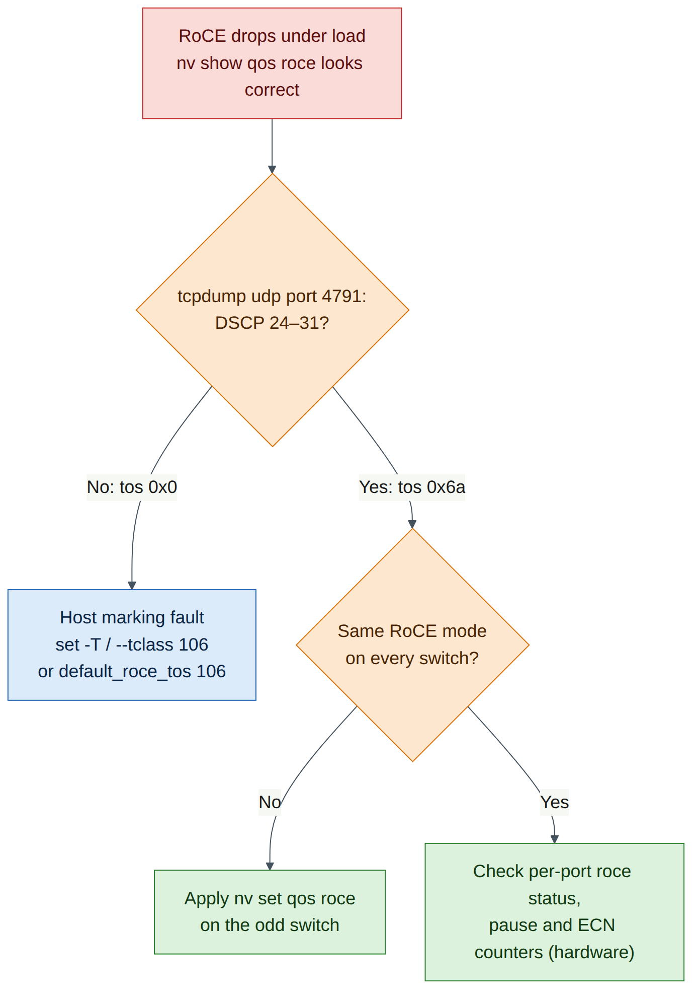

# Lab 3 — Lossless RoCE QoS and Soft-RoCE Hosts

!!! abstract "Companion to the NCP-AIN Certification Guide"
    This free lab is part of the hands-on companion to *NCP-AIN Certification Guide* by Vakeesan Thevarajah (Cloudfoxy Ltd). The book explains the theory, design choices and hardware behaviour behind every step.

    [Get the book](../book.md){ .md-button .md-button--primary } [Free sample](../sample/NCP-AIN_Sample.pdf){ .md-button }


## Lab at a glance

| Item | Detail |
|---|---|
| Book chapters | Chapter 5 (Lossless RoCE: QoS, PFC and ECN) · Chapter 3 (RDMA and RoCE basics) · Chapter 19 (perftest flags) |
| Exam objectives | **2.1** Configure Spectrum-X switches for RoCE · **2.2** Enable QoS, ECN and PFC · supports **5.5** (perftest) |
| Time | About 90 minutes |
| Air resources used | hxb-leaf-r1, hxb-gpu01, hxb-gpu03 (plus oob-mgmt-server as jump host). Optional roll-out task touches every switch |
| Prerequisite labs | Lab 0 (topology running), Lab 1 (NVUE essentials), Lab 2 (underlay) |

## Objectives

By the end of this lab you will be able to:

- Build a temporary test VLAN on a leaf so two servers can exchange RoCE traffic without any routing.
- Enable the NVIDIA RoCE QoS profile with `nv set qos roce` and read back every default it sets: trust, DSCP to switch-priority mapping, PFC, ECN and buffers.
- Turn an Ubuntu server into a RoCE endpoint with Soft-RoCE (`rdma_rxe`), and inspect the RDMA device, port and GID table.
- Mark RoCE traffic with traffic class byte 106 (DSCP 26 + ECT), both per test and as the RDMA-CM default.
- Prove the marking on the wire with `tcpdump`, and recognise the "host sends DSCP 0" fault.
- Explain plainly what Cumulus VX in Air can and cannot show you about lossless behaviour.

## Background

Chapter 5 described the Spectrum QoS pipeline: the switch **trusts** a marking, maps it to a **switch priority**, maps that to a **traffic class** (egress queue), places the packet in a **buffer pool**, and applies **PFC** or **ECN** when thresholds are crossed. On Cumulus Linux one command, `nv set qos roce`, builds the whole NVIDIA-validated profile: DSCP 24–31 lands in switch priority 3 (lossless, PFC on), and DSCP 48–55 (CNPs) lands in switch priority 6 (strict priority).

The switch only does half the job. The **host** must mark RoCE packets so they fall into the lossless class. The usual Helix-B value is traffic class byte **106**: DSCP 26 × 4 = 104, plus ECT(0) = 2. If the host sends DSCP 0, the switch classifies the traffic into lossy TC 0, and everything on the switch still "looks configured". That mismatch is the most common real-world RoCE QoS fault, and this lab makes you see it on the wire.

Air has no Spectrum ASIC and no ConnectX NICs. So you use **Soft-RoCE** (`rdma_rxe`), a Linux kernel driver that implements RoCEv2 in software over any Ethernet interface. It produces genuine RoCEv2 packets (UDP destination port 4791) with a real IP header, so the DSCP marking is exactly what you would check on hardware. On Cumulus VX the `swp` ports are ordinary Linux interfaces and bridging is done by the Linux kernel, so you can run `tcpdump` on the leaf port itself. On a real Spectrum switch the data plane is in the ASIC and `tcpdump` on a `swp` only sees traffic punted to the CPU.


<figure markdown>

{ loading=lazy }

<figcaption><strong>Figure 3.1: Lab 3 test topology.</strong> For this lab only, hxb-gpu01 eth1 and hxb-gpu03 eth1 sit in a plain VLAN 100 on the hxb-leaf-r1 bridge, so Soft-RoCE traffic between them crosses one switch with no routing. The RoCE QoS profile is enabled on the leaf, and you capture on swp1 to read the DSCP value. VLAN 100 is removed at the end because Lab 5 puts these ports into their EVPN tenants.</figcaption>

</figure>


!!! warning "Warning"
    Cumulus VX has no Spectrum ASIC. It has no real buffers, no hardware queues, no PFC pause generation and no ECN marking under load. The RoCE QoS commands are accepted and `nv show qos roce` displays the intended configuration, but no packet is ever paused or ECN-marked by VX. In this lab you learn to **configure and verify intent** on the switch and to **verify marking** on the host and on the wire. Counters that depend on the ASIC (per-priority pause, ECN marks, buffer occupancy) are expected to stay at zero or be absent.


## Step-by-step

### Task 1 — Build temporary VLAN 100 on hxb-leaf-r1

1. From the oob-mgmt-server, log in to the leaf.

    ```text
    ubuntu@oob-mgmt-server:~$ ssh cumulus@hxb-leaf-r1
    cumulus@hxb-leaf-r1:mgmt:~$
    ```

2. Put swp1 and swp2 into the default bridge as access ports in VLAN 100, then review and apply.

    ```text
    cumulus@hxb-leaf-r1:mgmt:~$ nv set bridge domain br_default vlan 100
    cumulus@hxb-leaf-r1:mgmt:~$ nv set interface swp1-2 bridge domain br_default access 100
    cumulus@hxb-leaf-r1:mgmt:~$ nv set interface swp1-2 description "LAB3-TEMP VLAN100"
    cumulus@hxb-leaf-r1:mgmt:~$ nv config diff
    cumulus@hxb-leaf-r1:mgmt:~$ nv config apply -y
    ```

3. Check the bridge membership.

    ```text
    cumulus@hxb-leaf-r1:mgmt:~$ nv show bridge domain br_default vlan
    cumulus@hxb-leaf-r1:mgmt:~$ nv show interface swp1-2 link
    ```

    **Expected output (illustrative):** VLAN 100 is listed in `br_default`, and swp1 and swp2 show `oper-status up` with access VLAN 100.

4. On each server, bring up eth1 and give it a Lab 3 address. These addresses are not persistent, which is what you want for a temporary VLAN.

    ```text
    ubuntu@oob-mgmt-server:~$ ssh ubuntu@hxb-gpu01
    ubuntu@hxb-gpu01:~$ sudo ip link set eth1 up
    ubuntu@hxb-gpu01:~$ sudo ip addr add 172.16.100.101/24 dev eth1
    ```

    ```text
    ubuntu@oob-mgmt-server:~$ ssh ubuntu@hxb-gpu03
    ubuntu@hxb-gpu03:~$ sudo ip link set eth1 up
    ubuntu@hxb-gpu03:~$ sudo ip addr add 172.16.100.103/24 dev eth1
    ubuntu@hxb-gpu03:~$ ping -c 3 172.16.100.101
    ```

    **Expected output (illustrative):**

    ```text
    64 bytes from 172.16.100.101: icmp_seq=1 ttl=64 time=0.912 ms
    64 bytes from 172.16.100.101: icmp_seq=2 ttl=64 time=0.644 ms
    64 bytes from 172.16.100.101: icmp_seq=3 ttl=64 time=0.701 ms
    ```

**Checkpoint**

- VLAN 100 exists on hxb-leaf-r1 and swp1–2 are access ports in it.
- hxb-gpu03 pings hxb-gpu01 on 172.16.100.0/24. `ttl=64` confirms there is no router in the path.

### Task 2 — Enable the RoCE QoS profile

1. Enable RoCE in its default mode and state the mode explicitly, so the intent is readable in the configuration.

    ```text
    cumulus@hxb-leaf-r1:mgmt:~$ nv set qos roce
    cumulus@hxb-leaf-r1:mgmt:~$ nv set qos roce mode lossless
    cumulus@hxb-leaf-r1:mgmt:~$ nv config diff
    cumulus@hxb-leaf-r1:mgmt:~$ nv config apply -y
    ```

    **Expected output (illustrative):** `nv config diff` shows a small block under `qos: roce:` with `enable: on` and `mode: lossless`. One NVUE line expands into the whole profile when NVUE renders the switch configuration.


    !!! note "Version note"
        On Cumulus VX, `nv config apply` normally accepts the RoCE profile (check on your release). If apply returns an error about the platform or `switchd`, copy the message into your lab notes, run `nv config detach` to drop the pending change, and continue with the read-only parts of this task using the book's reference output in Chapter 5. The host tasks (3 to 6) do not depend on it.


2. Read the full profile.

    ```text
    cumulus@hxb-leaf-r1:mgmt:~$ nv show qos roce
    ```

    **Expected output (illustrative, trimmed):**

    ```text
                         operational    applied
    -------------------  -------------  --------
    enable               on             on
    mode                 lossless       lossless
    congestion-control
      congestion-mode    ECN
      enabled-tc         0,3
      max-threshold      1.43 MB
      min-threshold      146.48 KB
      probability        100
    pfc
      pfc-priority       3
      rx-enabled         enabled
      tx-enabled         enabled
    trust
      trust-mode         pcp,dscp
    RoCE PCP/DSCP->SP mapping configurations
      pcp  dscp                     switch-prio
      3    24,25,26,27,28,29,30,31  3
      6    48,49,50,51,52,53,54,55  6
      ...
    RoCE SP->TC mapping and ETS configurations
      switch-prio  traffic-class  scheduler-weight
      3            3              DWRR-50%
      6            6              strict-priority
      ...
    RoCE pool config
      name                   mode     size
      lossy-default-ingress  Dynamic  50%
      roce-reserved-ingress  Dynamic  50%
      lossy-default-egress   Dynamic  50%
      roce-reserved-egress   Dynamic  inf
    ```

3. Record your own values in this table. It is the same table as Chapter 5, and the exam expects you to know it.

    | Setting | Default (book) | Your output |
    |---|---|---|
    | Mode | lossless | |
    | Trust | pcp,dscp | |
    | DSCP 26 maps to | switch priority 3, TC 3 | |
    | DSCP 48 maps to | switch priority 6, TC 6 | |
    | PFC priority | 3 (RX and TX) | |
    | ECN enabled on | TC 0 and TC 3 | |
    | ECN min / max / probability | 146.48 KB / 1.43 MB / 100% | |
    | RoCE TC 3 scheduling | DWRR 50% | |
    | CNP TC 6 scheduling | Strict priority | |

4. Look at the same settings through the individual QoS objects. The RoCE profile populates the standard QoS profiles (`default-global`), so you can inspect each stage of the pipeline separately.

    ```text
    cumulus@hxb-leaf-r1:mgmt:~$ nv show qos mapping default-global
    cumulus@hxb-leaf-r1:mgmt:~$ nv show qos mapping default-global dscp 26
    cumulus@hxb-leaf-r1:mgmt:~$ nv show qos mapping default-global dscp 48
    cumulus@hxb-leaf-r1:mgmt:~$ nv show qos pfc default-global
    cumulus@hxb-leaf-r1:mgmt:~$ nv show qos congestion-control default-global
    cumulus@hxb-leaf-r1:mgmt:~$ nv show qos traffic-pool
    ```

    **Expected output (illustrative):** `dscp 26` shows `switch-priority 3`, `dscp 48` shows `switch-priority 6`, PFC lists switch priority 3, and congestion control lists traffic classes 0 and 3 with ECN enabled. If one of these paths is not available on your release, `nv show qos` lists the objects that are (check on your release).

5. For reference only, these are the standard QoS commands that the RoCE profile saves you from typing. **Do not apply them** on top of `nv set qos roce`: NVIDIA's profile is validated per ASIC, and mixing manual changes into it is how fabrics drift.

    ```text
    nv set qos mapping default-global trust l3
    nv set qos mapping default-global dscp 26 switch-priority 3
    nv set qos mapping default-global dscp 48 switch-priority 6
    nv set qos pfc default-global switch-priority 3
    nv set qos pfc default-global tx enable
    nv set qos pfc default-global rx enable
    nv set qos congestion-control default-global traffic-class 3 min-threshold <bytes>
    nv set qos congestion-control default-global traffic-class 3 max-threshold <bytes>
    nv set qos congestion-control default-global traffic-class 3 ecn enable
    nv set qos traffic-pool <pool-name> memory-percent <percent>
    ```

6. Check the per-port view on the two server-facing ports.

    ```text
    cumulus@hxb-leaf-r1:mgmt:~$ nv show interface swp1 qos roce status
    cumulus@hxb-leaf-r1:mgmt:~$ nv show interface swp1 qos roce counters
    cumulus@hxb-leaf-r1:mgmt:~$ nv show interface qos-roce-status-pool-map
    ```

    **Expected output:** On hardware, `status` shows the profile active on the port with PFC on priority 3, and `counters` shows RoCE bytes, pause frames and ECN marks. On VX, status may show the configured intent while counters are zero or not supported. That is expected: the counters come from the ASIC.


<figure markdown>

{ loading=lazy }

<figcaption><strong>Figure 3.2: What VX shows and what it cannot.</strong> The configuration plane (NVUE, the rendered QoS files and `nv show`) behaves as on Spectrum hardware. Everything below it depends on the ASIC, so on VX it is absent: no hardware queues, no pause frames, no ECN marks and no buffer occupancy. Marking is still real because the hosts generate it.</figcaption>

</figure>


**Checkpoint**

- `nv show qos roce` shows mode `lossless`, trust `pcp,dscp`, PFC priority 3 and ECN on TC 0 and 3.
- You can state which switch priority and TC DSCP 26 and DSCP 48 map to.
- You can say which of these settings VX can actually enforce (none of the data-plane ones).

### Task 3 — Optional: roll the profile out to every switch

RoCE QoS must be consistent on every hop. Chapter 22 and Lab 12 automate this with Ansible. For now, a shell loop from the oob-mgmt-server is enough. It runs non-interactively because NVUE commands work over `ssh`.

```text
ubuntu@oob-mgmt-server:~$ for sw in hxb-spine01 hxb-spine02 hxb-leaf-r2 hxb-leaf-r3 hxb-leaf-r4; do
>   echo "== $sw"; ssh cumulus@$sw "nv set qos roce && nv config apply -y && nv show qos roce | grep -E '^mode|pfc-priority'"
> done
```

**Expected output (illustrative):** each switch prints `mode lossless` and `pfc-priority 3`.

**Checkpoint**

- Every switch in helix-b-air reports the same RoCE mode. A single switch left in its default QoS state is the classic "one hop is lossy" fault.

### Task 4 — Install RDMA tools and create a Soft-RoCE device

Do steps 1–6 on **both** hxb-gpu01 and hxb-gpu03. hxb-gpu01 is shown.

1. Install the RDMA user space, the verbs utilities and perftest.

    ```text
    ubuntu@hxb-gpu01:~$ sudo apt-get update
    ubuntu@hxb-gpu01:~$ sudo apt-get install -y rdma-core ibverbs-utils ibverbs-providers perftest
    ```


    !!! info "Field note"
        Air servers normally reach the Ubuntu mirrors through the OOB network. If `apt-get update` cannot resolve or reach the mirror, check the internet setting of your simulation in the Air UI before troubleshooting anything else.


2. Load the Soft-RoCE kernel module.

    ```text
    ubuntu@hxb-gpu01:~$ sudo modprobe rdma_rxe
    ubuntu@hxb-gpu01:~$ lsmod | grep rdma_rxe
    ```

    **Expected output (illustrative):**

    ```text
    rdma_rxe              204800  0
    ib_uverbs             200704  2 rdma_rxe,rdma_ucm
    ib_core               524288  6 rdma_cm,rdma_rxe,...
    ```


    !!! note "Version note"
        On some Ubuntu kernel flavours `rdma_rxe` ships in the extra modules package. If `modprobe` reports `Module rdma_rxe not found`, install it with `sudo apt-get install -y linux-modules-extra-$(uname -r)` and try again (check on your release).


3. Bind a Soft-RoCE device called `rxe0` to eth1 and check the link.

    ```text
    ubuntu@hxb-gpu01:~$ sudo rdma link add rxe0 type rxe netdev eth1
    ubuntu@hxb-gpu01:~$ rdma link show
    ```

    **Expected output (illustrative):**

    ```text
    link rxe0/1 state ACTIVE physical_state LINK_UP netdev eth1
    ```

4. List RDMA devices and inspect the port.

    ```text
    ubuntu@hxb-gpu01:~$ ibv_devices
    ubuntu@hxb-gpu01:~$ ibv_devinfo -d rxe0
    ```

    **Expected output (illustrative):**

    ```text
        device                 node GUID
        ------              ----------------
        rxe0                5054:00ff:fe12:3401

    hca_id: rxe0
            transport:                      InfiniBand (0)
            ...
            port:   1
                    state:                  PORT_ACTIVE (4)
                    max_mtu:                4096 (5)
                    active_mtu:             1024 (3)
                    sm_lid:                 0
                    port_lid:               0
                    port_lmc:               0x00
                    link_layer:             Ethernet
    ```

Note three things. `transport: InfiniBand` is normal for RoCE: the verbs transport is InfiniBand's, carried over Ethernet. `link_layer: Ethernet` tells you it is RoCE. `active_mtu 1024` follows from eth1's MTU of 1500 bytes, because a RoCE MTU must fit inside the Ethernet MTU with its headers (Lab 9 explores this).

5. Read the GID table. Ubuntu's rdma-core does not ship the `show_gids` script that comes with DOCA-OFED/MLNX_OFED, so use `ibv_devinfo -v` or read sysfs directly.

    ```text
    ubuntu@hxb-gpu01:~$ ibv_devinfo -v -d rxe0 | grep GID
    ubuntu@hxb-gpu01:~$ for i in 0 1 2 3; do
    >   g=$(cat /sys/class/infiniband/rxe0/ports/1/gids/$i 2>/dev/null)
    >   t=$(cat /sys/class/infiniband/rxe0/ports/1/gid_attrs/types/$i 2>/dev/null)
    >   echo "$i $g $t"
    > done
    ```

    **Expected output (illustrative):**

    ```text
                            GID[  0]:       fe80::5054:ff:fe12:3401, RoCE v2
                            GID[  1]:       ::ffff:172.16.100.101, RoCE v2
    0 fe80:0000:0000:0000:5054:00ff:fe12:3401 RoCE v2
    1 0000:0000:0000:0000:0000:ffff:ac10:6465 RoCE v2
    2 0000:0000:0000:0000:0000:0000:0000:0000
    3 0000:0000:0000:0000:0000:0000:0000:0000
    ```

The **RoCEv2 IPv4 GID** is the one that embeds your IPv4 address as `::ffff:172.16.100.101` (`ac10:6465` is 172.16.100.101 in hex). Its index, usually **1** on Soft-RoCE, is what `-x` means in perftest. On ConnectX adapters the same address is often index 3, because the NIC also lists RoCE v1 GIDs. Always read the table rather than assume.

6. Repeat steps 1–5 on hxb-gpu03 and record its RoCEv2 IPv4 GID index.

**Checkpoint**

- `rdma link show` reports `rxe0/1 state ACTIVE` bound to eth1 on both servers.
- `ibv_devinfo` shows `PORT_ACTIVE` and `link_layer: Ethernet`.
- You know the GID index that holds `::ffff:172.16.100.10x` on each server.

### Task 5 — Mark RoCE traffic with traffic class 106

There are three places a RoCE application's marking can come from. Know all three, because the exam and real incidents use all three.

| Method | Applies to | How |
|---|---|---|
| perftest `--tclass=<value>` | Tests that connect without RDMA-CM (you give `-x <GID index>`). Sets the Traffic Class in the GRH, which becomes the IP ToS byte | `ib_write_bw -x 1 --tclass=106 …` |
| perftest `-T <value>` / `--tos=<value>` | Tests that connect with RDMA-CM (`-R`). perftest passes the ToS to RDMA-CM | `ib_write_bw -R -T 106 …` |
| RDMA-CM default ToS (configfs) | Every RDMA-CM connection on that device and port that doesn't set its own ToS | `default_roce_tos` under `/sys/kernel/config/rdma_cm/` |


!!! note "Version note"
    In current perftest, `--tclass` sets the GRH traffic class and `-T`/`--tos` is documented as "available only with -R". A command such as `ib_write_bw -R --tclass=106` may therefore **not** mark the packets on your version. Check `ib_write_bw --help | grep -iE 'tos|tclass'` on your release and use the table above. The `cma_roce_tos` helper script mentioned in Chapter 5 ships with DOCA-OFED/MLNX_OFED, not with Ubuntu's rdma-core, so here you use configfs directly.


1. Check the perftest options on your installed version.

    ```text
    ubuntu@hxb-gpu01:~$ ib_write_bw --help | grep -iE 'tos|tclass|rdma_cm|gid-index'
    ```

    **Expected output (illustrative):**

    ```text
      -R, --rdma_cm  Connect QPs with rdma_cm and run test on those QPs
      -T, --tos=<tos value>  Set <tos_value> to RDMA-CM QPs. available only with -R flag. values 0-256 (default off)
      -x, --gid-index=<index>  Test uses GID with GID index taken from command
          --tclass=<value>  Set the Traffic Class in GRH (if GRH is in use)
    ```

2. Set the RDMA-CM default ToS for rxe0 to 106 on **both** servers. Creating the directory under `rdma_cm` makes the kernel populate it with the device's ports.

    ```text
    ubuntu@hxb-gpu01:~$ sudo modprobe rdma_cm
    ubuntu@hxb-gpu01:~$ mount | grep -q configfs || sudo mount -t configfs none /sys/kernel/config
    ubuntu@hxb-gpu01:~$ sudo mkdir -p /sys/kernel/config/rdma_cm/rxe0
    ubuntu@hxb-gpu01:~$ echo 106 | sudo tee /sys/kernel/config/rdma_cm/rxe0/ports/1/default_roce_tos
    ubuntu@hxb-gpu01:~$ cat /sys/kernel/config/rdma_cm/rxe0/ports/1/default_roce_tos
    ```

    **Expected output:** `106`. This setting is not persistent: it is lost when the server reboots or the rxe0 device is deleted.

**Checkpoint**

- You can explain why `--tclass` goes with `-x` and `-T` goes with `-R`.
- `default_roce_tos` reads 106 on both servers.

### Task 6 — Run perftest and prove the marking on the wire

1. On hxb-leaf-r1, start a capture on swp1 (the port facing hxb-gpu01). Leave it running.

    ```text
    cumulus@hxb-leaf-r1:mgmt:~$ sudo tcpdump -i swp1 -nn -v -c 6 udp port 4791
    ```

2. On hxb-gpu03, start the **server** side of an RDMA WRITE bandwidth test using RDMA-CM.

    ```text
    ubuntu@hxb-gpu03:~$ ib_write_bw -d rxe0 -R -T 106 -F --report_gbits
    ```

3. On hxb-gpu01, run the **client** against the server's IP.

    ```text
    ubuntu@hxb-gpu01:~$ ib_write_bw -d rxe0 -R -T 106 -F --report_gbits 172.16.100.103
    ```

    **Expected output (client, illustrative):**

    ```text
                        RDMA_Write BW Test
     Dual-port       : OFF          Device         : rxe0
     Number of qps   : 1            Transport type : IB
     Connection type : RC           Using SRQ      : OFF
     TX depth        : 128
     CQ Moderation   : 1
     Mtu             : 1024[B]
     Link type       : Ethernet
     GID index       : 1
     Max inline data : 0[B]
     rdma_cm QPs     : ON
     Data ex. method : rdma_cm      TOS    : 106
    ---------------------------------------------------------------------------------------
     local address: LID 0000 QPN 0x0011 PSN 0x2c61a2
     GID: 00:00:00:00:00:00:00:00:00:00:255:255:172:16:100:101
     remote address: LID 0000 QPN 0x0012 PSN 0x9a01be
     GID: 00:00:00:00:00:00:00:00:00:00:255:255:172:16:100:103
    ---------------------------------------------------------------------------------------
     #bytes     #iterations    BW peak[Gb/sec]    BW average[Gb/sec]   MsgRate[Mpps]
     65536      5000             1.62               1.48                 0.002823
    ---------------------------------------------------------------------------------------
    ```

Ignore the bandwidth figure. Soft-RoCE runs on a virtual CPU, so a few Gb/s or less is normal (Lab 9 explains why). What matters here is `rdma_cm QPs : ON`, `GID index : 1` chosen automatically by RDMA-CM, and `TOS : 106`.

4. Read the capture on the leaf.

    **Expected output (illustrative):**

    ```text
    tcpdump: listening on swp1, link-type EN10MB (Ethernet), snapshot length 262144 bytes
    10:42:17.311508 IP (tos 0x6a,ECT(0), ttl 64, id 4412, offset 0, flags [DF], proto UDP (17), length 1080)
        172.16.100.101.49153 > 172.16.100.103.4791: UDP, length 1052
    ...
    6 packets captured
    ```

Decode the ToS byte: `0x6a` = 106 = binary `011010 10`. The top six bits `011010` are **DSCP 26**, and the bottom two bits `10` are **ECT(0)**. On a Spectrum switch with the RoCE profile, DSCP 26 falls in 24–31, so the packet goes to switch priority 3, TC 3, the lossless queue.

5. Now run the same test the other way: without RDMA-CM, with an explicit GID index and `--tclass`. Use the index you recorded in Task 4.

    ```text
    ubuntu@hxb-gpu03:~$ ib_write_bw -d rxe0 -x 1 --tclass=106 -F --report_gbits
    ubuntu@hxb-gpu01:~$ ib_write_bw -d rxe0 -x 1 --tclass=106 -F --report_gbits 172.16.100.103
    ```

Capture again on swp1. You should see the same `tos 0x6a`. In this mode perftest exchanges QP details over a TCP socket (port 18515) first, and you can see that TCP session if you capture without the UDP filter.


<figure markdown>

{ loading=lazy }

<figcaption><strong>Figure 3.3: Following the marking from host to queue.</strong> The application (perftest) sets ToS 106 either with -T over RDMA-CM or with --tclass in the GRH. Soft-RoCE copies it into the IP header of every RoCEv2 packet (UDP 4791). The leaf reads DSCP 26 and, on Spectrum hardware, maps it to switch priority 3 and lossless TC 3.</figcaption>

</figure>


**Checkpoint**

- `tcpdump` on hxb-leaf-r1 swp1 shows RoCEv2 packets to UDP 4791 with `tos 0x6a,ECT(0)`.
- You can convert a ToS byte to DSCP (divide by 4, ignore the remainder) and back (DSCP × 4 + ECN bits).
- You have run perftest in both connection modes, `-R -T 106` and `-x <index> --tclass=106`.

## Verify

- [ ] VLAN 100 is up on hxb-leaf-r1 with swp1–2 as access ports, and the servers ping each other on 172.16.100.0/24.
- [ ] `nv show qos roce` shows `lossless`, trust `pcp,dscp`, PFC priority 3, ECN on TC 0 and 3, and DSCP 26 → SP 3, DSCP 48 → SP 6.
- [ ] `rdma link show` shows rxe0 ACTIVE on eth1 on hxb-gpu01 and hxb-gpu03.
- [ ] You know the RoCEv2 IPv4 GID index on each server.
- [ ] `default_roce_tos` is 106 on both servers.
- [ ] A capture on swp1 shows RoCEv2 (UDP 4791) with ToS 0x6a (DSCP 26, ECT(0)).
- [ ] You can list what VX cannot show: hardware TC classification, PFC pauses, ECN marks, buffer occupancy.

## Break and fix

### Fault 1 — The host sends DSCP 0

**Inject.** On both servers, set the RDMA-CM default back to 0, then run the test with `-R` and **no** `-T`, as an application that "forgot" its traffic class would.

```text
ubuntu@hxb-gpu03:~$ echo 0 | sudo tee /sys/kernel/config/rdma_cm/rxe0/ports/1/default_roce_tos
ubuntu@hxb-gpu01:~$ echo 0 | sudo tee /sys/kernel/config/rdma_cm/rxe0/ports/1/default_roce_tos
ubuntu@hxb-gpu03:~$ ib_write_bw -d rxe0 -R -F --report_gbits
ubuntu@hxb-gpu01:~$ ib_write_bw -d rxe0 -R -F --report_gbits 172.16.100.103
```

**Symptoms.** The test completes normally. Nothing on the switch has changed, and `nv show qos roce` is still perfect. On real hardware the job would be fine when idle and would suffer drops and erratic throughput under incast, while the RoCE priority-3 counters on the leaf stay almost empty.

**Diagnosis.** Capture on the leaf port.

```text
cumulus@hxb-leaf-r1:mgmt:~$ sudo tcpdump -i swp1 -nn -v -c 3 udp port 4791
```

**Expected output (illustrative):**

```text
10:51:02.114873 IP (tos 0x0, ttl 64, id 5120, offset 0, flags [DF], proto UDP (17), length 1080)
    172.16.100.101.49154 > 172.16.100.103.4791: UDP, length 1052
```

`tos 0x0` means DSCP 0 and Not-ECT. DSCP 0 maps to switch priority 0 and **TC 0**, which is lossy: no PFC, and packets can be dropped. It is also not ECN-capable, so DCQCN gets no early feedback. The client's own output confirms it: there is no `TOS : 106` on the `Data ex. method` line.


<figure markdown>

{ loading=lazy }

<figcaption><strong>Figure 3.4: Diagnosing "RoCE configured but still dropping".</strong> Start from the wire, not the switch configuration. If the captured ToS is not DSCP 24–31, fix the host marking. Only if the marking is right do you move on to switch trust, mapping and PFC state.</figcaption>

</figure>


**Fix.** Restore the default ToS on both servers and re-run the capture to confirm `tos 0x6a`.

```text
ubuntu@hxb-gpu01:~$ echo 106 | sudo tee /sys/kernel/config/rdma_cm/rxe0/ports/1/default_roce_tos
ubuntu@hxb-gpu03:~$ echo 106 | sudo tee /sys/kernel/config/rdma_cm/rxe0/ports/1/default_roce_tos
```

Because the RDMA-CM default now applies, even `ib_write_bw -R` without `-T` marks the traffic with ToS 106. In production the equivalent fixes are `NCCL_IB_TC=106` for NCCL, the device's RDMA-CM default ToS, and trust `dscp` on the NIC (Chapter 5).

### Fault 2 — One switch drops to lossy mode

**Inject.** On hxb-leaf-r1, change the mode and apply.

```text
cumulus@hxb-leaf-r1:mgmt:~$ nv set qos roce mode lossy
cumulus@hxb-leaf-r1:mgmt:~$ nv config apply -y
```

**Symptoms.** On hardware, RoCE still reaches TC 3 and gets ECN, but the leaf no longer sends or honours PFC on priority 3, so incast bursts that outrun congestion control are dropped instead of paused. On VX there is no visible traffic effect.

**Diagnosis.**

```text
cumulus@hxb-leaf-r1:mgmt:~$ nv show qos roce | grep -A3 -E '^mode|^pfc'
cumulus@hxb-leaf-r1:mgmt:~$ nv config history | head
```

`mode lossy` and the missing PFC priority give it away. `nv config history` shows who applied the change and when.

**Fix.**

```text
cumulus@hxb-leaf-r1:mgmt:~$ nv set qos roce mode lossless
cumulus@hxb-leaf-r1:mgmt:~$ nv config apply -y
cumulus@hxb-leaf-r1:mgmt:~$ nv show qos roce | grep -E '^mode|pfc-priority'
```

## Clean-up / save state

Lab 5 puts swp1 and swp2 into the AURORA and BOREALIS tenants, and the servers' eth1 addresses change to 172.16.10.101 and 172.17.10.103. Remove the temporary VLAN now, but **keep the RoCE QoS profile**: every later lab assumes it.

1. On hxb-leaf-r1, remove VLAN 100 and the temporary port settings, then save.

    ```text
    cumulus@hxb-leaf-r1:mgmt:~$ nv unset interface swp1-2 bridge
    cumulus@hxb-leaf-r1:mgmt:~$ nv unset interface swp1-2 description
    cumulus@hxb-leaf-r1:mgmt:~$ nv unset bridge domain br_default vlan 100
    cumulus@hxb-leaf-r1:mgmt:~$ nv config diff
    cumulus@hxb-leaf-r1:mgmt:~$ nv config apply -y
    cumulus@hxb-leaf-r1:mgmt:~$ nv config save
    cumulus@hxb-leaf-r1:mgmt:~$ nv show qos roce | grep -E '^mode'
    ```

    **Expected output:** `mode lossless`. If `br_default` has no other members, NVUE may also remove the bridge. Lab 5 re-creates it.

2. On each server, remove the Lab 3 address. Leave rxe0 in place: Lab 9 reuses it on the same eth1 interface, and its GID table follows the new address automatically.

    ```text
    ubuntu@hxb-gpu01:~$ sudo ip addr del 172.16.100.101/24 dev eth1
    ubuntu@hxb-gpu03:~$ sudo ip addr del 172.16.100.103/24 dev eth1
    ```

3. If you are stopping here, sleep the simulation from the Air UI to save compute-hour credits. Note that the rxe0 device and the configfs ToS are **not persistent**: after a server reboot, repeat Task 4 steps 2–3 and Task 5 step 2.

## Exam tie-in

- **2.1:** `nv set qos roce` (then `nv config apply`) enables the RoCE profile, default mode `lossless`. `nv set qos roce mode lossy` removes PFC but keeps classification and ECN. Verify with `nv show qos roce` and `nv show interface <if> qos roce status`/`counters`.
- **2.2:** Know the defaults: trust PCP+DSCP, DSCP 24–31 → SP 3 → TC 3 (DWRR 50%, PFC, ECN), DSCP 48–55 → SP 6 → TC 6 (strict, CNPs), ECN 146.48 KB / 1.43 MB / 100% on TC 0 and 3.
- **2.1 and 2.2 (host side):** Traffic class 106 = DSCP 26 × 4 + ECT(0). A host sending DSCP 0 lands in lossy TC 0 even when every switch is correct.
- **5.5:** perftest on RoCE needs the right GID (`-x`, or `-R` to let RDMA-CM resolve it) and the right marking (`--tclass` with `-x`, `-T` with `-R`).

## Review questions

1. A captured RoCEv2 packet shows `tos 0x6a`. What DSCP and ECN values does it carry, and which switch priority and traffic class does the default RoCE profile give it?
2. Which command changes an existing lossless RoCE configuration to lossy, and what is the single behavioural difference between the two modes?
3. You run `ib_write_bw -x 1 -T 106 172.16.100.103` and the capture shows `tos 0x0`. Why?
4. On hxb-leaf-r1 in Air, `nv show qos roce` is correct but `nv show interface swp1 qos roce counters` shows no pause frames or ECN marks after a perftest run. Is the fabric broken?
5. Why does `ibv_devinfo` report `active_mtu 1024` for rxe0 when eth1 has an MTU of 1500?

### Answers

1. `0x6a` = 106 = DSCP 26 (106 ÷ 4 = 26 remainder 2) with ECN bits `10`, ECT(0). DSCP 26 is in 24–31, so switch priority 3 and traffic class 3, the lossless RoCE queue with PFC and ECN.
2. `nv set qos roce mode lossy` followed by `nv config apply`. Lossy mode keeps trust, mappings, scheduling and ECN, but does not enable PFC on priority 3.
3. `-T`/`--tos` only applies to RDMA-CM connections (`-R`). Without `-R`, perftest connects over its TCP socket with the GID from `-x`, and the marking must be set with `--tclass=106`.
4. No. Cumulus VX has no Spectrum ASIC, so there are no hardware queues, pause frames or ECN marks to count. You verify intent with `nv show` and marking with `tcpdump`. Data-plane counters must be validated on hardware.
5. The RoCE MTU is one of the InfiniBand sizes (256, 512, 1024, 2048, 4096), and the whole RoCEv2 packet (Ethernet, IP, UDP, BTH headers plus payload) must fit in the Ethernet MTU. 2048 does not fit in 1500, so the largest valid value is 1024. With a 9000-byte MTU it becomes 4096 (Lab 9).

---

!!! abstract "Go deeper"
    The matching book chapters cover the exam objectives for this lab in full, with a Q&A pack of about 40 exam-style questions per chapter.

    [Get the book](../book.md){ .md-button .md-button--primary } [Report a problem with this lab](https://github.com/Cloudfoxy-Ltd/ncp-ain-guide/issues/new?template=erratum.yml){ .md-button }
