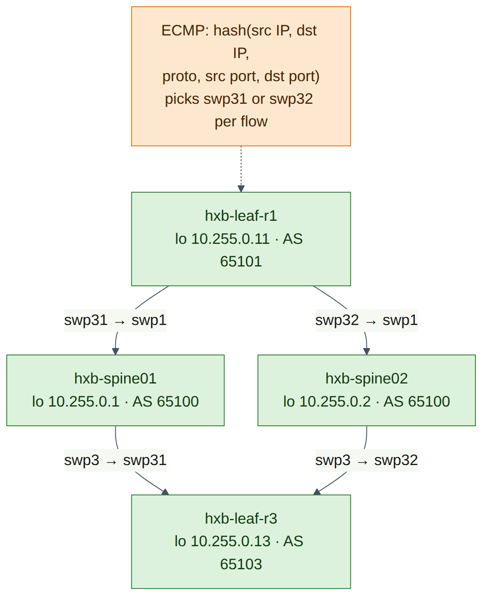
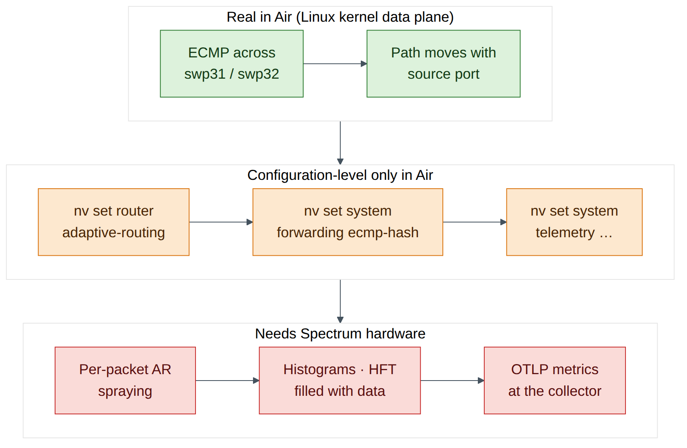
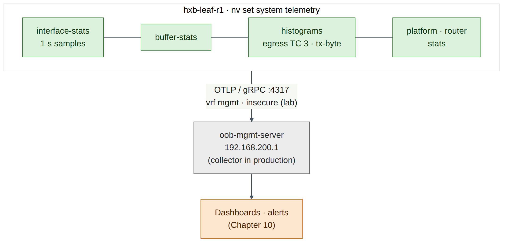

# Lab 4 — Adaptive Routing, ECMP and Telemetry Configuration

!!! abstract "Companion to the NCP-AIN Certification Guide"
    This free lab is part of the hands-on companion to *NCP-AIN Certification Guide* by Vakeesan Thevarajah (Cloudfoxy Ltd). The book explains the theory, design choices and hardware behaviour behind every step.

    [Get the book on Leanpub](https://leanpub.com/nvidiancp-aincertificationguide){ .md-button .md-button--primary } [Paperbacks](../book.md){ .md-button } [Free sample](../sample/NCP-AIN_Sample.pdf){ .md-button }


## Lab at a glance

| Item | Detail |
|---|---|
| Book chapters | Chapter 6 (Adaptive routing, performance isolation and telemetry) · Chapter 10 (monitoring) · Chapter 2 (Clos fabrics and ECMP) |
| Exam objectives | **2.2** Enable QoS, ECN, PFC, **adaptive routing and telemetry** · supports **2.5** (diagnose congestion) |
| Time | About 60 minutes |
| Air resources used | hxb-leaf-r1 and hxb-leaf-r3 (configuration), hxb-spine01 and hxb-spine02 (path observation), oob-mgmt-server (jump host, telemetry destination) |
| Prerequisite labs | Lab 2 (eBGP unnumbered underlay with loopbacks advertised). Lab 3 is recommended but not required |

## Objectives

By the end of this lab you will be able to:

- Enable adaptive routing (AR) globally and on each uplink with NVUE, and verify it, while being clear about what VX can and cannot do with it.
- Read and change the ECMP hash configuration (`nv show system forwarding`, hash fields, hash seed) and know where `cl-ecmpcalc` fits.
- Observe ECMP path selection in the Air underlay by varying the source port of a probe and watching it move between the two spines.
- Configure OTLP telemetry export and interface, buffer and histogram statistics with the commands from Chapter 6.
- State, for each feature, whether Air gives you a configuration-level result or a data-plane result.

## Background

Hash-based ECMP pins each flow to one path. For the few, huge, long-lived RoCE flows of AI training, that means collisions: two elephant flows share one uplink while another sits idle. Spectrum-X **adaptive routing** solves this by choosing the egress port **per packet** from live port load, and relies on the SuperNIC to put packets back in order at the receiver. On Cumulus Linux it is enabled globally with `nv set router adaptive-routing state enabled` and then per eligible Layer-3 uplink. AR applies to RoCEv2 unicast in the default VRF; everything else still uses ECMP hashing, which is why the hash settings still matter.

Telemetry is the other half of objective 2.2. Counters averaged over seconds hide microbursts, so Spectrum switches add **histograms** (distributions of queue occupancy, latency and counters), **high-frequency telemetry** (HFT, Spectrum-4) and **OTLP export** to an OpenTelemetry collector over gRPC.

This lab is honest about Air. NVIDIA's documentation lists **Cumulus VX as not supported** for adaptive routing, and histograms, HFT and OTLP export need Spectrum-2 or later (HFT needs Spectrum-4). On VX you can type, diff and in many cases apply the configuration, and read it back with `nv show`. You cannot see packets sprayed or histograms filled. ECMP, on the other hand, is real in Air: VX forwards in the Linux kernel, which load-shares across the two spines, so you can watch flows move between paths.


<figure markdown>

{ loading=lazy }

<figcaption><strong>Figure 4.1: Two equal-cost paths from hxb-leaf-r1 to hxb-leaf-r3.</strong> Each leaf has two uplinks, swp31 to hxb-spine01 and swp32 to hxb-spine02, so the route to 10.255.0.13 has two next hops. ECMP picks one per flow by hashing header fields. Adaptive routing (hardware only) would pick per packet by load.</figcaption>

</figure>


## Step-by-step

### Task 1 — Confirm the two equal-cost paths

1. Log in to hxb-leaf-r1 and check the route to hxb-leaf-r3's loopback.

    ```text
    ubuntu@oob-mgmt-server:~$ ssh cumulus@hxb-leaf-r1
    cumulus@hxb-leaf-r1:mgmt:~$ nv show vrf default router rib ipv4 route 10.255.0.13/32
    cumulus@hxb-leaf-r1:mgmt:~$ ip route show 10.255.0.13
    ```

    **Expected output (illustrative):**

    ```text
    10.255.0.13 nhid 62 proto bgp metric 20
            nexthop via inet6 fe80::4638:39ff:fe00:1 dev swp31 weight 1
            nexthop via inet6 fe80::4638:39ff:fe00:3 dev swp32 weight 1
    ```

Two next hops (IPv6 link-local, because the underlay is BGP unnumbered from Lab 2) means ECMP is in play.

**Checkpoint**

- The route to 10.255.0.13/32 has two next hops, one via swp31 and one via swp32.

### Task 2 — Enable adaptive routing (configuration level)

1. Enable AR globally and on both uplinks. The book's Chapter 6 example uses `swp49-52`; on helix-b-air the uplinks are `swp31-32`.

    ```text
    cumulus@hxb-leaf-r1:mgmt:~$ nv set router adaptive-routing state enabled
    cumulus@hxb-leaf-r1:mgmt:~$ nv set interface swp31-32 router adaptive-routing state enabled
    cumulus@hxb-leaf-r1:mgmt:~$ nv config diff
    ```

    **Expected output (illustrative):**

    ```text
    - set:
        router:
          adaptive-routing:
            state: enabled
        interface:
          swp31:
            router:
              adaptive-routing:
                state: enabled
          swp32:
            router:
              adaptive-routing:
                state: enabled
    ```

2. Try to apply.

    ```text
    cumulus@hxb-leaf-r1:mgmt:~$ nv config apply -y
    ```


    !!! note "Version note"
        NVIDIA documents adaptive routing as supported on Spectrum-4 at 200G and 400G, and **not supported on Cumulus VX**. Depending on your release, VX either accepts the configuration (and `nv show` displays it with no data-plane effect) or rejects the apply with a platform error (check on your release). If apply fails, record the message, run `nv config detach` to discard the pending change, and complete step 3 using `nv config diff` as your evidence of correct intent.


3. Verify.

    ```text
    cumulus@hxb-leaf-r1:mgmt:~$ nv show router adaptive-routing
    cumulus@hxb-leaf-r1:mgmt:~$ nv show interface swp31 router adaptive-routing
    cumulus@hxb-leaf-r1:mgmt:~$ nv show interface swp32 router adaptive-routing
    ```

    **Expected output (illustrative):**

    ```text
                                  operational  applied
    ----------------------------  -----------  --------
    state                         enabled      enabled
    link-utilization-threshold    disabled     disabled
    ```

4. Look at the one AR tunable Chapter 6 covers: the link-utilisation threshold (default 70%). Do not change it in this lab; just read the syntax.

    ```text
    nv set interface swp31 router adaptive-routing link-utilization-threshold <1-100>
    nv set router adaptive-routing link-utilization-threshold enabled
    ```

5. Repeat steps 1–3 on hxb-leaf-r3 so that both ends of the path under study carry the same intent.


<figure markdown>

{ loading=lazy }

<figcaption><strong>Figure 4.2: What this lab proves in Air, layer by layer.</strong> ECMP forwarding is real in Air because VX forwards in the Linux kernel. Adaptive routing, histograms and OTLP data depend on the Spectrum ASIC, so in Air you prove the configuration and leave data-plane proof to hardware.</figcaption>

</figure>


**Checkpoint**

- `nv config diff` (or `nv show router adaptive-routing`) shows AR enabled globally and on swp31 and swp32, on both hxb-leaf-r1 and hxb-leaf-r3.
- You can explain why AR still needs per-interface enablement after the global command.

### Task 3 — Inspect and tune ECMP hashing

1. Read the forwarding and hash settings.

    ```text
    cumulus@hxb-leaf-r1:mgmt:~$ nv show system forwarding
    cumulus@hxb-leaf-r1:mgmt:~$ nv show system forwarding ecmp-hash
    ```

    **Expected output (illustrative):**

    ```text
                      operational  applied
    ----------------  -----------  -------
    destination-ip    enabled      on
    destination-port  enabled      on
    ip-protocol       enabled      on
    source-ip         enabled      on
    source-port       enabled      on
    ...
    ```

2. Set a unique hash seed on this leaf. Chapter 6 explains why: identical seeds on every tier make leaf and spine take correlated decisions (polarisation).

    ```text
    cumulus@hxb-leaf-r1:mgmt:~$ nv set system forwarding hash-seed 50
    cumulus@hxb-leaf-r1:mgmt:~$ nv config diff
    cumulus@hxb-leaf-r1:mgmt:~$ nv config apply -y
    cumulus@hxb-leaf-r1:mgmt:~$ nv show system forwarding | grep -i seed
    ```


    !!! warning "Warning"
        On Spectrum hardware these settings program the ASIC hash, through `switchd`. On VX there is no ASIC, so they do **not** change how the Linux kernel hashes the traffic you observe in Task 4. The kernel's own policy is controlled by `net.ipv4.fib_multipath_hash_policy`. Keep that distinction clear.


3. Try the path calculator.

    ```text
    cumulus@hxb-leaf-r1:mgmt:~$ sudo cl-ecmpcalc -i swp1 -s 10.255.0.11 -d 10.255.0.13 -p udp --sport 49152 --dport 4791
    ```

    **Expected output:** On Spectrum hardware, `cl-ecmpcalc` prints the egress interface the ASIC hash would choose for that flow. On VX it is either absent or fails because there is no ASIC to query (check on your release). Record which one you see. The book's form of the command, with every field (interface, source, destination, protocol, ports) supplied, is what matters for the exam.

**Checkpoint**

- You can list the ECMP hash fields and name the commands that remove L4 ports from the hash (`nv set system forwarding ecmp-hash source-port off` / `destination-port off`) and set the seed.
- You know which tool predicts a flow's path on hardware.

### Task 4 — Watch ECMP move flows between spines

On VX the kernel does the forwarding, so you can see real ECMP decisions. Your shell on a Cumulus switch runs in the management VRF (note `:mgmt:` in the prompt), so run underlay tests in the **default** VRF with `ip vrf exec default`.

1. Check that the kernel includes Layer-4 ports in its multipath hash.

    ```text
    cumulus@hxb-leaf-r1:mgmt:~$ sysctl net.ipv4.fib_multipath_hash_policy
    ```

    **Expected output:** `net.ipv4.fib_multipath_hash_policy = 1` (L3 + L4). If it shows `0` (L3 only), every flow between the same two loopbacks takes the same path. Set it to 1 for this lab only: `sudo sysctl -w net.ipv4.fib_multipath_hash_policy=1` (it reverts on reboot).

2. Ask the kernel which next hop it would use for several flows that differ only by source port. The destination port is 4791, as for RoCEv2.

    ```text
    cumulus@hxb-leaf-r1:mgmt:~$ for sp in 49152 49153 49154 49155 49156 49157; do
    >   echo -n "sport $sp: "
    >   ip route get 10.255.0.13 from 10.255.0.11 ipproto udp sport $sp dport 4791 | grep -o 'dev swp3[12]'
    > done
    ```

    **Expected output (illustrative):**

    ```text
    sport 49152: dev swp31
    sport 49153: dev swp32
    sport 49154: dev swp32
    sport 49155: dev swp31
    sport 49156: dev swp31
    sport 49157: dev swp32
    ```

3. Confirm with real probes. `traceroute -U` sends UDP to one fixed destination port (instead of incrementing it per probe), and `--sport` fixes the source port, so each run is one "flow".

    ```text
    cumulus@hxb-leaf-r1:mgmt:~$ for sp in 49152 49153 49154 49155; do
    >   sudo ip vrf exec default traceroute -n -q 1 -U -p 4791 --sport=$sp -s 10.255.0.11 10.255.0.13 | tail -2
    > done
    ```

    **Expected output (illustrative):**

    ```text
     1  10.255.0.1  0.901 ms
     2  10.255.0.13  1.412 ms
     1  10.255.0.2  0.874 ms
     2  10.255.0.13  1.380 ms
     1  10.255.0.2  0.911 ms
     2  10.255.0.13  1.502 ms
     1  10.255.0.1  0.820 ms
     2  10.255.0.13  1.355 ms
    ```

Hop 1 is the spine's loopback (unnumbered interfaces borrow it), so `10.255.0.1` means hxb-spine01 and `10.255.0.2` means hxb-spine02. Different source ports, different spines: that is per-flow ECMP. Every probe of one run takes the same path, because the 5-tuple does not change. That is exactly why a single elephant RoCE flow can never use more than one uplink under ECMP.


!!! info "Field note"
    If `traceroute` is not installed or does not recognise `--sport`, use step 2 alone: `ip route get` with `sport`/`dport` shows the kernel's decision directly (check on your release).


4. Now remove the source port from the kernel hash and repeat step 2. With `fib_multipath_hash_policy=0`, all six flows pick the same uplink. Put the value back afterwards.

    ```text
    cumulus@hxb-leaf-r1:mgmt:~$ sudo sysctl -w net.ipv4.fib_multipath_hash_policy=0
    cumulus@hxb-leaf-r1:mgmt:~$ sudo sysctl -w net.ipv4.fib_multipath_hash_policy=1
    ```

This is the kernel equivalent of `nv set system forwarding ecmp-hash source-port off` on hardware: fewer hash fields, less entropy, more collisions.

**Checkpoint**

- Different source ports map to different uplinks (swp31/swp32) and different first-hop spines.
- Without L4 fields in the hash, all flows between the same two addresses take one path.

### Task 5 — Configure telemetry: OTLP export, statistics and histograms

1. On the oob-mgmt-server, find its management address. It is the OTLP destination for this lab.

    ```text
    ubuntu@oob-mgmt-server:~$ ip -4 addr show eth0 | grep inet
    ```

    **Expected output (illustrative):** `inet 192.168.200.1/24 ...`. Use your own value in place of `192.168.200.1` below.

2. On hxb-leaf-r1, enable telemetry and OTLP export over the management VRF (the Chapter 6 command set).

    ```text
    cumulus@hxb-leaf-r1:mgmt:~$ nv set system telemetry state enabled
    cumulus@hxb-leaf-r1:mgmt:~$ nv set system telemetry export otlp state enabled
    cumulus@hxb-leaf-r1:mgmt:~$ nv set system telemetry export otlp grpc destination 192.168.200.1 port 4317
    cumulus@hxb-leaf-r1:mgmt:~$ nv set system telemetry export otlp grpc insecure enabled
    cumulus@hxb-leaf-r1:mgmt:~$ nv set system telemetry export vrf mgmt
    cumulus@hxb-leaf-r1:mgmt:~$ nv set system telemetry interface-stats export state enabled
    cumulus@hxb-leaf-r1:mgmt:~$ nv set system telemetry interface-stats sample-interval 1
    cumulus@hxb-leaf-r1:mgmt:~$ nv set system telemetry buffer-stats export state enabled
    cumulus@hxb-leaf-r1:mgmt:~$ nv set system telemetry histogram export state enabled
    cumulus@hxb-leaf-r1:mgmt:~$ nv set system telemetry platform-stats export state enabled
    cumulus@hxb-leaf-r1:mgmt:~$ nv set system telemetry router export state enabled
    ```


    !!! warning "Warning"
        `insecure enabled` sends telemetry without TLS. It is for the lab only. In production, install the collector's CA certificate with `nv set system telemetry export otlp grpc certificate <ca-certificate>`.


3. Add histograms for the RoCE queue. An egress-buffer histogram on traffic class 3 answers "how often does the lossless queue go above X?". Add it on the server-facing and uplink ports, together with a counter histogram on the uplinks.

    ```text
    cumulus@hxb-leaf-r1:mgmt:~$ nv set system telemetry histogram egress-buffer bin-min-boundary 960
    cumulus@hxb-leaf-r1:mgmt:~$ nv set system telemetry histogram egress-buffer histogram-size 12288
    cumulus@hxb-leaf-r1:mgmt:~$ nv set system telemetry histogram egress-buffer sample-interval 1024
    cumulus@hxb-leaf-r1:mgmt:~$ nv set interface swp1-2,swp31-32 telemetry histogram egress-buffer traffic-class 3
    cumulus@hxb-leaf-r1:mgmt:~$ nv set interface swp31-32 telemetry histogram counter counter-type tx-byte
    cumulus@hxb-leaf-r1:mgmt:~$ nv config diff
    cumulus@hxb-leaf-r1:mgmt:~$ nv config apply -y
    ```


    !!! note "Version note"
        OTLP export, buffer statistics and histograms need a Spectrum-2 or later ASIC (egress-buffer histograms Spectrum-1 and later), and HFT needs Spectrum-4. On VX, apply may succeed with no data produced, or be rejected for unsupported objects (check on your release). If it is rejected, `nv config detach`, then re-enter the commands without the objects named in the error and keep a note of which ones VX refused.


4. Read the configuration back.

    ```text
    cumulus@hxb-leaf-r1:mgmt:~$ nv show system telemetry
    cumulus@hxb-leaf-r1:mgmt:~$ nv show system telemetry export
    cumulus@hxb-leaf-r1:mgmt:~$ nv show system telemetry histogram
    cumulus@hxb-leaf-r1:mgmt:~$ nv show system telemetry histogram interface
    cumulus@hxb-leaf-r1:mgmt:~$ nv show interface swp31 telemetry histogram egress-buffer traffic-class 3
    ```

    **Expected output (illustrative):** `export` shows OTLP `enabled`, destination 192.168.200.1 port 4317, VRF `mgmt`. `histogram interface` lists swp1, swp2, swp31 and swp32. On hardware, the per-interface histogram view shows bins with sample counts. On VX expect the configuration and empty or missing bins.

5. Optional: see whether the leaf tries to reach the collector. There is no collector running, so any connection is refused, but the attempt shows the export path and VRF are right.

    ```text
    ubuntu@oob-mgmt-server:~$ sudo tcpdump -i eth0 -nn -c 5 tcp port 4317
    ```

    **Expected output:** SYN packets from hxb-leaf-r1's management address to port 4317, answered by RST, if the VX build starts the exporter at all. No packets is also a valid VX result: record it.

6. For reference, the HFT block from Chapter 6. Type it into `nv config diff` only if you want to see how NVUE renders it, then detach; HFT needs Spectrum-4.

    ```text
    nv set system telemetry hft sample-interval-usec 1000
    nv set system telemetry hft counter tc-occupancy
    nv set system telemetry hft egress-buffer traffic-class 3
    nv set interface swp31-32 telemetry hft state enabled
    nv set system telemetry hft duration 120
    nv set system telemetry hft export state enabled
    ```


<figure markdown>

{ loading=lazy }

<figcaption><strong>Figure 4.3: Telemetry configured on hxb-leaf-r1.</strong> Interface, buffer, platform and routing statistics plus TC 3 histograms feed the OTLP exporter, which streams over gRPC (port 4317) in the management VRF to the collector on the oob-mgmt-server. On hardware the collector would feed Prometheus or Grafana. On VX the pipeline is configured but carries little or no data.</figcaption>

</figure>


**Checkpoint**

- `nv show system telemetry export` shows the OTLP destination, port and VRF you set, or you have a recorded note of what VX refused.
- You can name the four telemetry layers in Chapter 6 (counters, histograms, HFT, OTLP) and the ASIC generation each needs.

## Verify

- [ ] The route to 10.255.0.13/32 has two next hops on hxb-leaf-r1.
- [ ] AR intent (global and swp31–32) is visible in `nv show router adaptive-routing` or in `nv config diff`, on hxb-leaf-r1 and hxb-leaf-r3.
- [ ] `nv show system forwarding` shows your hash seed and the hash fields.
- [ ] `ip route get … sport <n>` or `traceroute --sport` shows different flows taking different spines.
- [ ] Telemetry export and TC 3 histograms are configured on hxb-leaf-r1 (or you recorded exactly which objects VX refused).
- [ ] You can say, for AR, ECMP, histograms and OTLP, which part Air proved and which part needs hardware.

## Break and fix

### Fault 1 — AR enabled on only one uplink

This is the Chapter 6 troubleshooting scenario in miniature.

**Inject.** On hxb-leaf-r1, disable AR on swp32 as if a typo had left it out of the range.

```text
cumulus@hxb-leaf-r1:mgmt:~$ nv set interface swp32 router adaptive-routing state disabled
cumulus@hxb-leaf-r1:mgmt:~$ nv config apply -y
```

**Symptoms.** On hardware, RoCE traffic that the leaf sends out of swp32 is still placed by ECMP hash, so uplink utilisation is uneven and ECN marks appear on one uplink only, even though "AR is enabled".

**Diagnosis.** Check the global state, then every uplink. Use JSON when you script this across many leaves.

```text
cumulus@hxb-leaf-r1:mgmt:~$ nv show router adaptive-routing
cumulus@hxb-leaf-r1:mgmt:~$ for i in swp31 swp32; do echo -n "$i: "; nv show interface $i router adaptive-routing -o json | grep -o '"state": *"[a-z]*"'; done
```

**Expected output (illustrative):**

```text
swp31: "state": "enabled"
swp32: "state": "disabled"
```

**Fix.**

```text
cumulus@hxb-leaf-r1:mgmt:~$ nv set interface swp31-32 router adaptive-routing state enabled
cumulus@hxb-leaf-r1:mgmt:~$ nv config apply -y
```

To stop it happening again, generate leaf configuration from a template (Lab 11) and check AR on every uplink automatically.

### Fault 2 — No entropy in the hash

**Inject.** On hxb-leaf-r1, set the kernel policy to L3 only (standing in for `ecmp-hash source-port off` and `destination-port off` on hardware).

```text
cumulus@hxb-leaf-r1:mgmt:~$ sudo sysctl -w net.ipv4.fib_multipath_hash_policy=0
```

**Symptoms.** Re-run Task 4 step 2. All flows between 10.255.0.11 and 10.255.0.13 take the same uplink, whatever the source port.

**Diagnosis.** `sysctl net.ipv4.fib_multipath_hash_policy` shows `0`. On hardware, `nv show system forwarding ecmp-hash` would show the port fields disabled.

**Fix.** `sudo sysctl -w net.ipv4.fib_multipath_hash_policy=1`, then re-run the loop and confirm both uplinks appear. On hardware: `nv set system forwarding ecmp-hash source-port on` and `destination-port on`, then apply.

## Clean-up / save state

1. Decide what to keep. The AR and telemetry configuration is harmless on VX and matches the Helix-B design, so keep it if it applied cleanly. If VX rejected any object, make sure nothing is left pending.

    ```text
    cumulus@hxb-leaf-r1:mgmt:~$ nv config diff
    cumulus@hxb-leaf-r1:mgmt:~$ nv config detach        # only if the diff shows leftover pending changes
    ```

2. If you prefer a clean baseline for Lab 5, remove the telemetry objects (keep AR and the hash seed).

    ```text
    cumulus@hxb-leaf-r1:mgmt:~$ nv unset system telemetry
    cumulus@hxb-leaf-r1:mgmt:~$ nv unset interface swp1-2,swp31-32 telemetry
    cumulus@hxb-leaf-r1:mgmt:~$ nv config apply -y
    ```

3. Confirm the kernel hash policy is back to `1`, then save on every switch you changed.

    ```text
    cumulus@hxb-leaf-r1:mgmt:~$ sysctl net.ipv4.fib_multipath_hash_policy
    cumulus@hxb-leaf-r1:mgmt:~$ nv config save
    cumulus@hxb-leaf-r3:mgmt:~$ nv config save
    ```

4. Sleep the simulation from the Air UI if you are stopping here.

## Exam tie-in

- **2.2 (AR):** `nv set router adaptive-routing state enabled` (global) **and** `nv set interface <swp> router adaptive-routing state enabled` (per uplink), verified with `nv show router adaptive-routing` and `nv show interface <swp> router adaptive-routing`. AR applies to RoCEv2 unicast on L3 uplinks in the default VRF, and needs SuperNIC reordering.
- **2.2 (telemetry):** OTLP export (`nv set system telemetry export otlp …`, gRPC destination and port, VRF), statistics (`interface-stats`, `buffer-stats`, `histogram`, `platform-stats`, `router`), histograms per interface and TC, HFT for microbursts on Spectrum-4.
- **2.2 and 2.5 (ECMP):** ECMP is per flow. Hash fields, `hash-seed` and `cl-ecmpcalc` still matter for non-RoCE traffic and for any RoCE traffic AR doesn't handle.
- **Exam trap:** AR is not "a better hash". It does not hash RoCE at all; it chooses per packet by load.

## Review questions

1. After `nv set router adaptive-routing state enabled` and `nv config apply`, RoCE on uplink swp32 is still placed by hash. What was missed?
2. Why does changing `nv set system forwarding hash-seed` on VX not change the paths you observed with `ip route get`?
3. Four `traceroute` runs with different `--sport` values show first hops 10.255.0.1, 10.255.0.2, 10.255.0.2, 10.255.0.1. What does this show, and why does each individual run stay on one spine?
4. Which NVUE settings stream interface statistics to an OpenTelemetry collector at 10.10.0.50 over the management VRF?
5. A 1-second interface average shows 30% utilisation on a leaf uplink, yet ECN marks keep appearing. Which telemetry feature would show why, and on which ASIC generation?

### Answers

1. Per-interface enablement: `nv set interface swp32 router adaptive-routing state enabled` (usually for all uplinks, e.g. `swp31-32`), then apply. The global command alone does not enable AR on any port.
2. On VX there is no ASIC. The NVUE ECMP settings program the Spectrum hash through `switchd`, while VX forwards in the Linux kernel, whose hash is governed by `net.ipv4.fib_multipath_hash_policy`.
3. It shows per-flow ECMP across the two spines: the source port is part of the hash, so different flows take different paths. Within one run the 5-tuple is constant (`-U -p 4791 --sport=<n>`), so every probe hashes to the same next hop.
4. `nv set system telemetry export otlp state enabled`, `nv set system telemetry export otlp grpc destination 10.10.0.50 port 4317`, `nv set system telemetry export vrf mgmt`, `nv set system telemetry interface-stats export state enabled` (plus a certificate, or `insecure enabled` in a lab), then `nv config apply`.
5. High-frequency telemetry (HFT), sampling `tc-occupancy` and `tx-byte` at sub-millisecond intervals, reveals the microbursts that the average hides. HFT needs Spectrum-4 or later and benefits from PTP time.

---

!!! abstract "Go deeper"
    The matching book chapters cover the exam objectives for this lab in full, with a Q&A pack of about 40 exam-style questions per chapter.

    [Get the book on Leanpub](https://leanpub.com/nvidiancp-aincertificationguide){ .md-button .md-button--primary } [Report a problem with this lab](https://github.com/Cloudfoxy-Ltd/ncp-ain-guide/issues/new?template=erratum.yml){ .md-button }
