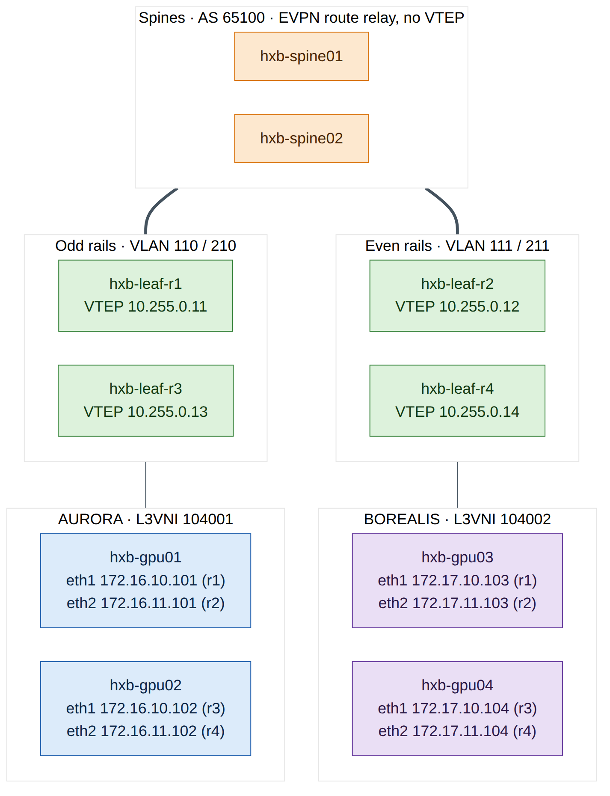
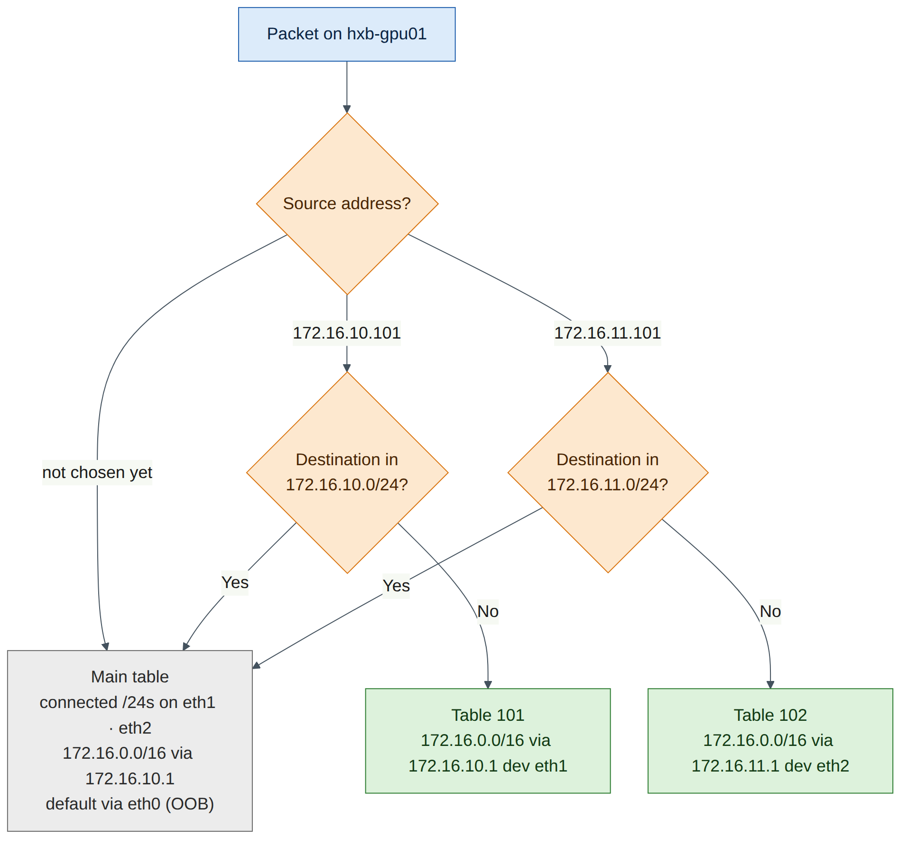
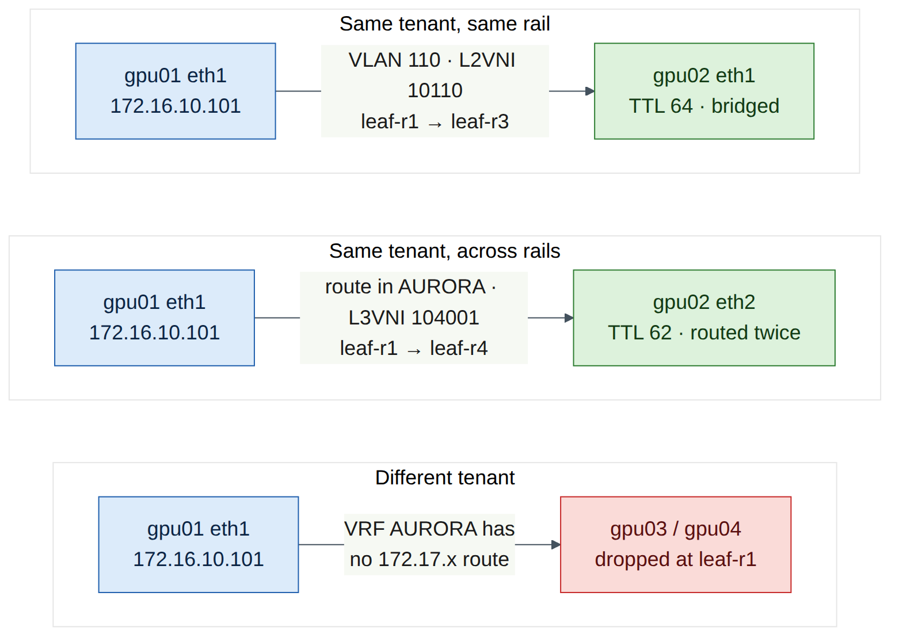

# Lab 5 — BGP-EVPN Multi-Tenancy

!!! abstract "Companion to the NCP-AIN Certification Guide"
    This free lab is part of the hands-on companion to *NCP-AIN Certification Guide* by Vakeesan Thevarajah (Cloudfoxy Ltd). The book explains the theory, design choices and hardware behaviour behind every step. [Get the book](../book.md){ .md-button .md-button--primary } [Free sample](../sample/NCP-AIN_Sample.pdf){ .md-button }


## Lab at a glance

| Item | Detail |
|---|---|
| Book chapters | Chapter 7 (Multi-Tenancy with BGP-EVPN) · Chapter 4 (NVUE, underlay) · Chapter 10 (NetQ EVPN checks, concept only) |
| Exam objectives | **2.3** Configure multi-tenancy BGP-EVPN to isolate tenant workloads · supports 2.6 (validation) and 5.3 (verification) |
| Time | About 120 minutes |
| Air resources used | hxb-spine01–02, hxb-leaf-r1–r4, hxb-gpu01–04, oob-mgmt-server (hxa-ibsim can stay idle) |
| Prerequisite labs | Lab 0 (setup), Lab 1 (NVUE), Lab 2 (eBGP unnumbered underlay with loopbacks advertised). Lab 3's temporary VLAN 100 must be removed (Task 1) |

## Objectives

By the end of this lab you will be able to:

1. Enable EVPN on a Cumulus Linux 5.x fabric: VTEP source address, global EVPN state and the `l2vpn-evpn` address family on leaves and spines.
2. Build two isolated tenants, **AURORA** (L3 VNI 104001) and **BOREALIS** (L3 VNI 104002), each with two L2 VNIs.
3. Configure a **distributed anycast gateway** (VRR `.1`) in every tenant subnet with the Cumulus Linux 5.15+ `ipv4` syntax.
4. Configure the four servers with rail-aligned addressing and per-NIC policy routing using netplan.
5. Verify EVPN with NVUE and vtysh (VNIs, type-2 and type-5 routes, MAC tables), prove bridged and routed (symmetric IRB) reachability, and prove that AURORA cannot reach BOREALIS.
6. Diagnose and fix two classic EVPN faults: a mismatched L2 VNI and a missing L3 VNI.

## Background

In Lab 2 you built a routed underlay: eBGP unnumbered on `swp31`–`swp32`, with every leaf loopback (10.255.0.11–.14) reachable from every other leaf. That underlay knows nothing about tenants. In this lab each leaf becomes a **VTEP** (VXLAN tunnel endpoint) using its loopback as the tunnel source, and **BGP-EVPN** runs over the same eBGP sessions to tell every VTEP which MAC addresses, host IPs and prefixes live behind which other VTEP (book Section 7.2).

Each tenant gets a **VRF** mapped to an **L3 VNI**, and each tenant subnet gets a VLAN mapped to an **L2 VNI**. With **symmetric IRB**, the ingress leaf routes a packet into the tenant's L3 VNI, and the egress leaf routes it out of the L3 VNI into the destination VLAN. A leaf therefore needs only the VLANs it serves locally, plus the L3 VNI (book Section 7.3). Every leaf answers on the same gateway address and MAC (the **anycast gateway**, implemented as VRR), so a host's gateway is always its own leaf.

The helix-b-air topology is **rail-aligned**, as a real GPU cluster would be. Each "GPU server" has one NIC on an odd rail leaf (r1 or r3) and one on an even rail leaf (r2 or r4). VLAN 110 (AURORA) and VLAN 210 (BOREALIS) live on leaves r1 and r3, while VLAN 111 and VLAN 211 live on leaves r2 and r4. So traffic between two servers on the **same rail** is bridged across the fabric in an L2 VNI, and traffic **between rails** is routed through the tenant's L3 VNI. You will see both.


<figure markdown>

{ loading=lazy }

<figcaption><strong>Figure 5.1: Lab 5 tenant plan on helix-b-air.</strong> Each server has one NIC on an odd rail (VLAN 110 or 210) and one on an even rail (VLAN 111 or 211). AURORA (green) and BOREALIS (purple) share every leaf and spine but live in separate VRFs with separate L3 VNIs. Every leaf is a VTEP on its loopback; the spines only relay EVPN routes.</figcaption>

</figure>


The tenant plan used throughout this lab:

| Tenant | VRF / L3 VNI | VLAN / L2 VNI | Subnet | Anycast gateway | Leaves | Leaf ports |
|---|---|---|---|---|---|---|
| AURORA | AURORA / 104001 | 110 / 10110 | 172.16.10.0/24 | 172.16.10.1 | r1, r3 | swp1 |
| AURORA | AURORA / 104001 | 111 / 10111 | 172.16.11.0/24 | 172.16.11.1 | r2, r4 | swp1 |
| BOREALIS | BOREALIS / 104002 | 210 / 10210 | 172.17.10.0/24 | 172.17.10.1 | r1, r3 | swp2 |
| BOREALIS | BOREALIS / 104002 | 211 / 10211 | 172.17.11.0/24 | 172.17.11.1 | r2, r4 | swp2 |

Each SVI also has a **unique** address per leaf, using the leaf's loopback last octet: `.11` on leaf-r1, `.12` on leaf-r2, `.13` on leaf-r3 and `.14` on leaf-r4 (for example 172.16.10.11 on leaf-r1 and 172.16.10.13 on leaf-r3). The VRR MAC is `00:00:5e:00:01:01` on every leaf, as in the book.


!!! note "Version note"
    Your switches run Cumulus Linux 5.16.1. From Cumulus Linux 5.15, NVUE moves SVI addressing under an `ipv4` object and VRF membership directly under the interface: `nv set interface vlan110 vrf AURORA`, `… ipv4 address …`, `… ipv4 vrr address …`, `… ipv4 vrr mac-address …` and `… ipv4 vrr state enabled`. The book's Chapter 7 shows the earlier 5.x form (`… ip vrf AURORA`, `… ip address …`, `… ip vrr … state up`). The concepts are identical. If a command is rejected on your release, press **Tab** after `nv set interface vlan110 ` to see which form it expects, and check the Cumulus Linux user guide for your release.


## Step-by-step

### Task 1 — Pre-checks and Lab 3 clean-up

1. From the oob-mgmt-server, log in to hxb-leaf-r1 and confirm the underlay is healthy. Every leaf should have two Established sessions, one per spine.

    ```text
    ubuntu@oob-mgmt-server:~$ ssh cumulus@hxb-leaf-r1
    cumulus@hxb-leaf-r1:mgmt:~$ sudo vtysh -c "show bgp ipv4 unicast summary"
    cumulus@hxb-leaf-r1:mgmt:~$ ip route show 10.255.0.13
    ```

    **Expected output (illustrative):**

    ```text
    Neighbor        V         AS   MsgRcvd   MsgSent   TblVer  InQ OutQ  Up/Down State/PfxRcd   PfxSnt Desc
    hxb-spine01(swp31) 4   65100       412       409        0    0    0 03:21:07            5        6 N/A
    hxb-spine02(swp32) 4   65100       410       409        0    0    0 03:21:05            5        6 N/A

    10.255.0.13 nhid 38 proto bgp metric 20
            nexthop via inet6 fe80::4ab0:2dff:fe11:2201 dev swp31 weight 1
            nexthop via inet6 fe80::4ab0:2dff:fe8c:9a02 dev swp32 weight 1
    ```

**Checkpoint:**
- Both uplink sessions are Established on every leaf (repeat on r2–r4).
- Each remote leaf loopback is reachable over **two** next hops (ECMP through both spines). VXLAN tunnels ride on these loopback routes, so do not continue until they are present.

2. Remove Lab 3's temporary VLAN 100 from hxb-leaf-r1. The host ports will be re-assigned to tenant VLANs in Task 4.

    ```text
    cumulus@hxb-leaf-r1:mgmt:~$ nv show bridge domain br_default vlan
    cumulus@hxb-leaf-r1:mgmt:~$ nv unset interface vlan100
    cumulus@hxb-leaf-r1:mgmt:~$ nv unset bridge domain br_default vlan 100
    cumulus@hxb-leaf-r1:mgmt:~$ nv config diff
    cumulus@hxb-leaf-r1:mgmt:~$ nv config apply -y
    ```

**Checkpoint:**
- `nv show bridge domain br_default vlan` no longer lists VLAN 100. (If Lab 3 left the SVI unconfigured, the `nv unset interface vlan100` line simply has nothing to remove.)
- Lab 3's QoS configuration (`nv show qos roce`) is untouched. You keep it; RoCE QoS and EVPN work together (book Section 7.5).

3. On hxb-gpu01 and hxb-gpu03, remove Lab 3's temporary 172.16.100.x address. List the netplan files and delete (or move aside) the file that Lab 3 created for `eth1`; Task 5 writes a new one for both NICs.

    ```text
    ubuntu@hxb-gpu01:~$ ls /etc/netplan/
    ubuntu@hxb-gpu01:~$ sudo grep -l "172.16.100" /etc/netplan/*.yaml
    ubuntu@hxb-gpu01:~$ sudo mv /etc/netplan/<lab3-file>.yaml /root/
    ubuntu@hxb-gpu01:~$ sudo ip addr flush dev eth1
    ```

**Checkpoint:**
- `ip -br addr show eth1` shows no IPv4 address on hxb-gpu01 and hxb-gpu03.
- The file that configures `eth0` (the OOB management NIC, usually `50-cloud-init.yaml`) is still in place. Do not touch it, or you will lose SSH access from the oob-mgmt-server.

### Task 2 — Enable EVPN on the spines

The spines are not VTEPs. They only need the `l2vpn-evpn` address family on their leaf-facing sessions so that they relay EVPN routes between leaves (book Chapter 7, Q1). Configure **both** spines.

```text
ubuntu@oob-mgmt-server:~$ ssh cumulus@hxb-spine01
cumulus@hxb-spine01:mgmt:~$ nv set evpn state enabled
cumulus@hxb-spine01:mgmt:~$ nv set vrf default router bgp address-family l2vpn-evpn state enabled
cumulus@hxb-spine01:mgmt:~$ nv set vrf default router bgp neighbor swp1 address-family l2vpn-evpn state enabled
cumulus@hxb-spine01:mgmt:~$ nv set vrf default router bgp neighbor swp2 address-family l2vpn-evpn state enabled
cumulus@hxb-spine01:mgmt:~$ nv set vrf default router bgp neighbor swp3 address-family l2vpn-evpn state enabled
cumulus@hxb-spine01:mgmt:~$ nv set vrf default router bgp neighbor swp4 address-family l2vpn-evpn state enabled
cumulus@hxb-spine01:mgmt:~$ nv config diff
cumulus@hxb-spine01:mgmt:~$ nv config apply -y
```

Repeat exactly the same commands on hxb-spine02.


!!! note "Version note"
    Some Cumulus Linux releases enable EVPN route relay on the spines with the address family alone, without `nv set evpn state enabled`. Setting it is harmless on a spine because the spine has no VNIs and no `nve vxlan source`, so it never becomes a VTEP. If NVUE rejects it on your release, leave it out.


**Checkpoint:**
- `nv config diff` showed only the `evpn` and `l2vpn-evpn` changes, with no change to the IPv4 underlay.
- `nv show vrf default router bgp neighbor swp1 address-family` lists `l2vpn-evpn` as enabled (the EVPN sessions only come up once the leaves are configured in Task 3).

### Task 3 — Make every leaf a VTEP

On each leaf, enable EVPN, set the VTEP source to the leaf's loopback and activate the `l2vpn-evpn` address family on both uplinks. Start with hxb-leaf-r1.

```text
ubuntu@oob-mgmt-server:~$ ssh cumulus@hxb-leaf-r1
cumulus@hxb-leaf-r1:mgmt:~$ nv set evpn state enabled
cumulus@hxb-leaf-r1:mgmt:~$ nv set nve vxlan source address 10.255.0.11
cumulus@hxb-leaf-r1:mgmt:~$ nv set vrf default router bgp address-family l2vpn-evpn state enabled
cumulus@hxb-leaf-r1:mgmt:~$ nv set vrf default router bgp neighbor swp31 address-family l2vpn-evpn state enabled
cumulus@hxb-leaf-r1:mgmt:~$ nv set vrf default router bgp neighbor swp32 address-family l2vpn-evpn state enabled
```

Do not apply yet: you will apply the complete leaf configuration at the end of Task 4. The only per-leaf value in this task is the VTEP source address:

| Leaf | `nv set nve vxlan source address …` |
|---|---|
| hxb-leaf-r1 | 10.255.0.11 |
| hxb-leaf-r2 | 10.255.0.12 |
| hxb-leaf-r3 | 10.255.0.13 |
| hxb-leaf-r4 | 10.255.0.14 |

**Checkpoint:**
- `nv config diff` on each leaf shows the four EVPN/NVE lines and the two neighbour address-family lines.
- The VTEP source is the leaf's own `/32` loopback from Lab 2, which every other leaf can already reach (Task 1).

### Task 4 — Tenant VRFs, VNIs, anycast gateways and access ports

The complete tenant configuration for each leaf follows. Enter it on top of Task 3's pending changes, check the diff, then apply. Note which VLANs each leaf carries: a leaf only needs its **local** VLANs plus both L3 VNIs (symmetric IRB).

1. **hxb-leaf-r1** (VLANs 110 and 210, SVI host part `.11`):

    ```text
    cumulus@hxb-leaf-r1:mgmt:~$ nv set vrf AURORA evpn vni 104001
    cumulus@hxb-leaf-r1:mgmt:~$ nv set vrf BOREALIS evpn vni 104002
    cumulus@hxb-leaf-r1:mgmt:~$ nv set vrf AURORA router bgp address-family ipv4-unicast redistribute connected state enabled
    cumulus@hxb-leaf-r1:mgmt:~$ nv set vrf AURORA router bgp address-family ipv4-unicast route-export to-evpn state enabled
    cumulus@hxb-leaf-r1:mgmt:~$ nv set vrf BOREALIS router bgp address-family ipv4-unicast redistribute connected state enabled
    cumulus@hxb-leaf-r1:mgmt:~$ nv set vrf BOREALIS router bgp address-family ipv4-unicast route-export to-evpn state enabled
    cumulus@hxb-leaf-r1:mgmt:~$ nv set bridge domain br_default vlan 110 vni 10110
    cumulus@hxb-leaf-r1:mgmt:~$ nv set bridge domain br_default vlan 210 vni 10210
    cumulus@hxb-leaf-r1:mgmt:~$ nv set interface vlan110 vrf AURORA
    cumulus@hxb-leaf-r1:mgmt:~$ nv set interface vlan110 ipv4 address 172.16.10.11/24
    cumulus@hxb-leaf-r1:mgmt:~$ nv set interface vlan110 ipv4 vrr address 172.16.10.1/24
    cumulus@hxb-leaf-r1:mgmt:~$ nv set interface vlan110 ipv4 vrr mac-address 00:00:5e:00:01:01
    cumulus@hxb-leaf-r1:mgmt:~$ nv set interface vlan110 ipv4 vrr state enabled
    cumulus@hxb-leaf-r1:mgmt:~$ nv set interface vlan210 vrf BOREALIS
    cumulus@hxb-leaf-r1:mgmt:~$ nv set interface vlan210 ipv4 address 172.17.10.11/24
    cumulus@hxb-leaf-r1:mgmt:~$ nv set interface vlan210 ipv4 vrr address 172.17.10.1/24
    cumulus@hxb-leaf-r1:mgmt:~$ nv set interface vlan210 ipv4 vrr mac-address 00:00:5e:00:01:01
    cumulus@hxb-leaf-r1:mgmt:~$ nv set interface vlan210 ipv4 vrr state enabled
    cumulus@hxb-leaf-r1:mgmt:~$ nv set interface swp1 bridge domain br_default access 110
    cumulus@hxb-leaf-r1:mgmt:~$ nv set interface swp2 bridge domain br_default access 210
    cumulus@hxb-leaf-r1:mgmt:~$ nv config diff
    cumulus@hxb-leaf-r1:mgmt:~$ nv config apply -y
    ```

What each group does:

| Commands | Purpose | Book reference |
|---|---|---|
| `vrf … evpn vni 104001/104002` | Creates the tenant VRF and maps it to its **L3 VNI**. NVUE allocates the hidden L3 VNI VLAN automatically | Section 7.4 Step 2 |
| `redistribute connected` + `route-export to-evpn` | Advertises each tenant subnet as an EVPN **type-5** route | Step 5 |
| `bridge domain br_default vlan … vni …` | Creates the VLAN and maps it to its **L2 VNI** on the single VXLAN device | Step 3 |
| `interface vlanX vrf …` / `ipv4 address` / `ipv4 vrr …` | SVI in the tenant VRF with a unique address and the **anycast gateway** `.1` | Step 4 |
| `interface swpX bridge domain br_default access …` | Host-facing access port in the tenant VLAN | Step 6 |


!!! warning "Warning"
    The VRR MAC must be identical on every leaf for the same gateway. A different MAC on one leaf breaks the anycast gateway after a host moves or when ARP caches age (book Chapter 7, common mistakes). Copy the MAC exactly.


2. **hxb-leaf-r2** (VLANs 111 and 211, SVI host part `.12`). Run the six `vrf` lines exactly as on leaf-r1, then:

    ```text
    cumulus@hxb-leaf-r2:mgmt:~$ nv set bridge domain br_default vlan 111 vni 10111
    cumulus@hxb-leaf-r2:mgmt:~$ nv set bridge domain br_default vlan 211 vni 10211
    cumulus@hxb-leaf-r2:mgmt:~$ nv set interface vlan111 vrf AURORA
    cumulus@hxb-leaf-r2:mgmt:~$ nv set interface vlan111 ipv4 address 172.16.11.12/24
    cumulus@hxb-leaf-r2:mgmt:~$ nv set interface vlan111 ipv4 vrr address 172.16.11.1/24
    cumulus@hxb-leaf-r2:mgmt:~$ nv set interface vlan111 ipv4 vrr mac-address 00:00:5e:00:01:01
    cumulus@hxb-leaf-r2:mgmt:~$ nv set interface vlan111 ipv4 vrr state enabled
    cumulus@hxb-leaf-r2:mgmt:~$ nv set interface vlan211 vrf BOREALIS
    cumulus@hxb-leaf-r2:mgmt:~$ nv set interface vlan211 ipv4 address 172.17.11.12/24
    cumulus@hxb-leaf-r2:mgmt:~$ nv set interface vlan211 ipv4 vrr address 172.17.11.1/24
    cumulus@hxb-leaf-r2:mgmt:~$ nv set interface vlan211 ipv4 vrr mac-address 00:00:5e:00:01:01
    cumulus@hxb-leaf-r2:mgmt:~$ nv set interface vlan211 ipv4 vrr state enabled
    cumulus@hxb-leaf-r2:mgmt:~$ nv set interface swp1 bridge domain br_default access 111
    cumulus@hxb-leaf-r2:mgmt:~$ nv set interface swp2 bridge domain br_default access 211
    cumulus@hxb-leaf-r2:mgmt:~$ nv config diff
    cumulus@hxb-leaf-r2:mgmt:~$ nv config apply -y
    ```

3. **hxb-leaf-r3** is the same as leaf-r1 (VLANs 110 and 210) with SVI addresses `.13`: `172.16.10.13/24` on vlan110 and `172.17.10.13/24` on vlan210. The VRR addresses and MAC do not change.

4. **hxb-leaf-r4** is the same as leaf-r2 (VLANs 111 and 211) with SVI addresses `.14`: `172.16.11.14/24` on vlan111 and `172.17.11.14/24` on vlan211.

Summary of per-leaf values:

| Leaf | VTEP | VLAN → VNI | Unique SVI addresses | swp1 access | swp2 access |
|---|---|---|---|---|---|
| hxb-leaf-r1 | 10.255.0.11 | 110 → 10110 · 210 → 10210 | 172.16.10.11 · 172.17.10.11 | 110 | 210 |
| hxb-leaf-r2 | 10.255.0.12 | 111 → 10111 · 211 → 10211 | 172.16.11.12 · 172.17.11.12 | 111 | 211 |
| hxb-leaf-r3 | 10.255.0.13 | 110 → 10110 · 210 → 10210 | 172.16.10.13 · 172.17.10.13 | 110 | 210 |
| hxb-leaf-r4 | 10.255.0.14 | 111 → 10111 · 211 → 10211 | 172.16.11.14 · 172.17.11.14 | 111 | 211 |


!!! info "Field note"
    Four leaves typed by hand is exactly where one wrong digit creeps in. Break/fix exercise 1 is that digit. In Lab 11 you generate this same configuration from one NVUE template, and in Lab 12 from Ansible variables, so every leaf is built from one source.


**Checkpoint (on each leaf):**
- `nv config apply` completed without errors.
- `nv show vrf AURORA evpn` shows VNI 104001 and `nv show vrf BOREALIS evpn` shows 104002.
- `nv show bridge domain br_default vlan` lists only the two local tenant VLANs, each with its VNI.
- `nv show interface vlan110` (or vlan111) shows the unique address, the VRR address `.1` and VRF AURORA.

### Task 5 — Configure the servers with netplan

Each server has one NIC in each of its tenant's two subnets. Both subnets are therefore directly connected, and by default Linux reaches the other rail's subnet **directly through the other NIC** (bridged in its L2 VNI), never through the gateway. To exercise routing across rails through the L3 VNI, as a real rail-aligned GPU node does, each NIC gets its own **routing table** and a **source-based rule**:

- Traffic sourced from the eth1 address uses table 101, which reaches the rest of the tenant (`172.16.0.0/16` or `172.17.0.0/16`) through eth1's anycast gateway.
- Traffic sourced from the eth2 address uses table 102, through eth2's gateway.
- A higher-priority rule keeps each NIC's own subnet on the main table, so same-subnet traffic stays bridged.
- The main table also gets a tenant supernet route via eth1's gateway, so any future subnet of the same tenant is reachable. The OOB default route on `eth0` is untouched.


<figure markdown>

{ loading=lazy }

<figcaption><strong>Figure 5.2: Per-NIC routing on hxb-gpu01.</strong> Source-based rules pick a routing table per NIC. Traffic from 172.16.10.101 leaves eth1 towards leaf-r1's anycast gateway, so a packet to the other rail (172.16.11.0/24) is routed through L3 VNI 104001. Traffic without a chosen source uses the main table and reaches 172.16.11.0/24 directly on eth2.</figcaption>

</figure>


1. On hxb-gpu01, create `/etc/netplan/60-fabric.yaml`:

    ```text
    ubuntu@oob-mgmt-server:~$ ssh ubuntu@hxb-gpu01
    ubuntu@hxb-gpu01:~$ sudo nano /etc/netplan/60-fabric.yaml
    ```

    ```text
    network:
      version: 2
      ethernets:
        eth1:
          mtu: 9000
          addresses: [172.16.10.101/24]
          routes:
            - to: 172.16.0.0/16          # rest of AURORA, main table
              via: 172.16.10.1
              metric: 200
            - to: 172.16.0.0/16          # rest of AURORA, eth1-sourced traffic
              via: 172.16.10.1
              on-link: true
              table: 101
          routing-policy:
            - from: 172.16.10.101
              to: 172.16.10.0/24
              table: 254                 # own subnet stays on the main table (bridged)
              priority: 100
            - from: 172.16.10.101
              table: 101
              priority: 110
        eth2:
          mtu: 9000
          addresses: [172.16.11.101/24]
          routes:
            - to: 172.16.0.0/16
              via: 172.16.11.1
              on-link: true
              table: 102
          routing-policy:
            - from: 172.16.11.101
              to: 172.16.11.0/24
              table: 254
              priority: 100
            - from: 172.16.11.101
              table: 102
              priority: 110
    ```

2. Apply it:

    ```text
    ubuntu@hxb-gpu01:~$ sudo chmod 600 /etc/netplan/60-fabric.yaml
    ubuntu@hxb-gpu01:~$ sudo netplan try
    ubuntu@hxb-gpu01:~$ sudo netplan apply
    ubuntu@hxb-gpu01:~$ ip -br addr show eth1; ip -br addr show eth2
    ubuntu@hxb-gpu01:~$ ip rule show
    ubuntu@hxb-gpu01:~$ ip route show table 101
    ```

    **Expected output (illustrative):**

    ```text
    eth1             UP             172.16.10.101/24 fe80::4ab0:2dff:fe31:a101/64
    eth2             UP             172.16.11.101/24 fe80::4ab0:2dff:fe31:a102/64
    0:      from all lookup local
    100:    from 172.16.10.101 to 172.16.10.0/24 lookup main
    100:    from 172.16.11.101 to 172.16.11.0/24 lookup main
    110:    from 172.16.10.101 lookup 101
    110:    from 172.16.11.101 lookup 102
    32766:  from all lookup main
    32767:  from all lookup default
    172.16.0.0/16 via 172.16.10.1 dev eth1 proto static onlink
    ```

    `netplan try` rolls back automatically after 120 seconds unless you press Enter, which protects you from a typo. Press Enter when it asks.

3. Repeat on the other three servers, changing only the values in this table (the structure is identical; BOREALIS servers use `172.17.0.0/16` as the tenant supernet):

    | Server | eth1 address / gateway | eth2 address / gateway | Tenant supernet |
    |---|---|---|---|
    | hxb-gpu01 | 172.16.10.101/24 · 172.16.10.1 | 172.16.11.101/24 · 172.16.11.1 | 172.16.0.0/16 |
    | hxb-gpu02 | 172.16.10.102/24 · 172.16.10.1 | 172.16.11.102/24 · 172.16.11.1 | 172.16.0.0/16 |
    | hxb-gpu03 | 172.17.10.103/24 · 172.17.10.1 | 172.17.11.103/24 · 172.17.11.1 | 172.17.0.0/16 |
    | hxb-gpu04 | 172.17.10.104/24 · 172.17.10.1 | 172.17.11.104/24 · 172.17.11.1 | 172.17.0.0/16 |

Remember to change the `from:` and `to:` values in both `routing-policy` blocks, not just the addresses.


!!! note "Version note"
    The MTU of 9000 leaves room for the roughly 50 bytes of VXLAN overhead inside the 9216-byte fabric MTU (book Section 7.5). If Lab 2 left the uplinks at a smaller MTU, set the hosts to 1500 for now and see Lab 7. Netplan keys shown (`routes`, `on-link`, `table`, `routing-policy`, `priority`) are documented for Ubuntu 24.04's netplan; `sudo netplan try` will reject a malformed file without changing anything.


4. On every server, ping the anycast gateway from **each** NIC. This populates the leaves' ARP and MAC tables, so every host is advertised in EVPN before the tests in Task 6.

    ```text
    ubuntu@hxb-gpu01:~$ ping -c 2 -I 172.16.10.101 172.16.10.1
    ubuntu@hxb-gpu01:~$ ping -c 2 -I 172.16.11.101 172.16.11.1
    ```

**Checkpoint:**
- Every server reaches both of its gateways with 0% loss.
- `ip rule show` on each server shows the four rules at priorities 100 and 110.
- `ip route` on each server still shows the default route on `eth0`.

### Task 6 — Verify the EVPN control plane

1. Check the EVPN sessions and VNIs on hxb-leaf-r1:

    ```text
    cumulus@hxb-leaf-r1:mgmt:~$ sudo vtysh -c "show bgp l2vpn evpn summary"
    cumulus@hxb-leaf-r1:mgmt:~$ nv show evpn vni
    cumulus@hxb-leaf-r1:mgmt:~$ sudo vtysh -c "show evpn vni"
    ```

    **Expected output (illustrative):**

    ```text
    BGP router identifier 10.255.0.11, local AS number 65101 vrf-id 0
    Neighbor           V   AS   MsgRcvd MsgSent  Up/Down State/PfxRcd PfxSnt
    hxb-spine01(swp31) 4 65100      96      88 00:12:40           18     10
    hxb-spine02(swp32) 4 65100      95      88 00:12:38           18     10

    VNI        Type VxLAN IF              # MACs   # ARPs   # Remote VTEPs  Tenant VRF
    10110      L2   vxlan48               3        4        1               AURORA
    10210      L2   vxlan48               3        4        1               BOREALIS
    104001     L3   vxlan48               4        4        n/a             AURORA
    104002     L3   vxlan48               4        4        n/a             BOREALIS
    ```

**What to notice:** two L2 VNIs and two L3 VNIs, each tied to the correct VRF. Each L2 VNI has exactly **one** remote VTEP, hxb-leaf-r3, because only leaf-r1 and leaf-r3 carry VLANs 110 and 210. (The book's Chapter 7 output shows 7 remote VTEPs because its full Helix-B has 8 rail leaves carrying every VLAN.) `nv show evpn vni` shows the same VNIs in NVUE format.

2. Look at the type-2 (MAC/IP) and type-5 (IP prefix) routes:

    ```text
    cumulus@hxb-leaf-r1:mgmt:~$ sudo vtysh -c "show bgp l2vpn evpn route type macip"
    cumulus@hxb-leaf-r1:mgmt:~$ sudo vtysh -c "show bgp l2vpn evpn route type prefix"
    ```

    **Expected output (illustrative, abbreviated):**

    ```text
    Route Distinguisher: 10.255.0.13:2
    *> [2]:[0]:[48]:[4a:b0:2d:32:a1:01]:[32]:[172.16.10.102]
                        10.255.0.13                            0 65100 65103 i
                        RT:65103:10110 RT:65103:104001 ET:8 Rmac:4a:b0:2d:0c:13:00
    Route Distinguisher: 10.255.0.12:4
    *> [5]:[0]:[24]:[172.16.11.0]
                        10.255.0.12                            0 65100 65102 ?
                        RT:65102:104001 ET:8 Rmac:4a:b0:2d:0c:12:00
    Route Distinguisher: 10.255.0.14:5
    *> [5]:[0]:[24]:[172.17.11.0]
                        10.255.0.14                            0 65100 65104 ?
                        RT:65104:104002 ET:8 Rmac:4a:b0:2d:0c:14:00
    ```

**What to notice:**
- A **type-2** route for hxb-gpu02's eth1 carries **two** route targets: the L2 VNI's (`…:10110`) for bridging, and the L3 VNI's (`…:104001`) plus the router MAC for symmetric routing.
- **Type-5** routes carry the tenant subnets with only the L3 VNI route target. AURORA prefixes carry `…:104001`, BOREALIS prefixes `…:104002`. These route targets are the isolation mechanism (book Section 7.2).
- The next hop of every route is the **originating leaf's VTEP loopback**, not the spine. The spines relayed the routes without changing the next hop.


!!! note "Version note"
    Recent FRR releases also accept the numeric form, for example `show bgp l2vpn evpn route type 2` and `… type 5`. The book uses `macip` and `prefix`, which work on all Cumulus Linux 5.x releases.


3. Check the MAC tables per VNI and the tenant routing tables:

    ```text
    cumulus@hxb-leaf-r1:mgmt:~$ sudo vtysh -c "show evpn mac vni all"
    cumulus@hxb-leaf-r1:mgmt:~$ sudo vtysh -c "show ip route vrf AURORA"
    cumulus@hxb-leaf-r1:mgmt:~$ sudo vtysh -c "show ip route vrf BOREALIS"
    ```

    **Expected output (illustrative, abbreviated):**

    ```text
    VNI 10110 #MACs (local and remote) 3
    MAC               Type   Flags Intf/Remote ES/VTEP            VLAN  Seq #'s
    4a:b0:2d:31:a1:01 local        swp1                           110   0/0
    4a:b0:2d:32:a1:01 remote       10.255.0.13                          0/0
    00:00:5e:00:01:01 local        vlan110                        110   0/0

    VRF AURORA:
    C>* 172.16.10.0/24 is directly connected, vlan110, 00:14:02
    B>* 172.16.11.0/24 [20/0] via 10.255.0.12, vlan4024_l3 onlink, weight 1, 00:13:51
      *                       via 10.255.0.14, vlan4024_l3 onlink, weight 1, 00:13:51
    B>* 172.16.11.101/32 [20/0] via 10.255.0.12, vlan4024_l3 onlink, weight 1, 00:09:12
    B>* 172.16.11.102/32 [20/0] via 10.255.0.14, vlan4024_l3 onlink, weight 1, 00:08:57
    ```

**Checkpoint:**
- `show evpn mac vni all` lists the local host MAC on `swp1` (or `swp2`) and the remote host MAC behind the other odd-rail leaf's VTEP.
- VRF AURORA contains **only** 172.16.x prefixes and host routes, reached through the L3 VNI interface (the auto-created L3 VNI VLAN name, such as `vlan4024_l3`, varies). VRF BOREALIS contains only 172.17.x.
- Repeat the checks on hxb-leaf-r2: its L2 VNIs are 10111 and 10211, with hxb-leaf-r4 as the remote VTEP.

### Task 7 — Prove bridged and routed reachability within a tenant

1. **Same rail, same subnet (bridged in L2 VNI 10110).** From hxb-gpu01 eth1 to hxb-gpu02 eth1:

    ```text
    ubuntu@hxb-gpu01:~$ ping -c 3 -I 172.16.10.101 172.16.10.102
    ```

    **Expected output (illustrative):**

    ```text
    PING 172.16.10.102 (172.16.10.102) from 172.16.10.101 : 56(84) bytes of data.
    64 bytes from 172.16.10.102: icmp_seq=1 ttl=64 time=1.84 ms
    64 bytes from 172.16.10.102: icmp_seq=2 ttl=64 time=1.12 ms
    64 bytes from 172.16.10.102: icmp_seq=3 ttl=64 time=1.09 ms
    ```

**TTL 64** means no router touched the packet. It crossed leaf-r1 → spine → leaf-r3 inside VXLAN VNI 10110, but it was **bridged**.

2. **Across rails, different subnet (routed in L3 VNI 104001).** From hxb-gpu01 eth1 (VLAN 110 on leaf-r1) to hxb-gpu02 eth2 (VLAN 111 on leaf-r4):

    ```text
    ubuntu@hxb-gpu01:~$ ping -c 3 -I 172.16.10.101 172.16.11.102
    ubuntu@hxb-gpu01:~$ ping -c 1 -t 1 -I 172.16.10.101 172.16.11.102
    ```

    **Expected output (illustrative):**

    ```text
    64 bytes from 172.16.11.102: icmp_seq=1 ttl=62 time=2.41 ms
    64 bytes from 172.16.11.102: icmp_seq=2 ttl=62 time=1.37 ms
    64 bytes from 172.16.11.102: icmp_seq=3 ttl=62 time=1.33 ms

    From 172.16.10.11 icmp_seq=1 Time to live exceeded
    ```

**What to notice:** the reply arrives with **TTL 62**. The reply was routed **twice**, once by leaf-r4 (ingress for the reply) and once by leaf-r1 (egress). That is symmetric IRB: both VTEPs route, and the L3 VNI carries the packet between them (book Figure 7.4). The TTL-1 probe is answered by leaf-r1's own SVI address (`.11`), which proves that the first routing hop is the local leaf, the anycast gateway. The source address shown may differ on your release.

3. Compare with the default path without a chosen source:

    ```text
    ubuntu@hxb-gpu01:~$ ping -c 2 172.16.11.102
    ```

    **Expected:** replies with **TTL 64**. With no source chosen, the main table sends the packet out of eth2 directly into VLAN 111, so it is bridged through leaf-r2 and leaf-r4. This is why real rail-aligned hosts use per-NIC routing: the NIC choice decides which rail carries the traffic.

4. Repeat the equivalent tests for BOREALIS from hxb-gpu03:

    ```text
    ubuntu@hxb-gpu03:~$ ping -c 3 -I 172.17.10.103 172.17.10.104
    ubuntu@hxb-gpu03:~$ ping -c 3 -I 172.17.10.103 172.17.11.104
    ```

**Checkpoint:**
- Same-subnet tests succeed with TTL 64 (bridged over the L2 VNI).
- Cross-rail tests succeed with TTL 62 (routed over the L3 VNI) for both tenants.
- Large frames also pass: `ping -c 2 -M do -s 8972 -I 172.16.10.101 172.16.10.102` succeeds, which confirms that the 9216-byte underlay carries 9000-byte tenant frames plus VXLAN overhead.

### Task 8 — Prove tenant isolation

A well-behaved server in AURORA has no route to BOREALIS at all, so a simple ping would leave through `eth0` and prove nothing about the fabric. To test the fabric, temporarily point hxb-gpu01 at its gateway for the BOREALIS range, as a misconfigured or hostile host might.

1. Add a temporary route and try to reach BOREALIS hosts:

    ```text
    ubuntu@hxb-gpu01:~$ sudo ip route add 172.17.0.0/16 via 172.16.10.1 dev eth1 table 101
    ubuntu@hxb-gpu01:~$ ping -c 3 -I 172.16.10.101 172.17.10.103
    ubuntu@hxb-gpu01:~$ ping -c 3 -I 172.16.10.101 172.17.11.104
    ```

    **Expected output (illustrative):**

    ```text
    From 172.16.10.11 icmp_seq=1 Destination Net Unreachable
    From 172.16.10.11 icmp_seq=2 Destination Net Unreachable
    --- 172.17.10.103 ping statistics ---
    3 packets transmitted, 0 received, +2 errors, 100% packet loss
    ```

hxb-gpu03 is attached to **the same leaf and the same physical switch** (leaf-r1 swp2), yet it is unreachable. The packet entered VRF AURORA on leaf-r1, and VRF AURORA has no route to 172.17.0.0/16. Depending on the release you may see "Destination Net Unreachable" from the leaf, or simply 100% loss.

2. Prove it on the leaf:

    ```text
    cumulus@hxb-leaf-r1:mgmt:~$ sudo vtysh -c "show ip route vrf AURORA 172.17.10.103"
    cumulus@hxb-leaf-r1:mgmt:~$ ip route show vrf AURORA | grep 172.17
    cumulus@hxb-leaf-r1:mgmt:~$ nv show vrf AURORA evpn
    ```

    **Expected:** `% Network not in table` and no output from the `grep`. The BOREALIS type-5 and type-2 routes reached leaf-r1 (you saw them in Task 6), but they carry BOREALIS's route targets (`…:104002`), so VRF AURORA never imported them.

3. Remove the temporary route:

    ```text
    ubuntu@hxb-gpu01:~$ sudo ip route del 172.17.0.0/16 via 172.16.10.1 dev eth1 table 101
    ```

**Checkpoint:**
- AURORA → BOREALIS fails even between hosts on the same leaf.
- `show ip route vrf AURORA` contains only 172.16.x routes, and `show ip route vrf BOREALIS` only 172.17.x routes.
- The temporary route is removed (`ip route show table 101` shows only 172.16.0.0/16).


<figure markdown>

{ loading=lazy }

<figcaption><strong>Figure 5.3: What each test in Tasks 7 and 8 proves.</strong> The same physical fabric carries three kinds of flow. Same-rail traffic is bridged in an L2 VNI (TTL 64). Cross-rail traffic in the same tenant is routed twice, through the L3 VNI (TTL 62). Traffic between tenants has no route in the source VRF and is dropped at the first leaf.</figcaption>

</figure>


## Verify

- [ ] Both spines have `l2vpn-evpn` enabled on swp1–swp4 and are not VTEPs (`nv show nve vxlan` shows no source address on the spines).
- [ ] Each leaf has `nv show nve vxlan` source = its loopback, and `sudo vtysh -c "show bgp l2vpn evpn summary"` shows two Established EVPN sessions.
- [ ] `nv show evpn vni` on each leaf lists its two local L2 VNIs and both L3 VNIs (104001 → AURORA, 104002 → BOREALIS).
- [ ] `show bgp l2vpn evpn route type macip` shows remote host MAC/IP routes with both L2 and L3 route targets; `type prefix` shows the four tenant subnets.
- [ ] `show evpn mac vni all` shows local and remote host MACs.
- [ ] Same-rail pings within a tenant succeed with TTL 64; cross-rail pings within a tenant (sourced with `-I`) succeed with TTL 62.
- [ ] AURORA cannot reach BOREALIS even with a forced route on the host, and each VRF contains only its own prefixes.

## Break and fix

Run each fault on its own, fix it, and re-verify before starting the next.

### Fault 1 — Mismatched L2 VNI on one leaf

**Inject** (on hxb-leaf-r3, a "typo" in the VNI for VLAN 110):

```text
cumulus@hxb-leaf-r3:mgmt:~$ nv unset bridge domain br_default vlan 110 vni 10110
cumulus@hxb-leaf-r3:mgmt:~$ nv set bridge domain br_default vlan 110 vni 10119
cumulus@hxb-leaf-r3:mgmt:~$ nv config apply -y
```

**Symptoms:**

```text
ubuntu@hxb-gpu01:~$ ping -c 3 -I 172.16.10.101 172.16.10.102      # same subnet, bridged
3 packets transmitted, 0 received, 100% packet loss
ubuntu@hxb-gpu02:~$ ping -c 2 -I 172.16.10.102 172.16.10.1        # its gateway
2 packets transmitted, 2 received, 0% packet loss
```

hxb-gpu02 still reaches its gateway: the access port, VLAN and SVI on leaf-r3 are fine. Only the stretch of VLAN 110 between leaf-r1 and leaf-r3 is broken. Routed traffic to 172.16.10.102 from the other rail may still work, because gpu02's type-2 route still carries the correct L3 VNI route target. A half-working tenant is a typical sign of a VNI mismatch.

**Diagnosis:**

```text
cumulus@hxb-leaf-r1:mgmt:~$ sudo vtysh -c "show evpn vni 10110"
cumulus@hxb-leaf-r3:mgmt:~$ sudo vtysh -c "show evpn vni"
cumulus@hxb-leaf-r1:mgmt:~$ sudo vtysh -c "show evpn mac vni 10110"
cumulus@hxb-leaf-r3:mgmt:~$ nv show bridge domain br_default vlan
```

- On leaf-r1, VNI 10110 now has **0 remote VTEPs**: leaf-r3 no longer sends a type-3 route for 10110.
- On leaf-r3, `show evpn vni` lists **10119** instead of 10110, also with 0 remote VTEPs.
- gpu02's MAC is missing from `show evpn mac vni 10110` on leaf-r1.
- `nv show bridge domain br_default vlan` on leaf-r3 shows VLAN 110 → 10119. Compare with the tenant plan.

**Fix:**

```text
cumulus@hxb-leaf-r3:mgmt:~$ nv unset bridge domain br_default vlan 110 vni 10119
cumulus@hxb-leaf-r3:mgmt:~$ nv set bridge domain br_default vlan 110 vni 10110
cumulus@hxb-leaf-r3:mgmt:~$ nv config apply -y
ubuntu@hxb-gpu01:~$ ping -c 3 -I 172.16.10.101 172.16.10.102
```

**Checkpoint:** VNI 10110 shows 1 remote VTEP on both leaf-r1 and leaf-r3, and the bridged ping succeeds with TTL 64.

### Fault 2 — Missing L3 VNI mapping

This is the book's Chapter 7 troubleshooting scenario, reproduced on your fabric.

**Inject** (on hxb-leaf-r4, "built from an old template"):

```text
cumulus@hxb-leaf-r4:mgmt:~$ nv unset vrf AURORA evpn vni 104001
cumulus@hxb-leaf-r4:mgmt:~$ nv config apply -y
```

**Symptoms:**

```text
ubuntu@hxb-gpu01:~$ ping -c 3 -I 172.16.10.101 172.16.11.102      # cross-rail, routed
3 packets transmitted, 0 received, 100% packet loss
ubuntu@hxb-gpu01:~$ ping -c 3 -I 172.16.11.101 172.16.11.102      # same subnet on the even rail, bridged
3 packets transmitted, 3 received, 0% packet loss
ubuntu@hxb-gpu03:~$ ping -c 3 -I 172.17.10.103 172.17.11.104      # BOREALIS cross-rail
3 packets transmitted, 3 received, 0% packet loss
```

Bridged AURORA traffic and all of BOREALIS still work. Only **routed** AURORA traffic to or from hosts behind leaf-r4 fails.

**Diagnosis:** follow book Figure 7.7.

```text
cumulus@hxb-leaf-r4:mgmt:~$ sudo vtysh -c "show evpn vni"
cumulus@hxb-leaf-r4:mgmt:~$ nv show vrf AURORA evpn
cumulus@hxb-leaf-r4:mgmt:~$ sudo vtysh -c "show ip route vrf AURORA"
cumulus@hxb-leaf-r1:mgmt:~$ sudo vtysh -c "show ip route vrf AURORA"
```

- `show evpn vni` on leaf-r4 lists L2 VNIs 10111 and 10211 and L3 VNI 104002, but **no L3 VNI 104001**.
- `nv show vrf AURORA evpn` on leaf-r4 has no VNI.
- VRF AURORA on leaf-r4 has only its connected subnet: no remote /32s or type-5 routes were imported.
- On leaf-r1, the host route to 172.16.11.102 behind leaf-r4 has disappeared (or the traffic is black-holed), because leaf-r4 no longer advertises AURORA's routed information with the L3 VNI.

**Fix:**

```text
cumulus@hxb-leaf-r4:mgmt:~$ nv set vrf AURORA evpn vni 104001
cumulus@hxb-leaf-r4:mgmt:~$ nv config apply -y
ubuntu@hxb-gpu01:~$ ping -c 3 -I 172.16.10.101 172.16.11.102
```

**Checkpoint:** `show evpn vni` on leaf-r4 lists 104001 → AURORA again, and the cross-rail ping succeeds with TTL 62. In production you would also fix the template (Lab 11) and add an EVPN validation (`netq check evpn`, book Chapter 10) to the post-change checks.

## Clean-up / save state

1. Confirm that all faults are fixed and that the Verify checklist passes.
2. NVUE auto-saves the applied configuration to `/etc/nvue.d/startup.yaml` by default. Save explicitly on each switch in case auto-save is off:

    ```text
    cumulus@hxb-leaf-r1:mgmt:~$ nv config save
    ```

3. Keep this configuration. Labs 7, 9, 10, 12 and 13 build on the AURORA and BOREALIS tenants and the server netplan files.
4. In the Air console, take a checkpoint of the simulation (Lab 6 covers checkpoints in detail), then put the simulation to sleep to stop spending compute-hour credits.

## Exam tie-in

- **2.3 (multi-tenancy BGP-EVPN):** you configured every building block the objective names: tenant VRFs mapped to L3 VNIs (`nv set vrf <T> evpn vni`), VLAN-to-L2 VNI mappings, the VTEP source, the `l2vpn-evpn` address family, anycast gateways and type-5 export.
- **Isolation mechanism:** route targets decide which VRF imports a route. You proved that AURORA ignores BOREALIS routes even on the same leaf.
- **Route types:** type 2 (MAC/IP with both L2 and L3 route targets), type 3 (flood list, visible as the remote VTEP count) and type 5 (tenant prefixes).
- **Symmetric IRB:** a leaf needs only its local VLANs plus the L3 VNI. The TTL-62 test shows that both ingress and egress VTEPs route.
- **Troubleshooting (domain 5):** a missing L3 VNI breaks only routed traffic; a mismatched L2 VNI breaks only bridged traffic in one VLAN. Know which verification command reveals each.

## Review questions

1. hxb-leaf-r1's `show evpn vni` shows one remote VTEP for VNI 10110, while the book's example shows seven. Which is wrong?
2. Why do the spines need the `l2vpn-evpn` address family but no `nve vxlan source` or tenant VRFs?
3. A cross-rail ping between two AURORA hosts returns TTL 62. What does that tell you about the path?
4. On one leaf, `show evpn vni` lists the L2 VNIs but not L3 VNI 104001. Which traffic fails and which still works?
5. hxb-gpu01 and hxb-gpu03 connect to the same physical leaf. What prevents them from communicating, even if a host adds a route through its gateway?

### Answers

1. Neither. The remote VTEP count per L2 VNI equals the number of other leaves that carry that VLAN. In helix-b-air only leaf-r3 also carries VLAN 110, so the answer is one. The book's full Helix-B stretches each VLAN across eight rail leaves, so it shows seven.
2. In the eBGP design the spines relay EVPN routes between leaves, so the address family must be active on their sessions. They never encapsulate or decapsulate tenant traffic (they route only the outer VTEP-to-VTEP packets), so they need no VTEP address, VNIs or tenant VRFs.
3. The packet was routed by two routers: the ingress leaf (into the L3 VNI) and the egress leaf (out of the L3 VNI into the destination VLAN). That is symmetric IRB. A bridged path would return TTL 64.
4. Routed traffic for AURORA to or from hosts behind that leaf fails, because the leaf cannot send or receive AURORA traffic in the L3 VNI and does not import AURORA's routed type-2 and type-5 information. Bridged traffic in the local L2 VNIs, and all BOREALIS traffic, still works.
5. The tenant VRFs. The ports are in different VLANs whose SVIs are in different VRFs (AURORA and BOREALIS). VRF AURORA contains no BOREALIS routes because BOREALIS routes carry BOREALIS's route targets, which AURORA does not import. The packet is dropped in VRF AURORA on the first leaf.

---

!!! abstract "Go deeper"
    The matching book chapters cover the exam objectives for this lab in full, with a Q&A pack of about 40 exam-style questions per chapter. [Get the book](../book.md){ .md-button .md-button--primary } [Report a problem with this lab](https://github.com/Cloudfoxy-Ltd/ncp-ain-guide/issues/new?template=erratum.yml){ .md-button }
