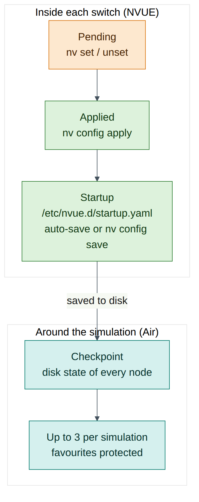
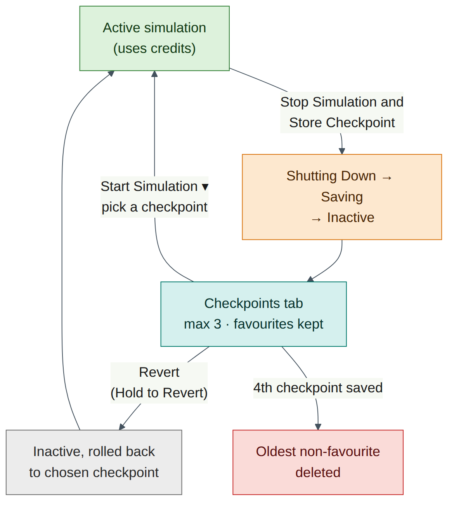
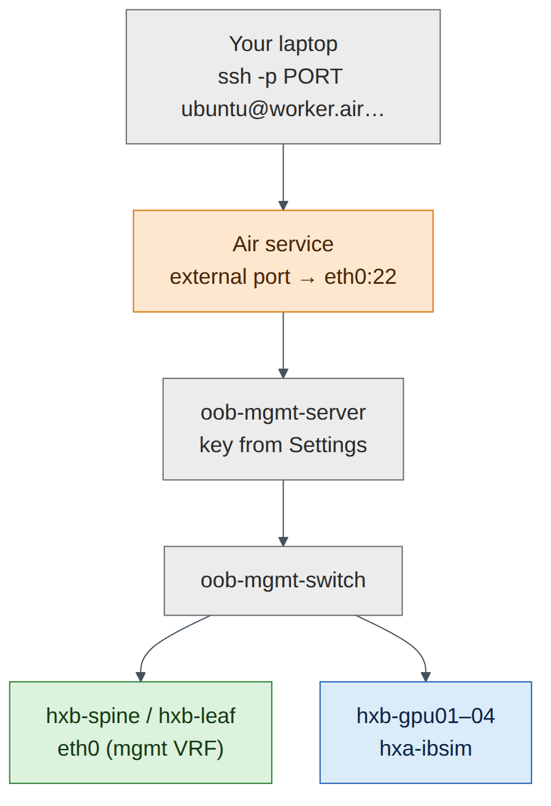
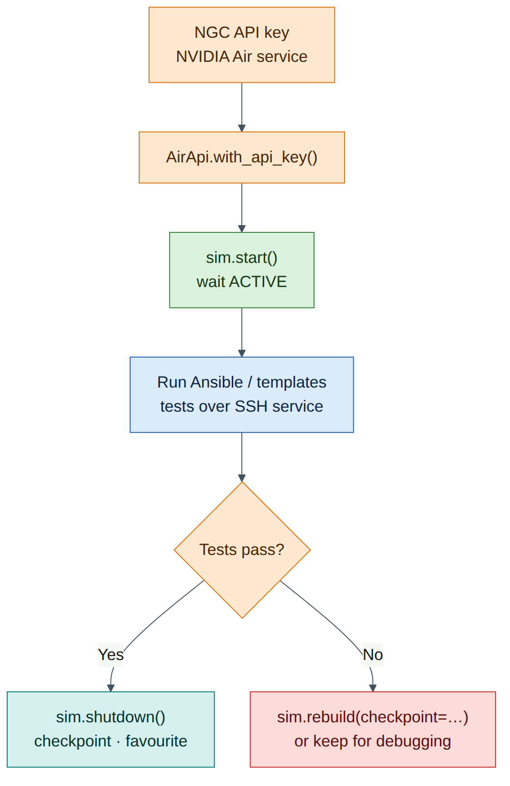

# Lab 6 — Air Power Skills: Checkpoints, Cloning, Services and the SDK

!!! abstract "Companion to the NCP-AIN Certification Guide"
    This free lab is part of the hands-on companion to *NCP-AIN Certification Guide* by Vakeesan Thevarajah (Cloudfoxy Ltd). The book explains the theory, design choices and hardware behaviour behind every step. [Get the book](../book.md){ .md-button .md-button--primary } [Free sample](../sample/NCP-AIN_Sample.pdf){ .md-button }


## Lab at a glance

| | |
|---|---|
| Book chapters | Chapter 9 (Lab simulation with NVIDIA Air) · Chapter 4 (NVUE startup configuration) · Chapters 21–22 (testing templates and Ansible in a twin) |
| Exam objectives | **2.4** Use NVIDIA Air to simulate network environments · supports **6.1/6.2** (testing automation in a digital twin) |
| Time | 75–90 minutes |
| Air resources used | The whole helix-b-air simulation (about 26 vCPU while running). Some tasks run with the simulation stopped. Your own computer for SSH and the Python SDK |
| Prerequisite labs | Lab 0 (topology imported, OOB network enabled). Labs 1–5 recommended, so there is configuration worth protecting |

## Objectives

By the end of this lab you will be able to:

1. Save switch configuration so it survives a restart, and stop a simulation with a checkpoint.
2. Work with checkpoints: start from one, mark a favourite, and revert a simulation to one.
3. Clone a simulation and export its topology as JSON.
4. Read the **History** tab and estimate how many compute hours (credits) your work uses.
5. Reach the simulation directly from your laptop with an SSH service on `oob-mgmt-server`.
6. Configure servers automatically with node instructions and cloud-init.
7. Use the DSX Air Python SDK (`nv-air-sdk`) to list, start and sleep simulations from a script.

## Background

By Lab 5 you have a working EVPN fabric that took hours to build. This lab is about protecting that work and using Air efficiently. A free-trial account has **10,000 compute hours** for a year and a **60 vCPU / 60 GiB** concurrent limit. A simulation that runs all night uses credits whether you type anything or not. Stopping it with a checkpoint costs nothing while it's stopped and brings you back to exactly where you were.

Air saves work at two layers, and you need both. **Inside each switch**, NVUE holds the running (applied) configuration and a startup configuration in `/etc/nvue.d/startup.yaml` (Chapter 4). Only the startup configuration is loaded at boot. **Around the whole simulation**, Air stores **checkpoints**: snapshots of every node's disk state. When you stop a simulation with **Stop Simulation and Store Checkpoint**, Air shuts the nodes down, saves their disks and releases the compute resources. Air keeps up to **three checkpoints** per simulation. The oldest non-favourite checkpoint is deleted automatically when a new one is saved, so mark the important ones as favourites.

The last part of the lab turns Air into something you can drive from code. The **Services** tab publishes a port on a node (usually SSH on `oob-mgmt-server`) to the internet. **Node instructions** and **cloud-init** configure servers automatically. The **Python SDK** lets a CI pipeline (Chapter 22) create, start, test and sleep simulations without anyone opening a browser.


<figure markdown>

{ loading=lazy }

<figcaption><strong>Figure 6.1: Two layers of saved state.</strong> NVUE startup configuration lives inside each switch's disk. An Air checkpoint saves every node's disk. Both are needed: a checkpoint of a switch whose change was never written to startup.yaml brings back the old configuration after the restart.</figcaption>

</figure>


!!! note "Version note"
    The DSX Air user interface changes often. The labels in this lab (**Stop Simulation and Store Checkpoint**, **Checkpoints**, **History**, **Services**, **Enable SSH**, **Settings**, **Node Instructions**) come from the DSX Air user guide at the time of writing. If a button has moved or been renamed, look for the same function nearby, and check docs.nvidia.com/dsx-air/simulation-management.


## Step-by-step

### Task 1 — Save configuration on every switch

A checkpoint saves disks, not running processes. Anything that exists only in a switch's applied configuration, and not in `startup.yaml`, might not come back after a stop and start. Make sure every switch's startup configuration matches its applied configuration.

1. Open the console of `oob-mgmt-server` (or SSH to it) and log in as `ubuntu`.
2. Connect to the first leaf and check whether anything is pending or unsaved:

    ```
    ubuntu@oob-mgmt-server:~$ ssh cumulus@hxb-leaf-r1
    cumulus@hxb-leaf-r1:mgmt:~$ nv config diff
    cumulus@hxb-leaf-r1:mgmt:~$ nv config diff applied startup
    ```

    **Expected output (illustrative):** both commands print nothing. The first shows pending changes that haven't been applied. The second shows differences between applied and startup.

3. If the first command shows output, you have pending changes. Review them, then apply or detach them (`nv config apply` or `nv config detach`). If the second shows output, save:

    ```
    cumulus@hxb-leaf-r1:mgmt:~$ nv config save
    ```

4. Confirm that auto-save is on, so future applies are saved automatically:

    ```
    cumulus@hxb-leaf-r1:mgmt:~$ nv show system config auto-save
    ```

    **Expected output (illustrative):**

    ```
           operational  applied
    -----  -----------  -------
    state  enabled      enabled
    ```

5. Repeat on every switch. A loop from `oob-mgmt-server` is faster. It assumes the SSH key set-up from Lab 0; otherwise you are asked for the password on each switch:

    ```
    ubuntu@oob-mgmt-server:~$ for sw in hxb-spine01 hxb-spine02 hxb-leaf-r1 hxb-leaf-r2 hxb-leaf-r3 hxb-leaf-r4; do
      echo "== $sw"; ssh cumulus@$sw "nv config save && nv config diff applied startup | wc -l"
    done
    ```

    **Expected output (illustrative):** each switch prints its name followed by `0` (no lines of difference).

6. On the Ubuntu servers, confirm the tenant addresses from Lab 5 are in a netplan file, not only added with `ip addr add`:

    ```
    ubuntu@oob-mgmt-server:~$ ssh ubuntu@hxb-gpu01 "sudo netplan get ethernets"
    ```

**Checkpoint:**

- Every switch shows no difference between applied and startup.
- Auto-save is enabled (the default in Cumulus Linux 5.x).
- Server addresses are persistent (netplan), or you have noted which ones you will re-add after a restart.


!!! tip "Exam focus (2.4)"
    A checkpoint is only as good as what is on disk. The NVUE answer to "what makes a change survive a reboot?" is that it is in the **startup** revision (`/etc/nvue.d/startup.yaml`). `nv config save` writes the applied configuration to startup. It does **not** apply pending changes.


### Task 2 — Stop the simulation and store a checkpoint

1. In the Air UI, open the **helix-b-air** simulation.
2. In the action bar at the top of the page, click **Stop Simulation and Store Checkpoint**.
3. Watch the status move through **Shutting Down** and **Saving** to **Inactive**. This can take several minutes for 13 nodes.
4. Open the **Checkpoints** tab. You should see one checkpoint with the time you stopped the simulation.


    !!! warning "Warning"
        The drop-down next to the stop button also offers **Stop Simulation Without Checkpoint**. That discards everything since the last checkpoint. Use it only when you really want to throw work away, for example after a destructive test.


**Checkpoint:**

- The simulation state is **Inactive**.
- The **Checkpoints** tab shows a new checkpoint of type **standard**.

### Task 3 — Mark a favourite and start from a checkpoint

Air keeps at most three checkpoints per simulation. When a fourth is saved, the oldest checkpoint that isn't a favourite is deleted. Protect your "known good after Lab 5" state now.

1. On the **Checkpoints** tab, mark the checkpoint you just created as a favourite (use the favourite control on its row). Its **Type** column changes from **standard** to **Favorites**. If you can rename it, call it `lab05-evpn-good`.
2. Click the drop-down arrow next to **Start Simulation**. A list of checkpoints appears.
3. Select the checkpoint and start the simulation.
4. When the state is **Active**, log in to a leaf and check that the EVPN configuration from Lab 5 is present:

    ```
    cumulus@hxb-leaf-r1:mgmt:~$ nv config diff applied startup
    cumulus@hxb-leaf-r1:mgmt:~$ sudo vtysh -c "show bgp summary"
    cumulus@hxb-leaf-r1:mgmt:~$ sudo vtysh -c "show evpn vni"
    ```

    **Expected output (illustrative):** the BGP summary lists both unnumbered neighbours (`swp31`, `swp32`) as Established and `show evpn vni` lists L2 VNIs 10110, 10111, 10210, 10211 and L3 VNIs 104001, 104002.

**Checkpoint:**

- The favourite checkpoint is marked and named.
- The simulation came back with the Lab 5 configuration intact.


!!! info "Field note"
    Checkpoint before every risky lab, not only at the end of the day. Before Lab 12 (Ansible) or Lab 13 (capstone faults), stop with a checkpoint, favourite it, and start again. It costs a few minutes and saves an evening of rebuilding.


<figure markdown>

{ loading=lazy }

<figcaption><strong>Figure 6.2: Checkpoint lifecycle in Air.</strong> Stopping with a checkpoint saves disks and frees resources. Starting from any stored checkpoint restores that state. Revert rolls an inactive simulation back to a checkpoint. When a fourth checkpoint is saved, the oldest non-favourite one is removed.</figcaption>

</figure>


### Task 4 — Break something, then revert

Revert rolls the simulation back to a checkpoint. It needs the simulation to be **Inactive** and to have at least one checkpoint.

1. With the simulation active, make a deliberate mess on `hxb-leaf-r1`:

    ```
    cumulus@hxb-leaf-r1:mgmt:~$ nv unset vrf default router bgp neighbor swp31
    cumulus@hxb-leaf-r1:mgmt:~$ nv unset vrf default router bgp neighbor swp32
    cumulus@hxb-leaf-r1:mgmt:~$ nv config apply -y
    cumulus@hxb-leaf-r1:mgmt:~$ sudo vtysh -c "show bgp summary"
    ```

    **Expected output (illustrative):** no neighbours listed. Leaf-r1 has dropped out of the fabric, and auto-save has written the broken configuration to startup.

2. Stop the simulation **without** a checkpoint (drop-down next to the stop button → **Stop Simulation Without Checkpoint**). You don't want to keep the broken state.
3. When the simulation is **Inactive**, click the **revert** icon in the action bar, choose the `lab05-evpn-good` checkpoint, and press and hold **Hold to Revert** until it completes.
4. Start the simulation and re-check `show bgp summary` on `hxb-leaf-r1`.

**Checkpoint:**

- Both BGP neighbours on `hxb-leaf-r1` are Established again.
- You understand the difference: *start from a checkpoint* picks a state for this run; *revert* rolls the simulation back to that checkpoint.


!!! warning "Warning"
    You can't revert an active simulation, and the revert option needs at least one checkpoint. If the revert icon is greyed out, check the state first.


### Task 5 — Clone the simulation

A clone is a second, independent copy of the simulation. It's useful for a "what if" test that you might want to throw away, while the original stays safe.

1. From the simulation list (or the simulation's action menu), choose the clone option. At the time of writing, Air added "clone a simulation directly from the UI" in its August 2026 release. Look for **Clone** or **Duplicate** in the simulation's menu (check on your release).
2. Name the clone `helix-b-air-whatif`.
3. **Don't start both at once.** Check the quota arithmetic first:

    | Resource | helix-b-air (approx.) | Two copies | Free-trial limit |
    |---|---|---|---|
    | vCPU | 26 | 52 | 60 |
    | Memory | about 46–48 GiB | about 94 GiB | 60 GiB |

Two copies fit the vCPU limit but not the memory limit. Stop the original with a checkpoint before starting the clone.

**Checkpoint:**

- The clone appears in your simulation list.
- You know that only one copy of this topology can run at a time on a free-trial account.


!!! info "Field note"
    If your UI has no clone option, the same result comes from exporting the topology (Task 6) and importing it as a new simulation. An imported topology starts from fresh images, not from your checkpoints, so re-apply configuration from saved `startup.yaml` files or your Lab 11/12 automation.


### Task 6 — Export the topology

1. Open the **Topology** tab of the original simulation.
2. Click the **Export** icon in the toolbar. Air downloads the topology as a JSON file.
3. Open the file in a text editor and find `hxb-leaf-r1`, its OS image, its vCPU and memory, and its links.
4. Commit the file to the Git repository you will use for Lab 11 and Lab 12, for example as `air/helix-b-air.json`.

**Checkpoint:**

- You have a JSON file that describes the nodes and links (not the configuration inside them).
- It is under version control next to your templates and playbooks.


!!! tip "Exam focus (2.4)"
    Air simulations can be built with the UI builder, from a **DOT** or **JSON** topology file, or from a pre-built demo. An exported topology file is how a digital twin stays in step with the production design (Chapter 9).


### Task 7 — Read the History tab and estimate credits

1. Open the **History** tab of the simulation. Each entry has a **Timestamp**, **Actor**, **Category** (INFO, WARNING or ERROR) and **Description**.
2. Find the events from Tasks 2–4: the stop, the checkpoint save, the revert and the start. Note who (**Actor**) did each one.
3. Estimate what one hour of this lab costs. DSX Air bills in **compute hours**. One compute hour is **1 vCPU for 1 hour**, or **8 GB of memory for 1 hour**, and the two are counted separately.

    | Item | Working |
    |---|---|
    | vCPU per hour | 12 nodes × 2 vCPU + `oob-mgmt-switch` ≈ **26 vCPU** → about 26 compute hours per hour |
    | Memory per hour | about 46–48 GB ÷ 8 ≈ **6** compute hours per hour |
    | Total | about **32 compute hours per running hour** |
    | Free-trial allowance | 10,000 ÷ 32 ≈ **310 hours** of running time |

A simple rule of thumb for planning is **vCPU × hours**, and then add about a quarter for memory on this topology. An evening of three hours uses about 100 compute hours. Leaving it running for a week by mistake uses over 5,000.

4. Look for the rate or usage display in the UI. Air's August 2026 release notes say the UI "now shows the rate required to run a simulation" (check where it appears on your release). Compare it with your estimate.
5. Open the simulation's **Edit** dialog and look at **Sleep date**. Free-trial simulations get an automatic sleep date that can't be removed. When it is reached, Air saves the simulation's state and stops it.

**Checkpoint:**

- You can find a stop, checkpoint and revert event in **History**.
- You have a credit estimate for one hour and one evening of work.


!!! warning "Warning"
    The **Sleep date** is a safety net, not a plan. Stop the simulation yourself at the end of each session, with a checkpoint.


### Task 8 — SSH from your laptop with a Service

The console in the browser works, but a proper SSH session from your laptop is faster and lets you copy and paste freely. Password authentication is disabled on `oob-mgmt-server` by default, so you must add a public key first.

1. On your laptop, create a key if you don't have one, and print the public half:

    ```
    you@laptop:~$ ssh-keygen -t ed25519 -C "helix-air"
    you@laptop:~$ cat ~/.ssh/id_ed25519.pub
    ```

2. In the Air UI, click your user name, choose **Settings**, and find the SSH keys section. Fill in **Name** (for example `laptop`) and **Public Key** (paste the whole `ssh-ed25519 …` line), then select **Add**.
3. Keys you add are included automatically in the simulation's authorised keys on `oob-mgmt-server`. If the simulation was already running, stop and start it (or restart `oob-mgmt-server`) if the key doesn't work straight away (check on your release).
4. Open the simulation's **Services** tab and click **Enable SSH**. This is only available when the OOB network is enabled. (The same tab has **+ New Service** for other ports, with the fields **Service Name**, **Interface**, **Service Type** and **Service Port**.)
5. Air shows an external host name and port for the service, with a ready-made command. It looks like this (illustrative):

    ```
    you@laptop:~$ ssh -p 24562 ubuntu@worker07.air.nvidia.com
    ```

6. Run the command shown in **your** Services tab. From `oob-mgmt-server`, go on to any node by name:

    ```
    ubuntu@oob-mgmt-server:~$ ssh cumulus@hxb-spine01
    ```

**Checkpoint:**

- You can SSH from your laptop straight to `oob-mgmt-server` with your key.
- From there, you can reach every node by host name.


<figure markdown>

{ loading=lazy }

<figcaption><strong>Figure 6.3: Reaching the simulation from your laptop.</strong> The SSH service publishes port 22 on oob-mgmt-server at an external host name and port. Your laptop's public key, added in Settings, is installed on oob-mgmt-server. Every other node is reached over the OOB network by host name.</figcaption>

</figure>


!!! warning "Warning"
    A published SSH service is reachable from the internet. Keep password authentication disabled, use keys only, and disable the service when you no longer need it.


### Task 9 — Configure servers automatically: node instructions and cloud-init

In Labs 3 and 5 you configured each server by hand. Air offers two ways to do this automatically.

| Method | When it runs | How you add it | Best for |
|---|---|---|---|
| **Node instructions** | After the node boots, run by the Air agent on the node | UI: **Nodes** tab → ⋮ menu on the node → **Node Instructions** (or right-click the node on the **Topology** canvas). Also the instructions API | Changes to an existing, running simulation |
| **Cloud-init** | On the node's first boot (NoCloud data source) | API or SDK: create **UserConfig** objects (user-data, meta-data) and assign them to nodes | Building servers from scratch, reproducibly |

Air-provided `generic/ubuntu` images include cloud-init. Assign cloud-init configuration **before** a node's first boot. Assignments made after a node has booted take effect only when the node is rebuilt.

**Part A — a node instruction for hxb-gpu01**

1. In the **Nodes** tab, open the ⋮ menu for `hxb-gpu01` and choose **Node Instructions**.
2. Create a shell-type instruction (choose the shell or script option the dialog offers; executor names vary by release) with this content. It makes the Lab 5 AURORA addresses persistent and installs the RDMA tools used in Labs 3 and 9:

    ```
    #!/bin/bash
    cat > /etc/netplan/60-helix.yaml <<'EOF'
    network:
      version: 2
      ethernets:
        eth1:
          addresses: [172.16.10.101/24]
          routes: [{to: 172.16.0.0/16, via: 172.16.10.1}]
        eth2:
          addresses: [172.16.11.101/24]
    EOF
    chmod 600 /etc/netplan/60-helix.yaml
    netplan apply
    apt-get update && apt-get install -y rdma-core ibverbs-utils perftest
    ```

3. Leave **wait for network** at its default (enabled). With the OOB network enabled, the Air agent waits until it can reach `oob-mgmt-server` before it runs the instruction. These network-readiness settings can't be changed after the instruction is created.
4. Save the instruction and watch it run (the node's instruction status shows when it has completed).
5. Check the result:

    ```
    ubuntu@oob-mgmt-server:~$ ssh ubuntu@hxb-gpu01 "ip -br addr show eth1; dpkg -l perftest | tail -1"
    ```

    **Expected output (illustrative):**

    ```
    eth1             UP             172.16.10.101/24 fe80::…/64
    ii  perftest     24.x…    amd64    Infiniband verbs performance tests
    ```


    !!! warning "Warning"
        The routes in the example assume the AURORA design from Lab 5 (a route to the other tenant subnets through the anycast gateway). Adjust them to match what you built. If eth1 and eth2 already have these addresses in another netplan file, remove the duplicate first.


**Part B — cloud-init with the SDK (optional, for a new simulation)**

Cloud-init is the cleaner choice when you build a new simulation, for example the clone from Task 5 before its first start, or a CI simulation in Lab 12. The user-data file is standard `#cloud-config`:

```
#cloud-config
package_update: true
packages: [rdma-core, ibverbs-utils, perftest, jq]
write_files:
  - path: /etc/netplan/60-helix.yaml
    permissions: '0600'
    content: |
      network:
        version: 2
        ethernets:
          eth1: {addresses: [172.16.10.102/24]}
          eth2: {addresses: [172.16.11.102/24]}
runcmd:
  - netplan apply
```

The SDK (Task 10) creates the configuration and assigns it to a node. This follows the DSX Air SDK cloud-init example:

```
from pathlib import Path
from air_sdk import AirApi
from air_sdk.endpoints import UserConfig

api = AirApi.with_ngc_config()
sim = next(s for s in api.simulations.list() if s.name == "helix-b-air-whatif")
node = next(n for n in sim.nodes.list() if n.name == "hxb-gpu02")

user_data = api.user_configs.create(
    name="hxb-gpu02-userdata",
    kind=UserConfig.KIND_CLOUD_INIT_USER_DATA,
    content=Path("hxb-gpu02-user-data.yaml"),
)
meta_data = api.user_configs.create(
    name="hxb-gpu02-metadata",
    kind=UserConfig.KIND_CLOUD_INIT_META_DATA,
    content="instance-id: hxb-gpu02\nlocal-hostname: hxb-gpu02\n",
)
sim.node_bulk_assign(nodes=[{"node": node, "user_data": user_data, "meta_data": meta_data}])
```

**Checkpoint:**

- `hxb-gpu01` has its tenant addresses and the RDMA tools installed by a node instruction.
- You can explain when to use node instructions (running simulation) and when to use cloud-init (first boot).


!!! note "Version note"
    The `sim.nodes.list()` call and the node `name` attribute follow the SDK's naming pattern, but this exact combination was not tested for this guide (check on your release, at docs.nvidia.com/dsx-air/sdk). The rest of the example is taken from NVIDIA's cloud-init SDK example.


### Task 10 — Drive Air from Python with the SDK

The DSX Air SDK is the `nv-air-sdk` package. It needs Python 3.10 or later and authenticates with an **NGC API key** that has the **NVIDIA Air** service selected.

1. **Create an API key.** Sign in to NGC, generate a Personal API key (see the NGC user guide, "Generating a Personal API Key"), and select **NVIDIA Air** in the services list. The key starts `nvapi-`. Copy it once; NGC doesn't show it again.


    !!! note "Version note"
        Older Air documentation and the older `air-sdk` package used an API token created in the Air UI and a user name and password style login. The current DSX Air SDK uses NGC keys: `AirApi.with_api_key(…)`, `AirApi.with_ngc_config()` (reads `~/.ngc/config`), or `AirApi.with_device_login(…)`. Confirm the method for your account at docs.nvidia.com/dsx-air/authentication and docs.nvidia.com/dsx-air/sdk.


2. **Install the SDK on your laptop**, in a virtual environment. Run it on your laptop, not on `oob-mgmt-server`: a script that sleeps the simulation would cut off the machine it runs on.

    ```
    you@laptop:~$ python3 -m venv ~/air-venv
    you@laptop:~$ source ~/air-venv/bin/activate
    (air-venv) you@laptop:~$ pip install nv-air-sdk
    (air-venv) you@laptop:~$ export AIR_API_KEY='nvapi-…your key…'
    ```

    `AIR_API_KEY` is simply the variable name this lab uses. It keeps the key out of the script and out of Git.

3. **Write the script.** Save it as `helix_air.py`:

    ```
    #!/usr/bin/env python3
    """List, start and sleep DSX Air simulations (Lab 6)."""
    import os
    import sys

    from air_sdk import AirApi, SimState

    api = AirApi.with_api_key(api_key=os.environ["AIR_API_KEY"])


    def list_sims():
        for sim in api.simulations.list():
            print(f"{sim.name:<28} {str(sim.state):<12} {sim.id}")


    def find(name):
        for sim in api.simulations.list():
            if sim.name == name:
                return sim
        sys.exit(f"No simulation called {name!r}")


    def start(name):
        sim = find(name)
        sim.start()
        sim.wait_for_state(SimState.ACTIVE, error_states=SimState.INACTIVE)
        print(f"{name} is ACTIVE")


    def sleep(name):
        sim = find(name)
        sim.shutdown()  # stores a checkpoint unless create_checkpoint=False
        sim.wait_for_state(SimState.INACTIVE)
        print(f"{name} is INACTIVE, checkpoint stored")
        for cp in sim.checkpoints.list():
            print(f"  checkpoint {cp.name} (id={cp.id}) state={cp.state}")


    if __name__ == "__main__":
        if len(sys.argv) < 2 or sys.argv[1] not in ("list", "start", "sleep"):
            sys.exit("usage: helix_air.py list | start <sim> | sleep <sim>")
        if sys.argv[1] == "list":
            list_sims()
        elif sys.argv[1] == "start":
            start(sys.argv[2])
        else:
            sleep(sys.argv[2])
    ```

4. **Run it.**

    ```
    (air-venv) you@laptop:~$ python3 helix_air.py list
    ```

    **Expected output (illustrative):**

    ```
    helix-b-air                  ACTIVE       3f6c1d2e-…
    helix-b-air-whatif           INACTIVE     9a41b7c0-…
    ```

    ```
    (air-venv) you@laptop:~$ python3 helix_air.py sleep helix-b-air
    (air-venv) you@laptop:~$ python3 helix_air.py start helix-b-air
    ```

    **Expected output (illustrative):** the sleep command waits several minutes, prints `helix-b-air is INACTIVE, checkpoint stored` and lists the checkpoints. The start command waits until the nodes are up and prints `helix-b-air is ACTIVE`.

5. Open the **History** tab. The API calls appear as events with your account as the **Actor**.

**Checkpoint:**

- `list` shows your simulations with their state.
- `sleep` creates a checkpoint, the same as **Stop Simulation and Store Checkpoint** in the UI.
- You know the other SDK calls that exist for CI: `sim.shutdown(create_checkpoint=False)`, `sim.rebuild(checkpoint=cp.id)`, `sim.export()`, `sim.get_history()`, and `cp.update(name=…, favorite=True)`.


<figure markdown>

{ loading=lazy }

<figcaption><strong>Figure 6.4: Air in a CI pipeline with the SDK.</strong> A pipeline authenticates with an NGC API key, starts the twin, runs automation and tests against it, then sleeps it with a checkpoint. The same calls you used by hand in this lab are the building blocks of Chapter 22's Air CI workflow.</figcaption>

</figure>


!!! info "Field note"
    Put a `sleep` step in the pipeline's clean-up stage so it runs even when tests fail. A failed CI run that leaves a 26 vCPU simulation running overnight uses around 400 compute hours.


## Verify

- [ ] Every switch shows no difference in `nv config diff applied startup`.
- [ ] You stopped the simulation with **Stop Simulation and Store Checkpoint** and saw a new checkpoint.
- [ ] One checkpoint is a favourite, named `lab05-evpn-good`.
- [ ] You started from a checkpoint, and reverted an inactive simulation to one.
- [ ] A clone exists, and you know that only one copy can run at a time on a trial account.
- [ ] The topology JSON is exported and committed to Git.
- [ ] You can find stop, checkpoint and revert events in **History**, and you have a credit estimate.
- [ ] You can SSH from your laptop to `oob-mgmt-server` through the SSH service.
- [ ] A node instruction configured `hxb-gpu01`.
- [ ] `helix_air.py list`, `start` and `sleep` work.

## Break and fix

### Fault 1 — "My changes disappeared after the restart"

**Symptom:** You changed `hxb-leaf-r2` (for example `nv set interface swp1 link mtu 9000`), stopped the simulation with a checkpoint, and started it the next day. The MTU is back to 9216.

**Diagnosis:**

1. `nv config history` on the leaf shows no revision with the change, or `nv config diff applied startup` shows it was never saved.
2. `nv show system config auto-save` shows `disabled`. Someone turned auto-save off (the fault injection for this exercise is `nv set system config auto-save state disabled` followed by `nv config apply -y`, run before the change).
3. The checkpoint faithfully saved a disk whose `startup.yaml` didn't contain the change.

    **Fix:** Re-apply the change, run `nv config save`, and turn auto-save back on with `nv set system config auto-save state enabled` and `nv config apply -y`. Then stop with a checkpoint again. The lesson: Air checkpoints save disks, and the switch decides what is on disk.

### Fault 2 — "Permission denied (publickey)"

**Symptom:** The SSH command from the **Services** tab fails with `Permission denied (publickey)`.

**Diagnosis:**

1. Password authentication is disabled on `oob-mgmt-server`, so only a key works.
2. Check the key in **Settings**: a common mistake is pasting the private key, or a public key with a line break in the middle.
3. Run `ssh -v -p <port> ubuntu@<host>` and check which key file your SSH client offers. If you created a non-default key, add `-i ~/.ssh/<keyfile>`.
4. If the key was added while the simulation was running, it may not have reached `oob-mgmt-server` yet.

    **Fix:** Paste the single-line public key (`ssh-ed25519 AAAA… comment`), select **Add**, restart the simulation or `oob-mgmt-server` if needed, and connect with the right `-i` key file.

## Clean-up / save state

1. Make sure every switch is saved (Task 1 loop).
2. Stop the simulation with **Stop Simulation and Store Checkpoint**, or run `python3 helix_air.py sleep helix-b-air`.
3. Mark this checkpoint as a favourite if it's the state you want Lab 7 to start from. With three slots, keep: `lab05-evpn-good` (favourite), the latest working state, and one spare.
4. If you don't need the clone, delete it so it doesn't confuse your SDK scripts.
5. Disable the SSH service if you won't use it for a while.

## Exam tie-in

- **2.4 Use NVIDIA Air:** know the lifecycle words (start, stop with or without checkpoint, sleep date, checkpoints, revert, rebuild) and what each keeps.
- **2.4:** simulations are built from the UI, from DOT/JSON topology files, or from demos, and can be exported as JSON. Air adds an OOB network with `oob-mgmt-server` and `oob-mgmt-switch`.
- **2.4:** Air is automated through the API/SDK (`nv-air-sdk`, `from air_sdk import AirApi`, NGC API key). That is how a digital twin fits into CI.
- **6.1/6.2:** templates and playbooks are tested against an Air twin started and stopped by a pipeline (Chapters 21–22).
- **Chapter 4 link:** a change survives a reboot only if it is in `startup.yaml`. `nv config save` saves; `nv config apply` applies.

## Review questions

1. What does **Stop Simulation and Store Checkpoint** save, and what happens to the compute resources?
2. A simulation has three standard checkpoints and one favourite. You stop it with a checkpoint again. What happens?
3. Why must you run `nv config save` (or have auto-save enabled) before you stop a simulation with a checkpoint?
4. Your simulation uses 26 vCPU and about 48 GB of memory. Roughly how many compute hours does a 4-hour session use?
5. You add a cloud-init configuration to a server that has already booted. Why doesn't it take effect, and what should you use instead?

### Answers

1. It shuts the nodes down, saves a checkpoint of every node's disk state, and releases the compute resources, so an inactive simulation doesn't use compute hours. The status moves through Shutting Down and Saving to Inactive.
2. A new checkpoint is saved and the oldest **non-favourite** checkpoint is deleted automatically. The favourite is kept. (Wording in the docs: up to 3 checkpoints per simulation; favourites are protected from automatic deletion.)
3. A checkpoint saves disks. At boot, a Cumulus switch loads `/etc/nvue.d/startup.yaml`. A change that is applied but not saved to startup is lost after the restart, even though the checkpoint itself worked.
4. About 26 vCPU-hours per hour plus about 6 for memory (48 ÷ 8), so about 32 per hour, or roughly **130 compute hours** for 4 hours. The quick vCPU × hours estimate gives 104.
5. Cloud-init runs on first boot; assignments made after a node has booted take effect only when the node is rebuilt. On a running simulation, use a **node instruction**, which the Air agent runs after boot.

---

!!! abstract "Go deeper"
    The matching book chapters cover the exam objectives for this lab in full, with a Q&A pack of about 40 exam-style questions per chapter. [Get the book](../book.md){ .md-button .md-button--primary } [Report a problem with this lab](https://github.com/Cloudfoxy-Ltd/ncp-ain-guide/issues/new?template=erratum.yml){ .md-button }
