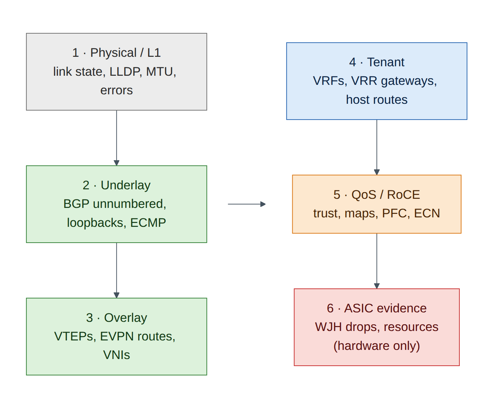
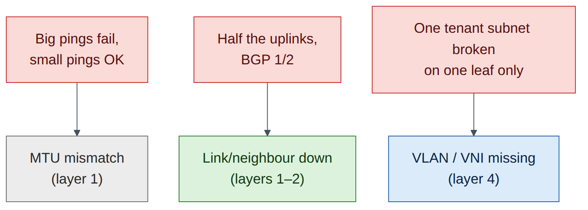

# Lab 7 — Monitoring and Troubleshooting a Spectrum-X-Style Fabric

!!! abstract "Companion to the NCP-AIN Certification Guide"
    This free lab is part of the hands-on companion to *NCP-AIN Certification Guide* by Vakeesan Thevarajah (Cloudfoxy Ltd). The book explains the theory, design choices and hardware behaviour behind every step.

    [Get the book on Leanpub](https://leanpub.com/nvidiancp-aincertificationguide){ .md-button .md-button--primary } [Paperbacks](../book.md){ .md-button } [Free sample](../sample/NCP-AIN_Sample.pdf){ .md-button }


## Lab at a glance

| | |
|---|---|
| Book chapters | 10 (NetQ, WJH, telemetry), 18 (cl-resource-query and WJH troubleshooting) |
| Exam objectives | 2.5, 2.6, 5.1, 5.2 |
| Time | 60 minutes |
| Air resources | Full helix-b-air simulation |
| Prerequisites | Labs 1, 2 and 5 (EVPN tenants working) |

## Objectives

- Build a repeatable health check for the Helix-B fabric from NVUE, FRR and Linux.
- Read interface, BGP and EVPN state quickly and know which command answers which question.
- Try `cl-resource-query` and `nv show platform asic resource` on Cumulus VX and interpret what you get.
- Understand what What Just Happened (WJH) and NetQ add on real hardware, and why they aren't in this lab.
- Diagnose three injected faults with a layered method.

## Background

On a Spectrum-X fabric you'd have three observability layers: **on-box** state (NVUE, FRR, Linux counters), **ASIC-level** drop and resource data (WJH, `cl-resource-query`), and **fabric-wide** history and validation (NetQ). Cumulus VX gives you the first layer in full. It has no Spectrum ASIC, so WJH isn't available and ASIC resource data is limited or absent. NetQ needs its own server, which is large for the free trial (Chapter 10), so this lab builds a scripted "mini-NetQ" health check instead and uses the book's WJH examples to practise reading drop reasons.


<figure markdown>

{ loading=lazy }

<figcaption><strong>Figure 7.1: Troubleshooting layer by layer.</strong> Work bottom-up. A failure at one layer explains every failure above it, so don't debug EVPN before the underlay is clean.</figcaption>

</figure>


## Step-by-step

### Task 1 — The five-minute health check on one switch

Run these on `hxb-leaf-r1`. Each answers one question.

| Question | Command |
|---|---|
| Are the ports up, with the right MTU? | `nv show interface` |
| Who is cabled where? | `nv show interface swp31 lldp` or `sudo lldpctl` |
| Are the BGP sessions up and exchanging routes? | `nv show vrf default router bgp neighbor` |
| Are both spines installed as next hops? | `sudo vtysh -c 'show ip route 10.255.0.14/32'` |
| Is EVPN learning MACs and routes? | `nv show evpn vni` · `sudo vtysh -c 'show bgp l2vpn evpn summary'` |
| Are tenant gateways present? | `nv show interface vlan110` |

```
cumulus@hxb-leaf-r1:mgmt:~$ nv show interface | grep -E 'swp|vlan|lo '
lo        up    65536  loopback  IP Address: 10.255.0.11/32
swp1      up    9216   swp
swp2      up    9216   swp
swp31     up    9216   swp
swp32     up    9216   swp
vlan110   up    9216   svi       IP Address: 172.16.10.11/24
vlan210   up    9216   svi       IP Address: 172.17.10.11/24
```

*(Illustrative; your columns and addresses depend on the release and on Lab 5.)*

```
cumulus@hxb-leaf-r1:mgmt:~$ sudo vtysh -c 'show bgp summary' | grep -E 'Neighbor|swp'
Neighbor        V         AS   MsgRcvd   MsgSent   TblVer  InQ OutQ  Up/Down State/PfxRcd   PfxSnt Desc
swp31           4      65100       812       805        0    0    0 06:41:12            5        7 N/A
swp32           4      65100       810       806        0    0    0 06:41:10            5        7 N/A
```

*(Illustrative.)* Both sessions **Established** (a number in *State/PfxRcd*, not a word like *Active* or *Idle*).

**Checkpoint**

- [ ] You can answer every question in the table for hxb-leaf-r1 in under five minutes.

### Task 2 — Counters: NVUE and Linux

1. Interface counters through NVUE:

    ```
    cumulus@hxb-leaf-r1:mgmt:~$ nv show interface swp31 counters
    ```

2. The same data from Linux. On Cumulus VX the switch ports are ordinary Linux interfaces, so standard tools work:

    ```
    cumulus@hxb-leaf-r1:mgmt:~$ ip -s link show swp31
    cumulus@hxb-leaf-r1:mgmt:~$ sudo ethtool -S swp31 | head -20
    ```

3. Generate some traffic (a 60-second ping flood inside AURORA from hxb-gpu01 to hxb-gpu02) and watch the counters move on the uplinks. Which spine carries it tells you where ECMP hashed the flow (Lab 4).

    ```
    ubuntu@hxb-gpu01:~$ sudo ping -f -c 20000 -s 1400 172.16.10.102
    cumulus@hxb-leaf-r1:mgmt:~$ watch -n 2 "nv show interface swp31-32 counters | grep -iE 'packet|octet'"
    ```


    !!! info "Field note"
        On Spectrum hardware, `nv show interface <swp> counters` also shows per-queue and PFC counters, and `nv show interface <swp> qos roce counters` shows RoCE-specific counters (Chapter 5). On VX those sections are empty or missing because there is no ASIC.


### Task 3 — ASIC resources: try cl-resource-query

Chapter 18 uses `cl-resource-query` to catch forwarding-table exhaustion. Try it on VX:

```
cumulus@hxb-leaf-r1:mgmt:~$ sudo cl-resource-query
cumulus@hxb-leaf-r1:mgmt:~$ nv show platform asic resource            # 5.11–5.14 syntax
cumulus@hxb-leaf-r1:mgmt:~$ nv show platform asic                      # find the ASIC id on 5.15+
```

What you'll see depends on the VX release: the command may be missing, may print zeros or maximums of zero, or may print a partial table. Any of these is expected: the numbers come from the Spectrum ASIC driver. Compare with the hardware output in Chapter 18 and answer:

- Which rows would grow when you add a tenant VRF with many /32 host routes?
- Which row would grow if you added more ECMP next hops?


!!! tip "Exam focus"
    Know the resource categories (host/neighbour entries, IPv4/IPv6 routes, ECMP next hops, MAC entries, ACL regions) and the symptom of exhaustion: routes present in FRR but not programmed in hardware, so traffic falls back or drops.


### Task 4 — WJH and NetQ: read what the hardware would tell you

WJH classifies every dropped packet in the Spectrum ASIC (Chapters 10 and 18). It isn't available on VX. Practise instead with the book's example output. For each drop reason, say which layer of Figure 7.1 it belongs to and what you would check next.

| WJH drop (from Chapter 18) | Layer | Next check |
|---|---|---|
| L2 · Ingress VLAN filtering | Tenant | Is the VLAN allowed on the bridge port? |
| Router · Blackhole route | Tenant / underlay | Which route points to blackhole, and why? |
| Router · TTL value is too small | Underlay | Routing loop? traceroute |
| Buffer · Tail drop / WRED | QoS | Congestion on which egress queue; RoCE marked correctly? |
| ACL · Ingress port ACL | Policy | Which rule matched? |

For NetQ, write down (from Chapter 10) the three commands you would run on netq-01 for this lab's topology: `netq check bgp`, `netq check evpn`, and `netq show interfaces` or `netq check mtu`. Task 5 builds a small substitute.

### Task 5 — Build a mini fabric check from the oob-mgmt-server

This script gives you a NetQ-style one-screen health view for the whole fabric using SSH.

```
ubuntu@oob-mgmt-server:~$ mkdir -p ~/checks && nano ~/checks/fabric-check.sh
```

```
#!/bin/bash
# Mini fabric check for helix-b-air: BGP, EVPN and link state on every switch
SWITCHES="hxb-spine01 hxb-spine02 hxb-leaf-r1 hxb-leaf-r2 hxb-leaf-r3 hxb-leaf-r4"
for s in $SWITCHES; do
  echo "===== $s"
  ssh -o BatchMode=yes cumulus@$s '
    echo -n "BGP established: "; sudo vtysh -c "show bgp summary json" | python3 -c "import sys,json;d=json.load(sys.stdin);p=d.get(\"ipv4Unicast\",{}).get(\"peers\",{});print(sum(1 for v in p.values() if v.get(\"state\")==\"Established\"),\"/\",len(p))"
    echo -n "Down swp ports:  "; ip -br link | awk "/^swp/ && \$2!=\"UP\" {printf \$1\" \"}"; echo
    echo -n "EVPN VNIs:       "; sudo vtysh -c "show evpn vni" 2>/dev/null | grep -cE "^ *[0-9]+ "
  '
done
```

```
ubuntu@oob-mgmt-server:~$ chmod +x ~/checks/fabric-check.sh && ~/checks/fabric-check.sh
===== hxb-spine01
BGP established: 4 / 4
Down swp ports:
EVPN VNIs:       0
===== hxb-leaf-r1
BGP established: 2 / 2
Down swp ports:
EVPN VNIs:       4
```

*(Illustrative.)* Run it now and save the output as your **baseline**: `~/checks/fabric-check.sh > ~/checks/baseline.txt`. In the break/fix tasks, compare with `diff`.


!!! warning "Warning"
    The script relies on the passwordless SSH set up in Lab 0 and on `sudo` without a password for the `cumulus` user (the Cumulus default). If `sudo` prompts, run the commands manually instead.


## Break and fix

Ask a colleague to inject a fault without telling you which, or inject it yourself and come back later. Diagnose with Figure 7.1, starting at layer 1.

### Fault A — MTU mismatch on an uplink

- *Inject:* on hxb-spine01, `nv set interface swp3 mtu 1500 && nv config apply -y`.
- *Symptoms:* BGP to hxb-leaf-r3 stays up (small packets). Small pings between gpu01 and gpu02 work, but large ones fail when the flow hashes through spine01: `ping -M do -s 8000 172.16.10.102`.
- *Diagnosis:* `nv show interface swp3` on spine01 shows MTU 1500 against 9216 on leaf-r3 swp31. VXLAN adds 50 bytes to every host frame, so host MTU 9000 frames can't cross a 1500-byte link.
- *Fix:* `nv set interface swp3 mtu 9216 && nv config apply -y`. Re-run the large ping.

### Fault B — A BGP neighbour down

- *Inject:* on hxb-leaf-r2, `nv set interface swp32 link state down && nv config apply -y`.
- *Symptoms:* the fabric check shows leaf-r2 at 1 / 2 established and swp32 in the down list. Traffic still flows (ECMP falls back to spine01) but capacity is halved.
- *Diagnosis:* `nv show interface swp32` shows admin down; LLDP neighbour missing.
- *Fix:* `nv set interface swp32 link state up && nv config apply -y`.

### Fault C — VLAN missing from the bridge on one leaf

- *Inject:* on hxb-leaf-r3, `nv unset bridge domain br_default vlan 110 && nv config apply -y`.
- *Symptoms:* gpu01 can no longer reach gpu02 in 172.16.10.0/24; BOREALIS is unaffected. `nv show evpn vni` on leaf-r3 no longer lists 10110.
- *Diagnosis:* layers 1–3 are clean (script output matches the baseline except VNI count on leaf-r3). At layer 4, the VLAN-to-VNI mapping and the access port's VLAN are gone. On hardware, WJH would show *Ingress VLAN filtering* drops on leaf-r3 swp1.
- *Fix:* restore `nv set bridge domain br_default vlan 110 vni 10110`, the access port VLAN and the SVI settings from Lab 5, then `nv config apply -y`. Or roll back with `nv config history` and `nv config apply <rev>` (Lab 1).


<figure markdown>

{ loading=lazy }

<figcaption><strong>Figure 7.2: Symptom to cause for the three faults.</strong> The first diverging layer points to the fault. Keep a baseline so "different from normal" is obvious.</figcaption>

</figure>


## Verify

- [ ] Your fabric check runs cleanly and matches the baseline.
- [ ] You found and fixed Faults A, B and C, each starting at layer 1.
- [ ] You can name what WJH, cl-resource-query and NetQ add on real hardware.

## Clean-up / save state

Make sure all three faults are reverted, run the fabric check once more, `nv config save` on every switch, and store a checkpoint (`lab07-monitoring`).

## Exam tie-in

- 5.1: `cl-resource-query` categories and the symptom of table exhaustion.
- 5.2: WJH drop categories (L1, L2, router, tunnel, ACL, buffer) and how they map to fixes.
- 2.5/2.6: NetQ checks (`netq check bgp|evpn|mtu`) and telemetry are how you'd run this lab at scale.
- The layered method (physical → underlay → overlay → tenant → QoS) is what most scenario questions test.

## Review questions

1. BGP is up on every link but large pings fail between tenants' hosts across leaves. What do you check first?
2. Why doesn't `cl-resource-query` give useful numbers on Cumulus VX?
3. Which WJH drop reason would you expect for Fault C on real hardware?
4. What does a baseline add to a health check?
5. Name two NetQ checks that would have caught Faults A and C.

### Answers

1. MTU on every hop of the path, including VXLAN overhead (host 9000 + 50 bytes must fit the underlay MTU).
2. The data comes from the Spectrum ASIC's forwarding tables. VX forwards in the Linux kernel, so there's no ASIC table to report.
3. L2 *Ingress VLAN filtering* on the leaf port where gpu02's frames arrive, because VLAN 110 is no longer allowed on the bridge.
4. It turns "is this normal?" into a diff. Faults show up as differences from a known-good state.
5. `netq check mtu` (Fault A) and `netq check evpn` (Fault C; it flags VNI inconsistencies across VTEPs).

---

!!! abstract "Go deeper"
    The matching book chapters cover the exam objectives for this lab in full, with a Q&A pack of about 40 exam-style questions per chapter.

    [Get the book on Leanpub](https://leanpub.com/nvidiancp-aincertificationguide){ .md-button .md-button--primary } [Report a problem with this lab](https://github.com/Cloudfoxy-Ltd/ncp-ain-guide/issues/new?template=erratum.yml){ .md-button }
