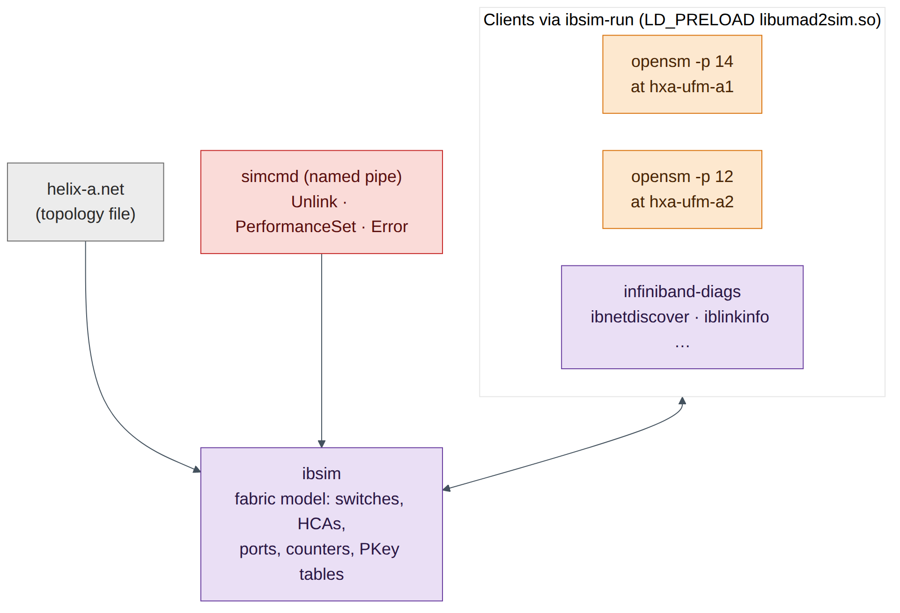
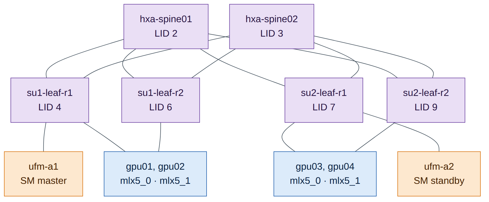
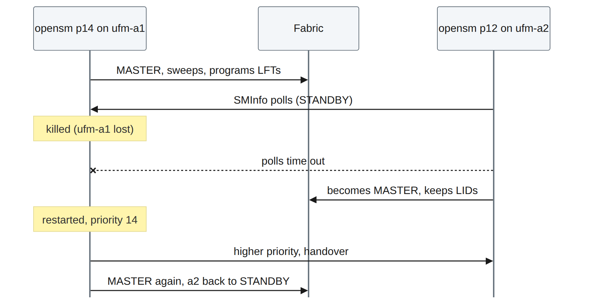
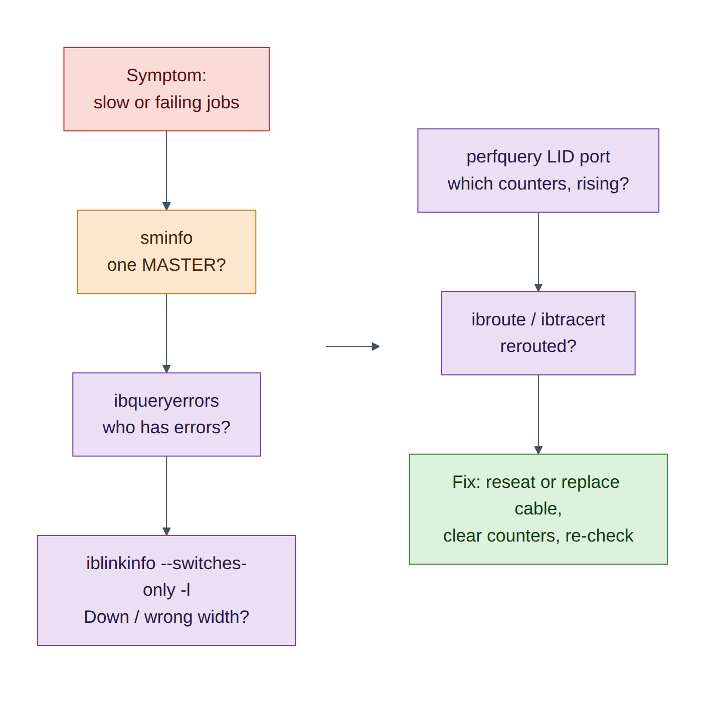

# Lab 8 — An InfiniBand Fabric with ibsim: SM, HA, Partitions and Diagnostics

!!! abstract "Companion to the NCP-AIN Certification Guide"
    This free lab is part of the hands-on companion to *NCP-AIN Certification Guide* by Vakeesan Thevarajah (Cloudfoxy Ltd). The book explains the theory, design choices and hardware behaviour behind every step.

    [Get the book](../book.md){ .md-button .md-button--primary } [Free sample](../sample/NCP-AIN_Sample.pdf){ .md-button }


## Lab at a glance

| | |
|---|---|
| Book chapters | 11 (IB architecture and SM), 12 (provisioning and HA), 13 (PKeys), 14 (routing), 15 and 20 (monitoring and health), 17 (diagnostic toolkit) |
| Exam objectives | 3.1, 3.2, 3.3, 3.4, 5.4, 5.5 |
| Time | 90 minutes |
| Air resources | hxa-ibsim only (2 vCPU, 2 GiB); the rest of the simulation can stay running or be stopped |
| Prerequisites | Lab 0 |

## Objectives

- Build a small Helix-A InfiniBand fabric in the **ibsim** simulator.
- Run **OpenSM**, watch it discover the fabric, assign LIDs and program forwarding tables.
- Use the Chapter 17 toolkit: `sminfo`, `ibnodes`, `ibswitches`, `ibhosts`, `ibnetdiscover`, `iblinkinfo`, `smpquery`, `ibroute`, `ibtracert`, `perfquery`, `ibqueryerrors`, `saquery`.
- Run a **master and a standby SM**, then fail over and fail back (Chapter 12).
- Create **partitions** (PKeys) for the RESEARCH, PRODUCTION and SHARED tenants (Chapter 13) and prove membership.
- Inject **symbol errors** and a **failed link**, and find them the way you would on a real fabric (Chapters 15, 17 and 20).

## Background

DSX Air cannot simulate InfiniBand switches, so this lab uses **ibsim**, the open-source InfiniBand fabric simulator from the linux-rdma project. ibsim models switches and HCAs from a text topology file in the same format that `ibnetdiscover` prints. The real OpenSM and the real `infiniband-diags` tools run against it through a small library, `libumad2sim.so`, that redirects their management datagrams (MADs) from the kernel to the simulator. The helper `ibsim-run <command>` loads that library for you.

What you practise is therefore genuine: the same SM state machine, LID assignment, PKey tables, forwarding tables and diagnostic tools that run on a Quantum fabric. The simulator has limits: links report SDR speed (2.5 Gb/s per lane) rather than NDR, sysfs-based tools such as `ibstat` and `ibv_devinfo` don't see simulated HCAs, and NVIDIA-specific tools (ibdiagnet, UFM, SHARP, the `ar_updn` routing engine) aren't part of it.


<figure markdown>

{ loading=lazy }

<figcaption><strong>Figure 8.1: How ibsim works.</strong> ibsim holds the fabric model. OpenSM and the diagnostic tools run unchanged, with libumad2sim.so redirecting their MADs to the simulator instead of a real HCA. Commands typed into the simulator console (fed through a named pipe) change the fabric, for example by failing a link.</figcaption>

</figure>


### The simulated Helix-A fabric

The fabric is a two-SU slice of Helix-A: two spines, four rail leaves, four GPU nodes with two HCAs each (one per rail), and the two UFM servers of the HA pair. The first node in the file, `hxa-ufm-a1`, is where ibsim attaches clients by default, so that is where the master SM runs, just as UFM hosts the SM on Helix-A.


<figure markdown>

{ loading=lazy }

<figcaption><strong>Figure 8.2: The Helix-A mini fabric in ibsim.</strong> Leaf ports 1–2 go to GPU HCAs, port 30 to a UFM server, and ports 33 and 34 are uplinks to spine01 and spine02. Rail 1 HCAs (mlx5_0) connect to the r1 leaves, rail 2 HCAs (mlx5_1) to the r2 leaves.</figcaption>

</figure>


## Step-by-step

### Task 1 — Install the simulator and tools on hxa-ibsim

1. From the oob-mgmt-server, log in and become root. Running everything as root keeps the simulator and its clients under the same user, which ibsim needs.

    ```
    ubuntu@oob-mgmt-server:~$ ssh ubuntu@hxa-ibsim
    ubuntu@hxa-ibsim:~$ sudo -i
    root@hxa-ibsim:~#
    ```

2. Install ibsim, OpenSM and the diagnostic tools. They are in Ubuntu 24.04's `universe` repository and download through the oob-mgmt-server's NAT gateway.

    ```
    root@hxa-ibsim:~# apt-get update
    root@hxa-ibsim:~# apt-get install -y ibsim-utils opensm infiniband-diags
    root@hxa-ibsim:~# ibsim-run -h | head -3
    ibsim-run: run commands with an ibsim-smulated stack
    ```

**Checkpoint**

- [ ] `which ibsim opensm ibnetdiscover` prints three paths.

### Task 2 — Create the fabric file and start the simulator

1. Create a working directory and the topology file. Download `helix-a.net` from the companion site, or type it in from **Appendix B**.

    ```
    root@hxa-ibsim:~# mkdir -p ~/ibsim && cd ~/ibsim
    root@hxa-ibsim:~/ibsim# nano helix-a.net          # paste Appendix B, save
    root@hxa-ibsim:~/ibsim# grep -c '^Switch' helix-a.net ; grep -c '^Hca' helix-a.net
    6
    10
    ```

2. Each node record is a header line (`Switch 36 "name"` or `Hca 1 "name"`) followed by one line per connected port: `[local-port] "remote-node"[remote-port]`. Look at one leaf:

    ```
    Switch	36 "hxa-su1-leaf-r1"
    [1]	"hxa-gpu01 mlx5_0"[1]
    [2]	"hxa-gpu02 mlx5_0"[1]
    [30]	"hxa-ufm-a1 mlx5_0"[1]
    [33]	"hxa-spine01"[1]
    [34]	"hxa-spine02"[1]
    ```

3. Start the simulator in the background. Its console reads commands from a **named pipe**, `simcmd`, so you can change the fabric later without a second terminal.

    ```
    root@hxa-ibsim:~/ibsim# mkfifo simcmd
    root@hxa-ibsim:~/ibsim# nohup sh -c 'tail -f ~/ibsim/simcmd | ibsim -s ~/ibsim/helix-a.net' > ~/ibsim/sim.log 2>&1 &
    root@hxa-ibsim:~/ibsim# echo 'Help' > simcmd ; sleep 1 ; grep -A6 'Commands:' sim.log
    sim> Commands:
    	!<filename> - run commands from the file
    	Start network
    	Dump ["nodeid"] : dump node information in network
    	Route <from-lid> <to-lid>
    	Link "nodeid"[port] "remoteid"[port]
    	ReLink "nodeid" : restore previously unconnected link(s) of the node
    ```


    !!! info "Field note"
        `sim.log` also contains many `ibwarn: parse_port_connection_data: cannot parse remote lid` lines. They are harmless: the parser expects the optional LID fields that a real `ibnetdiscover` dump contains.


### Task 3 — Start the Subnet Manager and discover the fabric

1. Start OpenSM on `hxa-ufm-a1` with priority 14 (Chapter 12: the preferred master gets the highest priority, 0–15).

    ```
    root@hxa-ibsim:~/ibsim# nohup ibsim-run opensm -p 14 -f ~/ibsim/opensm-a1.log > osm-a1.out 2>&1 &
    root@hxa-ibsim:~/ibsim# sleep 8 ; grep -E 'Priority|state' osm-a1.out
     Priority = 14
    Entering DISCOVERING state
    Entering MASTER state
    ```

2. Confirm which SM is master:

    ```
    root@hxa-ibsim:~/ibsim# ibsim-run sminfo 2>/dev/null
    sminfo: sm lid 1 sm guid 0x100001, activity count 506 priority 14 state 3 SMINFO_MASTER
    ```

3. Inventory the fabric (Chapter 17, section 17.3):

    ```
    root@hxa-ibsim:~/ibsim# alias ib='ibsim-run'        # saves typing; tools print ibwarn noise on stderr
    root@hxa-ibsim:~/ibsim# ib ibswitches 2>/dev/null
    Switch	: 0x0000000000200005 ports 36 "hxa-su2-leaf-r2" base port 0 lid 9 lmc 0
    Switch	: 0x0000000000200004 ports 36 "hxa-su2-leaf-r1" base port 0 lid 7 lmc 0
    Switch	: 0x0000000000200003 ports 36 "hxa-su1-leaf-r2" base port 0 lid 6 lmc 0
    Switch	: 0x0000000000200001 ports 36 "hxa-spine02" base port 0 lid 3 lmc 0
    Switch	: 0x0000000000200000 ports 36 "hxa-spine01" base port 0 lid 2 lmc 0
    Switch	: 0x0000000000200002 ports 36 "hxa-su1-leaf-r1" base port 0 lid 4 lmc 0
    root@hxa-ibsim:~/ibsim# ib ibhosts 2>/dev/null | wc -l
    10
    ```

4. Build the LID and port-GUID map you'll need for partitions. `ibnetdiscover -p` prints one line per port:

    ```
    root@hxa-ibsim:~/ibsim# ib ibnetdiscover -p 2>/dev/null | grep '^CA' | grep gpu | sort -k2 -n
    CA     5  1 0x0000000000100003 4x SDR - SW     4  1 0x0000000000200002 ( 'hxa-gpu01 mlx5_0' - 'hxa-su1-leaf-r1' )
    CA     8  1 0x0000000000100005 4x SDR - SW     6  1 0x0000000000200003 ( 'hxa-gpu01 mlx5_1' - 'hxa-su1-leaf-r2' )
    CA    10  1 0x0000000000100007 4x SDR - SW     4  2 0x0000000000200002 ( 'hxa-gpu02 mlx5_0' - 'hxa-su1-leaf-r1' )
    CA    11  1 0x0000000000100009 4x SDR - SW     6  2 0x0000000000200003 ( 'hxa-gpu02 mlx5_1' - 'hxa-su1-leaf-r2' )
    CA    12  1 0x000000000010000b 4x SDR - SW     7  1 0x0000000000200004 ( 'hxa-gpu03 mlx5_0' - 'hxa-su2-leaf-r1' )
    CA    13  1 0x000000000010000d 4x SDR - SW     9  1 0x0000000000200005 ( 'hxa-gpu03 mlx5_1' - 'hxa-su2-leaf-r2' )
    CA    14  1 0x000000000010000f 4x SDR - SW     7  2 0x0000000000200004 ( 'hxa-gpu04 mlx5_0' - 'hxa-su2-leaf-r1' )
    CA    15  1 0x0000000000100011 4x SDR - SW     9  2 0x0000000000200005 ( 'hxa-gpu04 mlx5_1' - 'hxa-su2-leaf-r2' )
    ```

Read each line as: node type, **LID**, port number, **port GUID**, width and speed, then the peer's type, LID, port and GUID, then the two node descriptions. Record the table below; the rest of the lab uses it.

| HCA | LID | Port GUID |
|---|---|---|
| hxa-gpu01 mlx5_0 | 5 | 0x0000000000100003 |
| hxa-gpu02 mlx5_0 | 10 | 0x0000000000100007 |
| hxa-gpu03 mlx5_0 | 12 | 0x000000000010000b |
| hxa-gpu04 mlx5_0 | 14 | 0x000000000010000f |


!!! danger "Exam trap"
    Node GUID and port GUID are different numbers. `ibhosts` shows the node GUID (…002 for gpu01 mlx5_0); partitions and SA records use the **port GUID** (…003). Mixing them up is the most common reason a partition "doesn't work".


**Checkpoint**

- [ ] `sminfo` shows a MASTER at LID 1 with priority 14.
- [ ] 6 switches and 10 CAs discovered; your LID table matches.

### Task 4 — Read ports, links and forwarding tables

1. Check one HCA port the way Chapter 11 describes the port state machine:

    ```
    root@hxa-ibsim:~/ibsim# ib smpquery portinfo 5 1 2>/dev/null | grep -E 'SMLid|LinkState|PhysLinkState|LinkWidthActive|LinkSpeedActive'
    SMLid:...........................1
    LinkWidthActive:.................4X
    LinkState:.......................Active
    PhysLinkState:...................LinkUp
    LinkSpeedActive:.................2.5 Gbps
    ```

    `Active` + `LinkUp` + 4X is healthy. (A real NDR port shows 106.25 Gbps per lane; the simulator models SDR.)

2. See every link from the switches' point of view (Chapter 17, `iblinkinfo`):

    ```
    root@hxa-ibsim:~/ibsim# ib iblinkinfo --switches-only -l 2>/dev/null | grep 'hxa-su1-leaf-r1' | head -4
    0x0000000000200002 "               hxa-su1-leaf-r1"      4    1[  ] ==( 4X           2.5 Gbps Active/  LinkUp)==>  0x0000000000100002      5    1[  ] "hxa-gpu01 mlx5_0" (Could be 12X Could be 10.0 Gbps)
    0x0000000000200002 "               hxa-su1-leaf-r1"      4    2[  ] ==( 4X           2.5 Gbps Active/  LinkUp)==>  0x0000000000100006     10    1[  ] "hxa-gpu02 mlx5_0" (Could be 12X Could be 10.0 Gbps)
    ```

3. Dump a leaf's linear forwarding table (LFT). The SM spreads destinations across both uplinks (33 and 34):

    ```
    root@hxa-ibsim:~/ibsim# ib ibroute 4 2>/dev/null | head -12
    Unicast lids [0x0-0x10] of switch Lid 4 guid 0x0000000000200002 (hxa-su1-leaf-r1):
      Lid  Out   Destination
           Port     Info 
    0x0001 030 : (Channel Adapter portguid 0x0000000000100001: 'hxa-ufm-a1 mlx5_0')
    0x0002 033 : (Switch portguid 0x0000000000200000: 'hxa-spine01')
    0x0003 034 : (Switch portguid 0x0000000000200001: 'hxa-spine02')
    0x0004 000 : (Switch portguid 0x0000000000200002: 'hxa-su1-leaf-r1')
    0x0005 001 : (Channel Adapter portguid 0x0000000000100003: 'hxa-gpu01 mlx5_0')
    0x0006 034 : (Switch portguid 0x0000000000200003: 'hxa-su1-leaf-r2')
    0x0007 034 : (Switch portguid 0x0000000000200004: 'hxa-su2-leaf-r1')
    0x0008 034 : (Channel Adapter portguid 0x0000000000100005: 'hxa-gpu01 mlx5_1')
    ```

4. Trace the path from gpu01 rail 1 (LID 5) to gpu03 rail 1 (LID 12), which sits in the other SU:

    ```
    root@hxa-ibsim:~/ibsim# ib ibtracert 5 12 2>/dev/null
    From ca {0x0000000000100002} portnum 1 lid 5-5 "hxa-gpu01 mlx5_0"
    [1] -> switch port {0x0000000000200002}[1] lid 4-4 "hxa-su1-leaf-r1"
    [33] -> switch port {0x0000000000200000}[1] lid 2-2 "hxa-spine01"
    [3] -> switch port {0x0000000000200004}[33] lid 7-7 "hxa-su2-leaf-r1"
    [1] -> ca port {0x000000000010000b}[1] lid 12-12 "hxa-gpu03 mlx5_0"
    To ca {0x000000000010000a} portnum 1 lid 12-12 "hxa-gpu03 mlx5_0"
    ```

Leaf → spine → leaf: exactly the rail-optimised path of Chapter 2. Traffic between two HCAs on the same rail leaf never leaves that leaf.


!!! question "Check your understanding"
    Run `ib ibtracert 5 8` (gpu01 rail 1 to gpu01 rail 2). Why does it cross a spine even though both HCAs are in the same server? *(Answer: rail 1 and rail 2 are separate leaves; in a rail-optimised fabric, cross-rail traffic goes leaf → spine → leaf. In a real node NCCL keeps it on NVLink instead.)*


5. Read the SM's routing choice from its log. OpenSM's default engine is **minhop**; NVIDIA's OpenSM in UFM adds `ar_updn` for adaptive routing (Chapter 14), which this open-source build doesn't include.

    ```
    root@hxa-ibsim:~/ibsim# grep -iE 'routing engine|ucast' ~/ibsim/opensm-a1.log | head -3
    ```

**Checkpoint**

- [ ] You can explain each field of an `iblinkinfo` line and an `ibroute` entry.
- [ ] You traced a cross-SU path leaf → spine → leaf.

### Task 5 — Master and standby SM; failover and failback

1. Start a second OpenSM on `hxa-ufm-a2` with a lower priority (12). The `SIM_HOST` variable tells umad2sim which simulated node to attach to.

    ```
    root@hxa-ibsim:~/ibsim# SIM_HOST="hxa-ufm-a2 mlx5_0" nohup ibsim-run opensm -p 12 -f ~/ibsim/opensm-a2.log > osm-a2.out 2>&1 &
    root@hxa-ibsim:~/ibsim# sleep 10 ; grep 'state' osm-a2.out
    Entering DISCOVERING state
    Entering STANDBY state
    ```

2. Fail the master by stopping it (the equivalent of losing `ufm-a1`):

    ```
    root@hxa-ibsim:~/ibsim# pgrep -af 'opensm -p 14'
    root@hxa-ibsim:~/ibsim# kill <pid-from-above>
    ```

3. Watch the standby. It polls the master and takes over after several missed polls; in the simulator this takes about a minute.

    ```
    root@hxa-ibsim:~/ibsim# sleep 90 ; grep 'state' osm-a2.out | tail -1
    Entering MASTER state
    root@hxa-ibsim:~/ibsim# ib sminfo 2>/dev/null
    sminfo: sm lid 16 sm guid 0x100013, activity count 788 priority 12 state 3 SMINFO_MASTER
    ```

    *(The activity count will differ.)* The master is now LID 16, `hxa-ufm-a2`. Existing LIDs and forwarding tables were kept: a failover does not renumber the fabric.


<figure markdown>

{ loading=lazy }

<figcaption><strong>Figure 8.3: SM failover and failback in the lab.</strong> The standby polls the master. When polls fail, it takes over as master with the existing LIDs. When the higher-priority SM returns, it negotiates and takes mastership back (handover).</figcaption>

</figure>


4. Fail back: restart the priority-14 SM on `hxa-ufm-a1`. Because it has the higher priority, it negotiates mastership back.

    ```
    root@hxa-ibsim:~/ibsim# nohup ibsim-run opensm -p 14 -f ~/ibsim/opensm-a1.log > osm-a1.out 2>&1 &
    root@hxa-ibsim:~/ibsim# sleep 45 ; ib sminfo 2>/dev/null
    sminfo: sm lid 1 sm guid 0x100001, activity count 483 priority 14 state 3 SMINFO_MASTER
    ```


    !!! tip "Exam focus"
        Highest priority wins; on equal priority the lowest port GUID wins. In UFM HA (Chapter 12) the SM follows the UFM master through Pacemaker, so you don't normally run two independent SMs by hand. This task shows the SM-level behaviour underneath.


**Checkpoint**

- [ ] You saw STANDBY → MASTER on ufm-a2 after the master failed.
- [ ] The priority-14 SM took mastership back.

### Task 6 — Partitions (PKeys) for tenant isolation

1. Write `partitions.conf` using the **port GUIDs** from Task 3. RESEARCH gets gpu01 and gpu03 (rail 1), PRODUCTION gets gpu02 and gpu04 (rail 1), and SHARED is a limited partition that every port can use to talk to a full member only (the UFM server).

    ```
    root@hxa-ibsim:~/ibsim# cat > partitions.conf <<'EOF'
    Default=0x7fff, ipoib : ALL=full ;
    RESEARCH=0x8001, ipoib : 0x0000000000100003=full, 0x000000000010000b=full ;
    PRODUCTION=0x8002, ipoib : 0x0000000000100007=full, 0x000000000010000f=full ;
    SHARED=0x0100 : ALL=limited, 0x0000000000100001=full ;
    EOF
    ```

2. Restart the master SM with the partition file (`-P`). In production UFM manages this file for you (Chapter 13).

    ```
    root@hxa-ibsim:~/ibsim# pkill -f 'opensm -p 14' ; sleep 2
    root@hxa-ibsim:~/ibsim# nohup ibsim-run opensm -p 14 -P ~/ibsim/partitions.conf -f ~/ibsim/opensm-a1.log > osm-a1.out 2>&1 &
    root@hxa-ibsim:~/ibsim# sleep 45 ; ib sminfo 2>/dev/null | grep -o 'priority 14.*'
    priority 14 state 3 SMINFO_MASTER
    ```

3. Read the PKey tables the SM programmed. gpu03 rail 1 (LID 12) is in RESEARCH; gpu01 rail 2 (LID 8) is not:

    ```
    root@hxa-ibsim:~/ibsim# ib smpquery pkeys 12 2>/dev/null | head -1
       0: 0xffff 0x0100 0x8001 0x0000 0x0000 0x0000 0x0000 0x0000
    root@hxa-ibsim:~/ibsim# ib smpquery pkeys 8 2>/dev/null | head -1
       0: 0xffff 0x0100 0x0000 0x0000 0x0000 0x0000 0x0000 0x0000
    ```

Decode them with Chapter 13: `0xffff` is the default partition with the membership bit set (full member). `0x0100` is SHARED with the membership bit **clear**, so these ports are **limited** members and can talk only to full members of 0x0100. `0x8001` is RESEARCH, full member.

4. Change membership and reload without restarting. Add gpu02 rail 1 to RESEARCH, then send OpenSM a HUP so it re-reads the file:

    ```
    root@hxa-ibsim:~/ibsim# sed -i 's/0x000000000010000b=full ;/0x000000000010000b=full, 0x0000000000100007=full ;/' partitions.conf
    root@hxa-ibsim:~/ibsim# pkill -HUP -f 'opensm -p 14' ; sleep 20
    root@hxa-ibsim:~/ibsim# ib smpquery pkeys 10 2>/dev/null | head -1
       0: 0xffff 0x0100 0x8002 0x8001 0x0000 0x0000 0x0000 0x0000
    ```

gpu02 rail 1 is now in both RESEARCH and PRODUCTION.


!!! warning "Warning"
    OpenSM discards partition lines it can't parse. Always check the log after a change: `grep -i partition ~/ibsim/opensm-a1.log | tail`.


**Checkpoint**

- [ ] LID 12 shows 0x8001; LID 8 does not.
- [ ] After the HUP, LID 10 shows 0x8001.

### Task 7 — Counters, errors and a failed link

1. Read counters on a leaf uplink (Chapter 15). All zero on a healthy port:

    ```
    root@hxa-ibsim:~/ibsim# ib perfquery 4 33 2>/dev/null | head -8
    # Port counters: Lid 4 port 33 (CapMask: 0x1300)
    PortSelect:......................33
    CounterSelect:...................0x0000
    SymbolErrorCounter:..............0
    LinkErrorRecoveryCounter:........0
    LinkDownedCounter:...............0
    PortRcvErrors:...................0
    ```

2. Inject a marginal cable: set symbol errors and link-downed events on `hxa-su1-leaf-r1` port 33 through the simulator console.

    ```
    root@hxa-ibsim:~/ibsim# echo 'PerformanceSet "hxa-su1-leaf-r1"[33] PortCounters.SymbolErrorCounter=250' > simcmd
    root@hxa-ibsim:~/ibsim# echo 'PerformanceSet "hxa-su1-leaf-r1"[33] PortCounters.LinkDownedCounter=3' > simcmd
    ```

3. Find it the way an operator would, with a fabric-wide error sweep (Chapter 17):

    ```
    root@hxa-ibsim:~/ibsim# ib ibqueryerrors 2>/dev/null
    Errors for 0x200002 "hxa-su1-leaf-r1"
       GUID 0x200002 port ALL: [SymbolErrorCounter == 250] [LinkDownedCounter == 3]
       GUID 0x200002 port 33: [SymbolErrorCounter == 250] [LinkDownedCounter == 3]

    ## Summary: 16 nodes checked, 1 bad nodes found
    ##          226 ports checked, 1 ports have errors beyond threshold
    ```

Diagnosis per Chapters 15 and 20: symbol errors plus link-down events on one uplink point to a marginal cable or optic between `hxa-su1-leaf-r1` port 33 and `hxa-spine01` port 1. On a real fabric you'd confirm with ibdiagnet's cable and BER checks and UFM's health report, isolate the port and replace the cable. Clear the counters afterwards (`perfquery -R`) so a recurrence is visible.

```
root@hxa-ibsim:~/ibsim# ib perfquery -R 4 33 2>/dev/null >/dev/null ; ib ibqueryerrors 2>/dev/null | tail -2
```

4. Now fail a link completely: unplug the spine02 uplink of `hxa-su2-leaf-r2`.

    ```
    root@hxa-ibsim:~/ibsim# echo 'Unlink "hxa-su2-leaf-r2"[34]' > simcmd ; sleep 20
    root@hxa-ibsim:~/ibsim# ib iblinkinfo --switches-only -l 2>/dev/null | grep 'hxa-su2-leaf-r2' | grep -E ' 3[34]\['
    0x0000000000200005 "               hxa-su2-leaf-r2"      9   33[  ] ==( 4X           2.5 Gbps Active/  LinkUp)==>  0x0000000000200000      2    4[  ] "hxa-spine01" (Could be 12X Could be 10.0 Gbps)
    0x0000000000200005 "               hxa-su2-leaf-r2"      9   34[  ] ==(                Down/ Polling)==>             [  ] "" ( )
    ```

Port 34 is **Down/Polling**: no physical link partner. The SM's next sweep reroutes: check `ib ibroute 9` and you'll see every destination now leaves through port 33 only. The fabric still works at half the uplink capacity on that leaf, which is exactly the "silent" degradation that Chapter 15 warns about.

5. Restore the link:

    ```
    root@hxa-ibsim:~/ibsim# echo 'ReLink "hxa-su2-leaf-r2"[34]' > simcmd ; sleep 20
    root@hxa-ibsim:~/ibsim# ib iblinkinfo --switches-only -l 2>/dev/null | grep 'hxa-su2-leaf-r2' | grep ' 34\['
    ```


<figure markdown>

{ loading=lazy }

<figcaption><strong>Figure 8.4: Finding a fabric problem with the toolkit.</strong> Start wide (errors and down links across the fabric), then narrow to the port, its counters and its routes. The same order works on a real fabric, where ibdiagnet and UFM add cable, BER and health data.</figcaption>

</figure>


**Checkpoint**

- [ ] `ibqueryerrors` found the symbol errors on leaf LID 4 port 33.
- [ ] `iblinkinfo` showed port 34 Down/Polling, and it recovered after ReLink.

## Verify

- [ ] Master SM on hxa-ufm-a1 (priority 14); standby on hxa-ufm-a2.
- [ ] Failover and failback both observed.
- [ ] PKeys 0x8001, 0x8002 and limited 0x0100 visible in PKey tables.
- [ ] Error injection and link failure found with `ibqueryerrors` and `iblinkinfo`.

## Break and fix

**Fault 1: "RESEARCH members can't reach each other."**

- *Inject:* in `partitions.conf`, replace gpu03's port GUID `…10000b` with its node GUID `…10000a`, then `pkill -HUP -f 'opensm -p 14'`.
- *Symptom:* `ib smpquery pkeys 12` no longer shows 0x8001.
- *Diagnosis:* the partition references a GUID that isn't a port GUID. Compare with `ib ibnetdiscover -p`.
- *Fix:* use the port GUID and reload.

**Fault 2: "Two masters fight after maintenance."**

- *Inject:* start the ufm-a2 SM with `-p 14` as well.
- *Symptom:* both logs show handover messages; mastership may move unexpectedly.
- *Diagnosis:* equal priorities, so the tie-break falls to the lowest GUID.
- *Fix:* set a clear priority order (14 on the preferred master, lower on the standby), as in Chapter 12.

## Clean-up / save state

The simulator runs in memory. To stop it: `pkill -f opensm ; pkill -f 'ibsim -s' ; pkill -f 'tail -f'`. To restart later, repeat Tasks 2 (step 3), 3 (step 1), 5 (step 1) and 6 (step 2). Your files in `~/ibsim` survive a simulation checkpoint.

## Exam tie-in

- 3.1: SM discovery, LID assignment, master/standby election by priority and GUID, failover without renumbering.
- 3.2: PKeys, full versus limited membership, port GUIDs in `partitions.conf`, reload with SIGHUP (UFM does this for you).
- 3.3: forwarding tables and routing engines (minhop here; `ar_updn` for AR on NVIDIA OpenSM).
- 3.4, 5.4: counters and error sweeps; interpreting SymbolErrorCounter and LinkDownedCounter.
- 5.5: `sminfo`, `ibnodes`, `ibswitches`, `ibhosts`, `ibnetdiscover`, `iblinkinfo`, `perfquery`, `ibqueryerrors`, `ibtracert`, `ibroute`.

## Review questions

1. What does `Down/Polling` on a switch port mean?
2. Why does `partitions.conf` need port GUIDs rather than node GUIDs?
3. After the master SM failed, did the LIDs change? Why does that matter?
4. A PKey table shows `0x0100` rather than `0x8100`. What kind of member is the port?
5. Which two tools would you run first to find a marginal cable in a large fabric?

### Answers

1. The port has no physical link: the port is down and the PHY is polling for a partner. Typical causes are an unplugged or failed cable or a powered-off peer.
2. Partition membership is enforced per port: the SM writes PKeys into each port's PKey table, identified by the port GUID. A node GUID identifies the whole device, not the port.
3. No. The standby took over with the existing LIDs and forwarding tables. Renumbering would break every established connection and address handle, so a failover must be invisible to running jobs.
4. A limited member: the top (membership) bit is clear. It can communicate only with full members of that partition, not with other limited members.
5. `ibqueryerrors` (fabric-wide error sweep) and `iblinkinfo` (link state, width and speed per port). Then `perfquery` on the suspect port to see which counters are rising. On a real fabric, ibdiagnet and UFM's health report add cable and BER data.

---

!!! abstract "Go deeper"
    The matching book chapters cover the exam objectives for this lab in full, with a Q&A pack of about 40 exam-style questions per chapter.

    [Get the book](../book.md){ .md-button .md-button--primary } [Report a problem with this lab](https://github.com/Cloudfoxy-Ltd/ncp-ain-guide/issues/new?template=erratum.yml){ .md-button }
