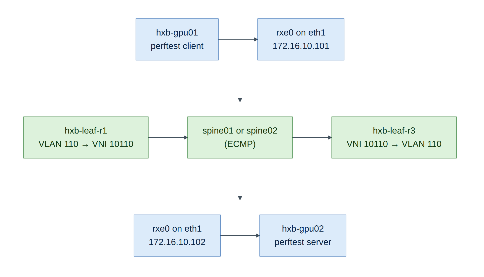
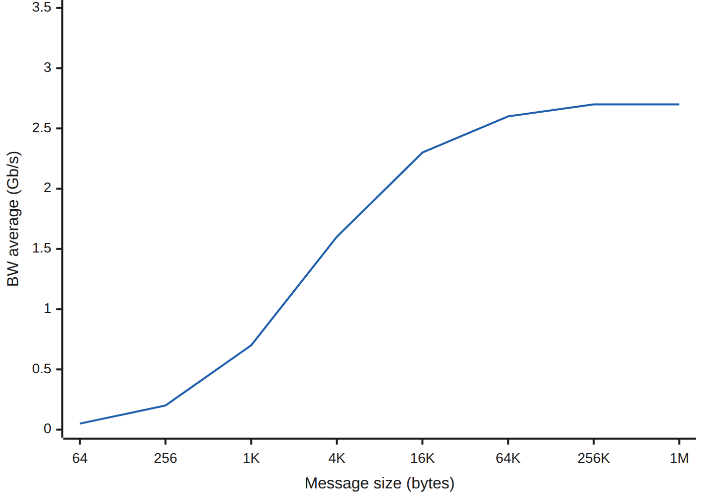
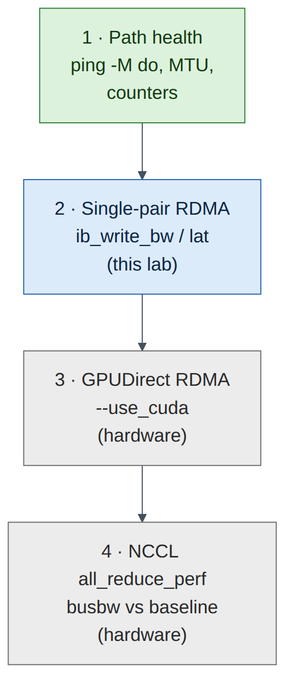

# Lab 9 — Verifying End-to-End Performance with perftest over Soft-RoCE

!!! abstract "Companion to the NCP-AIN Certification Guide"
    This free lab is part of the hands-on companion to *NCP-AIN Certification Guide* by Vakeesan Thevarajah (Cloudfoxy Ltd). The book explains the theory, design choices and hardware behaviour behind every step.

    [Get the book on Leanpub](https://leanpub.com/nvidiancp-aincertificationguide){ .md-button .md-button--primary } [Paperbacks](../book.md){ .md-button } [Free sample](../sample/NCP-AIN_Sample.pdf){ .md-button }


## Lab at a glance

| | |
|---|---|
| Book chapters | 19 (perftest and NCCL tests), 3 (RDMA fundamentals), 5 (RoCE marking) |
| Exam objectives | 5.3 Verify low-latency network performance · 5.5 ib_write_bw / ib_write_lat |
| Time | 60 minutes |
| Air resources | hxb-gpu01, hxb-gpu02 and the Ethernet fabric |
| Prerequisites | Lab 3 (Soft-RoCE tools installed on gpu01), Lab 5 (AURORA working across leaves) |

## Objectives

- Apply Chapter 19's **bottom-up test ladder** to a real (software) RDMA path across the EVPN fabric.
- Run the perftest suite: `ib_write_bw`, `ib_write_lat`, `ib_read_lat`, `ib_send_bw`, with RDMA-CM and with explicit GID indexes.
- Read latency output (`t_min`, `t_typical`, `t_avg`, 99% and 99.9% percentiles) and bandwidth sweeps.
- See how MTU changes the RoCE path MTU and the results.
- Diagnose the two classic setup mistakes: wrong GID index and MTU mismatch.

## Background

On real hardware, Chapter 19's ladder goes: link health → single-pair RDMA with perftest → GPUDirect RDMA → multi-node NCCL. In Air you can climb the first two rungs with **Soft-RoCE** (`rdma_rxe`), the Linux kernel's software implementation of RoCEv2. It speaks exactly the same verbs and wire protocol as a ConnectX NIC, so every perftest option, the GID table and RDMA-CM behave as on hardware. What it can't match is speed: the NIC's work is done by a virtual CPU, so expect well under 10 Gb/s and tens of microseconds of latency. **In this lab the method matters, not the numbers.** Never compare these results with the hardware figures in Chapter 19.


<figure markdown>

{ loading=lazy }

<figcaption><strong>Figure 9.1: The RDMA path in this lab.</strong> gpu01's rxe0 sends RoCEv2 (UDP 4791) on eth1 into leaf-r1. The frame is bridged into VNI 10110, VXLAN-encapsulated across a spine and decapsulated on leaf-r3, which delivers it to gpu02 eth1.</figcaption>

</figure>


## Step-by-step

### Task 1 — Rung 1: prove the path before testing RDMA

Chapter 19's first rule: never run perftest on a path you haven't checked.

1. Addresses and MTU on both hosts (Lab 5 set MTU 9000):

    ```
    ubuntu@hxb-gpu01:~$ ip -br addr show eth1 ; ip link show eth1 | grep -o 'mtu [0-9]*'
    eth1             UP             172.16.10.101/24
    mtu 9000
    ```

2. Reachability with the largest frame that fits, with fragmentation forbidden:

    ```
    ubuntu@hxb-gpu01:~$ ping -c 3 -M do -s 8972 172.16.10.102
    3 packets transmitted, 3 received, 0% packet loss
    ```

    `8972 = 9000 − 20 (IP) − 8 (ICMP)`. If this fails while a small ping works, stop and fix MTU first (Lab 7, Fault A).

**Checkpoint**

- [ ] Jumbo ping gpu01 → gpu02 succeeds.

### Task 2 — Soft-RoCE on both hosts

gpu01 has the tools from Lab 3; gpu02 doesn't yet. On **hxb-gpu02**:

```
ubuntu@hxb-gpu02:~$ sudo apt-get update && sudo apt-get install -y rdma-core ibverbs-utils ibverbs-providers perftest
ubuntu@hxb-gpu02:~$ sudo modprobe rdma_rxe
ubuntu@hxb-gpu02:~$ sudo rdma link add rxe0 type rxe netdev eth1
```

On **hxb-gpu01**, check that rxe0 still exists (it doesn't survive a reboot or checkpoint restore) and recreate it if not:

```
ubuntu@hxb-gpu01:~$ rdma link show || true
ubuntu@hxb-gpu01:~$ sudo modprobe rdma_rxe ; sudo rdma link add rxe0 type rxe netdev eth1 2>/dev/null ; rdma link show
link rxe0/1 state ACTIVE physical_state LINK_UP netdev eth1
```

Check the port attributes on both hosts. Note `active_mtu`: the RoCE path MTU is the largest InfiniBand MTU (256–4096) that fits in the Ethernet MTU.

```
ubuntu@hxb-gpu01:~$ ibv_devinfo -d rxe0 | grep -E 'state|max_mtu|active_mtu|link_layer'
			state:			PORT_ACTIVE (4)
			max_mtu:		4096 (5)
			active_mtu:		4096 (5)
			link_layer:		Ethernet
```

*(Illustrative.)* With Ethernet MTU 9000 the active MTU is 4096; in Lab 3 at MTU 1500 it was 1024.

Find the RoCEv2 IPv4 GID index on each host (Lab 3, Task 4, step 5). With a fresh rxe device on eth1 it is usually 1:

```
ubuntu@hxb-gpu02:~$ ibv_devinfo -v -d rxe0 | grep GID
			GID[  0]:		fe80::5054:ff:fe12:3402, RoCE v2
			GID[  1]:		::ffff:172.16.10.102, RoCE v2
```

**Checkpoint**

- [ ] `rdma link show` ACTIVE on both; active_mtu 4096; GID index recorded for both.

### Task 3 — Rung 2: bandwidth with RDMA-CM

1. Server on gpu02, client on gpu01. `-R` uses RDMA-CM to exchange connection data and pick the right GID automatically; `-T 106` sets traffic class 106 (DSCP 26 + ECT(0)) as in Lab 3.

    ```
    ubuntu@hxb-gpu02:~$ ib_write_bw -d rxe0 -R -T 106 -F --report_gbits
    ubuntu@hxb-gpu01:~$ ib_write_bw -d rxe0 -R -T 106 -F --report_gbits 172.16.10.102
    ```

    **Expected output (client, illustrative):**

    ```
     #bytes     #iterations    BW peak[Gb/sec]    BW average[Gb/sec]   MsgRate[Mpps]
     65536      5000             2.91               2.63                 0.005016
    ```

2. Sweep all message sizes (`-a`) to see where bandwidth levels off:

    ```
    ubuntu@hxb-gpu02:~$ ib_write_bw -d rxe0 -R -a -F --report_gbits
    ubuntu@hxb-gpu01:~$ ib_write_bw -d rxe0 -R -a -F --report_gbits 172.16.10.102 | tee ~/bw-sweep.txt
    ```

Plot or sketch bandwidth against message size. The shape is the lesson: small messages are limited by per-message overhead (message rate), large messages by the path (here, the CPU doing the NIC's work).


<figure markdown>

{ loading=lazy }

<figcaption><strong>Figure 9.2: Bandwidth against message size (illustrative Soft-RoCE results).</strong> Small messages are overhead-bound; bandwidth climbs and flattens once each message is large enough to amortise per-message cost. Hardware has the same shape at far higher numbers.</figcaption>

</figure>


3. Try a send/receive test for comparison. Two-sided operations need the receiver to post buffers, so results differ slightly from RDMA WRITE:

    ```
    ubuntu@hxb-gpu02:~$ ib_send_bw -d rxe0 -R -F --report_gbits
    ubuntu@hxb-gpu01:~$ ib_send_bw -d rxe0 -R -F --report_gbits 172.16.10.102
    ```

### Task 4 — Latency and tail latency

1. Write latency. It's a ping-pong test and reports **half the round trip**:

    ```
    ubuntu@hxb-gpu02:~$ ib_write_lat -d rxe0 -R -F
    ubuntu@hxb-gpu01:~$ ib_write_lat -d rxe0 -R -F 172.16.10.102
    ```

    **Expected output (illustrative):**

    ```
     #bytes #iterations    t_min[usec]    t_max[usec]  t_typical[usec]    t_avg[usec]    t_stdev[usec]   99% percentile[usec]   99.9% percentile[usec]
     2       1000          38.12          412.55       51.40              55.83          14.20            118.61                 390.07
    ```

Read it the Chapter 19 way:

- **t_typical** (the median) is the number to quote. **t_min** is a best case you'll rarely see.
- The **99% and 99.9% percentiles** are the tail. Collective operations wait for the slowest message, so the tail matters more than the average in AI clusters.
- A large gap between typical and 99.9% means jitter. Here it comes from virtual CPUs being scheduled; on hardware it points to congestion, PFC pauses or a noisy neighbour.

2. Read latency reports the full request-response time, so expect roughly double:

    ```
    ubuntu@hxb-gpu02:~$ ib_read_lat -d rxe0 -R -F
    ubuntu@hxb-gpu01:~$ ib_read_lat -d rxe0 -R -F 172.16.10.102
    ```

3. Run the write latency test three times and record t_typical and 99.9% each time. Variance between runs is itself a finding.

    | Run | t_typical (µs) | 99.9% (µs) |
    |---|---|---|
    | 1 | | |
    | 2 | | |
    | 3 | | |

### Task 5 — Explicit GID index, and why it matters

Without RDMA-CM, perftest exchanges connection data over a TCP socket and uses the GID index you give with `-x`. Use the index you recorded in Task 2.

```
ubuntu@hxb-gpu02:~$ ib_write_bw -d rxe0 -x 1 --tclass=106 -F --report_gbits
ubuntu@hxb-gpu01:~$ ib_write_bw -d rxe0 -x 1 --tclass=106 -F --report_gbits 172.16.10.102
```

It should give the same result as Task 3. On ConnectX NICs the IPv4 RoCEv2 GID is often index 3, and NCCL uses `NCCL_IB_GID_INDEX` (Chapter 19) or picks it automatically in recent releases.

### Task 6 — MTU experiment

1. Lower the Ethernet MTU on **both** hosts to 1500 and re-read `active_mtu`:

    ```
    ubuntu@hxb-gpu01:~$ sudo ip link set eth1 mtu 1500 ; ibv_devinfo -d rxe0 | grep active_mtu
    			active_mtu:		1024 (3)
    ```

2. Re-run the 64 KB `ib_write_bw` test and compare with Task 3. More, smaller packets per message means more per-packet work; on Soft-RoCE that usually lowers bandwidth.
3. Restore MTU 9000 on both hosts: `sudo netplan apply` (Lab 5's netplan file sets 9000).


<figure markdown>

{ loading=lazy }

<figcaption><strong>Figure 9.3: Chapter 19's test ladder, and how far Air takes you.</strong> Rungs 1–2 run in this lab. Rungs 3–4 need GPUs and ConnectX NICs; the method is the same.</figcaption>

</figure>


## Verify

- [ ] Jumbo ping works gpu01 → gpu02.
- [ ] `ib_write_bw` runs with `-R` and with `-x <index>`; a bandwidth sweep is saved in `~/bw-sweep.txt`.
- [ ] Latency recorded three times with t_typical and 99.9%.
- [ ] MTU experiment done and MTU restored to 9000.

## Break and fix

**Fault 1 — wrong GID index**

- *Inject:* run the client with `-x 0` (the link-local IPv6 GID) while the server uses `-x 1`.
- *Symptom:* the test hangs or fails with errors such as `Unable to Connect the HCA's through the link` or a completion error with a retry-exceeded status.
- *Diagnosis:* `ibv_devinfo -v -d rxe0 | grep GID` on both hosts; the two sides must use GIDs they can route to each other (both the IPv4 RoCEv2 GID here).
- *Fix:* use `-x 1` on both sides, or `-R` so RDMA-CM chooses.

**Fault 2 — MTU mismatch**

- *Inject:* set MTU 1500 on gpu02 eth1 only.
- *Symptom:* small messages work; large `ib_write_bw` stalls or reports retries; jumbo ping from gpu01 fails.
- *Diagnosis:* Task 1's jumbo ping, and `active_mtu` differs between hosts.
- *Fix:* `sudo netplan apply` on gpu02 to restore 9000.

## Clean-up / save state

Soft-RoCE devices aren't persistent. That's fine: Labs 10 and 13 recreate them if needed. Save switch configuration and store a checkpoint.

## Exam tie-in

- 5.3: the bottom-up ladder; always prove path and MTU before blaming RDMA.
- 5.5: `ib_write_bw` / `ib_write_lat` server and client roles, `-d`, `-x`, `-R`, `-a`, `-F`, `--report_gbits`, `-T`/`--tclass`.
- Reading latency: typical versus tail percentiles; write latency is half round trip.
- GID index selection for RoCEv2 and why RDMA-CM avoids the problem.

## Review questions

1. Why do you run `ping -M do -s 8972` before perftest?
2. What is the difference between `-R` and `-x 1`?
3. Which latency figure should you quote, and which should you watch for AI workloads?
4. Why is active_mtu 4096 with an Ethernet MTU of 9000, not 9000?
5. Why can't you compare this lab's results with Chapter 19's numbers?

### Answers

1. To prove the path carries full-size frames without fragmentation. Otherwise an MTU problem looks like an RDMA problem.
2. `-R` uses RDMA-CM, which resolves addresses and chooses the GID automatically. `-x 1` exchanges connection data over a TCP socket and uses the GID at index 1 that you chose.
3. Quote `t_typical` (median); watch the 99% and 99.9% percentiles, because collectives wait for the slowest message.
4. RoCE uses InfiniBand path MTUs (256, 512, 1024, 2048, 4096). 4096 is the largest, and it fits inside a 9000-byte Ethernet frame with the RoCEv2 headers.
5. Soft-RoCE runs the NIC's work on a virtual CPU. Bandwidth and latency reflect CPU scheduling, not a ConnectX adapter or the fabric.

---

!!! abstract "Go deeper"
    The matching book chapters cover the exam objectives for this lab in full, with a Q&A pack of about 40 exam-style questions per chapter.

    [Get the book on Leanpub](https://leanpub.com/nvidiancp-aincertificationguide){ .md-button .md-button--primary } [Report a problem with this lab](https://github.com/Cloudfoxy-Ltd/ncp-ain-guide/issues/new?template=erratum.yml){ .md-button }
