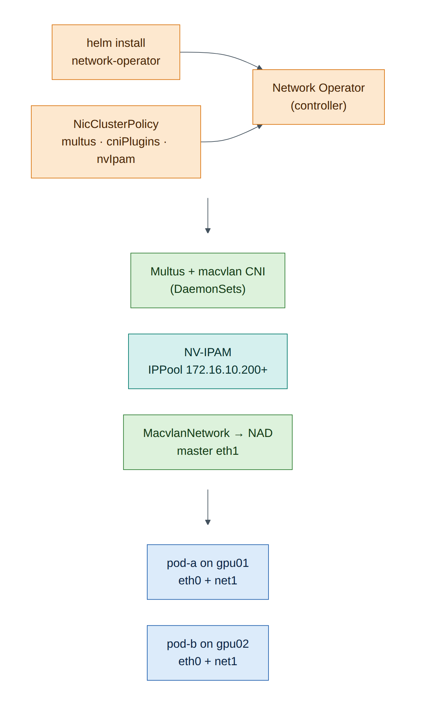
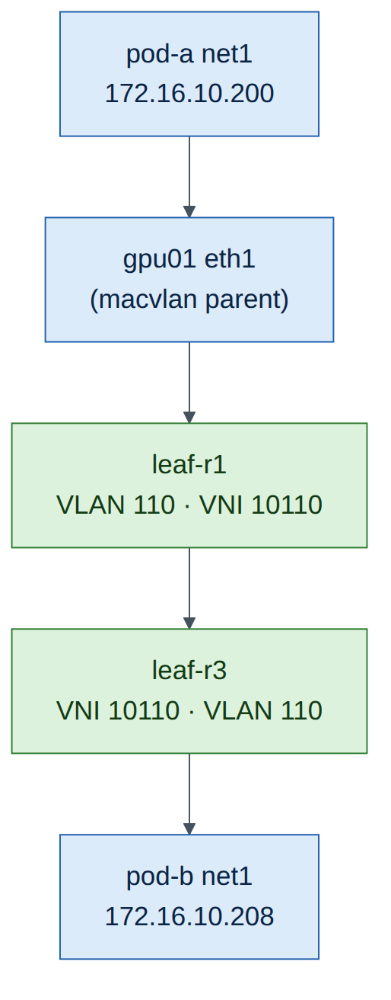

# Lab 10 — Kubernetes and the NVIDIA Network Operator

!!! abstract "Companion to the NCP-AIN Certification Guide"
    This free lab is part of the hands-on companion to *NCP-AIN Certification Guide* by Vakeesan Thevarajah (Cloudfoxy Ltd). The book explains the theory, design choices and hardware behaviour behind every step. [Get the book](../book.md){ .md-button .md-button--primary } [Free sample](../sample/NCP-AIN_Sample.pdf){ .md-button }


## Lab at a glance

| | |
|---|---|
| Book chapters | 16 (NVIDIA Network Operator: deploy and verify) |
| Exam objectives | 4.1 Deploy the Network Operator · 4.2 Verify Network Operator functionality |
| Time | 90 minutes |
| Air resources | hxb-gpu01 (control plane + worker), hxb-gpu02 (worker), EVPN fabric from Lab 5 |
| Prerequisites | Lab 5 (AURORA VLAN 110 working between gpu01 and gpu02) |

## Objectives

- Build a two-node Kubernetes cluster with kubeadm on hxb-gpu01 and hxb-gpu02.
- Install the NVIDIA Network Operator with Helm in namespace `nvidia-network-operator`.
- Apply a **NicClusterPolicy** that deploys the secondary-network stack (Multus, CNI plugins, NV-IPAM).
- Create an NV-IPAM **IPPool** and a **MacvlanNetwork** on eth1 (AURORA 172.16.10.0/24).
- Attach pods to the high-speed network with the networks annotation and ping pod-to-pod across the EVPN fabric.
- Verify the operator the way objective 4.2 expects.

## Background

On Helix, training pods need a second interface on the RDMA fabric in addition to the default cluster network. The Network Operator (Chapter 16) deploys everything needed from one custom resource, the NicClusterPolicy: the DOCA driver container, RDMA device plugins, Multus, CNI plugins and NV-IPAM. Network CRs such as MacvlanNetwork, HostDeviceNetwork and IPoIBNetwork then generate NetworkAttachmentDefinitions that pods request by annotation.

Air's servers have virtio NICs, not ConnectX, so this lab deploys only the parts that don't need NVIDIA hardware: **Multus, CNI plugins and NV-IPAM**. The driver container and RDMA device plugins are explained but left out. Everything else (the operator, the CRDs, the reconcile loop, the NADs and the pod attachments) is real.


<figure markdown>

{ loading=lazy }

<figcaption><strong>Figure 10.1: What this lab deploys.</strong> The operator reconciles the NicClusterPolicy into Multus, CNI plugins and NV-IPAM on both nodes. The MacvlanNetwork becomes a NetworkAttachmentDefinition; pods that name it in their annotation get net1 on eth1, with an address from the IPPool.</figcaption>

</figure>


!!! note "Version note"
    Kubernetes, the Network Operator and container images move quickly. This lab was written against the Kubernetes 1.34 package repository and Network Operator 26.7 (image tag `network-operator-v26.7.0`, as in NVIDIA's quick-start guides at the time of writing). Use the versions that `helm search repo` and the Network Operator release notes show for your date.


## Step-by-step

### Task 1 — Prepare both nodes (gpu01 and gpu02)

Run every step in this task on **both** servers. The cluster uses the OOB network (eth0) for Kubernetes traffic, and eth1 stays free for the secondary network.

1. Record each node's eth0 address; you'll need gpu01's.

    ```
    ubuntu@hxb-gpu01:~$ ip -4 -br addr show eth0
    eth0             UP             192.168.200.21/24
    ```

    *(Illustrative: the OOB network uses 192.168.200.0/24.)*

2. Kernel settings for Kubernetes networking, and swap off:

    ```
    ubuntu@hxb-gpu01:~$ sudo swapoff -a ; sudo sed -i '/ swap / s/^/#/' /etc/fstab
    ubuntu@hxb-gpu01:~$ printf 'overlay\nbr_netfilter\n' | sudo tee /etc/modules-load.d/k8s.conf
    ubuntu@hxb-gpu01:~$ sudo modprobe overlay ; sudo modprobe br_netfilter
    ubuntu@hxb-gpu01:~$ printf 'net.bridge.bridge-nf-call-iptables=1\nnet.bridge.bridge-nf-call-ip6tables=1\nnet.ipv4.ip_forward=1\n' | sudo tee /etc/sysctl.d/k8s.conf
    ubuntu@hxb-gpu01:~$ sudo sysctl --system >/dev/null
    ```

3. Install containerd and use the systemd cgroup driver:

    ```
    ubuntu@hxb-gpu01:~$ sudo apt-get update && sudo apt-get install -y containerd apt-transport-https ca-certificates curl gpg
    ubuntu@hxb-gpu01:~$ sudo mkdir -p /etc/containerd
    ubuntu@hxb-gpu01:~$ containerd config default | sudo tee /etc/containerd/config.toml >/dev/null
    ubuntu@hxb-gpu01:~$ sudo sed -i 's/SystemdCgroup = false/SystemdCgroup = true/' /etc/containerd/config.toml
    ubuntu@hxb-gpu01:~$ sudo systemctl restart containerd
    ```

4. Install kubeadm, kubelet and kubectl from the Kubernetes package repository:

    ```
    ubuntu@hxb-gpu01:~$ KVER=v1.34
    ubuntu@hxb-gpu01:~$ curl -fsSL https://pkgs.k8s.io/core:/stable:/$KVER/deb/Release.key | sudo gpg --dearmor -o /etc/apt/keyrings/kubernetes-apt-keyring.gpg
    ubuntu@hxb-gpu01:~$ echo "deb [signed-by=/etc/apt/keyrings/kubernetes-apt-keyring.gpg] https://pkgs.k8s.io/core:/stable:/$KVER/deb/ /" | sudo tee /etc/apt/sources.list.d/kubernetes.list
    ubuntu@hxb-gpu01:~$ sudo apt-get update && sudo apt-get install -y kubelet kubeadm kubectl
    ubuntu@hxb-gpu01:~$ sudo apt-mark hold kubelet kubeadm kubectl
    ```

**Checkpoint**

- [ ] `kubeadm version` works on both nodes; containerd is active.

### Task 2 — Create the cluster

1. On **gpu01**, initialise the control plane on the OOB address, with the pod CIDR that Flannel expects:

    ```
    ubuntu@hxb-gpu01:~$ sudo kubeadm init --apiserver-advertise-address=192.168.200.21 --pod-network-cidr=10.244.0.0/16
    ...
    Your Kubernetes control-plane has initialized successfully!
    ...
    kubeadm join 192.168.200.21:6443 --token abcdef.0123456789abcdef \
    	--discovery-token-ca-cert-hash sha256:1f2e...
    ```

    *(Illustrative: copy your own join command.)*

2. Set up kubectl for the `ubuntu` user and let pods run on the control-plane node (a two-node lab needs both):

    ```
    ubuntu@hxb-gpu01:~$ mkdir -p ~/.kube && sudo cp /etc/kubernetes/admin.conf ~/.kube/config && sudo chown $(id -u):$(id -g) ~/.kube/config
    ubuntu@hxb-gpu01:~$ kubectl taint nodes --all node-role.kubernetes.io/control-plane-
    ```

3. Install the Flannel pod network (the primary CNI, `eth0` in pods):

    ```
    ubuntu@hxb-gpu01:~$ kubectl apply -f https://github.com/flannel-io/flannel/releases/latest/download/kube-flannel.yml
    ```

4. On **gpu02**, run the join command from step 1 with `sudo`.
5. Back on gpu01:

    ```
    ubuntu@hxb-gpu01:~$ kubectl get nodes -o wide
    NAME        STATUS   ROLES           AGE   VERSION   INTERNAL-IP
    hxb-gpu01   Ready    control-plane   6m    v1.34.x   192.168.200.21
    hxb-gpu02   Ready    <none>          1m    v1.34.x   192.168.200.22
    ```

    *(Illustrative.)*

**Checkpoint**

- [ ] Both nodes `Ready`; `kubectl get pods -A` shows Flannel and CoreDNS running.

### Task 3 — Install Helm and the Network Operator

```
ubuntu@hxb-gpu01:~$ curl -fsSL https://raw.githubusercontent.com/helm/helm/main/scripts/get-helm-3 | bash
ubuntu@hxb-gpu01:~$ helm repo add nvidia https://helm.ngc.nvidia.com/nvidia
ubuntu@hxb-gpu01:~$ helm repo update
ubuntu@hxb-gpu01:~$ helm search repo nvidia/network-operator --versions | head -4
NAME                     	CHART VERSION	APP VERSION	DESCRIPTION
nvidia/network-operator  	26.7.0       	v26.7.0    	Nvidia network operator
...
```

*(Illustrative.)* Install the version shown at the top:

```
ubuntu@hxb-gpu01:~$ helm install network-operator nvidia/network-operator \
    -n nvidia-network-operator --create-namespace --version 26.7.0 --wait
ubuntu@hxb-gpu01:~$ kubectl -n nvidia-network-operator get pods
NAME                                                          READY   STATUS    RESTARTS
network-operator-6d8c7b9f9-4kq2x                              1/1     Running   0
network-operator-node-feature-discovery-master-...            1/1     Running   0
network-operator-node-feature-discovery-worker-...            1/1     Running   0
```

*(Illustrative.)* At this point only the controller (and Node Feature Discovery, if the chart enables it) runs. Nothing is deployed to the nodes until you create a NicClusterPolicy.

```
ubuntu@hxb-gpu01:~$ kubectl api-resources | grep -iE 'mellanox|nv-ipam'
```

You should see the CRDs from Chapter 16: `nicclusterpolicies`, `macvlannetworks`, `hostdevicenetworks`, `ipoibnetworks`, and NV-IPAM's `ippools` and `cidrpools`.

### Task 4 — Apply a NicClusterPolicy for the secondary network

```
ubuntu@hxb-gpu01:~$ mkdir -p ~/netop && cat > ~/netop/nicclusterpolicy.yaml <<'EOF'
apiVersion: mellanox.com/v1alpha1
kind: NicClusterPolicy
metadata:
  name: nic-cluster-policy
spec:
  # No ofedDriver / rdmaSharedDevicePlugin: Air servers have no NVIDIA NICs.
  secondaryNetwork:
    multus:
      image: multus-cni
      repository: nvcr.io/nvidia/mellanox
      version: network-operator-v26.7.0
    cniPlugins:
      image: plugins
      repository: nvcr.io/nvidia/mellanox
      version: network-operator-v26.7.0
  nvIpam:
    image: nvidia-k8s-ipam
    repository: nvcr.io/nvidia/mellanox
    version: network-operator-v26.7.0
    enableWebhook: false
EOF
ubuntu@hxb-gpu01:~$ kubectl apply -f ~/netop/nicclusterpolicy.yaml
ubuntu@hxb-gpu01:~$ kubectl -n nvidia-network-operator get pods -w
```

Wait until the Multus, CNI-plugins and NV-IPAM pods are `Running` on both nodes (Ctrl+C to stop watching), then check the policy status:

```
ubuntu@hxb-gpu01:~$ kubectl get nicclusterpolicy nic-cluster-policy -o jsonpath='{.status.state}{"\n"}'
ready
```


!!! tip "Exam focus"
    "NicClusterPolicy **ready**" is the first thing objective 4.2 asks you to verify. If it stays `notReady`, `kubectl describe nicclusterpolicy nic-cluster-policy` lists which component is failing, and the operator logs say why.


**Checkpoint**

- [ ] NicClusterPolicy state is `ready`; component pods Running on both nodes.
- [ ] `ls /etc/cni/net.d/` on each node shows a Multus configuration file.

### Task 5 — IPPool and MacvlanNetwork on eth1

1. Create an NV-IPAM pool inside AURORA's 172.16.10.0/24. Keep it clear of host addresses (.101, .102) and the gateway (.1): hand out .200 onwards.

    ```
    ubuntu@hxb-gpu01:~$ cat > ~/netop/ippool.yaml <<'EOF'
    apiVersion: nv-ipam.nvidia.com/v1alpha1
    kind: IPPool
    metadata:
      name: aurora-pool
      namespace: nvidia-network-operator
    spec:
      subnet: 172.16.10.0/24
      perNodeBlockSize: 8
      gateway: 172.16.10.1
      exclusions:
        - startIP: 172.16.10.1
          endIP: 172.16.10.199
    EOF
    ubuntu@hxb-gpu01:~$ kubectl apply -f ~/netop/ippool.yaml
    ubuntu@hxb-gpu01:~$ kubectl -n nvidia-network-operator get ippool aurora-pool -o yaml | grep -A8 'status:'
    ```

The status shows the per-node blocks NV-IPAM allocated, one block of 8 addresses per node.


!!! note "Version note"
    If your NV-IPAM release rejects `exclusions`, remove that block and use a smaller dedicated range by choosing a narrower `subnet` (for example `172.16.10.192/27`) with the same gateway.


2. Create the MacvlanNetwork. The operator turns it into a NetworkAttachmentDefinition in the `default` namespace.

    ```
    ubuntu@hxb-gpu01:~$ cat > ~/netop/macvlan.yaml <<'EOF'
    apiVersion: mellanox.com/v1alpha1
    kind: MacvlanNetwork
    metadata:
      name: aurora-net
    spec:
      networkNamespace: "default"
      master: "eth1"
      mode: "bridge"
      mtu: 9000
      ipam: |
        {
          "type": "nv-ipam",
          "poolName": "aurora-pool"
        }
    EOF
    ubuntu@hxb-gpu01:~$ kubectl apply -f ~/netop/macvlan.yaml
    ubuntu@hxb-gpu01:~$ kubectl get macvlannetwork aurora-net -o jsonpath='{.status.state}{"\n"}'
    ready
    ubuntu@hxb-gpu01:~$ kubectl get network-attachment-definitions
    NAME         AGE
    aurora-net   10s
    ```

### Task 6 — Pods on the high-speed network

1. Two test pods, pinned one per node:

    ```
    ubuntu@hxb-gpu01:~$ cat > ~/netop/pods.yaml <<'EOF'
    apiVersion: v1
    kind: Pod
    metadata:
      name: pod-a
      annotations:
        k8s.v1.cni.cncf.io/networks: aurora-net
    spec:
      nodeName: hxb-gpu01
      containers:
      - name: net
        image: nicolaka/netshoot
        command: ["sleep", "infinity"]
    ---
    apiVersion: v1
    kind: Pod
    metadata:
      name: pod-b
      annotations:
        k8s.v1.cni.cncf.io/networks: aurora-net
    spec:
      nodeName: hxb-gpu02
      containers:
      - name: net
        image: nicolaka/netshoot
        command: ["sleep", "infinity"]
    EOF
    ubuntu@hxb-gpu01:~$ kubectl apply -f ~/netop/pods.yaml
    ubuntu@hxb-gpu01:~$ kubectl get pods -o wide
    ```

2. Check that each pod has two interfaces:

    ```
    ubuntu@hxb-gpu01:~$ kubectl exec pod-a -- ip -br addr
    lo               UNKNOWN        127.0.0.1/8
    eth0@if12        UP             10.244.0.12/24
    net1@if3         UP             172.16.10.200/24
    ubuntu@hxb-gpu01:~$ kubectl exec pod-b -- ip -br addr | grep net1
    net1@if3         UP             172.16.10.208/24
    ```

    *(Illustrative addresses.)* `eth0` is the Flannel cluster network; `net1` is the macvlan interface on the node's eth1, in AURORA.

3. Ping pod-to-pod across the EVPN fabric, and from a pod to a host and to the gateway:

    ```
    ubuntu@hxb-gpu01:~$ kubectl exec pod-a -- ping -c 3 -I net1 172.16.10.208
    ubuntu@hxb-gpu01:~$ kubectl exec pod-a -- ping -c 3 -I net1 172.16.10.102
    ubuntu@hxb-gpu01:~$ kubectl exec pod-a -- ping -c 3 -I net1 172.16.10.1
    ```

pod-a's frames leave gpu01 eth1 into leaf-r1, cross the fabric in VNI 10110 and reach pod-b on gpu02 behind leaf-r3. Confirm on leaf-r1 that EVPN learned the pods' MAC addresses:

```
cumulus@hxb-leaf-r1:mgmt:~$ sudo vtysh -c 'show evpn mac vni 10110'
```


<figure markdown>

{ loading=lazy }

<figcaption><strong>Figure 10.2: Pod-to-pod across the fabric.</strong> Each pod's net1 is a macvlan child of the node's eth1, so to the fabric a pod looks like another host in VLAN 110. EVPN advertises its MAC and IP like any server.</figcaption>

</figure>


**Checkpoint**

- [ ] Both pods Running with net1 in 172.16.10.0/24 from the IPPool.
- [ ] pod-a ↔ pod-b ping works over net1; EVPN on leaf-r1 shows the pods' MACs.

### Task 7 — What RDMA hardware would add

On Helix-B's real nodes you'd add these to the same NicClusterPolicy (Chapter 16), and each needs NVIDIA NICs:

| Component | What it adds | Why it isn't in this lab |
|---|---|---|
| `ofedDriver` (DOCA driver container) | Installs the DOCA-OFED drivers on each node | Needs ConnectX/BlueField hardware |
| `rdmaSharedDevicePlugin` | Advertises `rdma/rdma_shared_device_a` in node Allocatable; pods request it with `IPC_LOCK` | Selects RDMA devices of physical NICs |
| SR-IOV device plugin / network operator | One VF per pod per rail (`nvidia.com/rail0` …) — the Spectrum-X quick start pattern | Needs SR-IOV capable NICs |
| NIC Configuration Operator | Applies the Spectrum-X NIC profile (`spectrumXOptimized`) | Firmware settings on SuperNICs |
| `ib-kubernetes` | Adds pod GUIDs to UFM PKeys on InfiniBand | Needs UFM and an IB fabric |

With those in place, the verification ladder from Chapter 16 continues: Allocatable shows the RDMA resource, the pod sees `/dev/infiniband`, `ibv_devinfo` works in the pod, and `ib_write_bw` runs pod-to-pod.

## Verify

- [ ] Operator pods Running; NicClusterPolicy `ready`.
- [ ] IPPool allocated per-node blocks; MacvlanNetwork `ready`; NAD `aurora-net` exists.
- [ ] Pods got net1 addresses from the pool and reach each other across leaves.

## Break and fix

**Fault 1 — wrong master interface**

- *Inject:* change `master: "eth1"` to `master: "ens1f0"` in `macvlan.yaml`, apply, and recreate pod-b (`kubectl delete pod pod-b && kubectl apply -f ~/netop/pods.yaml`).
- *Symptom:* pod-b stuck in `ContainerCreating`.
- *Diagnosis:* `kubectl describe pod pod-b` shows a Multus/CNI error such as `failed to lookup master "ens1f0": Link not found`.
- *Fix:* set `master: "eth1"`, re-apply, recreate the pod.

**Fault 2 — pool exhausted**

- *Inject:* set `perNodeBlockSize: 1` in the IPPool (on a new pool name, say `tiny-pool`, referenced by a new MacvlanNetwork) and start two pods on the same node.
- *Symptom:* the second pod stays in `ContainerCreating` with an IPAM allocation error.
- *Diagnosis:* `kubectl get ippool tiny-pool -o yaml` shows a one-address block per node.
- *Fix:* size `perNodeBlockSize` for the pods per node you expect.

## Clean-up / save state

```
ubuntu@hxb-gpu01:~$ kubectl delete -f ~/netop/pods.yaml
```

Leave the cluster in place if you plan to revisit it; it survives checkpoints. If memory is tight for later labs, `sudo systemctl stop kubelet containerd` on both nodes frees it.

## Exam tie-in

- 4.1: Helm install into `nvidia-network-operator`; NicClusterPolicy decides what gets deployed; network CRs (Macvlan, HostDevice, IPoIB, SR-IOV) create NADs.
- 4.2: verify operator pods, NicClusterPolicy `ready`, node resources, NADs, pod interfaces, and finally an RDMA test between pods.
- Know which components need NVIDIA hardware (driver container, RDMA device plugin, SR-IOV, NIC configuration) and which don't (Multus, CNI plugins, NV-IPAM).

## Review questions

1. What does the Network Operator deploy before you create a NicClusterPolicy?
2. How does a pod ask for the secondary network?
3. Which resource would a real RoCE pod request in addition, and which capability does it need?
4. `kubectl get nicclusterpolicy` shows `notReady`. What are your next two commands?
5. Why does pod-b's net1 appear to the fabric as another host in VLAN 110?

### Answers

1. Only the operator controller (plus Node Feature Discovery if enabled in the chart). Components are deployed when a NicClusterPolicy exists.
2. With the annotation `k8s.v1.cni.cncf.io/networks: <network-name>`, which Multus resolves to the NetworkAttachmentDefinition created by the network CR.
3. An RDMA resource such as `rdma/rdma_shared_device_a` (or an SR-IOV VF resource), and the `IPC_LOCK` capability so it can pin memory.
4. `kubectl describe nicclusterpolicy nic-cluster-policy` (which component is failing) and `kubectl -n nvidia-network-operator logs deploy/network-operator` (why).
5. net1 is a macvlan child of gpu02's eth1 with its own MAC address, bridged onto eth1, which is an access port in VLAN 110. EVPN learns and advertises its MAC and IP like any server.

---

!!! abstract "Go deeper"
    The matching book chapters cover the exam objectives for this lab in full, with a Q&A pack of about 40 exam-style questions per chapter. [Get the book](../book.md){ .md-button .md-button--primary } [Report a problem with this lab](https://github.com/Cloudfoxy-Ltd/ncp-ain-guide/issues/new?template=erratum.yml){ .md-button }
