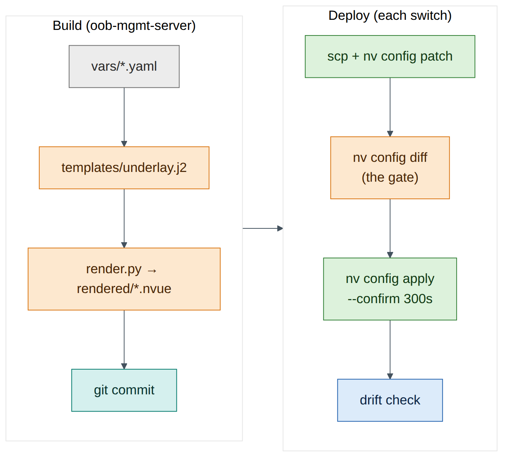
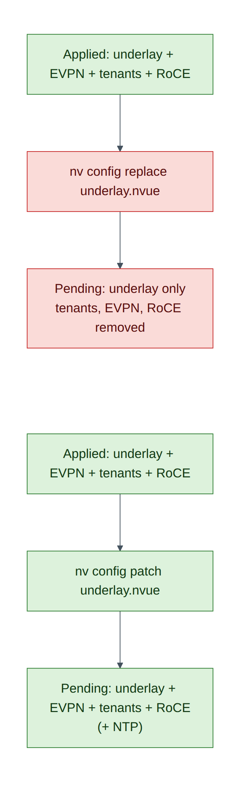

# Lab 11 — NVUE Templates and Configuration Management

!!! abstract "Companion to the NCP-AIN Certification Guide"
    This free lab is part of the hands-on companion to *NCP-AIN Certification Guide* by Vakeesan Thevarajah (Cloudfoxy Ltd). The book explains the theory, design choices and hardware behaviour behind every step.

    [Get the book on Leanpub](https://leanpub.com/nvidiancp-aincertificationguide){ .md-button .md-button--primary } [Paperbacks](../book.md){ .md-button } [Free sample](../sample/NCP-AIN_Sample.pdf){ .md-button }


## Lab at a glance

| | |
|---|---|
| Book chapters | 21 (NVUE templates and configuration management), 4 (NVUE revisions) |
| Exam objectives | 6.1 Configure Spectrum-X using NVUE templates |
| Time | 60 minutes |
| Air resources | oob-mgmt-server and the six switches |
| Prerequisites | Labs 1, 2 and 5 |

## Objectives

- Keep per-switch **variables** in YAML and one **Jinja2 template** in git on the oob-mgmt-server.
- Render NVUE command files for all six switches and use them as the **golden configuration** for the underlay.
- Load them with `nv config patch`, gate with `nv config diff`, and apply with `--confirm`.
- See exactly why `nv config replace` with a partial file is dangerous, and recover safely.
- Push a change through the **NVUE REST API** (revision → PATCH → apply) from the oob-mgmt-server.
- Detect **drift** between a switch and its golden file.

## Background

In Labs 1, 2 and 5 you typed configuration switch by switch. That's how drift starts (Chapter 21): six switches, six chances to miss a line. The fix is to describe each switch with a handful of variables, render its configuration from one template, keep both in git, and load the result with NVUE's file commands or REST API.

NVUE's file commands accept either YAML or a **plain text file of `nv set` / `nv unset` lines**. This lab renders the text form: it's easy to read and review, and it uses exactly the commands you already typed in Labs 1 and 2. Chapter 21 shows the YAML form, which you'd use for complete configurations.


<figure markdown>

{ loading=lazy }

<figcaption><strong>Figure 11.1: The lab's configuration pipeline.</strong> Variables and one template render a command file per switch. The file goes into git, is copied to the switch, loaded with patch, checked with diff, then applied with a confirm timer. A drift check compares the switch with the golden file afterwards.</figcaption>

</figure>


## Step-by-step

### Task 1 — Set up the project on the oob-mgmt-server

```
ubuntu@oob-mgmt-server:~$ sudo apt-get update && sudo apt-get install -y python3-jinja2 python3-yaml git
ubuntu@oob-mgmt-server:~$ mkdir -p ~/helix-nvue/{vars,templates,rendered} && cd ~/helix-nvue
ubuntu@oob-mgmt-server:~/helix-nvue$ git init -q && git config user.name "Helix NetOps" && git config user.email netops@example.com
```

### Task 2 — Variables

One file per switch. The values are the lab plan from Lab 0 and Lab 2.

```
ubuntu@oob-mgmt-server:~/helix-nvue$ cat > vars/hxb-leaf-r1.yaml <<'EOF'
hostname: hxb-leaf-r1
role: leaf
asn: 65101
loopback: 10.255.0.11
uplinks:
  swp31: to-hxb-spine01-swp1
  swp32: to-hxb-spine02-swp1
EOF
```

Create the other five with a small loop rather than by hand, which is the point of the exercise:

```
ubuntu@oob-mgmt-server:~/helix-nvue$ for n in 2 3 4; do
>   cat > vars/hxb-leaf-r$n.yaml <<EOF
> hostname: hxb-leaf-r$n
> role: leaf
> asn: 6510$n
> loopback: 10.255.0.1$n
> uplinks:
>   swp31: to-hxb-spine01-swp$n
>   swp32: to-hxb-spine02-swp$n
> EOF
> done
ubuntu@oob-mgmt-server:~/helix-nvue$ for s in 1 2; do
>   cat > vars/hxb-spine0$s.yaml <<EOF
> hostname: hxb-spine0$s
> role: spine
> asn: 65100
> loopback: 10.255.0.$s
> uplinks:
>   swp1: to-hxb-leaf-r1-swp3$s
>   swp2: to-hxb-leaf-r2-swp3$s
>   swp3: to-hxb-leaf-r3-swp3$s
>   swp4: to-hxb-leaf-r4-swp3$s
> EOF
> done
ubuntu@oob-mgmt-server:~/helix-nvue$ ls vars
hxb-leaf-r1.yaml  hxb-leaf-r2.yaml  hxb-leaf-r3.yaml  hxb-leaf-r4.yaml  hxb-spine01.yaml  hxb-spine02.yaml
```


!!! question "Check your understanding"
    In the spine loop, why does the description end in `swp3$s`? *(Answer: spine01 connects to each leaf's swp31 and spine02 to swp32, so the suffix is 31 or 32.)*


### Task 3 — The template and the renderer

1. One template for every switch. It produces the same `nv set` lines as Labs 1 and 2, plus two NTP servers that are new:

    ```
    ubuntu@oob-mgmt-server:~/helix-nvue$ cat > templates/underlay.j2 <<'EOF'
    # {{ hostname }} - rendered from templates/underlay.j2 - do not edit by hand
    nv set system hostname {{ hostname }}
    nv set interface lo ip address {{ loopback }}/32
    
    nv set interface {{ port }} description {{ desc }}
    nv set interface {{ port }} link mtu 9216
    nv set interface {{ port }} link state up
    nv set vrf default router bgp neighbor {{ port }} remote-as external
    
    nv set router bgp autonomous-system {{ asn }}
    nv set router bgp router-id {{ loopback }}
    nv set vrf default router bgp address-family ipv4-unicast network {{ loopback }}/32
    nv set service ntp mgmt server 0.pool.ntp.org
    nv set service ntp mgmt server 1.pool.ntp.org
    EOF
    ```

2. The renderer fails loudly on a missing variable (`StrictUndefined`), so a typo in a vars file can't produce a half-empty configuration:

    ```
    ubuntu@oob-mgmt-server:~/helix-nvue$ cat > render.py <<'EOF'
    #!/usr/bin/env python3
    import pathlib, yaml, jinja2
    env = jinja2.Environment(loader=jinja2.FileSystemLoader("templates"),
                             undefined=jinja2.StrictUndefined, trim_blocks=True, lstrip_blocks=True)
    for f in sorted(pathlib.Path("vars").glob("*.yaml")):
        data = yaml.safe_load(f.read_text())
        out = pathlib.Path("rendered") / f"{data['hostname']}.nvue"
        out.write_text(env.get_template("underlay.j2").render(**data))
        print("rendered", out)
    EOF
    ubuntu@oob-mgmt-server:~/helix-nvue$ python3 render.py
    rendered rendered/hxb-leaf-r1.nvue
    ...
    rendered rendered/hxb-spine02.nvue
    ubuntu@oob-mgmt-server:~/helix-nvue$ cat rendered/hxb-leaf-r1.nvue
    ```

    **Expected output:**

    ```
    # hxb-leaf-r1 - rendered from templates/underlay.j2 - do not edit by hand
    nv set system hostname hxb-leaf-r1
    nv set interface lo ip address 10.255.0.11/32
    nv set interface swp31 description to-hxb-spine01-swp1
    nv set interface swp31 link mtu 9216
    nv set interface swp31 link state up
    nv set vrf default router bgp neighbor swp31 remote-as external
    nv set interface swp32 description to-hxb-spine02-swp1
    nv set interface swp32 link mtu 9216
    nv set interface swp32 link state up
    nv set vrf default router bgp neighbor swp32 remote-as external
    nv set router bgp autonomous-system 65101
    nv set router bgp router-id 10.255.0.11
    nv set vrf default router bgp address-family ipv4-unicast network 10.255.0.11/32
    nv set service ntp mgmt server 0.pool.ntp.org
    nv set service ntp mgmt server 1.pool.ntp.org
    ```

3. Commit it. The rendered files are the golden configuration.

    ```
    ubuntu@oob-mgmt-server:~/helix-nvue$ git add -A && git commit -qm "Underlay golden config for helix-b-air" && git log --oneline
    ```


    !!! note "Version note"
        If your Cumulus release rejects the NTP lines, check the syntax with `nv set service ntp <Tab>` and correct the template, not the switch. That's the discipline this lab teaches.


### Task 4 — Patch, diff, apply with confirm

1. Copy the file to hxb-leaf-r1 and load it with **patch** (merge into the pending revision):

    ```
    ubuntu@oob-mgmt-server:~/helix-nvue$ scp rendered/hxb-leaf-r1.nvue cumulus@hxb-leaf-r1:/tmp/
    ubuntu@oob-mgmt-server:~/helix-nvue$ ssh cumulus@hxb-leaf-r1
    cumulus@hxb-leaf-r1:mgmt:~$ nv config patch /tmp/hxb-leaf-r1.nvue
    cumulus@hxb-leaf-r1:mgmt:~$ nv config diff
    ```

    **Expected output (illustrative):**

    ```
    - set:
        service:
          ntp:
            mgmt:
              server:
                0.pool.ntp.org: {}
                1.pool.ntp.org: {}
    ```

The diff is the gate. Only the NTP servers are new; everything else in the file already matches what you typed in Labs 1 and 2, so NVUE shows no change for it. If the diff shows anything you didn't expect, stop and investigate before applying.

2. Apply with a confirm timer, check, and keep:

    ```
    cumulus@hxb-leaf-r1:mgmt:~$ nv config apply --confirm 300s -y
    cumulus@hxb-leaf-r1:mgmt:~$ nv show service ntp mgmt server
    cumulus@hxb-leaf-r1:mgmt:~$ nv config apply --confirm-yes
    ```

3. Roll it out to the remaining switches with a loop. `nv config apply -y` without a timer is acceptable here because each change was just reviewed on leaf-r1 and is identical in form.

    ```
    ubuntu@oob-mgmt-server:~/helix-nvue$ for h in hxb-leaf-r2 hxb-leaf-r3 hxb-leaf-r4 hxb-spine01 hxb-spine02; do
    >   scp -q rendered/$h.nvue cumulus@$h:/tmp/ &&
    >   ssh cumulus@$h "nv config patch /tmp/$h.nvue && nv config diff && nv config apply -y && nv config save"
    > done
    ```

**Checkpoint**

- [ ] `nv show service ntp mgmt server` lists both servers on all six switches.
- [ ] BGP is still up everywhere (`~/checks/fabric-check.sh` from Lab 7).

### Task 5 — Why a partial replace is dangerous

1. On hxb-leaf-r1, load the same underlay-only file with **replace** instead of patch, and look at the diff. **Don't apply it.**

    ```
    cumulus@hxb-leaf-r1:mgmt:~$ nv config replace /tmp/hxb-leaf-r1.nvue
    cumulus@hxb-leaf-r1:mgmt:~$ nv config diff | head -40
    ```

The diff now has a large `unset:` section: the EVPN configuration, VRFs AURORA and BOREALIS, the bridge and VLANs, the server ports and the RoCE settings. Replace makes the pending configuration **exactly** the file, and the file only describes the underlay.

2. Throw the pending change away:

    ```
    cumulus@hxb-leaf-r1:mgmt:~$ nv config detach
    cumulus@hxb-leaf-r1:mgmt:~$ nv config diff
    ```

An empty diff means the pending revision matches applied again.


<figure markdown>

{ loading=lazy }

<figcaption><strong>Figure 11.2: Patch versus replace with an underlay-only file.</strong> Patch merges the file into the current configuration, so the tenants survive. Replace makes the configuration equal to the file, so everything the file doesn't mention is removed.</figcaption>

</figure>


!!! danger "Exam trap"
    Replace is for **complete** files, where the file describes the whole switch. With a partial file it is a mass deletion. Both patch and replace only change the pending revision; nothing happens until apply.


### Task 6 — A change through the REST API

The API listens on localhost by default (Lab 1, Task 8). Let the oob-mgmt-server reach it on each switch's management address.

1. On hxb-leaf-r1, find eth0's address and add it as a listening address:

    ```
    cumulus@hxb-leaf-r1:mgmt:~$ ip -4 -br addr show eth0
    eth0             UP             192.168.200.11/24
    cumulus@hxb-leaf-r1:mgmt:~$ nv set system api listening-address 192.168.200.11
    cumulus@hxb-leaf-r1:mgmt:~$ nv config apply -y
    ```

    *(Illustrative address.)*

2. From the oob-mgmt-server, run the revision workflow: create a revision, PATCH a description into it, apply it, and check its state.

    ```
    ubuntu@oob-mgmt-server:~$ SW=https://hxb-leaf-r1:8765/nvue_v1 ; AUTH='-s -k -u cumulus:CumulusLinux!'
    ubuntu@oob-mgmt-server:~$ curl $AUTH -X POST $SW/revision
    {"changeset/cumulus/2026-09-28_12.03.11_K3Q9": {"state": "pending", "transition": {"issue": {}, "progress": ""}}}
    ```

    *(Illustrative.)* Copy the revision ID (older releases return a `changeset/…` name, recent ones a number). In the next commands, replace `REV` with it, URL-encoding any `/` as `%2F`.

    ```
    ubuntu@oob-mgmt-server:~$ REV='changeset%2Fcumulus%2F2026-09-28_12.03.11_K3Q9'
    ubuntu@oob-mgmt-server:~$ curl $AUTH -X PATCH "$SW/interface/swp1?rev=$REV" -H 'Content-Type: application/json' \
        -d '{"description": "hxb-gpu01-eth1"}'
    ubuntu@oob-mgmt-server:~$ curl $AUTH -X PATCH "$SW/revision/$REV" -H 'Content-Type: application/json' \
        -d '{"state": "apply", "auto-prompt": {"ays": "ays_yes"}}'
    ubuntu@oob-mgmt-server:~$ curl $AUTH "$SW/revision/$REV"
    {"state": "applied", ...}
    ubuntu@oob-mgmt-server:~$ curl $AUTH "$SW/interface/swp1?rev=applied" | python3 -m json.tool | grep description
        "description": "hxb-gpu01-eth1",
    ```


    !!! warning "Warning"
        The single quotes around `AUTH` stop Bash from treating the `!` in the password as a history expansion. For anything beyond a lab, keep credentials out of your shell history: use `curl --netrc-file` or an NVUE API token. Chapter 21 recommends a token and a dedicated automation account in production.


3. The change came from outside git. That's drift from your golden file; Task 7 detects it.

### Task 7 — Drift detection

A switch is compliant when its applied configuration contains everything the golden file says. Let NVUE do the comparison: patch the golden file into a pending revision, look at the diff, then detach.

```
ubuntu@oob-mgmt-server:~/helix-nvue$ cat > drift-check.sh <<'EOF'
#!/bin/bash
# Report switches whose applied config differs from the golden underlay file
for f in rendered/*.nvue; do
  h=$(basename $f .nvue)
  scp -q $f cumulus@$h:/tmp/golden.nvue
  d=$(ssh cumulus@$h "nv config patch /tmp/golden.nvue >/dev/null && nv config diff; nv config detach >/dev/null")
  if [ -z "$d" ]; then echo "$h: compliant"; else echo "$h: DRIFT"; echo "$d" | sed 's/^/    /'; fi
done
EOF
ubuntu@oob-mgmt-server:~/helix-nvue$ chmod +x drift-check.sh && ./drift-check.sh
hxb-leaf-r1: compliant
...
```

The swp1 description you set through the API isn't flagged: the golden file doesn't mention swp1, and patch-based checks only find differences in what the file describes. Now simulate real drift: on hxb-leaf-r3 change swp31's MTU by hand (`nv set interface swp31 link mtu 9000 && nv config apply -y`) and run the check again.

```
hxb-leaf-r3: DRIFT
    - set:
        interface:
          swp31:
            link:
              mtu: 9216
```

*(Illustrative.)* The golden value is 9216. Fix it the configuration-as-code way: re-run the deployment loop from Task 4 for hxb-leaf-r3, or decide the change was intended, update the vars/template, re-render, commit and deploy.


!!! info "Field note"
    A **complete** golden file (Chapter 21's base + role + host templates) lets you use replace for both deployment and drift checks, which also finds additions like the swp1 description. That's the mature end state; this lab uses the safer partial pattern.


## Verify

- [ ] Six rendered files committed in git.
- [ ] NTP applied to all switches via patch; BGP unaffected.
- [ ] You saw the replace diff and detached it without applying.
- [ ] A description changed through the REST API revision workflow.
- [ ] `drift-check.sh` found and you fixed the MTU drift on leaf-r3.

## Break and fix

**Fault — "Someone ran replace with the underlay file and applied it."**

- *Inject (in a safe way):* on hxb-leaf-r4, `nv config replace /tmp/hxb-leaf-r4.nvue && nv config apply --confirm 120s -y`.
- *Symptom:* within seconds, gpu02 and gpu04 lose tenant connectivity; `nv show evpn vni` on leaf-r4 is empty.
- *Diagnosis:* `nv config history | head` shows the latest apply; `nv config diff <previous-rev> applied` shows the deletions.
- *Fix:* do nothing: after 120 seconds without confirmation, NVUE rolls back automatically. Check with `nv config history`. Without `--confirm`, you'd recover with `nv config apply <previous-revision>` (Lab 1).

## Clean-up / save state

`nv config save` on every switch; commit anything new in `~/helix-nvue`; store a checkpoint (`lab11-templates`).

## Exam tie-in

- 6.1: templates plus variables render NVUE configuration; load with `nv config patch` (merge) or `nv config replace` (whole configuration); gate with `nv config diff`; apply with `--confirm`.
- REST API workflow: POST revision → PATCH `?rev=` → PATCH `revision/<id>` with `state: apply`.
- Golden configuration in git and drift detection close the loop.

## Review questions

1. What exactly does `nv config replace file` do to the pending revision?
2. Why use `StrictUndefined` in the renderer?
3. After `nv config patch`, the diff is empty. What does that mean?
4. What are the three REST calls in the revision workflow?
5. Why didn't the patch-based drift check flag the swp1 description?

### Answers

1. It makes the pending configuration exactly the file's contents, removing anything the file doesn't include. Nothing changes on the switch until apply.
2. So a missing or misspelt variable stops rendering with an error instead of silently producing an incomplete configuration.
3. The switch already has everything the file describes: it's compliant for that scope.
4. `POST /nvue_v1/revision`, `PATCH /nvue_v1/<path>?rev=<id>` with the change, and `PATCH /nvue_v1/revision/<id>` with `{"state": "apply"}` (plus `auto-prompt` to answer yes).
5. A patch only compares what the file describes. The golden file doesn't mention swp1, so any setting there is invisible to the check. Complete files with replace-based checks catch additions too.

---

!!! abstract "Go deeper"
    The matching book chapters cover the exam objectives for this lab in full, with a Q&A pack of about 40 exam-style questions per chapter.

    [Get the book on Leanpub](https://leanpub.com/nvidiancp-aincertificationguide){ .md-button .md-button--primary } [Report a problem with this lab](https://github.com/Cloudfoxy-Ltd/ncp-ain-guide/issues/new?template=erratum.yml){ .md-button }
