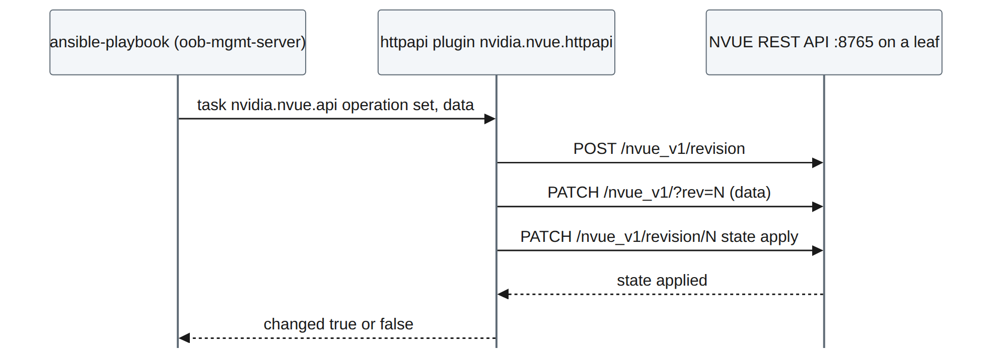
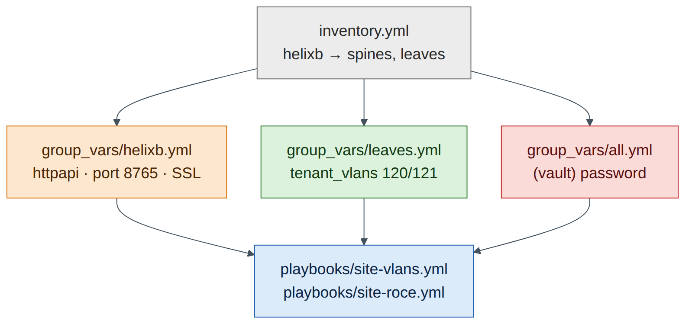

# Lab 12 — Ansible Automation: VLANs and RoCE with nvidia.nvue

!!! abstract "Companion to the NCP-AIN Certification Guide"
    This free lab is part of the hands-on companion to *NCP-AIN Certification Guide* by Vakeesan Thevarajah (Cloudfoxy Ltd). The book explains the theory, design choices and hardware behaviour behind every step. [Get the book](../book.md){ .md-button .md-button--primary } [Free sample](../sample/NCP-AIN_Sample.pdf){ .md-button }


## Lab at a glance

| | |
|---|---|
| Book chapters | 22 (Ansible automation for Spectrum-X), 21 (NVUE REST API) |
| Exam objectives | 6.2 Automate network configuration using Ansible playbooks (VLAN creation, RoCE configuration) |
| Time | 60 minutes |
| Air resources | oob-mgmt-server (control node) and the six switches |
| Prerequisites | Labs 1, 2, 5 and 11 (Task 6: REST API listening address) |

## Objectives

- Install Ansible and the `nvidia.nvue` collection on the oob-mgmt-server.
- Build an inventory with `group_vars` and `host_vars` that connects over **httpapi** to NVUE on port 8765.
- Run a playbook that creates two VLAN-to-VNI mappings on every leaf, read them back and assert the result.
- Run a playbook that enables lossless RoCE on every switch, one switch at a time.
- Use check mode, `--limit`, `serial` and a second run to understand idempotency.
- Diagnose authentication and connectivity failures.

## Background

Chapter 22 describes three ways to drive NVUE from Ansible: the **`nvidia.nvue`** collection (the recommended path), `ansible.builtin.uri` against the REST API, and SSH with `nv` commands. The collection's modules don't use SSH at all. They talk to the NVUE REST API through Ansible's **httpapi** connection plugin, on TCP 8765, and each task becomes a revision that NVUE applies.


<figure markdown>

{ loading=lazy }

<figcaption><strong>Figure 12.1: How a task reaches the switch.</strong> The playbook runs on the oob-mgmt-server. The httpapi plugin sends the task's data to NVUE on port 8765 over the OOB network; NVUE creates a revision, applies it and reports the result.</figcaption>

</figure>


## Step-by-step

### Task 1 — Open the API on every switch

Lab 11 opened the API on hxb-leaf-r1 only. Do the rest from the oob-mgmt-server:

```
ubuntu@oob-mgmt-server:~$ for h in hxb-spine01 hxb-spine02 hxb-leaf-r1 hxb-leaf-r2 hxb-leaf-r3 hxb-leaf-r4; do
>   ip=$(getent hosts $h | awk '{print $1}')
>   ssh cumulus@$h "nv set system api listening-address $ip && nv config apply -y && nv config save" >/dev/null && echo "$h $ip ok"
> done
ubuntu@oob-mgmt-server:~$ curl -s -k -u 'cumulus:CumulusLinux!' https://hxb-spine02:8765/nvue_v1/system/hostname?rev=applied
```

**Checkpoint**

- [ ] The curl call returns spine02's hostname as JSON.

### Task 2 — Install Ansible and the collection

```
ubuntu@oob-mgmt-server:~$ sudo apt-get update && sudo apt-get install -y pipx
ubuntu@oob-mgmt-server:~$ pipx install --include-deps ansible && pipx ensurepath && exec bash
ubuntu@oob-mgmt-server:~$ ansible --version | head -1
ubuntu@oob-mgmt-server:~$ ansible-galaxy collection install nvidia.nvue ansible.netcommon
ubuntu@oob-mgmt-server:~$ ansible-galaxy collection list | grep -E 'nvidia.nvue|ansible.netcommon'
nvidia.nvue        1.2.9
ansible.netcommon  7.x.x
```

*(Illustrative versions.)* Read the module documentation for **your** version before writing tasks:

```
ubuntu@oob-mgmt-server:~$ ansible-doc nvidia.nvue.api | sed -n '1,60p'
```

### Task 3 — Project, inventory and variables

```
ubuntu@oob-mgmt-server:~$ mkdir -p ~/helix-ansible/{group_vars,host_vars,playbooks} && cd ~/helix-ansible
ubuntu@oob-mgmt-server:~/helix-ansible$ cat > inventory.yml <<'EOF'
all:
  children:
    helixb:
      children:
        spines:
          hosts:
            hxb-spine01:
            hxb-spine02:
        leaves:
          hosts:
            hxb-leaf-r1:
            hxb-leaf-r2:
            hxb-leaf-r3:
            hxb-leaf-r4:
EOF
ubuntu@oob-mgmt-server:~/helix-ansible$ cat > group_vars/helixb.yml <<'EOF'
ansible_connection: ansible.netcommon.httpapi
ansible_network_os: nvidia.nvue.httpapi
ansible_httpapi_port: 8765
ansible_httpapi_use_ssl: true
ansible_httpapi_validate_certs: false     # lab only: self-signed certificates
ansible_user: cumulus
ansible_password: "{{ vault_nvue_password }}"
EOF
ubuntu@oob-mgmt-server:~/helix-ansible$ cat > group_vars/leaves.yml <<'EOF'
tenant_vlans:              # staging VLANs for new AURORA subnets
  - { vlan: 120, vni: 10120 }
  - { vlan: 121, vni: 10121 }
EOF
ubuntu@oob-mgmt-server:~/helix-ansible$ cat > ansible.cfg <<'EOF'
[defaults]
inventory = inventory.yml
host_key_checking = False
EOF
```

Keep the password out of plain text with Ansible Vault:

```
ubuntu@oob-mgmt-server:~/helix-ansible$ ansible-vault create group_vars/vault.yml
# in the editor, type:   vault_nvue_password: "CumulusLinux!"
ubuntu@oob-mgmt-server:~/helix-ansible$ mv group_vars/vault.yml group_vars/all.yml
```


!!! info "Field note"
    `group_vars/all.yml` applies to every host, so the vaulted password is available to the `helixb` variables. Run playbooks with `--ask-vault-pass` (or a vault password file in production pipelines).


<figure markdown>

{ loading=lazy }

<figcaption><strong>Figure 12.2: Project layout.</strong> Inventory groups decide which variables each switch gets. helixb holds the connection settings; leaves adds the tenant VLAN list; all holds the vaulted secret.</figcaption>

</figure>


### Task 4 — A read-only playbook first

Always prove connectivity with a read before you write.

```
ubuntu@oob-mgmt-server:~/helix-ansible$ cat > playbooks/facts.yml <<'EOF'
- name: Read hostname and BGP ASN through the NVUE API
  hosts: helixb
  gather_facts: false
  tasks:
    - name: Get system hostname
      nvidia.nvue.api:
        operation: get
        path: /system/hostname
      register: hn
    - name: Show it
      ansible.builtin.debug:
        msg: "{{ inventory_hostname }} reports {{ hn.message }}"
EOF
ubuntu@oob-mgmt-server:~/helix-ansible$ ansible-playbook playbooks/facts.yml --ask-vault-pass
...
PLAY RECAP *********************************************************************
hxb-leaf-r1  : ok=2  changed=0  unreachable=0  failed=0
...
```

**Checkpoint**

- [ ] All six hosts `ok=2 failed=0`.

### Task 5 — Playbook 1: VLANs and VNIs on every leaf

```
ubuntu@oob-mgmt-server:~/helix-ansible$ cat > playbooks/site-vlans.yml <<'EOF'
- name: Helix-B staging VLANs and VNIs
  hosts: leaves
  gather_facts: false
  serial: 2                      # two leaves at a time
  max_fail_percentage: 0         # stop the rollout on the first failure
  tasks:
    - name: Build the NVUE bridge data from the VLAN plan
      ansible.builtin.set_fact:
        vlan_data: >-
          {{ vlan_data | default({}) | combine({ (item.vlan | string):
             { 'vni': { (item.vni | string): {} } } }) }}
      loop: "{{ tenant_vlans }}"

    - name: Merge VLANs and VNIs into br_default and apply
      nvidia.nvue.api:
        operation: set
        force: true
        wait: 15
        data:
          bridge:
            domain:
              br_default:
                vlan: "{{ vlan_data }}"

    - name: Read back the bridge VLANs
      nvidia.nvue.api:
        operation: get
        path: /bridge/domain/br_default/vlan
      register: vlans

    - name: Assert every VLAN has the right VNI
      ansible.builtin.assert:
        that:
          - (vlans.message[item.vlan | string].vni | list | first) == (item.vni | string)
        fail_msg: "VLAN {{ item.vlan }} on {{ inventory_hostname }} is not mapped to VNI {{ item.vni }}"
      loop: "{{ tenant_vlans }}"
EOF
```

1. Dry run first, on one leaf:

    ```
    ubuntu@oob-mgmt-server:~/helix-ansible$ ansible-playbook playbooks/site-vlans.yml --ask-vault-pass --check --limit hxb-leaf-r1
    ```

Whether the `nvidia.nvue` modules honour check mode depends on the collection version (Chapter 22). If the run reports a change but the switch doesn't show one, the module doesn't support check mode; that's why you test in Air before production.

2. Real run, all leaves, two at a time:

    ```
    ubuntu@oob-mgmt-server:~/helix-ansible$ ansible-playbook playbooks/site-vlans.yml --ask-vault-pass
    ```

3. Verify on a switch:

    ```
    cumulus@hxb-leaf-r2:mgmt:~$ nv show bridge domain br_default vlan
    cumulus@hxb-leaf-r2:mgmt:~$ nv show evpn vni
    ```

VLANs 120 and 121 now appear with VNIs 10120 and 10121, alongside the Lab 5 tenant VLANs, which the merge left untouched.

4. **Idempotency:** run the playbook again. A well-behaved run reports `changed=0` for the merge task, because the desired state already exists. If your collection version reports `changed` on every run, note it: Chapter 22 explains why that matters for change control and how to guard against it (read first, compare, only write on a difference).

**Checkpoint**

- [ ] VLANs 120/121 with VNIs 10120/10121 on all four leaves; asserts passed.
- [ ] You know whether your module version is idempotent and check-mode aware.

### Task 6 — Playbook 2: lossless RoCE on every switch

```
ubuntu@oob-mgmt-server:~/helix-ansible$ echo 'roce_mode: lossless' >> group_vars/helixb.yml
ubuntu@oob-mgmt-server:~/helix-ansible$ cat > playbooks/site-roce.yml <<'EOF'
- name: Helix-B RoCE QoS
  hosts: helixb                  # leaves AND spines
  gather_facts: false
  serial: 1                      # one switch at a time for QoS changes
  max_fail_percentage: 0
  tasks:
    - name: Enable RoCE with the chosen mode
      nvidia.nvue.api:
        operation: set
        force: true
        wait: 20
        data:
          qos:
            roce:
              enable: "on"
              mode: "{{ roce_mode }}"

    - name: Read back the RoCE configuration
      nvidia.nvue.api:
        operation: get
        path: /qos/roce
      register: roce_show

    - name: Assert lossless RoCE is active
      ansible.builtin.assert:
        that:
          - "'lossless' in (roce_show.message | string)"
        fail_msg: "RoCE is not {{ roce_mode }} on {{ inventory_hostname }}"
EOF
ubuntu@oob-mgmt-server:~/helix-ansible$ ansible-playbook playbooks/site-roce.yml --ask-vault-pass
```


!!! note "Version note"
    The JSON keys under `/qos/roce` (`enable`, `mode`) follow Chapter 22. If NVUE rejects them on your release, read the current structure first with a `get` on `/qos/roce` (or `nv config show -o json` on a switch where you enabled RoCE by hand in Lab 3) and match it.


Confirm on a spine and a leaf with the CLI: `nv show qos roce`. On Cumulus VX this verifies the configured intent; the lossless data plane itself needs Spectrum hardware (Lab 3).

### Task 7 — Commit the project

```
ubuntu@oob-mgmt-server:~/helix-ansible$ git init -q && git add -A && git commit -qm "Helix-B VLAN and RoCE playbooks"
```

The vault file is encrypted, so committing it is safe; the vault password is not in the repository.

## Verify

- [ ] Read-only playbook succeeds on all six switches.
- [ ] VLANs 120/121 and VNIs 10120/10121 present on all leaves; second run behaviour recorded.
- [ ] RoCE lossless configured on all six switches, one at a time, with assertions passing.

## Break and fix

**Fault 1 — 401 Unauthorized**

- *Inject:* change the vaulted password to a wrong value (`ansible-vault edit group_vars/all.yml`).
- *Symptom:* every host fails with an HTTP 401 error from the httpapi plugin.
- *Diagnosis:* `curl -k -u 'cumulus:<password>' https://hxb-leaf-r1:8765/nvue_v1/system` returns 401 with the wrong password and 200 with the right one.
- *Fix:* correct the vaulted password.

**Fault 2 — connection refused on one switch**

- *Inject:* on hxb-leaf-r4, `nv unset system api listening-address && nv config apply -y`.
- *Symptom:* only hxb-leaf-r4 fails, with "connection refused" to port 8765. SSH to the switch still works.
- *Diagnosis:* `nv show system api` on leaf-r4 shows `localhost` only. The collection uses the API, not SSH (Chapter 22 exam trap).
- *Fix:* re-add the listening address (Task 1) and re-run with `--limit hxb-leaf-r4`.

## Clean-up / save state

The NVUE API applies each change, and auto-save writes it to startup on current releases. To be sure, run `nv config save` on all switches (Lab 11's loop), then store a checkpoint (`lab12-ansible`).

## Exam tie-in

- 6.2: the `nvidia.nvue` collection over `ansible.netcommon.httpapi` with `ansible_network_os: nvidia.nvue.httpapi` on port 8765.
- VLAN creation is a merge into `bridge domain br_default vlan <id> vni <vni>`; RoCE is `qos roce` with `mode lossless`.
- `serial`, `max_fail_percentage`, `--limit`, check mode and idempotency are how you roll changes out safely.
- Read-back and `assert` turn a playbook from "sent a change" into "proved the result".

## Review questions

1. Which connection plugin and `ansible_network_os` do the `nvidia.nvue` modules use?
2. SSH to a switch works but the playbook fails to connect. What do you check?
3. Why does the VLAN playbook merge rather than replace the bridge VLAN list?
4. What do `serial: 1` and `max_fail_percentage: 0` achieve in the RoCE playbook?
5. How do you tell whether a module is idempotent?

### Answers

1. `ansible.netcommon.httpapi` with `ansible_network_os: nvidia.nvue.httpapi`, over HTTPS to port 8765.
2. The NVUE REST API: enabled, listening on the management address (not only localhost), port 8765 reachable, and the credentials valid.
3. A merge adds VLANs 120/121 and leaves the Lab 5 tenant VLANs alone. Replacing (or `overridden`) would delete any VLAN not in the playbook's list.
4. Changes go to one switch at a time, and the play stops at the first failure, so a bad change can't spread across the fabric.
5. Run it twice with the same inputs. An idempotent task reports `changed=0` on the second run because the desired state already exists.

---

!!! abstract "Go deeper"
    The matching book chapters cover the exam objectives for this lab in full, with a Q&A pack of about 40 exam-style questions per chapter. [Get the book](../book.md){ .md-button .md-button--primary } [Report a problem with this lab](https://github.com/Cloudfoxy-Ltd/ncp-ain-guide/issues/new?template=erratum.yml){ .md-button }
