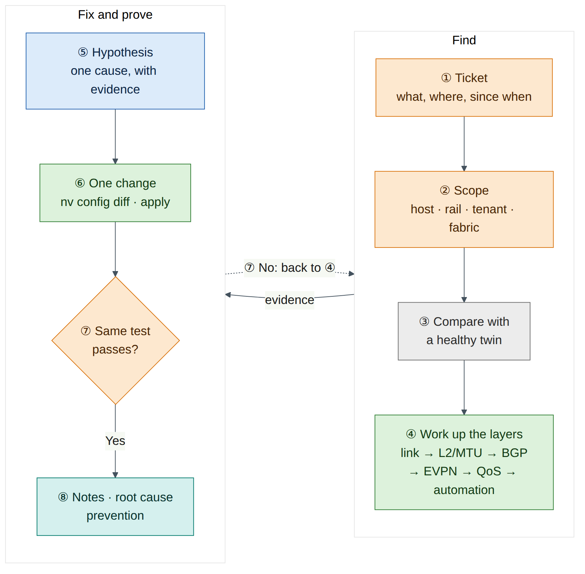
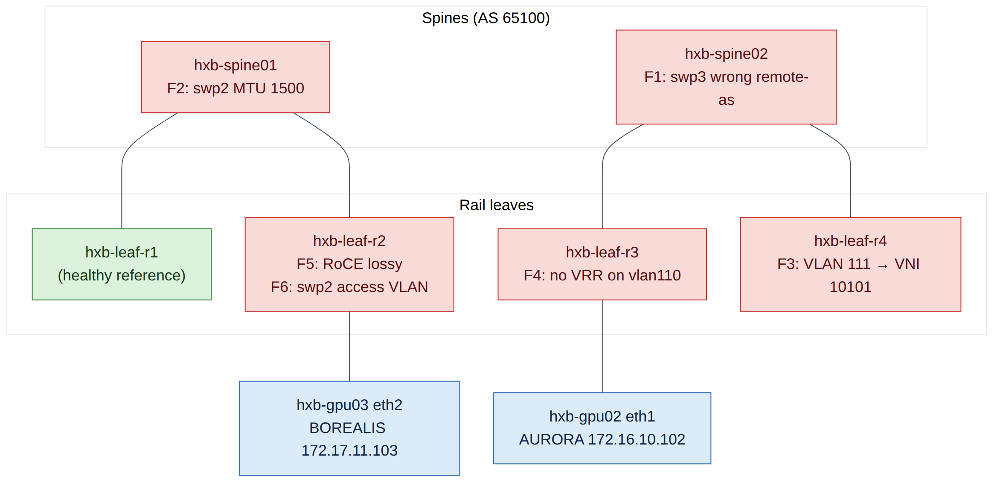
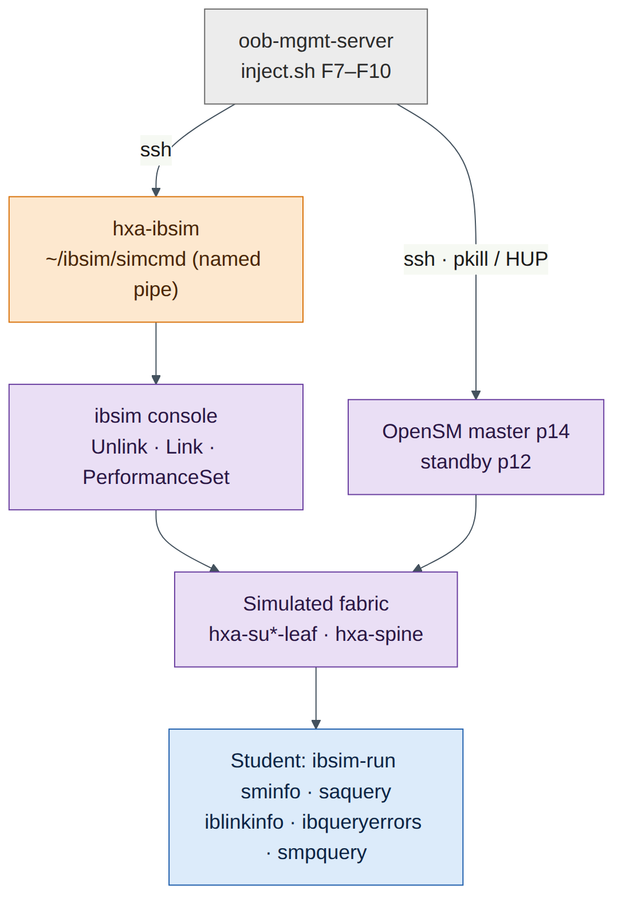

# Lab 13 — Capstone: Troubleshooting Challenge

!!! abstract "Companion to the NCP-AIN Certification Guide"
    This free lab is part of the hands-on companion to *NCP-AIN Certification Guide* by Vakeesan Thevarajah (Cloudfoxy Ltd). The book explains the theory, design choices and hardware behaviour behind every step.

    [Get the book](../book.md){ .md-button .md-button--primary } [Free sample](../sample/NCP-AIN_Sample.pdf){ .md-button }


## Lab at a glance

| | |
|---|---|
| Book chapters | Chapter 4 (NVUE) · 5 (RoCE QoS) · 7 (BGP-EVPN) · 11–13 (InfiniBand, SM HA, PKeys) · 17 (IB diagnostic tools) · 22 (Ansible) · 23 (exam strategy) |
| Exam objectives | Domain 5 Troubleshooting (**5.4**, **5.5**) plus the objectives behind each fault: **2.1**, **2.2**, **2.3**, **3.1**, **3.2**, **3.4**, **6.1**, **6.2** |
| Time | 3–4 hours for all ten scenarios (about 15–20 minutes each), or run them in two sessions |
| Air resources used | The whole helix-b-air simulation (about 26 vCPU while running). A favourite checkpoint taken before you start |
| Prerequisite labs | Labs 0–5, Lab 6 (checkpoints), Lab 8 (ibsim set up in `~/ibsim` on `hxa-ibsim`), Lab 12 (Ansible project). Labs 7, 9 and 11 help |

## Objectives

By the end of this lab you will be able to:

1. Work a fault from a vague ticket to a verified fix using a layer-by-layer method, not guesswork.
2. Diagnose Ethernet faults on the Helix-B twin: a BGP unnumbered neighbour that won't establish, an MTU mismatch, a VNI mismatch, a missing anycast gateway, a disabled lossless RoCE profile, and a wrong VLAN pushed by Ansible.
3. Diagnose InfiniBand faults in ibsim: a missing standby Subnet Manager and SM failover, a missing partition member, rising symbol errors on an uplink, and a failed link.
4. Prove every fix with the same commands that showed the fault.
5. Write troubleshooting notes that a colleague (or an examiner) can follow.

## Background

This lab turns everything you built in Labs 0–12 into a practice ground. An instructor, a study partner or a script breaks one thing at a time. You get only a short **ticket**, written the way a user would report it. Your job is to find the fault, fix it, and prove the fix. The exam's troubleshooting domain (20%) tests exactly this skill in multiple-choice form: given symptoms and command output, pick the cause and the next step.

There are **ten scenarios**: six on the Helix-B Ethernet twin and four on the Helix-A InfiniBand simulator. Each scenario lists how the fault is injected (instructor only), what the student sees, three hints that give away progressively more, and the exam objective it practises. Full solutions are in a separate section so you don't read them by accident.

Use the same method every time. Start from the symptom and the scope (one host? one rail? one tenant? whole fabric?). Then work **up the layers**: physical link, then L2 (VLAN, MTU), then the underlay control plane (BGP), then the overlay (EVPN, VNIs, VRFs, gateways), then QoS and policy, and last the automation that put the configuration there. On InfiniBand the order is link state, then SM and LIDs, then partitions, then counters and routes. At every step, compare the broken device with a healthy peer: in a rail-optimised fabric there is always a twin that should look the same.


!!! warning "Warning"
    Cumulus VX has no Spectrum ASIC, and ibsim has no real links. Some faults don't produce the traffic symptoms they would in production (for example, lossy RoCE on VX doesn't drop anything, and ibsim symbol errors only rise when someone sets them). In those scenarios you diagnose from configuration and counters, which is also what most exam questions show you.


<figure markdown>

{ loading=lazy }

<figcaption><strong>Figure 13.1: The capstone troubleshooting method.</strong> Every scenario follows the same loop. Scope the problem, compare with a healthy twin, work up the layers, change one thing, and verify with the command that first showed the fault. Write notes as you go, not afterwards.</figcaption>

</figure>


<figure markdown>

{ loading=lazy }

<figcaption><strong>Figure 13.2: Where the Ethernet faults are injected.</strong> F1 breaks the spine02–leaf-r3 BGP session, F2 lowers the MTU on the spine01–leaf-r2 link, F3 changes VLAN 111's VNI on leaf-r4, F4 removes the VLAN 110 gateway on leaf-r3, F5 switches leaf-r2 RoCE to lossy, and F6 moves gpu03's access port on leaf-r2 into the wrong VLAN.</figcaption>

</figure>


The figure shows only the links involved in the faults. Every leaf connects to both spines (swp31 to hxb-spine01, swp32 to hxb-spine02).

## Step-by-step

### Task 1 — Capture a baseline and take a checkpoint

You can only recognise "broken" if you have recorded "working". Capture a baseline from the healthy fabric before any fault is injected.

1. On `oob-mgmt-server`, create a working folder and capture the Ethernet baseline:

    ```
    ubuntu@oob-mgmt-server:~$ mkdir -p ~/capstone/baseline && cd ~/capstone/baseline
    ubuntu@oob-mgmt-server:~/capstone/baseline$ for sw in hxb-spine01 hxb-spine02 hxb-leaf-r1 hxb-leaf-r2 hxb-leaf-r3 hxb-leaf-r4; do
      ssh cumulus@$sw "sudo vtysh -c 'show bgp summary'; sudo vtysh -c 'show evpn vni'; nv show qos roce; nv config show" > $sw.txt 2>&1
    done
    ubuntu@oob-mgmt-server:~/capstone/baseline$ ls
    ```

    **Expected output (illustrative):**

    ```
    hxb-leaf-r1.txt  hxb-leaf-r2.txt  hxb-leaf-r3.txt  hxb-leaf-r4.txt  hxb-spine01.txt  hxb-spine02.txt
    ```

2. Record the host reachability matrix. From `hxb-gpu01`, every AURORA address should answer:

    ```
    ubuntu@hxb-gpu01:~$ for ip in 172.16.10.1 172.16.10.102 172.16.11.1 172.16.11.102; do ping -c 2 -W 1 $ip >/dev/null && echo "$ip ok" || echo "$ip FAIL"; done
    ```

    **Expected output (illustrative):** four lines ending in `ok`. Repeat from `hxb-gpu03` for the BOREALIS addresses (172.17.10.1, 172.17.10.104, 172.17.11.1, 172.17.11.104). Check that a cross-tenant ping (for example `ping 172.17.10.103` from `hxb-gpu01`) fails, as Lab 5 intended.

3. Capture the InfiniBand baseline on `hxa-ibsim`. Start ibsim and OpenSM the way Lab 8 does, then:

    ```
    ubuntu@hxa-ibsim:~$ cd ~/ibsim
    ubuntu@hxa-ibsim:~/ibsim$ ibsim-run sminfo > base-sminfo.txt
    ubuntu@hxa-ibsim:~/ibsim$ ibsim-run saquery -s > base-sm-ports.txt
    ubuntu@hxa-ibsim:~/ibsim$ ibsim-run ibnetdiscover > base-topo.txt
    ubuntu@hxa-ibsim:~/ibsim$ ibsim-run iblinkinfo --switches-only -l > base-links.txt
    ubuntu@hxa-ibsim:~/ibsim$ ibsim-run ibqueryerrors > base-errors.txt
    ubuntu@hxa-ibsim:~/ibsim$ cp partitions.conf base-partitions.conf
    ```

    `saquery -s` lists the ports that are SM-capable. With Lab 8's HA set-up it should show both SM hosts, so you know the master's and the standby's LIDs.

4. Save everything and take a checkpoint. On every switch, `nv config diff applied startup` should be empty (Lab 6, Task 1). Then in Air use **Stop Simulation and Store Checkpoint**, mark the checkpoint as a favourite, and name it `pre-capstone`. Start the simulation from it.


    !!! warning "Warning"
        An Air checkpoint saves disks, not running processes. After starting from a checkpoint, restart ibsim and the OpenSM instances as in Lab 8 before you do any InfiniBand scenario.


**Checkpoint:**

- Baseline files exist in `~/capstone/baseline` and `~/ibsim/base-*`.
- A favourite checkpoint called `pre-capstone` exists.

### Task 2 — Install the fault injector (instructor or study partner)

The student should not read this task. If you work alone, ask a friend to install the script, or install it without reading the `case` block and use `random` mode (Task 3).

1. On `oob-mgmt-server`, create `~/capstone/inject.sh`:

    ```
    #!/bin/bash
    # Lab 13 fault injector. Usage: inject.sh F1..F10 | F7b | random
    set -euo pipefail
    SVI_AF=ipv4                     # use "ip" if Lab 5 used the pre-5.15 SVI syntax
    ANSIBLE_DIR=~/helix-ansible     # your Lab 12 Ansible project
    SIM=hxa-ibsim
    VICTIM_GUID=0x0000000000000000  # port GUID of one PRODUCTION member (F8), from partitions.conf

    nv_on() { local sw=$1; shift; ssh -o BatchMode=yes cumulus@"$sw" "$* && nv config apply -y" >/dev/null; }
    sim_cmd() { ssh -o BatchMode=yes ubuntu@"$SIM" "echo '$1' > ~/ibsim/simcmd"; }

    id=${1:?usage: inject.sh F1..F10|F7b|random}
    if [ "$id" = random ]; then
      id=F$(( (RANDOM % 10) + 1 ))
      echo "$id $(date)" | sudo tee -a /root/capstone-answers >/dev/null
      echo "A fault has been injected. Good luck."
    fi

    case $id in
      F1) nv_on hxb-spine02 "nv set vrf default router bgp neighbor swp3 remote-as 65200" ;;
      F2) nv_on hxb-spine01 "nv set interface swp2 link mtu 1500" ;;
      F3) nv_on hxb-leaf-r4 "nv unset bridge domain br_default vlan 111 vni 10111 && nv set bridge domain br_default vlan 111 vni 10101" ;;
      F4) nv_on hxb-leaf-r3 "nv unset interface vlan110 $SVI_AF vrr" ;;
      F5) nv_on hxb-leaf-r2 "nv set qos roce mode lossy" ;;
      F6) cd "$ANSIBLE_DIR"
          cat > playbooks/access-ports.yml <<'EOF'
    - name: Tidy leaf access ports
      hosts: hxb-leaf-r2
      gather_facts: false
      tasks:
        - name: Set access VLAN on swp2
          nvidia.nvue.api:
            operation: set
            force: true
            wait: 15
            data:
              interface:
                swp2:
                  bridge:
                    domain:
                      br_default:
                        access: 111
    EOF
          git add playbooks/access-ports.yml && git commit -qm "Tidy access ports"
          ansible-playbook playbooks/access-ports.yml >/dev/null ;;
      F7)  ssh ubuntu@"$SIM" "pkill -f '[o]pensm.*-p 12'" ;;   # standby SM disappears
      F7b) ssh ubuntu@"$SIM" "pkill -f '[o]pensm.*-p 14'" ;;   # later: master fails too
      F8) ssh ubuntu@"$SIM" "cd ~/ibsim && sed -i.bak 's/${VICTIM_GUID}[^,;]*, *//; s/, *${VICTIM_GUID}[^,;]*//' partitions.conf && pkill -HUP -f '[o]pensm.*-p 14'" ;;
      F9) ( for n in 400 1500 4200 9800; do
              sim_cmd "PerformanceSet \"hxa-su1-leaf-r1\"[33] PortCounters.SymbolErrorCounter=$n"; sleep 120
            done ) >/dev/null 2>&1 & ;;
      F10) sim_cmd 'Unlink "hxa-su2-leaf-r2"[34]' ;;
      *) echo "unknown fault $id"; exit 1 ;;
    esac
    ```

2. Make it executable and check it parses:

    ```
    ubuntu@oob-mgmt-server:~$ chmod +x ~/capstone/inject.sh
    ubuntu@oob-mgmt-server:~$ bash -n ~/capstone/inject.sh && echo syntax ok
    ```

**Notes on the script (check on your set-up):**

- `nv_on` assumes the passwordless SSH from `oob-mgmt-server` to the switches that Lab 0 and Lab 12 set up. Without it, `BatchMode=yes` makes the script fail instead of hanging on a password prompt.
- `SVI_AF` must match the SVI syntax you used in Lab 5. From Cumulus Linux 5.15, NVUE uses `interface vlan110 ipv4 vrr`. Earlier 5.x releases use `ip vrr`.
- F6 uses the Lab 12 connection settings (`nvidia.nvue.api` over the NVUE REST API on port 8765). If your Lab 12 inventory uses a different project path or host names, adjust `ANSIBLE_DIR` and `hosts`.
- F7, F7b and F8 assume that Lab 8 started the master OpenSM with priority 14 (`-p 14`) and the standby with priority 12 (`-p 12`), and that the partition file is `~/ibsim/partitions.conf`. The `[o]pensm` pattern stops `pkill` from matching its own shell. OpenSM re-reads the partition file on its next heavy sweep, which `SIGHUP` triggers (check on your OpenSM version; if the change doesn't appear, restart the master OpenSM the Lab 8 way).
- The ibsim console reads commands from the named pipe `~/ibsim/simcmd` that Lab 8 creates. If nothing is reading the pipe, `echo … > simcmd` blocks. In the Lab 8 topology, leaf ports 33 and above are spine uplinks; confirm the port numbers in `~/ibsim/base-links.txt`.

### Task 3 — Run the challenge

**With an instructor:** the instructor runs one scenario at a time (`~/capstone/inject.sh F3`, for example), hands the student the ticket text from the **Break and fix** section, and starts a timer.

**On your own:** run `~/capstone/inject.sh random`. The script picks a fault, writes the answer to `/root/capstone-answers` (readable only with `sudo`), and tells you nothing else. Read the ticket list in **Break and fix**, decide which ticket matches what you see, and start.

Rules:

1. Target 15–20 minutes per scenario. After 10 minutes stuck, take Hint 1; after 15, Hint 2.
2. Change **one thing at a time**. On switches, review `nv config diff` before every `nv config apply`.
3. Prove the fix with the same test that showed the fault.
4. Restore before the next scenario. Either apply the fix from the solution, or start again from the `pre-capstone` checkpoint (Lab 6). A checkpoint restore is the only guaranteed clean slate, but it takes several minutes and you must restart ibsim afterwards.


<figure markdown>

{ loading=lazy }

<figcaption><strong>Figure 13.3: How the InfiniBand faults reach ibsim.</strong> The injector on oob-mgmt-server writes simulator commands into the named pipe that Lab 8 feeds to the ibsim console, or signals the OpenSM processes. Students see the effects only through the diagnostic tools run with ibsim-run.</figcaption>

</figure>


### Task 4 — Keep troubleshooting notes

Good notes are part of the score. Copy this template into `~/capstone/notes-F<n>.md` at the start of each scenario and fill it in **as you go**:

```
# Ticket F<n> — <one-line summary in your own words>
Start: 14:05   Finish: 14:22   Hints used: 0

## Symptom and scope
- What fails:      gpu02 eth1 (172.16.10.102) cannot reach its gateway 172.16.10.1
- What still works: gpu02 → gpu01 172.16.10.101 (same VLAN, other leaf)
- Scope:           one leaf (hxb-leaf-r3), one VLAN (110); leaf-r1 VLAN 110 fine

## Evidence (command → key line)
- gpu02: ip neigh show 172.16.10.1          → FAILED
- leaf-r3: nv show interface vlan110         → no vrr address
- leaf-r1: nv show interface vlan110         → vrr 172.16.10.1/24, 00:00:5e:00:01:01

## Root cause
VRR (anycast gateway) removed from vlan110 on hxb-leaf-r3 (nv config history: rev 41).

## Fix (exact commands)
nv set interface vlan110 ipv4 vrr address 172.16.10.1/24 ... ; nv config diff ; nv config apply

## Verification (same test as the symptom)
- gpu02: ping 172.16.10.1 → 0% loss; ping 172.16.11.101 → 0% loss

## Prevention
Gateway settings come from the Lab 11 template; add a post-change ping check to the pipeline.
```

What makes notes good:

| Good notes | Weak notes |
|---|---|
| State scope: what works as well as what fails | "Network is broken" |
| Quote the one line of output that proves each point | Paste 200 lines of output with no comment |
| Name the device, interface, VLAN/VNI or port and LID | "Something on the leaf" |
| Separate the root cause from the symptom | "Fixed by rebooting" |
| Show the exact fix and the exact verification | "Changed config, works now" |
| End with prevention: template, check or alert | No lesson recorded |

### Task 5 — Score yourself

Score each scenario out of 10 with this rubric. An instructor scores from the student's notes and a short verbal walk-through.

| Criterion | 0 | 1 | 2 | 3 |
|---|---|---|---|---|
| **Scope and isolation** (max 2) | No scope stated | Right area (Ethernet or IB, one tenant or rail) | Exact device and interface, VLAN or port | — |
| **Root cause** (max 3) | Wrong or none | Right layer, wrong detail | Right cause, weak evidence | Right cause, proved with the key output line |
| **Fix** (max 2) | None, or it broke something else | Worked but untidy (several changes, no diff review) | Minimal, reviewed with `nv config diff` or equivalent | — |
| **Verification** (max 2) | None | A different test from the symptom | Same test as the symptom, plus a check that nothing else broke | — |
| **Notes** (max 1) | Missing or unreadable | Complete template, including prevention | — | — |

| Adjustment | Points |
|---|---|
| Each hint used | −1 (Hint 3 counts as two) |
| Solved in under 10 minutes | +1 |
| Needed the solution | Score the notes and verification only |

| Total over ten scenarios | Rating |
|---|---|
| 85–110 | Exam-ready for Domain 5: fast, evidence-based, tidy |
| 65–84 | Solid. Revisit the chapters for the scenarios where you lost points |
| Below 65 | Repeat the lowest-scoring scenarios after re-reading their chapters and labs |

## Break and fix

Each scenario is written in four parts: **Ticket** (all the student gets), **Injection** (instructor only), **Symptoms** (what the student should find), and **Hints**. Full solutions follow in the next section.

### F1 — "Rail 3 is running on one leg"

**Ticket:** "Monitoring says `hxb-leaf-r3` has only one path to the spines. Jobs still run. Can you check before tonight's training run?"

**Injection:** `inject.sh F1`. On `hxb-spine02`, the unnumbered neighbour on `swp3` (the link to `hxb-leaf-r3` `swp32`) is changed from `remote-as external` to `remote-as 65200`.

**Symptoms:**

- On `hxb-leaf-r3`, `sudo vtysh -c "show bgp summary"` shows `swp31` Established but `swp32` in `Active`, `Connect` or `Idle`, with 0 prefixes received.
- `sudo vtysh -c "show ip route 10.255.0.11"` on leaf-r3 shows one next hop (via swp31) instead of two.
- The physical link is up: `nv show interface swp32` shows `up`, and LLDP shows `hxb-spine02 swp3`.
- On `hxb-spine02`, `show bgp neighbor swp3` shows an OPEN error / bad peer AS as the last reset reason (wording varies by FRR version).

**Hints:**

1. The link is up. Which layer is left, and which end would you look at?
2. Compare `nv show vrf default router bgp neighbor swp3` on spine02 with `swp1` on the same spine.
3. With BGP unnumbered, both ends normally say `remote-as external`. What happens if one end expects a specific AS?

**Exam objective:** **2.3** (the BGP underlay that EVPN runs on) · **6.1** (finding the change with `nv config history`) · **1.2** (rail-optimised design: why ECMP to both spines matters).

### F2 — "Small pings work, big transfers hang"

**Ticket:** "From `hxb-gpu01` to `hxb-gpu02` on AURORA VLAN 111, ping works but copying a large file with `scp` stalls. Other pairs seem fine."

**Injection:** `inject.sh F2`. On `hxb-spine01`, `swp2` (the link to `hxb-leaf-r2` `swp31`) gets `link mtu 1500`. The leaf side stays at 9216.

**Symptoms:**

- `ping 172.16.11.102` from `hxb-gpu01` (over eth2, leaf-r2 → spine → leaf-r4) works with default-size packets.
- A full-size, don't-fragment ping fails or partly fails: `ping -M do -s 1472 -c 5 172.16.11.102`. VXLAN adds 50 bytes, so a 1500-byte host packet becomes a 1550-byte underlay packet, which doesn't fit a 1500-byte link. Whether it fails depends on which spine the flow hashes to.
- **BGP stays Established** on every link. Unlike OSPF, BGP doesn't check MTU, so the control plane looks healthy.
- An underlay test from `hxb-leaf-r2` to `hxb-spine01`'s loopback with a jumbo packet fails, while the same test to `hxb-spine02` works.

**Hints:**

1. Small works, large fails: think about packet size before you think about routing.
2. Test the underlay between leaf-r2 and each spine with `ping -M do -s 8972` to the spine loopbacks.
3. Compare the MTU on **both ends** of each leaf-r2 uplink.

**Exam objective:** **2.1** (link settings on Spectrum-X switches, MTU 9216) · **2.3** (VXLAN overhead in an EVPN fabric) · **5.3** (verifying the data path, not just the control plane).

### F3 — "gpu02 can't see gpu01 on VLAN 111"

**Ticket:** "After last night's maintenance on rail 4, `hxb-gpu02` eth2 (172.16.11.102) can't reach `hxb-gpu01` eth2 (172.16.11.101). It can reach its gateway."

**Injection:** `inject.sh F3`. On `hxb-leaf-r4`, VLAN 111 is re-mapped from VNI 10111 to VNI 10101.

**Symptoms:**

- From `hxb-gpu02`: `ping 172.16.11.1` works (the gateway is local VRR on leaf-r4). `ping 172.16.11.101` fails.
- Traffic between different subnets may still work (for example gpu02 eth2 to 172.16.10.101), because symmetric routing uses the L3 VNI 104001, not the L2 VNI. That partial success is a strong clue.
- On leaf-r4, `sudo vtysh -c "show evpn vni"` lists VNI **10101** with no remote VTEPs, and no 10111.
- On leaf-r2, `sudo vtysh -c "show evpn vni 10111"` lists remote VTEPs 10.255.0.11 and .13 as usual, but not 10.255.0.14.

**Hints:**

1. Same subnet fails, gateway works. Which part of EVPN carries same-subnet traffic between leaves?
2. Run `show evpn vni` on leaf-r4 and on leaf-r2 and compare the VNI lists.
3. Look at `nv show bridge domain br_default vlan 111` on leaf-r4.

**Exam objective:** **2.3** (L2 VNI mapping, route type 2/3, symmetric IRB).

### F4 — "One server can't leave its subnet"

**Ticket:** "`hxb-gpu02` eth1 (172.16.10.102) can't reach anything outside 172.16.10.0/24. It can still ping `hxb-gpu01` on 172.16.10.101."

**Injection:** `inject.sh F4`. On `hxb-leaf-r3`, the VRR (anycast gateway) configuration is removed from `vlan110`.

**Symptoms:**

- From `hxb-gpu02`: `ping 172.16.10.101` works (L2 across VNI 10110). `ping 172.16.10.1` and `ping 172.16.11.101` fail.
- `ip neigh show 172.16.10.1` on `hxb-gpu02` shows `FAILED` or `INCOMPLETE`: nothing answers ARP for the gateway on leaf-r3.
- On leaf-r3, `nv show interface vlan110` has no VRR address. On leaf-r1, the same command shows `172.16.10.1/24` and MAC `00:00:5e:00:01:01`.
- BGP and EVPN sessions are all healthy.

**Hints:**

1. The host can bridge but not route. Who is the host's router?
2. Check the host's ARP entry for 172.16.10.1.
3. Compare `nv show interface vlan110` on leaf-r3 and leaf-r1.

**Exam objective:** **2.3** (distributed anycast gateway with VRR on every leaf).

### F5 — "RoCE audit failed on rail 2"

**Ticket:** "The weekly RoCE audit flagged `hxb-leaf-r2`. perftest still runs. Is it a real problem?"

**Injection:** `inject.sh F5`. On `hxb-leaf-r2`, `nv set qos roce mode lossy` is applied. (Variant for a harder round: change the switch's QoS trust so DSCP is no longer trusted, for example `nv set qos mapping default-global trust l2`; check on your release whether VX accepts it and how it interacts with the RoCE profile.)

**Symptoms:**

- Soft-RoCE perftest still works. VX has no Spectrum ASIC, so there is no PFC, pause or buffer behaviour to observe, and nothing drops.
- `nv show qos roce` on leaf-r2 shows `mode lossy` and no PFC on switch priority 3. Leaf-r1 shows `mode lossless` with PFC on priority 3, ECN enabled and trust `pcp,dscp`.
- `nv config history` on leaf-r2 shows a recent revision that changed it.

**Hints:**

1. VX can't show you drops. What can it show you?
2. Diff `nv show qos roce` between leaf-r2 and leaf-r1.
3. Which single NVUE command sets the lossless defaults, and what does `mode lossy` remove?

**Exam objective:** **2.1** (configure RoCE with `nv set qos roce`) · **2.2** (PFC and ECN) · **5.3** (verify the low-latency, lossless configuration end to end).

### F6 — "BOREALIS host sees AURORA broadcast traffic"

**Ticket:** "`hxb-gpu03` eth2 (BOREALIS, 172.17.11.103) lost its gateway this morning. `tcpdump` on it shows ARP requests for 172.16.11.x addresses, which belong to another tenant."

**Injection:** `inject.sh F6`. A new playbook, committed to the Lab 12 Git repository as "Tidy access ports", sets `hxb-leaf-r2` `swp2` to access VLAN **111** (AURORA) instead of **211** (BOREALIS).

**Symptoms:**

- From `hxb-gpu03`: `ping 172.17.11.1` and `ping 172.17.11.104` fail.
- `sudo tcpdump -ni eth2 arp` on `hxb-gpu03` shows ARP for 172.16.11.x. The host is in the wrong broadcast domain, which is a **tenant isolation breach**, not only an outage.
- On leaf-r2, `nv show interface swp2 bridge domain br_default` shows access VLAN 111. On leaf-r1, `swp2` shows 210, and on leaf-r4, `swp2` shows 211.
- `nv config history` on leaf-r2 shows a revision applied through the API by the automation user, not an interactive CLI user.
- `git log --oneline -3` in the Ansible project shows the "Tidy access ports" commit.

**Hints:**

1. Which VLAN is gpu03's port in, and which should it be in?
2. Who changed it? `nv config history` tells you whether it came from a person or from the API.
3. Fix the source of truth, not just the switch. Otherwise the next playbook run puts the fault back.

**Exam objective:** **6.2** (Ansible playbooks for VLANs) · **6.1** (NVUE configuration management and history) · **2.3** (tenant isolation).

### F7 — "Confirm Subnet Manager HA before the change freeze"

**Ticket:** "Change freeze starts tomorrow. Please confirm the Helix-A SM pair is healthy: one master, one standby." (If the student reports HA as healthy, the instructor later runs `inject.sh F7b` and sends a second ticket: "New nodes on Helix-A are stuck in Initializing and `sminfo` times out.")

**Injection:** `inject.sh F7` stops the **standby** OpenSM (priority 12). `inject.sh F7b` later stops the **master** (priority 14).

**Symptoms (stage 1):**

- `ibsim-run sminfo` still shows a master (priority 14, state `SMINFO_MASTER`). Everything looks fine at first glance.
- `ibsim-run sminfo <standby LID>` (the standby LID from `base-sm-ports.txt`) doesn't return a standby SM (it times out or shows it not active), and `ps -ef | grep [o]pensm` shows only one OpenSM.

**Symptoms (stage 2, after F7b):**

- `ibsim-run sminfo` times out. There is no master SM.
- Existing routes keep working, because the switches keep their programmed forwarding tables, but ports that come up now stay in `Initializing`.

**Hints:**

1. "One master" is only half the question. How do you query a specific SM rather than the master?
2. Compare `ps -ef | grep [o]pensm` with how Lab 8 started the HA pair.
3. SM election uses the highest priority, then the lowest GUID. Which priority must the restarted standby have so that it doesn't take over?

**Exam objective:** **3.1** (SM high availability) · **5.4** (SM and UFM health) · **5.5** (`sminfo`, `saquery`).

### F8 — "One PRODUCTION node can't join the job"

**Ticket:** "A node on Helix-A can't talk to the other PRODUCTION nodes over the PRODUCTION partition. Everything else about it looks normal."

**Injection:** `inject.sh F8` removes one member (`VICTIM_GUID`) from the PRODUCTION line of `~/ibsim/partitions.conf` and makes the master SM re-read the file.

**Symptoms:**

- The node's port is `Active` in `ibsim-run iblinkinfo`, and it has a LID.
- `ibsim-run smpquery pkeys <LID>` for that node lists the default partition but **not 0x8002** (PRODUCTION, full member). A healthy PRODUCTION node lists `0x8002`.
- `diff ~/ibsim/base-partitions.conf ~/ibsim/partitions.conf` shows the missing GUID (and there is a `partitions.conf.bak`).

**Hints:**

1. The port is up and has a LID, so the SM has seen it. What else does the SM program into a port?
2. Read the node's PKey table with `smpquery pkeys` and compare it with a healthy PRODUCTION node.
3. Where does OpenSM get partition membership from?

**Exam objective:** **3.2** (configure PKeys: `partitions.conf`, full and limited membership, 0x8002 = full member of 0x0002).

### F9 — "Errors climbing on an SU1 uplink"

**Ticket:** "UFM-style health alerts every few minutes about `hxa-su1-leaf-r1`. No outage yet."

**Injection:** `inject.sh F9` sets `SymbolErrorCounter` on `hxa-su1-leaf-r1` port 33 (a spine uplink) to 400, 1500, 4200 and 9800 at two-minute intervals, using the ibsim console command `PerformanceSet "hxa-su1-leaf-r1"[33] PortCounters.SymbolErrorCounter=N`.

**Symptoms:**

- `ibsim-run ibqueryerrors` lists `hxa-su1-leaf-r1` port 33 with a non-zero `SymbolErrorCounter`. Running it again a few minutes later shows a higher value.
- The link is still `LinkUp` / `Active` at full width in `ibsim-run iblinkinfo --switches-only -l`.
- `base-errors.txt` from Task 1 shows no errors on that port.

**Hints:**

1. The link is up. Which tool lists only ports with non-zero error counters?
2. One reading tells you little. What does a **rising** symbol error count mean?
3. Which end of the link, and which cable, would you replace, and how do you confirm the fix in the simulator?

**Exam objective:** **5.5** (`ibqueryerrors`, `perfquery`, `iblinkinfo`) · **3.4** and **5.4** (monitoring link health and acting on alerts).

### F10 — "SU2 lost bandwidth to the spines"

**Ticket:** "Jobs spanning both SUs slowed down about 3% after lunch. Nothing is down, as far as we can see."

**Injection:** `inject.sh F10` sends `Unlink "hxa-su2-leaf-r2"[34]` to the ibsim console through the named pipe (`echo 'Unlink "hxa-su2-leaf-r2"[34]' > ~/ibsim/simcmd`).

**Symptoms:**

- `ibsim-run iblinkinfo --switches-only -l` shows `hxa-su2-leaf-r2` port 34 as `Down` (physical state `Polling` or `Disabled`, depending on the ibsim build), with no peer.
- `diff ~/ibsim/base-links.txt <(ibsim-run iblinkinfo --switches-only -l)` highlights that one line.
- `ibsim-run ibqueryerrors` may show nothing useful: in the simulator, unlinking doesn't necessarily raise error counters. That is why the baseline diff matters.
- The fabric keeps working. After its next sweep, the SM routes around the missing uplink, so only bandwidth drops.

**Hints:**

1. "Slower, nothing down" often means a missing link in an ECMP-like fabric. Which tool shows every link?
2. Compare the current `iblinkinfo --switches-only -l` with your baseline.
3. Which spine and port was leaf-r2 port 34 connected to? Your baseline knows.

**Exam objective:** **5.5** (`iblinkinfo`, `ibnetdiscover`) · **3.1** (fabric provisioning and link validation).

## Solutions

### F1 solution — wrong remote-as on spine02

1. Scope: only leaf-r3's `swp32` session is down. Its other uplink is fine, and other leaves' sessions to spine02 are fine, so the problem is this one link or its two ends.
2. The physical layer is fine (`nv show interface swp32` is up, LLDP shows the right neighbour).
3. On `hxb-spine02`, compare neighbours:

    ```
    cumulus@hxb-spine02:mgmt:~$ nv show vrf default router bgp neighbor swp3
    cumulus@hxb-spine02:mgmt:~$ nv show vrf default router bgp neighbor swp1
    cumulus@hxb-spine02:mgmt:~$ nv config history
    ```

    **Expected output (illustrative):** `swp3` shows `remote-as 65200` and `swp1` shows `remote-as external`. The history shows the revision that changed it.

4. Fix and verify:

    ```
    cumulus@hxb-spine02:mgmt:~$ nv set vrf default router bgp neighbor swp3 remote-as external
    cumulus@hxb-spine02:mgmt:~$ nv config diff
    cumulus@hxb-spine02:mgmt:~$ nv config apply -y
    cumulus@hxb-leaf-r3:mgmt:~$ sudo vtysh -c "show bgp summary"
    cumulus@hxb-leaf-r3:mgmt:~$ sudo vtysh -c "show ip route 10.255.0.11"
    ```

**Checkpoint:** swp32 is Established with prefixes received, and the route to 10.255.0.11 has two next hops again.

**Root cause:** the peer AS on spine02 swp3 didn't match leaf-r3's real AS (65103). The leaf's OPEN carried AS 65103, the spine expected 65200, and the session was rejected. `remote-as external` accepts any AS different from the local one, which is why unnumbered fabrics use it.

### F2 solution — MTU mismatch on spine01 swp2

1. Prove it's size-related from the host:

    ```
    ubuntu@hxb-gpu01:~$ ping -c 3 172.16.11.102
    ubuntu@hxb-gpu01:~$ ping -M do -s 1472 -c 5 172.16.11.102
    ```

2. Test the underlay from `hxb-leaf-r2` to each spine loopback. Your SSH session is in the management VRF (the `:mgmt:` in the prompt), so run the ping in the default VRF:

    ```
    cumulus@hxb-leaf-r2:mgmt:~$ sudo ip vrf exec default ping -M do -s 8972 -c 3 10.255.0.1
    cumulus@hxb-leaf-r2:mgmt:~$ sudo ip vrf exec default ping -M do -s 8972 -c 3 10.255.0.2
    ```

    **Expected output (illustrative):** the ping to 10.255.0.2 (spine02) gets replies. The ping to 10.255.0.1 (spine01) shows 100% packet loss or `message too long`.

3. Compare both ends of the leaf-r2 → spine01 link:

    ```
    cumulus@hxb-leaf-r2:mgmt:~$ nv show interface swp31 link | grep -i mtu
    cumulus@hxb-spine01:mgmt:~$ nv show interface swp2 link | grep -i mtu
    ```

    **Expected output (illustrative):** leaf-r2 swp31 shows 9216, spine01 swp2 shows 1500.

4. Fix and verify:

    ```
    cumulus@hxb-spine01:mgmt:~$ nv set interface swp2 link mtu 9216
    cumulus@hxb-spine01:mgmt:~$ nv config apply -y
    cumulus@hxb-leaf-r2:mgmt:~$ sudo ip vrf exec default ping -M do -s 8972 -c 3 10.255.0.1
    ubuntu@hxb-gpu01:~$ ping -M do -s 1472 -c 5 172.16.11.102
    ```

**Checkpoint:** both pings succeed with no loss.

**Root cause:** one side of a routed link had MTU 1500. BGP stayed up because its packets are small and BGP doesn't negotiate MTU. VXLAN-encapsulated full-size frames were dropped on that link only, so failures depended on the ECMP hash.


!!! note "Version note"
    How Cumulus VX handles an oversized received frame (drop, or accept) depends on the virtual NIC. If the jumbo ping from leaf-r2 to spine01 still works in your simulation, test in the other direction (from spine01 to 10.255.0.12), where spine01's 1500-byte egress MTU applies.


### F3 solution — VNI mismatch on leaf-r4

```
cumulus@hxb-leaf-r4:mgmt:~$ sudo vtysh -c "show evpn vni"
cumulus@hxb-leaf-r4:mgmt:~$ nv show bridge domain br_default vlan 111
cumulus@hxb-leaf-r2:mgmt:~$ sudo vtysh -c "show evpn vni 10111"
```

**Expected output (illustrative):** leaf-r4 lists VNI 10101 (L2, 0 remote VTEPs) and no 10111. Leaf-r2's VNI 10111 lists remote VTEPs 10.255.0.11 and 10.255.0.13 only.

Fix and verify:

```
cumulus@hxb-leaf-r4:mgmt:~$ nv unset bridge domain br_default vlan 111 vni 10101
cumulus@hxb-leaf-r4:mgmt:~$ nv set bridge domain br_default vlan 111 vni 10111
cumulus@hxb-leaf-r4:mgmt:~$ nv config diff
cumulus@hxb-leaf-r4:mgmt:~$ nv config apply -y
cumulus@hxb-leaf-r4:mgmt:~$ sudo vtysh -c "show evpn vni 10111"
ubuntu@hxb-gpu02:~$ ping -c 3 172.16.11.101
```

**Checkpoint:** leaf-r4 shows VNI 10111 with remote VTEPs, and the same-subnet ping works.

**Root cause:** VLAN 111 on leaf-r4 was mapped to the wrong VNI, so its type-3 (inclusive multicast) and type-2 routes were in a VNI no other leaf used. Same-subnet traffic had no remote VTEPs to go to. Routed traffic could still work through the L3 VNI. This is exactly the typo from Chapter 22's opening story, and the reason for the Ansible `assert` in `site-vlans.yml`.

### F4 solution — missing VRR on leaf-r3

```
ubuntu@hxb-gpu02:~$ ip neigh show 172.16.10.1
cumulus@hxb-leaf-r3:mgmt:~$ nv show interface vlan110
cumulus@hxb-leaf-r1:mgmt:~$ nv show interface vlan110
cumulus@hxb-leaf-r3:mgmt:~$ nv config history
```

Fix (use the same syntax family you used in Lab 5; the 5.15+ form is shown):

```
cumulus@hxb-leaf-r3:mgmt:~$ nv set interface vlan110 ipv4 vrr address 172.16.10.1/24
cumulus@hxb-leaf-r3:mgmt:~$ nv set interface vlan110 ipv4 vrr mac-address 00:00:5e:00:01:01
cumulus@hxb-leaf-r3:mgmt:~$ nv set interface vlan110 ipv4 vrr state enabled
cumulus@hxb-leaf-r3:mgmt:~$ nv config diff
cumulus@hxb-leaf-r3:mgmt:~$ nv config apply -y
```

On releases before 5.15, the equivalent is `nv set interface vlan110 ip vrr address 172.16.10.1/24`, `… ip vrr mac-address 00:00:5e:00:01:01` and `… ip vrr state up`.

Verify:

```
ubuntu@hxb-gpu02:~$ ping -c 3 172.16.10.1
ubuntu@hxb-gpu02:~$ ping -c 3 172.16.11.101
```

**Checkpoint:** both pings work, and `ip neigh` shows 172.16.10.1 as `REACHABLE` with MAC 00:00:5e:00:01:01.

**Root cause:** the anycast gateway exists on every leaf, so each host's gateway is always its local leaf. Removing it from one leaf breaks routing only for hosts attached to that leaf, while bridging across the fabric still works.

### F5 solution — RoCE lossy on leaf-r2

```
cumulus@hxb-leaf-r2:mgmt:~$ nv show qos roce
cumulus@hxb-leaf-r1:mgmt:~$ nv show qos roce
cumulus@hxb-leaf-r2:mgmt:~$ nv config history
```

**Expected output (illustrative):** leaf-r2 shows `mode lossy` and no PFC on switch priority 3. Leaf-r1 shows `mode lossless`, PFC on priority 3, ECN enabled and trust `pcp,dscp`.

Fix and verify:

```
cumulus@hxb-leaf-r2:mgmt:~$ nv set qos roce mode lossless
cumulus@hxb-leaf-r2:mgmt:~$ nv config apply -y
cumulus@hxb-leaf-r2:mgmt:~$ nv show qos roce
```

For the trust variant, remove the trust override (`nv unset qos mapping default-global trust`) and confirm that `nv show qos roce` reports trust `pcp,dscp` again (check on your release).

**Checkpoint:** `nv show qos roce` on leaf-r2 matches leaf-r1 line for line.

**Root cause:** one leaf's RoCE profile had been changed to lossy (PFC removed from priority 3). On real Spectrum hardware, RoCE traffic through that leaf would lose its lossless guarantee and drop under congestion, which causes retransmissions and slow collectives. VX can't show that, so the audit (comparing configuration against the standard) is the right detection method. Chapter 5: hosts mark DSCP 26 (traffic class 106), switches trust DSCP and map it to switch priority 3 with PFC and ECN.

### F6 solution — Ansible pushed the wrong access VLAN

1. Find what changed and who changed it:

    ```
    cumulus@hxb-leaf-r2:mgmt:~$ nv show interface swp2 bridge domain br_default
    cumulus@hxb-leaf-r2:mgmt:~$ nv config history
    cumulus@hxb-leaf-r2:mgmt:~$ nv config diff <previous-rev> <latest-rev>
    ubuntu@oob-mgmt-server:~/helix-ansible$ git log --oneline -3
    ubuntu@oob-mgmt-server:~/helix-ansible$ git show HEAD --stat
    ```

    **Expected output (illustrative):** access VLAN 111 on swp2. The history shows an API revision by the automation user. `git log` shows `Tidy access ports`, which added `playbooks/access-ports.yml`.

2. Fix the source of truth first, then the switch. Revert the commit and correct the port through Ansible (or NVUE, if your Lab 12 project doesn't manage access ports):

    ```
    ubuntu@oob-mgmt-server:~/helix-ansible$ git revert --no-edit HEAD
    cumulus@hxb-leaf-r2:mgmt:~$ nv set interface swp2 bridge domain br_default access 211
    cumulus@hxb-leaf-r2:mgmt:~$ nv config apply -y
    ```

3. Verify the host and check that the automation now agrees with the fabric:

    ```
    ubuntu@hxb-gpu03:~$ ping -c 3 172.17.11.1
    ubuntu@hxb-gpu03:~$ ping -c 3 172.17.11.104
    ubuntu@oob-mgmt-server:~/helix-ansible$ ansible-playbook playbooks/site-vlans.yml --check --diff
    ```

**Checkpoint:** gpu03 reaches its gateway and its BOREALIS peer. No AURORA ARP is seen on eth2. The check run reports no changes.

**Root cause:** an unreviewed playbook applied a wrong access VLAN to one port. It broke gpu03 and put a BOREALIS host into the AURORA broadcast domain. Prevention: peer review (pull requests) for playbooks, `--check --diff` in CI against the Air twin (Lab 6 SDK script), and an `assert` step that checks access ports against the tenant plan.

### F7 solution — standby SM missing, then master failure

Stage 1 (the proactive check):

```
ubuntu@hxa-ibsim:~/ibsim$ ibsim-run sminfo
ubuntu@hxa-ibsim:~/ibsim$ cat base-sm-ports.txt
ubuntu@hxa-ibsim:~/ibsim$ ibsim-run sminfo <standby LID>
ubuntu@hxa-ibsim:~/ibsim$ ps -ef | grep [o]pensm
```

**Expected output (illustrative):**

```
sminfo: sm lid 1 sm guid 0x…a1, activity count 5120 priority 14 state 3 SMINFO_MASTER
```

The query to the standby's LID fails or doesn't show a standby state, and `ps` shows one OpenSM (priority 14).

Fix: start the standby exactly as Lab 8 does, with **priority 12** on its own port GUID. Lab 8's command has this shape (use yours):

```
ubuntu@hxa-ibsim:~/ibsim$ ibsim-run opensm -g <standby port GUID> -p 12 -P ~/ibsim/partitions.conf -B
ubuntu@hxa-ibsim:~/ibsim$ ibsim-run sminfo <standby LID>
```

**Expected output (illustrative):** `… priority 12 state 2 SMINFO_STANDBY`.

Stage 2 (after F7b, if HA was missed): `ibsim-run sminfo` times out. Start the standby first, which becomes master because it is the only SM. Then prove the failover path works:

```
ubuntu@hxa-ibsim:~/ibsim$ ibsim-run sminfo
ubuntu@hxa-ibsim:~/ibsim$ ibsim-run opensm -g <master port GUID> -p 14 -P ~/ibsim/partitions.conf -B
ubuntu@hxa-ibsim:~/ibsim$ ibsim-run sminfo
```

**Checkpoint:** one `SMINFO_MASTER` (priority 14) and one `SMINFO_STANDBY` (priority 12). Optional: stop the master and confirm the standby takes over within a few sweeps, then restore it.

**Root cause:** HA had silently degraded to a single SM. Nobody noticed until the master failed. With no master, existing routes kept forwarding but new or flapping ports couldn't become Active. Prevention: alert on SM state (UFM health, Chapter 15), and check the standby explicitly, not only the master.


!!! info "Field note"
    Watch priorities when you restart SMs. If the standby is restarted with a **higher** priority than the master (15, say), it takes over mastership. That is legal but not what the design says, and it makes the next failover go the wrong way. OpenSM's election rule is the highest priority, then the lowest GUID. OpenSM's `-p` accepts 0–15.


### F8 solution — missing partition member

```
ubuntu@hxa-ibsim:~/ibsim$ ibsim-run iblinkinfo | grep <node name>
ubuntu@hxa-ibsim:~/ibsim$ ibsim-run smpquery pkeys <LID of affected node>
ubuntu@hxa-ibsim:~/ibsim$ ibsim-run smpquery pkeys <LID of a healthy PRODUCTION node>
ubuntu@hxa-ibsim:~/ibsim$ diff base-partitions.conf partitions.conf
```

**Expected output (illustrative):** the healthy node lists `0xffff` (or `0x7fff`) and `0x8002`. The affected node lists only the default partition. The diff shows the node's GUID missing from the `PRODUCTION=0x0002` line.

Fix: add the GUID back (restore the line from the baseline copy, or edit it), then make OpenSM re-read the file and check the PKey table:

```
ubuntu@hxa-ibsim:~/ibsim$ cp base-partitions.conf partitions.conf
ubuntu@hxa-ibsim:~/ibsim$ pkill -HUP -f '[o]pensm.*-p 14'
ubuntu@hxa-ibsim:~/ibsim$ ibsim-run smpquery pkeys <LID of affected node>
```

**Checkpoint:** `0x8002` appears in the node's PKey table. If it doesn't after a minute, restart the master OpenSM the Lab 8 way.

**Root cause:** the node's port GUID had been removed from the PRODUCTION partition, so the SM didn't program 0x8002 into its PKey table. Packets carrying PKey 0x8002 to or from it are dropped by PKey enforcement, while the port looks perfectly healthy. Remember the encoding: 0x8002 is partition 0x0002 with the full-membership bit set.

### F9 solution — rising symbol errors on an uplink

```
ubuntu@hxa-ibsim:~/ibsim$ ibsim-run ibqueryerrors
```

**Expected output (illustrative):**

```
Errors for "hxa-su1-leaf-r1"
   GUID 0x… port 33: [SymbolErrorCounter == 1500]
```

Run it again two minutes later and the count has risen (4200). Confirm that the link is still up and find its far end:

```
ubuntu@hxa-ibsim:~/ibsim$ ibsim-run iblinkinfo --switches-only -l | grep -E '"hxa-su1-leaf-r1".*\b33\b'
ubuntu@hxa-ibsim:~/ibsim$ ibsim-run perfquery <leaf LID> 33
```

**Diagnosis:** a steadily rising `SymbolErrorCounter` on a link that is still up means a marginal physical link: a dirty or damaged cable or optic, or a bad port. Symbol errors are corrected or retried, so there's no outage yet, but throughput and latency suffer, and the link may go down or retrain at a lower width. In production you would check the physical layer with `mlxlink` (BER, eye), look at both ends, and replace the cable or optic in a maintenance window. UFM would flag it through its health checks.

Fix in the simulator (the equivalent of "replace the cable and clear the counters"):

```
ubuntu@hxa-ibsim:~/ibsim$ echo 'PerformanceSet "hxa-su1-leaf-r1"[33] PortCounters.SymbolErrorCounter=0' > ~/ibsim/simcmd
ubuntu@hxa-ibsim:~/ibsim$ ibsim-run ibqueryerrors
```

The injection loop runs on `oob-mgmt-server`, so the instructor should also stop it there (`kill %1` in the shell that ran it, or wait until it finishes after eight minutes). Clearing counters with `perfquery -R <LID> 33` also works on real fabrics (check how your ibsim build handles it).

**Checkpoint:** `ibqueryerrors` shows no errors on port 33, and a second run a few minutes later is still clean.

### F10 solution — failed spine uplink on SU2 leaf-r2

```
ubuntu@hxa-ibsim:~/ibsim$ ibsim-run iblinkinfo --switches-only -l > now-links.txt
ubuntu@hxa-ibsim:~/ibsim$ diff base-links.txt now-links.txt
ubuntu@hxa-ibsim:~/ibsim$ grep -E '"hxa-su2-leaf-r2".*\b34\b' base-links.txt
```

**Expected output (illustrative):** the diff shows `hxa-su2-leaf-r2` port 34 changed from `4X … LinkUp` with a spine peer to `Down` with no peer. The baseline line names the peer, for example `"hxa-spine02"` port 2.

Fix: reconnect the link through the ibsim console using the peer from your baseline:

```
ubuntu@hxa-ibsim:~/ibsim$ echo 'Link "hxa-su2-leaf-r2"[34] "hxa-spine02"[2]' > ~/ibsim/simcmd
ubuntu@hxa-ibsim:~/ibsim$ sleep 15; ibsim-run iblinkinfo --switches-only -l | grep -E '"hxa-su2-leaf-r2".*\b34\b'
```

Some ibsim builds also have `ReLink "hxa-su2-leaf-r2"`, which restores the node's disconnected links. Type `Help` at the ibsim console to see the commands your build supports.

**Checkpoint:** port 34 is `LinkUp` / `Active` at 4X again, and `diff base-links.txt <(ibsim-run iblinkinfo --switches-only -l)` shows nothing. The SM brings the port to Active on its next sweep (default sweep interval about 10 seconds).

**Root cause:** one spine uplink failed. The SM routed around it, so nothing broke, but SU2's bandwidth to the spines dropped by one uplink's share. Only a comparison with a known-good baseline (or UFM link monitoring) shows it quickly. In production, also check `LinkDownedCounter` on both ends and the physical layer before you declare it fixed.

## Verify

- [ ] You captured Ethernet and InfiniBand baselines and a `pre-capstone` favourite checkpoint.
- [ ] For each scenario you solved, the notes follow the template, with scope, evidence, root cause, fix, verification and prevention.
- [ ] Every fix was proved with the same test that showed the fault.
- [ ] After the last scenario, all switches match the baseline: `nv config diff applied startup` is empty and `show bgp summary`, `show evpn vni` and `nv show qos roce` match the baseline files.
- [ ] On `hxa-ibsim`, `sminfo` shows a master (priority 14), the standby answers (priority 12), `ibqueryerrors` is clean and `iblinkinfo` matches `base-links.txt`.
- [ ] Your rubric total is recorded, with the chapters to revisit for any scenario that scored below 7.

## Clean-up / save state

1. If you fixed each fault by hand, run a final comparison with the baseline (the Task 1 loop into a new folder, then `diff -r`).
2. If anything is uncertain, stop the simulation **without** a checkpoint and start it from `pre-capstone` (Lab 6). Restart ibsim and OpenSM afterwards.
3. Remove the capstone playbook if it's still in the Ansible project, and check `git status` is clean.
4. Stop the simulation with **Stop Simulation and Store Checkpoint**. Keep `pre-capstone` as a favourite: you can run the challenge again before the exam.

## Exam tie-in

- **Domain 5 (20%)** questions look like these tickets: a symptom, a few lines of output, and "what is the most likely cause?" or "what should you check next?". Practise reading the one line that matters.
- **5.5:** know which InfiniBand tool answers which question: `sminfo` (who is master), `saquery`/`smpquery` (SM-capable ports, PKey tables), `iblinkinfo` (every link's state, width and speed), `ibqueryerrors` and `perfquery` (error counters), `ibnetdiscover` (topology for baseline diffs).
- **2.1, 2.2, 2.3:** control plane up does not mean data plane healthy (F2). Same subnet broken but routing working points to the L2 VNI (F3). Bridging working but routing broken points to the gateway (F4). RoCE settings must be identical on every switch (F5).
- **3.1, 3.2:** SM HA means checking the standby too (F7). A port can be Active and still be missing from a partition (F8).
- **6.1, 6.2:** `nv config history` shows whether a change came from a person or from automation. Fix the source of truth, then the device (F6).

## Review questions

1. BGP is Established on every link, but large packets between two hosts on different leaves fail and small ones succeed. What do you check first, and why doesn't BGP show the problem?
2. A host can ping another host in the same subnet on a different leaf, but not its default gateway. Which configuration is most likely missing, and where?
3. `sminfo` shows a healthy master SM. Why is that not enough to confirm SM high availability, and how do you check the standby?
4. `ibqueryerrors` shows `SymbolErrorCounter == 4200` on a leaf uplink that is still Active, and the value was 1500 five minutes ago. What does this indicate and what is the usual fix?
5. A leaf's VLAN is wrong, and `nv config history` shows the change came through the API from the automation account. Why should you fix the Git repository before (or together with) the switch?

### Answers

1. Check MTU on both ends of every link in the path (and test with `ping -M do -s 8972` in the underlay). BGP doesn't negotiate or test MTU and its packets are small, so sessions stay up while full-size VXLAN frames (inner frame plus 50 bytes) are dropped on the smaller link.
2. The anycast gateway (VRR) on that SVI on the host's local leaf. In EVPN with a distributed gateway, every leaf answers for the gateway address. Bridging uses the L2 VNI, so it still works without the SVI's VRR address.
3. `sminfo` without arguments shows only the current master. HA needs a standby that is running and in `SMINFO_STANDBY` state. Find the SM-capable ports with `saquery -s`, then query the standby directly with `sminfo <standby LID>`, and check that its priority is lower than the master's.
4. A marginal physical link: a dirty or damaged cable or optic, or a bad port. It hasn't failed yet but is getting worse. Check the physical layer (`mlxlink` on real hardware), reseat or replace the cable or optic in a maintenance window, clear the counters, and confirm they stay at zero.
5. The repository is the source of truth. If you fix only the switch, the next playbook run pushes the wrong VLAN again. Revert or correct the commit, run the playbook in check and diff mode, and add review and an `assert` so it can't happen again.

---

!!! abstract "Go deeper"
    The matching book chapters cover the exam objectives for this lab in full, with a Q&A pack of about 40 exam-style questions per chapter.

    [Get the book](../book.md){ .md-button .md-button--primary } [Report a problem with this lab](https://github.com/Cloudfoxy-Ltd/ncp-ain-guide/issues/new?template=erratum.yml){ .md-button }
